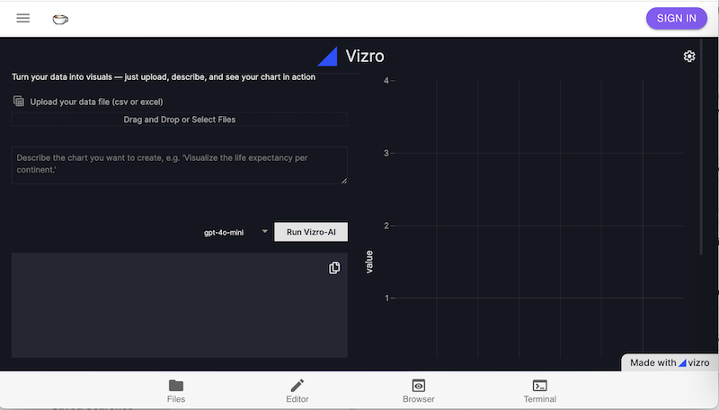
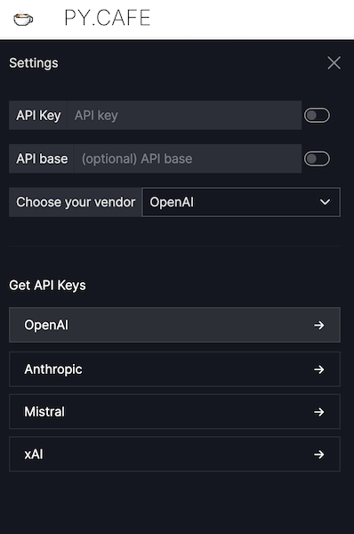
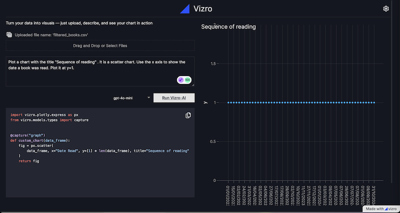
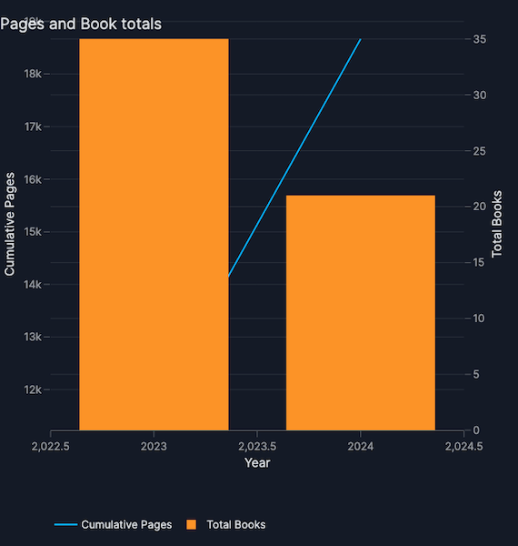
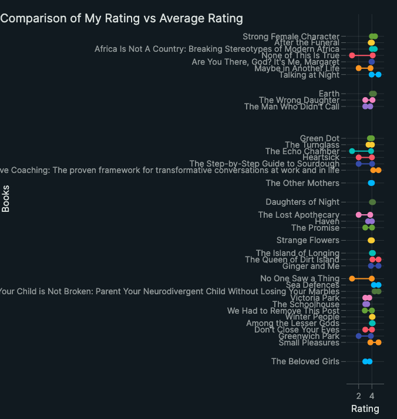
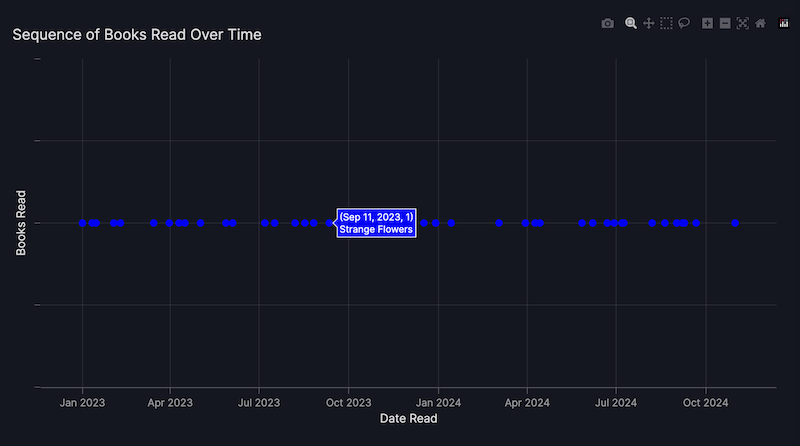

# How to build a prototype dashboard with Vizro-AI

This tutorial uses Vizro-AI to build a prototype dashboard with three charts that illustrate a simple dataset. We first show how to create individual charts with Vizro-AI and then show how to use Vizro-AI to build a dashboard. The tutorial concludes by moving the prototype code generated by Vizro-AI into a project on PyCafe, for others to use and extend. A version of this tutorial was first published as a [blog post on Towards Data Science in January 2025](https://medium.com/towards-data-science/how-to-build-a-data-dashboard-prototype-with-generative-ai-462f1d91690d).

## Project explanation

The dataset for this project was a set of books data [exported from a personal Goodreads account](https://www.goodreads.com/review/import), which is provided with the project so you can run it. The dataset can be downloaded from the [Vizro repository](https://raw.githubusercontent.com/mckinsey/vizro/834c8d9c198420e8b315c0dc045b7aa12534719d/vizro-ai/examples/goodreads_tutorial/filtered_books.csv). If you use Goodreads, you can export your own data in CSV format, substitute it for the dataset provided, and explore it with the code for this project.

The dataset was filtered to retain only books with an ISBN, which can be used with [Google Books API](https://developers.google.com/books) to retrieve more data about a book. The Books API wasn't used in this project, but by including ISBN data, there is scope to extend the prototype project in future.

## OpenAI

This tutorial uses OpenAI models with Vizro-AI. To run through the steps, you must have an account with paid-for credits available. None of the free accounts will suffice. [Check the OpenAI models and pricing on their website](https://platform.openai.com/docs/models).

!!! note

    Before using a model, please review OpenAI's guidelines on risk mitigation to understand potential model limitations and best practices. [See the OpenAI site for more details on responsible usage](https://platform.openai.com/docs/guides/safety-best-practices).

## Chart generation with Vizro-AI

In this step, we use a hosted version of Vizro-AI, found at [https://py.cafe/app/vizro-official/vizro-ai-charts](https://py.cafe/app/vizro-official/vizro-ai-charts). Navigate with your browser to the site, which looks as follows:



### Settings

The link will open with a settings pane where you can set the API key for your chosen vendor. At the time of writing, you can use OpenAI, Anthropic, Mistral, or xAI:



To return to these settings at any time, you'll notice a cog icon at the top right hand corner for access to them.

Once the API key is set, return to the main screen and [upload the data for the project](https://raw.githubusercontent.com/mckinsey/vizro/834c8d9c198420e8b315c0dc045b7aa12534719d/vizro-ai/examples/goodreads_tutorial/filtered_books.csv).

We can now use Vizro-AI to build some charts by iterating text to form effective prompts.

### Chart 1: Books timeline

To ask Vizro-AI to build a chart, we describe what we want to see. The first chart should show an ordered horiontal timeline to illustrate the sequence of reading the books.

```
Plot a chart with the title "Sequence of reading" .
It is a scatter chart. Use the x axis to show the date a book was read.
Plot it at y=1.
```

We can adjust the model used depending on the results, since more complex prompts need more powerful models. This chart was generated from `gpt-4o-mini`. It displays on the right hand side of the screen and the Plotly code to generate the chart is shown below the prompt.

The plot this code returns looks as follows. Hovering over each point gave the date the book was read, but not the title of the book, although this could be achieved by tweaking the prompt to ask explicitly for particular fields in the hover text. You'll also notice that the points are spaced evenly rather than proportionately: 

??? example "Click to expand"

    === "Generated by Vizro-AI"

        ```python
        import plotly.graph_objects as go
        from vizro.models.types import capture

        @capture("graph")
        def custom_chart(data_frame):
        fig = go.Figure()
        fig.add_trace(go.Scatter(x=data_frame["Date Read"], y=[1] * len(data_frame), mode="markers"))
        fig.update_layout(title="Sequence of reading", xaxis_title="Date Read", yaxis_title="Y=1")
        return fig
        ```

### Chart 2: Reading velocity

The second chart should plot the cumulative total of pages read and the cumulative total of books read per year. The prompt took a few iterations to refine:

```
Plot a chart with the title "Pages and Book totals" .
It shows the cumulative total number of pages read by summing the
Number of Pages of each book read in each year, using the Date Read data.
Plot date on the x axis and the number of pages on the y axis
using a scale on the left hand side of the chart.

Superimpose a bar chart showing the total books read for each year,
taking data from the Date Read column.
Show the total books read using the right hand side of the chart,
which can be a different scale to the y axis shown on the left hand side.
```

The Plotly code generated when run with `gpt-4-turbo` was as follows. The chart could be improved by bringing the line graph on top of the bar chart, but varying the prompt to make this explicit did not generate the desired output:

??? example "Click to expand"

    === "Generated by Vizro-AI"

        ```python
        import pandas as pd
        import plotly.graph_objects as go
        from plotly.subplots import make_subplots
        from vizro.models.types import capture


        @capture("graph")
        def custom_chart(data_frame):
            # Convert Date Read to datetime
            data_frame["Date Read"] = pd.to_datetime(data_frame["Date Read"], dayfirst=True)

            # Group by year and sum pages
            pages_per_year = data_frame.groupby(data_frame["Date Read"].dt.year)["Number of Pages"].sum().cumsum()

            # Count books per year
            books_per_year = data_frame.groupby(data_frame["Date Read"].dt.year).size()

            # Create subplot
            fig = make_subplots(specs=[[{"secondary_y": True}]])

            # Add line for cumulative pages
            fig.add_trace(
                go.Scatter(
                    x=pages_per_year.index,
                    y=pages_per_year,
                    mode="lines",
                    name="Cumulative Pages",
                ),
                secondary_y=False,
            )

            # Add bar for books count
            fig.add_trace(
                go.Bar(x=books_per_year.index, y=books_per_year, name="Total Books"),
                secondary_y=True,
            )

            # Set y-axes titles
            fig.update_yaxes(title_text="Cumulative Pages", secondary_y=False)
            fig.update_yaxes(title_text="Total Books", secondary_y=True)

            # Set layout
            fig.update_layout(title="Pages and Book totals", xaxis_title="Year", showlegend=True)

            return fig
        ```

The plot this code returns looks as follows: 

### Chart 3: Reviews comparison

The third chart should illustrate the difference between the rating the Goodreads reader assigned a book and the average rating across the Goodreads community. This prompt took a degree of iteration and needed us to specify how to draw the lines between the points, which is a key learning when using generative AI: your results will vary from run to run. The type of chart ("dumbbell") was given explicitly to guide the chart creation.

```
For each row, create a dumbbell chart to show the difference
between My Rating and Average Rating for each book.
Use shapes to add the horizontal lines between markers.
Omit the legend. Don't show any row where My Rating is 0.
```

??? example "Click to expand"

    === "Generated by Vizro-AI"

        ```python
        import plotly.graph_objects as go
        from vizro.models.types import capture


        @capture("graph")
        def custom_chart(data_frame):
            # Filter out rows where 'My Rating' is 0
            df_filtered = data_frame[data_frame["My Rating"] != 0]

            # Create a blank figure
            fig = go.Figure()

            # Add dumbbell lines and markers for each book
            for index, row in df_filtered.iterrows():
                fig.add_trace(
                    go.Scatter(
                        x=[row["My Rating"], row["Average Rating"]],
                        y=[index, index],
                        mode="markers+lines",
                        marker=dict(size=10),
                        line=dict(width=2),
                        name=row["Title"],
                        showlegend=False,
                    )
                )

            # Update layout
            fig.update_layout(
                title="Comparison of My Rating vs Average Rating",
                xaxis_title="Rating",
                yaxis_title="Books",
                yaxis=dict(
                    tickmode="array",
                    tickvals=list(df_filtered.index),
                    ticktext=df_filtered["Title"],
                ),
            )
            return fig
        ```

The plot this code returns looks as follows: 

## Dashboard generation with Vizro-AI

### Set up a Jupyter Notebook

Now we have prototypes for three plotly charts for the Goodreads data. To display these as an interactive dashboard, we need some more code. Vizro-AI can generate this for us, but not through the application hosted on PyCafe at the time of writing. We'll use a Jupyter Notebook instead.

Before running the Notebook code, [set up Vizro-AI](../user-guides/install.md) inside a virtual environment with Python 3.10 or later. Install the package with `pip install vizro_ai`.

You need to give Vizro-AI your API key to access OpenAI by adding it to your environment so the code you write in the next step can access it to successfully call OpenAI. There are some [straightforward instructions in the OpenAI docs](https://platform.openai.com/docs/quickstart/step-2-set-up-your-api-key), and the process is also covered in the our [LLM setup guide](../user-guides/install.md#set-up-access-to-a-large-language-model).

### Build a dashboard

In the Jupyter Notebook we'll submit a single prompt that combines the three prompts listed above, with some small edits to ask for a dashboard that has three pages: one for each chart.

The following shows the code to make the request to Vizro-AI to build and display the dashboardted, with the data handling code omit. The cp,\[;ete Notebook is available for download from [Vizro's GitHub repository](https://raw.githubusercontent.com/mckinsey/vizro/834c8d9c198420e8b315c0dc045b7aa12534719d/vizro-ai/examples/goodreads_tutorial/goodreads.ipynb):

??? example "Click to expand"

    === "Generated by Vizro-AI"

        ```python
        user_question = """
        Create a dashboard with 3 pages, one for each chart.

        On the first page, plot a chart with the title "Sequence of reading" .
        It is a scatter chart. Use the x axis to show the date a book was read. Plot it at y=1.

        On the second page, lot a chart with the title "Pages and Book totals" .
        It shows the cumulative total number of pages read by summing the Number of Pages of each book read in each year, using the Date Read data.
        Plot date on the x axis and the number of pages on the y axis using a scale on the left hand side of the chart.
        Superimpose a bar chart showing the total books read for each year, taking data from the Date Read column.
        Show the total books read using the right hand side of the chart which can be a different scale to the y axis shown on the left hand side.

        On the third page, for each row, create a dumbbell chart to show the difference between My Rating and Average Rating for each book.
        Use shapes to add the horizontal lines between markers. Omit the legend. Don't show any row where My Rating is 0.
        """

        result = vizro_ai.dashboard([df_cleaned], user_question, return_elements=True)
        Vizro().build(result.dashboard).run(port=8006)
        print(result.code)
        ```

Using `gpt-4-turbo`, Vizro-AI generates a set of plotly chart code and the necessary Vizro support code to build a dashboard. The generated code is displayed as output in the Notebook with the dashboard, although the dashboard is better viewed at `http://localhost:8006/`.

### Add dashboard interactivity

To make the Vizro dashboards more interactive, we can ask Vizro-AI to add the code for a control. As a simple example, we can extend the prompt to ask for a date picker control to modify the time period displayed for the `Date Read` column and change the scale on the x axis of the first chart.

??? example "Click to expand"

    === "Extend the prompt to add a control"

        ```diff
        user_question = """
        Create a dashboard with 3 pages, one for each chart.

        On the first page, plot a chart with the title "Sequence of reading" .
        It is a scatter chart. Use the x axis to show the date a book was read. Plot it at y=1.

        + Add a date picker filter so the user can adjust the range of dates for the Date Read on the x axis.

        On the second page, plot a chart with the title "Pages and Book totals" .
        It shows the cumulative total number of pages read by summing the Number of Pages of each book read in each year, using the Date Read data.
        Plot date on the x axis and the number of pages on the y axis using a scale on the left hand side of the chart.
        Superimpose a bar chart showing the total books read for each year, taking data from the Date Read column.

        Show the total books read using the right hand side of the chart which can be a different scale to the y axis shown on the left hand side.

        On the third page, for each row, create a dumbbell chart to show the difference between My Rating and Average Rating for each book.
        Use shapes to add the horizontal lines between markers. Omit the legend. Don't show any row where My Rating is 0.
        """

        ```

### Get the Notebook

You can see the code output in the [Notebook stored on the Vizro GitHub repository](https://raw.githubusercontent.com/mckinsey/vizro/834c8d9c198420e8b315c0dc045b7aa12534719d/vizro-ai/examples/goodreads_tutorial/goodreads.ipynb), and generate similar output by running it yourself, although it will not necessarily be identical because of the variability of results returned from generative AI.

The charts generated were similar to those created by the PyCafe host above, although the first chart was improved by spacing the books proportionate to the date read. The hover text included the book title as well as the date read, without needing an explicit request to do so.



## Interactive Vizro dashboards on PyCafe

Now we have a Notebook with code to call Vizro-AI to build a prototype Vizro dashboard with a set of three pages and three charts, plus a control to filter the view.

As we've already seen, the code generated by Vizro-AI can vary from run to run, and calling OpenAI each time a dashboard is needed can get costly.

The project isn't particularly easy to share at present either: sharing a Notebook requires every user to have an OpenAI key and set up an environment.

To share and iterate the prototype, we can transfer the **generated** code from the output of Vizro-AI in the Notebook into a PyCafe project.

There are three changes to the Notebook code needed for it to run on PyCafe:

1. Add `from vizro import Vizro` to the imports list
1. Add `Vizro().build(model).run()` at the end of the code block
1. Uncomment the data manager code and replace it with code needed to access the dataset:
    - either download the dataset from the [Vizro GitHub repository](https://raw.githubusercontent.com/mckinsey/vizro/834c8d9c198420e8b315c0dc045b7aa12534719d/vizro-ai/examples/goodreads_tutorial/filtered_books.csv) and upload it to the PyCafe project.
    - or use the code added to the snippet below to read the dataset directly from online storage.

Follow the link at the bottom of the code snippet titled **☕️ Run and edit this code in PyCafe** to use and edit the dashboard.

??? example "Click to expand"

    === "PyCafe project based on Notebook code"

        ```{.python pycafe-link}
        from vizro import Vizro
        import vizro.models as vm
        from vizro.models.types import capture
        import pandas as pd
        import plotly.graph_objects as go
        from vizro.models.types import capture

        ####### Function definitions ######
        @capture("graph")
        def sequence_reading(data_frame):
            fig = go.Figure()
            fig.add_trace(
                go.Scatter(
                    x=data_frame["Date Read"],
                    y=[1] * len(data_frame),
                    mode="markers",
                    marker=dict(size=10, color="blue"),
                )
            )
            fig.update_layout(
                title="Sequence of reading",
                xaxis_title="Date Read",
                yaxis_title="Sequence",
                yaxis=dict(showticklabels=False, showgrid=False),
                xaxis=dict(tickangle=-45),
            )
            return fig


        @capture("graph")
        def pages_books_totals(data_frame):
            # Prepare data
            data_frame["Date Read"] = pd.to_datetime(data_frame["Date Read"])
            data_frame.sort_values("Date Read", inplace=True)
            data_frame["Cumulative Pages"] = data_frame["Number of Pages"].cumsum()

            # Aggregate data by year for total books read
            yearly_books = data_frame.groupby(data_frame["Date Read"].dt.year).size()

            # Create figure with secondary y-axis
            fig = go.Figure()

            # Add line for cumulative pages
            fig.add_trace(
                go.Scatter(
                    x=data_frame["Date Read"],
                    y=data_frame["Cumulative Pages"],
                    mode="lines",
                    name="Cumulative Pages Read",
                )
            )

            # Add bars for books read per year
            fig.add_trace(
                go.Bar(
                    x=yearly_books.index, y=yearly_books, name="Books Read per Year", yaxis="y2"
                )
            )

            # Set up the layout
            fig.update_layout(
                title="Cumulative Pages Read and Books Read per Year",
                xaxis_title="Date",
                yaxis=dict(title="Number of Pages"),
                yaxis2=dict(title="Total Books", overlaying="y", side="right"),
            )

            return fig


        @capture("graph")
        def rating_comparison(data_frame):
            # Filter out rows where 'My Rating' is 0
            df = data_frame[data_frame["My Rating"] != 0]

            # Create a figure
            fig = go.Figure()

            # Add dumbbell traces
            for index, row in df.iterrows():
                fig.add_trace(
                    go.Scatter(
                        x=[row["My Rating"], row["Average Rating"]],
                        y=[row["Title"], row["Title"]],
                        mode="markers+lines",
                        name=row["Title"],
                        marker=dict(size=10),
                        line=dict(width=2),
                    )
                )

            # Update layout
            fig.update_layout(
                title="Comparison of My Rating vs Average Rating",
                xaxis_title="Rating",
                yaxis_title="Book Title",
                showlegend=False,
            )

            return fig

        ########### Read data ############
        # Define the URL of the raw CSV file
        import requests
        url = "https://raw.githubusercontent.com/mckinsey/vizro/834c8d9c198420e8b315c0dc045b7aa12534719d/vizro-ai/examples/goodreads_tutorial/filtered_books.csv"

        # Fetch the CSV file
        response = requests.get(url)
        response.raise_for_status()  # Ensure we notice bad responses

        # Load the CSV data into a pandas DataFrame
        from io import StringIO
        csv_data = StringIO(response.text)
        df = pd.read_csv(csv_data)
        df["Date Read"] = pd.to_datetime(df['Date Read'],dayfirst=True)


                ########### Model code ############
        model = vm.Dashboard(
            pages=[
                vm.Page(
                    components=[
                        vm.Graph(
                            id="sequence_reading",
                            figure=sequence_reading(df),
                        )
                    ],
                    title="Sequence of Reading",
                    layout=vm.Layout(grid=[[0]]),
                    controls=[
                        vm.Filter(
                            type="filter",
                            column="Date Read",
                            targets=["sequence_reading"],
                            selector=vm.DatePicker(type="date_picker", range=True),
                        )
                    ],
                ),
                vm.Page(
                    components=[
                        vm.Graph(
                            id="pages_books_totals",
                            figure=pages_books_totals(df),
                        )
                    ],
                    title="Pages and Book Totals",
                    layout=vm.Layout(grid=[[0]]),
                    controls=[],
                ),
                vm.Page(
                    components=[
                        vm.Graph(
                            id="rating_comparison",
                            figure=rating_comparison(df),
                        )
                    ],
                    title="Rating Comparison",
                    layout=vm.Layout(grid=[[0]]),
                    controls=[],
                ),
            ],
            title="Book Reading Analysis Dashboard",
        )

        Vizro().build(model).run()
        ```

## Prototype summary

In this tutorial, we used Vizro-AI to generate a set of charts by iterating prompts, hosted in PyCafe.

We then converted the successful prompts to build a Vizro dashboard using Vizro-AI in a Notebook using a few lines of support code.

Finally, we converted the generated Python to a PyCafe project with a few more lines of support code. The resulting Vizro project is not using generative AI, so it is easy to share and iterate.

The code generated by Vizro-AI does not make a perfect dashboard, but it has been very easy to get it to a good standard without a great deal of coding or design experience. There are a few improvements that are easily applied to the Plotly code to further improve the charts, as shown below in a separate PyCafe project.

### Improvements to generated Plotly code

In this version of the dashboard, the first chart that shows the sequence of books read has been modified to improve the information supplied when hovering over a point, and the opacity of the points has been altered to make it more attractive. The control has been changed to a slider for the `Date Read` field.

In the second chart that shows the cumulative total of pages and books read, the line chart has been explicitly plotted on top of the bar chart.

In the third chart that shows the ratings comparison, the color scheme has been updated to make it clearer which is the `My Rating` value compared to the `Average Rating`.

Follow the link at the bottom of the code snippet titled **☕️ Run and edit this code in PyCafe** to use and edit the dashboard.

??? example "Click to expand"

    === "PyCafe project based on Notebook code"

        ```{.python pycafe-link}
        from vizro import Vizro
        import vizro.models as vm
        from vizro.models.types import capture
        import pandas as pd
        import plotly.graph_objects as go
        from vizro.models.types import capture

        ####### Function definitions ######
        @capture("graph")
        def sequence_reading(data_frame):
            fig = go.Figure()

            # Iterate through the filtered DataFrame to add traces
            for index, row in data_frame.iterrows():
                fig.add_trace(
                    go.Scatter(
                        x=[row["Date Read"], row["Date Read"]],
                        y=[1],
                        customdata=[[row["Title"], row["Author"], row["My Rating"]]],
                        showlegend=False,
                        marker=dict(color="#00b4ff", size=20, opacity=0.4),
                        hovertemplate="<b>Title:</b> %{customdata[0]}<br>"
                        + "<b>Author:</b> %{customdata[1]}<br>"
                        + "<b>My Rating:</b> %{customdata[2]}<br>"
                        + "<b>Date:</b> %{x}"
                        + "<extra></extra>",
                    )
                )
            fig.update_layout(
                title="Sequence of reading",
                xaxis_title="Date Read",
                yaxis_title="Sequence",
                yaxis=dict(showticklabels=False, showgrid=False),
                xaxis=dict(tickangle=-45),
            )
            return fig


        @capture("graph")
        def pages_books_totals(data_frame):
            # Prepare data
            data_frame["Date Read"] = pd.to_datetime(data_frame["Date Read"])
            data_frame.sort_values("Date Read", inplace=True)
            data_frame["Cumulative Pages"] = data_frame["Number of Pages"].cumsum()

            # Aggregate data by year for total books read
            yearly_books = data_frame.groupby(data_frame["Date Read"].dt.year).size()

            # Create figure with secondary y-axis
            fig = go.Figure()

            # Add line for cumulative pages
            fig.add_trace(
                go.Scatter(
                    x=data_frame["Date Read"],
                    y=data_frame["Cumulative Pages"],
                    mode="lines",
                    name="Cumulative Pages Read",
                    zorder=1,  # Ensure the line chart is rendered on top of the bar chart
                )
            )

            # Add bars for books read per year
            fig.add_trace(
                go.Bar(
                    x=yearly_books.index, y=yearly_books, name="Books Read per Year", yaxis="y2"
                )
            )

            # Set up the layout
            fig.update_layout(
                title="Cumulative Pages Read and Books Read per Year",
                xaxis_title="Date",
                yaxis=dict(title="Number of Pages"),
                yaxis2=dict(title="Total Books", overlaying="y", side="right"),
            )

            return fig


        @capture("graph")
        def rating_comparison(data_frame):
            # Filter out rows where 'My Rating' is 0
            df = data_frame[data_frame["My Rating"] != 0]
            # Sort by decreasing average rating
            df = df.sort_values(by="Average Rating", ascending=False)

            # Create a figure
            fig = go.Figure()

            # Add dumbbell traces
            for index, row in df.iterrows():
                fig.add_trace(
                    go.Scatter(
                        x=[row["My Rating"], row["Average Rating"]],
                        y=[row["Title"], row["Title"]],
                        mode="markers+lines",
                        line=dict(color="gray", width=2),
                        marker=dict(color=["#00b4ff", "#ff9222"], size=10),
                        showlegend=False,
                    )
                )

            # Update layout
            fig.update_layout(
                title="Comparison of My Rating (blue) vs Average Rating (orange)",
                xaxis_title="Rating",
                yaxis_title="Book Title",
                showlegend=False,
            )

            return fig

        ########### Read data ############
        # Define the URL of the raw CSV file
        import requests
        url = "https://raw.githubusercontent.com/mckinsey/vizro/834c8d9c198420e8b315c0dc045b7aa12534719d/vizro-ai/examples/goodreads_tutorial/filtered_books.csv"

        # Fetch the CSV file
        response = requests.get(url)
        response.raise_for_status()  # Ensure we notice bad responses

        # Load the CSV data into a pandas DataFrame
        from io import StringIO
        csv_data = StringIO(response.text)
        df = pd.read_csv(csv_data)
        df["Date Read"] = pd.to_datetime(df['Date Read'],dayfirst=True)
        # Extract the year from each Date Read and create a new column 'Year Read'
        df['Year Read'] = df['Date Read'].dt.year

        ########### Model code ############
        model = vm.Dashboard(
            pages=[
                vm.Page(
                    components=[
                        vm.Graph(
                            id="sequence_reading",
                            figure=sequence_reading(df),
                        )
                    ],
                    title="Sequence of Reading",
                    layout=vm.Layout(grid=[[0]]),
                    controls=[
                        vm.Filter(
                            column="Year Read",
                            targets=["sequence_reading"],
                            selector=vm.RangeSlider(type="range_slider"),
                        )
                    ],
                ),
                vm.Page(
                    components=[
                        vm.Graph(
                            id="pages_books_totals",
                            figure=pages_books_totals(df),
                        )
                    ],
                    title="Pages and Book Totals",
                    layout=vm.Layout(grid=[[0]]),
                    controls=[],
                ),
                vm.Page(
                    components=[
                        vm.Graph(
                            id="rating_comparison",
                            figure=rating_comparison(df),
                        )
                    ],
                    title="Rating Comparison",
                    layout=vm.Layout(grid=[[0]]),
                    controls=[],
                ),
            ],
            title="Book Reading Analysis Dashboard",
        )

        Vizro().build(model).run()

        ```
