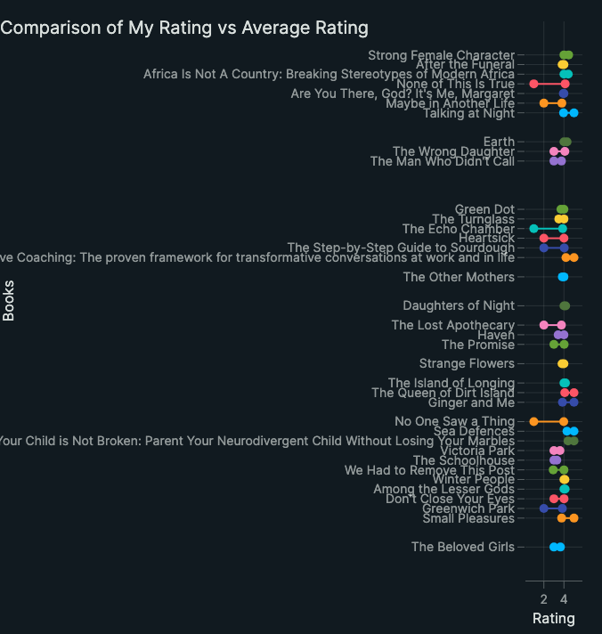
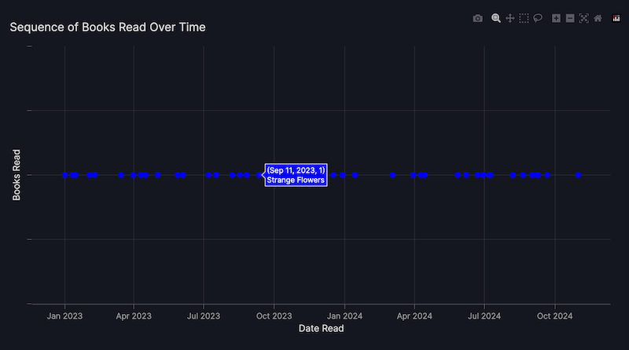

# How to build a prototype dashboard with Vizro-AI

This tutorial uses Vizro-AI to build a prototype dashboard with three charts that illustrate a simple dataset. We first show how to create individual charts with Vizro-AI and then move on to learn how to use Vizro-AI to build a dashboard. The tutorial concludes by moving the prototype code generated by Vizro-AI into a project on PyCafe, for others to use and extend.

## Project background and data
The dataset for this project was a set of books data [exported from a personal Goodreads account](https://www.goodreads.com/review/import). If you use Goodreads, you can export your own data in CSV format and use it with the code for this project.

The dataset was filtered to retain only books with an ISBN, since that can be used with [Google Books API](https://developers.google.com/books) to retrieve additional data about a book. The Books API wasn't used in this project, but by including ISBN data, there is scope to extend the prototype project in future. The dataset used can be downloaded from the [Vizro repository](filtered_books.csv).

## OpenAI
This tutorial uses OpenAI with Vizro-AI. To run through the steps, you must have an account with paid-for credits available. None of the free accounts will suffice. [Check the OpenAI models and pricing on their website](https://platform.openai.com/docs/models). 

!!! note
    
    Before using a model, please review OpenAI's guidelines on risk mitigation to understand potential model limitations and best practices. [See the OpenAI site for more details on responsible usage](https://platform.openai.com/docs/guides/safety-best-practices).


## Individual chart generation with Vizro-AI
In this step, we'll show a UI on a hosted version of Vizro-AI, at [https://py.cafe/app/vizro-official/vizro-ai-charts](https://py.cafe/app/vizro-official/vizro-ai-charts). Use your browser to navigate to the site which looks as follows:


### Settings
You'll notice a cog icon at the top right hand corner for access to your settings, which look as follows:


Add the API key for your chosen vendor. At the time of writing, you can use OpenAI, Anthropic, Mistral, or xAI. 

Once the API key is set, return to the main screen and upload the data for the project. 

We can now dive use Vizro-AI to build some charts by iterating text to write effective prompts.

### Chart 1: Books timeline
To ask Vizro-AI to build a chart, describe what you want to see. This chart should show an ordered horiontal timeline to illustrate the sequence of reading the books.

> Plot a chart with the title "Sequence of reading" . It is a scatter chart. Use the x axis to show the date a book was read. Plot it at y=1.

You can adjust the model used: the chart below was generated from `gpt-4o-mini`. The chart displays on the right hand side of the screen and the Plotly code to generate the chart is below the prompt.

The plot this code returns looks as follows. Hovering over each point gave the date the book was read, but not the title of the book. You'll also notice that the points are spaced evenly rather than proportionately:


### Chart 2: Reading velocity
The second chart should plot the cumulative total of pages read and the cumulative total of books read per year. The prompt took a few iterations to refine:

> Plot a chart with the title "Pages and Book totals" . It shows the cumulative total number of pages read by summing the Number of Pages of each book read in each year, using the Date Read data. Plot date on the x axis and the number of pages on the y axis using a scale on the left hand side of the chart.

> Superimpose a bar chart showing the total books read for each year, taking data from the Date Read column. Show the total books read using the right hand side of the chart which can be a different scale to the y axis shown on the left hand side. 

The Plotly code generated when run with `gpt-4-turbo` was as follows:

```python
import pandas as pd
import plotly.graph_objects as go
from plotly.subplots import make_subplots
from vizro.models.types import capture


@capture("graph")
def custom_chart(data_frame):
    # Convert Date Read to datetime
    data_frame["Date Read"] = pd.to_datetime(data_frame["Date Read"], dayfirst=True)

    # Group by year and sum pages
    pages_per_year = (
        data_frame.groupby(data_frame["Date Read"].dt.year)["Number of Pages"].sum().cumsum()
    )

    # Count books per year
    books_per_year = data_frame.groupby(data_frame["Date Read"].dt.year).size()

    # Create subplot
    fig = make_subplots(specs=[[{"secondary_y": True}]])

    # Add line for cumulative pages
    fig.add_trace(
        go.Scatter(
            x=pages_per_year.index,
            y=pages_per_year,
            mode="lines",
            name="Cumulative Pages",
        ),
        secondary_y=False,
    )

    # Add bar for books count
    fig.add_trace(
        go.Bar(x=books_per_year.index, y=books_per_year, name="Total Books"),
        secondary_y=True,
    )

    # Set y-axes titles
    fig.update_yaxes(title_text="Cumulative Pages", secondary_y=False)
    fig.update_yaxes(title_text="Total Books", secondary_y=True)

    # Set layout
    fig.update_layout(title="Pages and Book totals", xaxis_title="Year", showlegend=True)

    return fig

```

The plot this code returns looks as follows:


### Chart 3: Reviews comparison
The third chart should illustrate the difference between the rating the Goodreads reader assigned a book and the average rating across the Goodreads community. This prompt took a degree of iteration and needed us to specify how to draw the lines between the points. It was run several times before it colored each line differently, which is a key learning when using generative AI: your results will vary from run to run.

> For each row, create a dumbbell chart to show the difference between My Rating and Average Rating for each book - use shapes to add the horizontal lines between markers. Omit the legend. Don't show any row where My Rating is 0.

```python
import plotly.graph_objects as go
from vizro.models.types import capture


@capture("graph")
def custom_chart(data_frame):
    # Filter out rows where 'My Rating' is 0
    df_filtered = data_frame[data_frame["My Rating"] != 0]

    # Create a blank figure
    fig = go.Figure()

    # Add dumbbell lines and markers for each book
    for index, row in df_filtered.iterrows():
        fig.add_trace(
            go.Scatter(
                x=[row["My Rating"], row["Average Rating"]],
                y=[index, index],
                mode="markers+lines",
                marker=dict(size=10),
                line=dict(width=2),
                name=row["Title"],
                showlegend=False,
            )
        )

    # Update layout
    fig.update_layout(
        title="Comparison of My Rating vs Average Rating",
        xaxis_title="Rating",
        yaxis_title="Books",
        yaxis=dict(
            tickmode="array",
            tickvals=list(df_filtered.index),
            ticktext=df_filtered["Title"],
        ),
    )
    return fig
```

The plot this code returns looks as follows:



## Dashboard generation with Vizro-AI

### Set up a Jupyter Notebook in which to use Vizro-AI
At this point, we have prototypes for three plotly charts for the Goodreads data. To display these as an interactive dashboard, we need some additional code and Vizro-AI can generate this for us, but not through the PyCafe host at the time of writing. We'll use a Jupyter Notebook

Before running the Notebook code, you need to [set up Vizro-AI](https://vizro.readthedocs.io/projects/vizro-ai/en/latest/pages/user-guides/install/) inside a virtual environment with Python 3.10 or later. Install the package with `pip install vizro_ai`.

You need to give Vizro-AI your API key to access OpenAI by adding it to your environment so the code you write in the next step can access it to successfully call OpenAI. There are some [straightforward instructions in the OpenAI docs](https://platform.openai.com/docs/quickstart/step-2-set-up-your-api-key), and the process is also covered in the our [LLM setup guide](https://vizro.readthedocs.io/projects/vizro-ai/en/latest/pages/user-guides/install/#set-up-access-to-a-large-language-model).

### Build a dashboard
At this point you can open a Jupyter Notebook to make the dashboard. We'll submit a prompt that combines the three prompts listed above, with some small edits to ask for a dashboard that has three pages: one for each chart.

The following code shows the code to make the request to Vizro-AI to build and display the dashboard.  The Notebook is available for download on [Vizro's GitHub repository](TO DO):

```python
user_question = """
Create a dashboard with 3 pages, one for each chart. 

On the first page, plot a chart with the title "Sequence of reading" . 
It is a scatter chart. Use the x axis to show the date a book was read. Plot it at y=1.

On the second page, lot a chart with the title "Pages and Book totals" . 
It shows the cumulative total number of pages read by summing the Number of Pages of each book read in each year, using the Date Read data. 
Plot date on the x axis and the number of pages on the y axis using a scale on the left hand side of the chart.
Superimpose a bar chart showing the total books read for each year, taking data from the Date Read column. 
Show the total books read using the right hand side of the chart which can be a different scale to the y axis shown on the left hand side. 

On the third page, for each row, create a dumbbell chart to show the difference between My Rating and Average Rating for each book.
Use shapes to add the horizontal lines between markers. Omit the legend. Don't show any row where My Rating is 0.
"""

result = vizro_ai.dashboard([df_cleaned], user_question, return_elements=True)
Vizro().build(result.dashboard).run(port=8006)
print(result.code)
```

Using `gpt-4-turbo`, Vizro-AI generates a set of plotly chart code and the necessary Vizro support code to build a dashboard. The generated code is displayed as output in the Notebook with the dashboard, although the dashboard is better viewed at `http://localhost:8006/`.

You can see the code output in the Notebook stored on the Vizro GitHub repository, or generate similar output by running it yourself.

The charts generated were similar to those created by the PyCafe host above, although the first chart was improved by spacing the books proportionate to the date read and rolling over each point gave the book title as well as the date read.



### Dashboard interactivity
To make the Vizro dashboards more interactive, we can ask Vizro-AI to add the code for a control. As a simple example, we can extend the prompt to ask for a filter to modify the time period displayed. 

```diff
user_question = """
Create a dashboard with 3 pages, one for each chart. 

On the first page, plot a chart with the title "Sequence of reading" . 
It is a scatter chart. Use the x axis to show the date a book was read. Plot it at y=1.
-
+ Add a filter so the user can change the x axis to adjust the range of dates by year on the x axis, using a slider to range from Jan 2023 to Dec 2024.

On the second page, plot a chart with the title "Pages and Book totals" . 
It shows the cumulative total number of pages read by summing the Number of Pages of each book read in each year, using the Date Read data. 
Plot date on the x axis and the number of pages on the y axis using a scale on the left hand side of the chart.
Superimpose a bar chart showing the total books read for each year, taking data from the Date Read column. 

Show the total books read using the right hand side of the chart which can be a different scale to the y axis shown on the left hand side. 
-
+ Add a filter so the user can change the x axis to adjust the range of dates by year on the x axis, using a slider to range from Jan 2023 to Dec 2024.

On the third page, for each row, create a dumbbell chart to show the difference between My Rating and Average Rating for each book.
Use shapes to add the horizontal lines between markers. Omit the legend. Don't show any row where My Rating is 0.
"""

```

## Interactive Vizro dashboards on PyCafe
At this point, we have a Notebook with code to call Vizro-AI to build a prototype Vizro dashboard with a set of three pages and three charts, plus a control to filter the view.

As we've already seen, the code generated by Vizro-AI can vary from run to run, and calling OpenAI each time a dashboard is needed can get costly. 

The project isn't particularly easy to share at present either: sharing a Notebook requires every user to have an OpenAI key and set up an environment.

At this point, to share and iterate the prototype the best course of action is to transfer the generated code from the output of Vizro-AI in the Notebook into a PyCafe project.

There are three changes to the Notebook code needed for it to run on PyCafe:

1. Add `from vizro import Vizro` to the imports list
2. Add `Vizro().build(model).run()` at the end of the code block
3. Uncomment the data manager code and replace it with code needed to access the dataset:

        - If you are building your own PyCafe project, you can download the dataset from the Vizro GitHub repository and upload it to the PyCafe project.
        - Alternatively, you can use the code specified below to read the dataset directly from online storage.

	
	
!!! example "First dashboard"
    === "app.py"
        ```{.python pycafe-link}
        from vizro import Vizro
        import vizro.models as vm
        from vizro.models.types import capture
        import pandas as pd
        import plotly.graph_objects as go
        from vizro.models.types import capture
		
        ####### Function definitions ######
        @capture("graph")
        def sequence_reading(data_frame):
            fig = go.Figure()
            fig.add_trace(
                go.Scatter(
                    x=data_frame["Date Read"],
                    y=[1] * len(data_frame),
                    mode="markers",
                    marker=dict(size=10, color="blue"),
                )
            )
            fig.update_layout(
                title="Sequence of reading",
                xaxis_title="Date Read",
                yaxis_title="Sequence",
                yaxis=dict(showticklabels=False, showgrid=False),
                xaxis=dict(tickangle=-45),
            )
            return fig


        @capture("graph")
        def pages_books_totals(data_frame):
            # Prepare data
            data_frame["Date Read"] = pd.to_datetime(data_frame["Date Read"])
            data_frame.sort_values("Date Read", inplace=True)
            data_frame["Cumulative Pages"] = data_frame["Number of Pages"].cumsum()

            # Aggregate data by year for total books read
            yearly_books = data_frame.groupby(data_frame["Date Read"].dt.year).size()

            # Create figure with secondary y-axis
            fig = go.Figure()

            # Add line for cumulative pages
            fig.add_trace(
                go.Scatter(
                    x=data_frame["Date Read"],
                    y=data_frame["Cumulative Pages"],
                    mode="lines",
                    name="Cumulative Pages Read",
                )
            )

            # Add bars for books read per year
            fig.add_trace(
                go.Bar(
                    x=yearly_books.index, y=yearly_books, name="Books Read per Year", yaxis="y2"
                )
            )

            # Set up the layout
            fig.update_layout(
                title="Cumulative Pages Read and Books Read per Year",
                xaxis_title="Date",
                yaxis=dict(title="Number of Pages"),
                yaxis2=dict(title="Total Books", overlaying="y", side="right"),
            )

            return fig


        @capture("graph")
        def rating_comparison(data_frame):
            # Filter out rows where 'My Rating' is 0
            df = data_frame[data_frame["My Rating"] != 0]

            # Create a figure
            fig = go.Figure()

            # Add dumbbell traces
            for index, row in df.iterrows():
                fig.add_trace(
                    go.Scatter(
                        x=[row["My Rating"], row["Average Rating"]],
                        y=[row["Title"], row["Title"]],
                        mode="markers+lines",
                        name=row["Title"],
                        marker=dict(size=10),
                        line=dict(width=2),
                    )
                )

            # Update layout
            fig.update_layout(
                title="Comparison of My Rating vs Average Rating",
                xaxis_title="Rating",
                yaxis_title="Book Title",
                showlegend=False,
            )

            return fig

        ########### Read data ############
        # Define the URL of the raw CSV file
        # TO DO -- This will change when data is uploaded to Vizro repo
        import requests
        url = "https://raw.githubusercontent.com/stichbury/vizro_projects/refs/heads/main/goodreads_project/filtered_books.csv"

        # Fetch the CSV file
        response = requests.get(url)
        response.raise_for_status()  # Ensure we notice bad responses

        # Load the CSV data into a pandas DataFrame
        from io import StringIO
        csv_data = StringIO(response.text)
        df = pd.read_csv(csv_data)
        df["Date Read"] = pd.to_datetime(df['Date Read'],dayfirst=True)


        ########### Model code ############
        model = vm.Dashboard(
            pages=[
                vm.Page(
                    components=[
                        vm.Graph(
                            id="sequence_reading",
                            figure=sequence_reading(df),
                        )
                    ],
                    title="Sequence of Reading",
                    layout=vm.Layout(grid=[[0]]),
                    controls=[
                        vm.Filter(
                            column="Year Published",
                            targets=["sequence_reading"],
                            selector=vm.RangeSlider(type="range_slider"),
                        )
                    ],
                ),
                vm.Page(
                    components=[
                        vm.Graph(
                            id="pages_books_totals",
                            figure=pages_books_totals(df),
                        )
                    ],
                    title="Pages and Book Totals",
                    layout=vm.Layout(grid=[[0]]),
                    controls=[
                        vm.Filter(
                            column="Year Published",
                            targets=["pages_books_totals"],
                            selector=vm.RangeSlider(type="range_slider"),
                        )
                    ],
                ),
                vm.Page(
                    components=[
                        vm.Graph(
                            id="rating_comparison",
                            figure=rating_comparison(df),
                        )
                    ],
                    title="Rating Comparison",
                    layout=vm.Layout(grid=[[0]]),
                    controls=[],
                ),
            ],
            title="Book Reading Analysis Dashboard",
        )        		

        Vizro().build(model).run()
        ```

 
 
 
 
 
