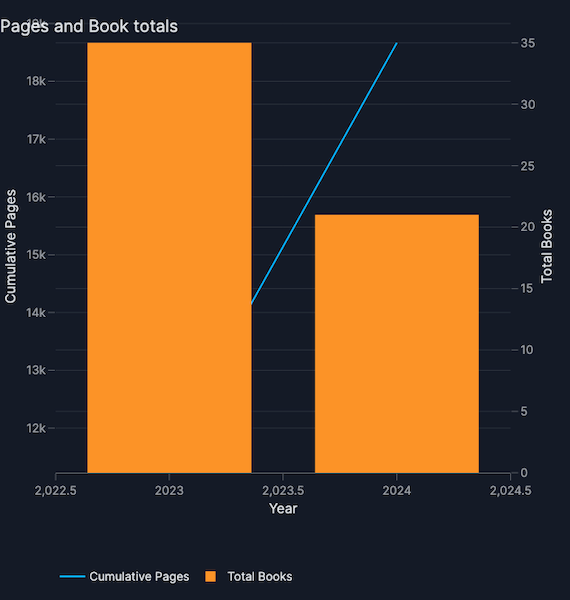

# How to build a prototype dashboard with Vizro-AI

This tutorial uses Vizro-AI to build a prototype dashboard with three charts that illustrate a simple dataset. We first show how to create individual charts with Vizro-AI and then move on to learn how to use Vizro-AI to build a dashboard. The tutorial concludes by moving the prototype code generated by Vizro-AI into a project on PyCafe, for others to use and extend.

## Project background and data
The dataset for this project was a set of books data [exported from a personal Goodreads account](https://www.goodreads.com/review/import). If you use Goodreads, you can export your own data in CSV format and use it with the code for this project.

The dataset was filtered to retain only books with an ISBN, since that can be used with [Google Books API](https://developers.google.com/books) to retrieve additional data about a book. The Books API wasn't used in this project, but by including ISBN data, there is scope to extend the prototype project in future. The dataset used can be downloaded from the [Vizro repository](filtered_books.csv).

## OpenAI
This tutorial uses OpenAI with Vizro-AI. To run through the steps, you must have an account with paid-for credits available. None of the free accounts will suffice. [Check the OpenAI models and pricing on their website](https://platform.openai.com/docs/models). 

!!! note
    
    Before using a model, please review OpenAI's guidelines on risk mitigation to understand potential model limitations and best practices. [See the OpenAI site for more details on responsible usage](https://platform.openai.com/docs/guides/safety-best-practices).


## Individual chart generation with Vizro-AI
In this step, we'll show a UI on a hosted version of Vizro-AI, at [https://py.cafe/app/vizro-official/vizro-ai-charts](https://py.cafe/app/vizro-official/vizro-ai-charts). Use your browser to navigate to the site which looks as follows:


### Settings
You'll notice a cog icon at the top right hand corner for access to your settings, which look as follows:


Add the API key for your chosen vendor. At the time of writing, you can use OpenAI, Anthropic, Mistral, or xAI. 

Once the API key is set, return to the main screen and upload the data for the project. 

We can now dive use Vizro-AI to build some charts by iterating text to write effective prompts.

### Chart 1: Books timeline
To ask Vizro-AI to build a chart, describe what you want to see. This chart should show an ordered horiontal timeline to illustrate the sequence of reading the books.

> Plot a chart with the title "Sequence of reading" . It is a scatter chart. Use the x axis to show the date a book was read. Plot it at y=1.

You can adjust the model used: the chart below was generated from `gpt-4o-mini`. The chart displays on the right hand side of the screen and the Plotly code to generate the chart is below the prompt.

The plot this code returns looks as follows:


### Chart 2: Reading velocity
The second chart should plot the cumulative total of pages read and the cumulative total of books read per year. The prompt took a few iterations to refine:

> Plot a chart with the title "Pages and Book totals" . It shows the cumulative total number of pages read by summing the Number of Pages of each book read in each year, using the Date Read data. Plot date on the x axis and the number of pages on the y axis using a scale on the left hand side of the chart.

> Superimpose a bar chart showing the total books read for each year, taking data from the Date Read column. Show the total books read using the right hand side of the chart which can be a different scale to the y axis shown on the left hand side. 

The Plotly code generated when run with `gpt-4-turbo` was as follows:

```python
import pandas as pd
import plotly.graph_objects as go
from plotly.subplots import make_subplots
from vizro.models.types import capture


@capture("graph")
def custom_chart(data_frame):
    # Convert Date Read to datetime
    data_frame["Date Read"] = pd.to_datetime(data_frame["Date Read"], dayfirst=True)

    # Group by year and sum pages
    pages_per_year = (
        data_frame.groupby(data_frame["Date Read"].dt.year)["Number of Pages"].sum().cumsum()
    )

    # Count books per year
    books_per_year = data_frame.groupby(data_frame["Date Read"].dt.year).size()

    # Create subplot
    fig = make_subplots(specs=[[{"secondary_y": True}]])

    # Add line for cumulative pages
    fig.add_trace(
        go.Scatter(
            x=pages_per_year.index,
            y=pages_per_year,
            mode="lines",
            name="Cumulative Pages",
        ),
        secondary_y=False,
    )

    # Add bar for books count
    fig.add_trace(
        go.Bar(x=books_per_year.index, y=books_per_year, name="Total Books"),
        secondary_y=True,
    )

    # Set y-axes titles
    fig.update_yaxes(title_text="Cumulative Pages", secondary_y=False)
    fig.update_yaxes(title_text="Total Books", secondary_y=True)

    # Set layout
    fig.update_layout(title="Pages and Book totals", xaxis_title="Year", showlegend=True)

    return fig

```

The plot this code returns looks as follows:


### Chart 3: Reviews comparison
The third chart should illustrate the difference between the rating the Goodreads reader assigned a book and the average rating across the Goodreads community. This prompt took a degree of iteration and needed us to specify how to draw the lines between the points. It was run several times before it colored each line differently, which is a key learning when using generative AI: your results will vary from run to run.

> For each row, create a dumbbell chart to show the difference between My Rating and Average Rating for each book - use shapes to add the horizontal lines between markers. Omit the legend. Don't show any row where My Rating is 0.


```python
import plotly.graph_objects as go
from vizro.models.types import capture


@capture("graph")
def custom_chart(data_frame):
    # Filter out rows where 'My Rating' is 0
    df_filtered = data_frame[data_frame["My Rating"] != 0]

    # Create a blank figure
    fig = go.Figure()

    # Add dumbbell lines and markers for each book
    for index, row in df_filtered.iterrows():
        fig.add_trace(
            go.Scatter(
                x=[row["My Rating"], row["Average Rating"]],
                y=[index, index],
                mode="markers+lines",
                marker=dict(size=10),
                line=dict(width=2),
                name=row["Title"],
                showlegend=False,
            )
        )

    # Update layout
    fig.update_layout(
        title="Comparison of My Rating vs Average Rating",
        xaxis_title="Rating",
        yaxis_title="Books",
        yaxis=dict(
            tickmode="array",
            tickvals=list(df_filtered.index),
            ticktext=df_filtered["Title"],
        ),
    )
    return fig
```

The plot this code returns looks as follows:


## Dashboard generation with Vizro-AI

## Interactive Vizro dashboards on PyCafe
 