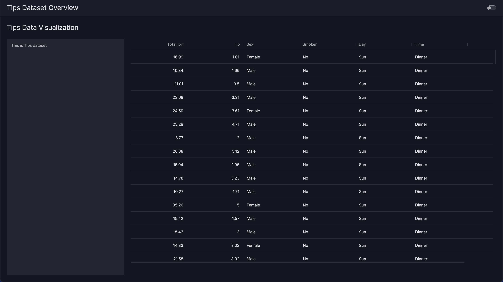

# How to run Vizro-AI dashboard

!!! warning "Vizro-AI has been replaced by Vizro-MCP"

    Vizro-AI has largely been replaced by [Vizro-MCP](https://github.com/mckinsey/vizro/blob/main/vizro-mcp/README.md) and only supports chart generation from version 0.4.0.

This guide offers insights into different ways of running `VizroAI.dashboard` to generate a Vizro dashboards from natural language prompts.

??? note "Note: API key"

    Make sure you have followed the [LLM setup guide](../user-guides/install.md#set-up-access-to-a-large-language-model) and that your API key is set up in a `.env` file in the same folder as your Notebook file (`.ipynb`).

## Run Vizro-AI dashboard

!!! example "Generated dashboard"

    === "Prompt"

        ```py
        import vizro.plotly.express as px
        from vizro_ai import VizroAI
        from vizro import Vizro

        df = px.data.tips()
        user_question = """
        Create a one-page dashboard layout with the following components:

        1. Card:
           - Position: Left of the page
           - Size: Takes up 1/4 of the total page width
           - Content: Display the text "This is Tips dataset"

        1. Table:
           - Position: Right of the card
           - Size: Takes up the remaining 3/4 of the page width
           - Content: Display the Tips dataset
        """
        vizro_ai = VizroAI(model="gpt-4o-mini")
        dashboard = vizro_ai.dashboard([df], user_question)
        Vizro().build(dashboard).run()
        ```

    === "Result"

        

This triggers the dashboard building process. Once Vizro-AI finishes the dashboard generation process, you can now launch the dashboard.

## Retrieve the Python code of the dashboard

To illustrate the process, lets use the example above.

<!-- vale off -->

Like the `VizroAI.plot` method, in order to produce more comprehensive output we need to set `return_elements=True`. `return_elements` is a boolean (by default `False`) which determines the return type of `VizroAI.dashboard`.

- If set to `False` it produces a `Vizro` dashboard object.
- If set to `True`, it returns a class (a Pydantic model) containing both the dashboard object and the code string used to generate it.

!!! example "View dashboard code"

    === "Prompt"

        ```py
        import vizro.plotly.express as px
        from vizro_ai import VizroAI
        from vizro import Vizro

        df = px.data.tips()
        user_question = """
        Create a one-page dashboard layout with the following components:

        1. Card:
           - Position: Left of the page
           - Size: Takes up 1/4 of the total page width
           - Content: Display the text "This is Tips dataset"

        1. Table:
           - Position: Right of the card
           - Size: Takes up the remaining 3/4 of the page width
           - Content: Display the Tips dataset
        """
        vizro_ai = VizroAI(model="gpt-4o-mini")
        result = vizro_ai.dashboard([df], user_question, return_elements=True)

        print(result.code)
        ```

    === "Resulting code"

        ```py
        ######## Module Imports ##########
        from vizro import Vizro
        from vizro.managers import data_manager
        from vizro.models.types import capture
        import vizro.models as vm
        from vizro.tables import dash_ag_grid

        ########## Data Imports ##########
        #####!!! UNCOMMENT BELOW !!!######
        # data_manager["restaurant_bills"] = ===> Fill in here <===

        ###### Callable definitions ######


        ########## Object code ###########
        dashboard = vm.Dashboard(
           pages=[
               vm.Page(
                   id="Tips Data Visualization",
                   components=[
                       vm.Card(
                           id="tips_card_tips_data_visualization",
                           type="card",
                           text="This is Tips dataset",
                           href="",
                       ),
                       vm.AgGrid(
                           id="tips_table_tips_data_visualization",
                           figure=dash_ag_grid(data_frame="restaurant_bills"),
                       ),
                   ],
                   title="Tips Data Visualization",
                   layout=vm.Layout(grid=[[0, 1, 1, 1]]),
                   controls=[],
               )
           ],
           title="Tips Dataset Overview",
        )
        ```

To use the above code, you will still need to add three simple steps:

- Import your data.

    ```py
    data = pd.read_csv('data.csv')  # Replace 'data.csv' with your filename or path to your data
    ```

- After importing your data, register it in the data manager by uncommenting the data manager instance and assigning the imported data to it. See the Vizro guide on [connecting dashboard to data](https://vizro.readthedocs.io/en/stable/pages/user-guides/data/#reference-by-name/).

    ```py
    data_manager["restaurant_bills"] = data
    ```

- Launch the dashboard by adding the code below at the end of the file:

    ```py
    Vizro().build(dashboard).run()
    ```

Detailed guidance is provided in [dashboard generation tutorial](https://vizro.readthedocs.io/projects/vizro-ai/en/latest/pages/tutorials/quickstart/).

## Available Vizro components

The following list is a table of the Vizro components currently supported by Vizro-AI. This list is not exhaustive, and we are actively working on adding more features to Vizro-AI.

| Feature type         | Feature                                                                                                                 | Availability |
| -------------------- | ----------------------------------------------------------------------------------------------------------------------- | ------------ |
| **Components**       | [Graph](https://vizro.readthedocs.io/en/stable/pages/user-guides/graph/)                                                | ✔            |
|                      | [AG Grid](https://vizro.readthedocs.io/en/stable/pages/user-guides/table/#ag-grid)                                      | ✔            |
|                      | [Card](https://vizro.readthedocs.io/en/stable/pages/user-guides/card-button/)                                           | ✔            |
|                      | [Button](https://vizro.readthedocs.io/en/stable/pages/user-guides/card-button/)                                         | ✖            |
|                      | [Tabs](https://vizro.readthedocs.io/en/stable/pages/user-guides/tabs/)                                                  | ✖            |
|                      | [Containers](https://vizro.readthedocs.io/en/stable/pages/user-guides/container/)                                       | ✖            |
| **Controls**         | [Filter](https://vizro.readthedocs.io/en/stable/pages/user-guides/filters/)                                             | ✔            |
|                      | [Parameter](https://vizro.readthedocs.io/en/stable/pages/user-guides/parameters/)                                       | ✖            |
| **Navigation**       | [Default navigation](https://vizro.readthedocs.io/en/stable/pages/user-guides/navigation/#use-the-default-navigation)   | ✔            |
|                      | [Custom navigation](https://vizro.readthedocs.io/en/stable/pages/user-guides/navigation/#customize-the-navigation-bar)  | ✖            |
| **Layout**           | [Layout](https://vizro.readthedocs.io/en/stable/pages/user-guides/layouts/)                                             | ✔            |
| **Dashboard header** | [Dashboard title](https://vizro.readthedocs.io/en/stable/pages/user-guides/dashboard/)                                  | ✔            |
|                      | [Logo](https://vizro.readthedocs.io/en/stable/pages/user-guides/dashboard/)                                             | ✖            |
| **Actions**          | [Pre-defined actions](https://vizro.readthedocs.io/en/stable/pages/user-guides/actions/#pre-defined-actions/)           | ✖            |
|                      | [Filter interaction between charts](https://vizro.readthedocs.io/en/stable/pages/user-guides/actions/#cross-filtering/) | ✖            |
|                      | [Custom actions](https://vizro.readthedocs.io/en/stable/pages/user-guides/actions/#custom-actions/)                     | ✖            |

If a feature you need for your dashboard isn't currently supported by Vizro-AI you can retrieve the dashboard code and add it by hand before running the dashboard.
