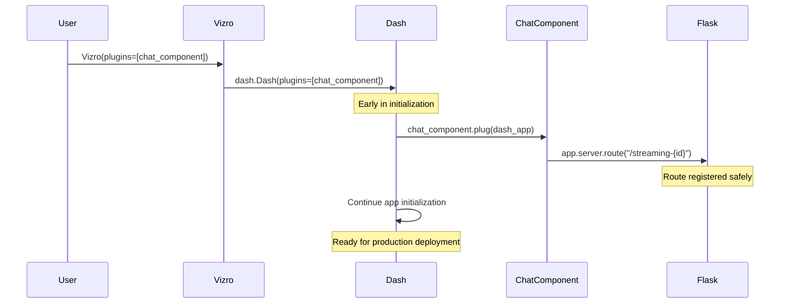

# VizroChatComponent Architecture Documentation

## Overview

VizroChatComponent is a chat interface built for Vizro dashboards that provides smooth streaming responses with rich markdown support. It features a plugin-based architecture that separates data processing from UI rendering, enabling easy integration with different AI services.

**🚨 Important**: This component **must be passed as a plugin to Vizro** to properly register its streaming routes. See the [Dash Plugin Pattern](#-dash-plugin-pattern) section for details.

## 🏗️ Architecture Design

### Core Components

```
┌─────────────────┐    ┌──────────────────┐    ┌───────────────────┐
│   Data Source   │ -> │   ChatProcessor  │ -> │ VizroChatComponent│
│  (LLM/AI API)   │    │   (Plugin API)   │    │   (UI Component)  │
└─────────────────┘    └──────────────────┘    └───────────────────┘
```

### 1. **ChatProcessor Layer** (Data Processing)
- **Responsibility**: Convert various data sources into standardized `ChatMessage` objects
- **Interface**: Abstract base class with `get_response()` method
- **Output**: Stream of typed `ChatMessage` objects
- **Flexibility**: Easy to implement custom processors for different AI services

### 2. **VizroChatComponent Layer** (UI & Experience)
- **Responsibility**: Handle all UI concerns, animations, user interactions
- **Features**: Smooth streaming, markdown rendering, clipboard functionality
- **Performance**: Client-side buffering and animation for optimal UX

### 3. **Communication Layer** (SSE Streaming)
- **Technology**: Server-Sent Events (SSE) for real-time streaming
- **Format**: JSON-serialized `ChatMessage` objects
- **Benefits**: Low latency, automatic reconnection, browser-native support

## 🔌 Dash Plugin Pattern

### Why We Use the Plugin Pattern

VizroChatComponent implements Dash's plugin interface to safely register streaming routes. This approach solves critical production deployment issues:

```python
class VizroChatComponent(VizroBaseModel):
    def plug(self, app):
        """Called by Dash during app initialization to register routes."""
        @app.server.route(f"/streaming-{self.id}", methods=["POST"])
        def streaming_chat():
            # Direct access to self - no registry needed!
            return self.handle_streaming_request()
```

### Route Registration Approaches Comparison

| Approach | When Routes Register | Worker Safety | Component Access | Production Ready |
|----------|---------------------|---------------|------------------|------------------|
| **Plugin Pattern** ✅ | During Dash init | ✅ Before worker fork | ✅ Direct `self` access | ✅ Yes |
| `add_startup_route` | During Dash init | ✅ Before worker fork | ⚠️ Needs registry | ✅ Yes |
| `pre_build` registration | During component build | ❌ After worker fork | ✅ Direct `self` access | ❌ No |
| Route hooks | At import time | ✅ Before worker fork | ❌ Global state needed | ⚠️ Complex |

### Problems with Previous Approach

**Before (problematic)**:
```python
# ❌ Routes registered in pre_build() - UNSAFE for production
class VizroChatComponent:
    def pre_build(self):
        @dash.get_app().server.route(f"/streaming-{self.id}")
        def streaming_chat():
            return self.handle_request()
```

**Issues**:
- 🚨 **Worker Safety**: Routes registered after app forks to workers
- 🚨 **Timing Issues**: Registration happens during component building, not app initialization
- 🚨 **Production Failures**: Breaks with gunicorn, uvicorn, and other WSGI servers

### Plugin Pattern Benefits

**Now (safe and robust)**:
```python
# ✅ Plugin pattern - SAFE for production
class VizroChatComponent:
    def plug(self, app):
        @app.server.route(f"/streaming-{self.id}")
        def streaming_chat():
            return self.handle_request()  # Direct access to self!

# Usage
app = Vizro(plugins=[chat_component])  # Routes registered here
```

**Benefits**:
- ✅ **Production Safe**: Routes registered before worker processes fork
- ✅ **Clean Architecture**: No global state or component registries needed  
- ✅ **Direct Access**: Route handlers have direct access to component instance
- ✅ **Dash Convention**: Uses Dash's official plugin system
- ✅ **Easy Testing**: Each component can be tested in isolation

### Plugin Lifecycle



## 📊 Data Flow Architecture

### Complete Data Flow Pipeline

```
[LLM Token Stream] 
        ↓
[ChatProcessor.get_response()]
        ↓ 
[ChatMessage Objects]
        ↓
[JSON Serialization]
        ↓
[SSE Stream]
        ↓
[VizroChatComponent Callbacks]
        ↓
[Client-side Buffer]
        ↓
[Smooth Animation]
        ↓
[Rendered UI]
```

### Step-by-Step Flow

1. **Data Source** → Raw tokens/chunks from LLM or AI service
2. **Processor** → Parses and structures data into `ChatMessage` objects
3. **Serialization** → Converts to JSON for network transmission
4. **SSE Streaming** → Real-time streaming to browser
5. **Component Callbacks** → Server-side Dash callbacks receive data
6. **Buffer Management** → Accumulates content in client-side buffer
7. **Animation Engine** → Smooth character-by-character rendering
8. **UI Rendering** → Final display with markdown, syntax highlighting, clipboard

## 🔧 Special Design Features

### 1. Streaming Buffer System

**Purpose**: Provide smooth, consistent animation regardless of irregular token arrival from LLMs.

**How It Works**:
```python
# Server-side: Accumulate all received content
stream_buffer = ""
for message in sse_stream:
    stream_buffer += message.content

# Client-side: Smooth character-by-character rendering
render_position = 0
timer_interval = 33ms  # ~30fps

def animate_frame():
    if render_position < len(stream_buffer):
        chars_to_add = min(4, len(stream_buffer) - render_position)
        render_position += chars_to_add
        display_content = stream_buffer[:render_position]
        update_ui(display_content)
```

**Benefits**:
- Consistent typing speed regardless of network irregularities
- Smooth visual experience similar to ChatGPT/Claude
- Decouples data arrival from visual presentation

### 2. Server-Sent Events (SSE) Integration

**Why SSE**: 
- Browser-native streaming support
- Automatic reconnection handling
- Lower overhead than WebSockets for one-way communication
- Works through proxies and firewalls

**Implementation**:
```python
# Server-side streaming endpoint
@app.route("/streaming-{component_id}", methods=["POST"])
def streaming_chat():
    def response_stream():
        for chat_message in processor.get_response(messages, prompt):
            yield sse_message(chat_message.to_json())
        yield sse_message()  # Signal completion
    
    return Response(response_stream(), mimetype="text/event-stream")

# Client-side SSE consumption
<SSE id="sse-component" url="/streaming-endpoint" />
```

### 3. Client-Side Animation Engine

**Smooth Rendering Algorithm**:
```javascript
function animate_stream(n_intervals, stream_buffer, render_position) {
    if (render_position < stream_buffer.length) {
        // Adaptive speed: faster for longer content
        const charsToAdd = Math.min(
            Math.max(2, Math.floor(stream_buffer.length / 100)), 
            4
        );
        const newPosition = Math.min(
            render_position + charsToAdd, 
            stream_buffer.length
        );
        
        return [newPosition, stream_buffer.slice(0, newPosition)];
    }
    
    // Animation complete
    return [no_update, no_update];
}
```

**Timer Management**:
- **Start**: When new content arrives
- **Stop**: When rendering is complete
- **Performance**: Uses `no_update` to prevent unnecessary re-renders

### 4. Safe Markdown Parsing During Streaming

**Challenge**: Incomplete markdown blocks can break rendering during streaming.

**Solution**: Parse incrementally with rollback capability:

```python
def parse_markdown_stream(token_stream):
    buffer = ""
    in_code_block = False
    
    for token in token_stream:
        buffer += token
        
        # Check for complete code block delimiters
        while "```" in buffer:
            before, delimiter, after = buffer.partition("```")
            
            if in_code_block:
                # Complete code block - safe to render
                yield ChatMessage(
                    type=MessageType.CODE,
                    content=before,
                    metadata={"language": code_language}
                )
                in_code_block = False
            else:
                # Starting code block
                if before.strip():
                    yield ChatMessage(type=MessageType.TEXT, content=before)
                in_code_block = True
```

**Benefits**:
- No broken markdown rendering during streaming
- Smooth transitions between text and code blocks
- Maintains syntax highlighting throughout the stream

### 5. Dynamic Clipboard System

**Architecture**: 
```javascript
// Detect new code blocks as they render
const codeBlocks = document.querySelectorAll('pre');

codeBlocks.forEach(pre => {
    // Create clipboard button with SVG icon
    const clipboardBtn = document.createElement('button');
    clipboardBtn.innerHTML = `<svg>...</svg>`;
    
    // Position in top-right corner
    clipboardBtn.style.position = 'absolute';
    clipboardBtn.style.top = '5px';
    clipboardBtn.style.right = '5px';
    
    // Copy functionality
    clipboardBtn.onclick = () => {
        navigator.clipboard.writeText(pre.textContent);
        showSuccessFeedback();
    };
    
    pre.appendChild(clipboardBtn);
});
```

**Features**:
- **Auto-detection**: Dynamically adds buttons to new code blocks
- **Visual feedback**: Icon changes to checkmark on successful copy
- **Claude-style UX**: Hidden until hover, smooth transitions

## 🔌 ChatProcessor Plugin Architecture

> **Note**: This section covers the ChatProcessor plugin system for AI integrations. For the Dash plugin pattern used for route registration, see [Dash Plugin Pattern](#-dash-plugin-pattern) above.

### Creating Custom Processors

```python
from vizro_ai.components import ChatProcessor, ChatMessage, MessageType

class CustomProcessor(ChatProcessor):
    def get_response(self, messages, prompt):
        # Connect to your AI service
        response = my_ai_service.generate(prompt)
        
        # Stream character by character
        for char in response:
            yield ChatMessage(
                type=MessageType.TEXT,
                content=char
            )
        
        # Or yield complete blocks
        yield ChatMessage(
            type=MessageType.CODE,
            content="print('hello')",
            metadata={"language": "python"}
        )

# Use with VizroChatComponent
chat = VizroChatComponent(
    id="my-chat",
    processor=CustomProcessor()
)
```

### Supported Message Types

```python
class MessageType(str, Enum):
    TEXT = "text"      # Regular text content
    CODE = "code"      # Code blocks with syntax highlighting
    ERROR = "error"    # Error messages with special styling
```

### Message Schema

```python
class ChatMessage(BaseModel):
    type: MessageType = MessageType.TEXT
    content: str                              # The actual content
    metadata: Dict[str, Any] = {}            # Additional data (e.g., language for code)
    
    def to_json(self) -> str:
        return self.model_dump_json()
```

## 🎯 Performance Optimizations

### 1. **Efficient Re-rendering Prevention**
- Uses `dash.no_update` to prevent unnecessary component updates
- Separates buffer updates from visual rendering
- Client-side animation reduces server round-trips

### 2. **Memory Management**
- Streaming buffer is cleared between messages
- Clipboard buttons are cleaned up and recreated to prevent memory leaks
- Timer is properly disabled when animation completes

### 3. **Network Efficiency**
- SSE provides persistent connection for streaming
- JSON serialization minimizes payload size
- Graceful error handling prevents connection drops

## 🔧 Configuration Options

### Component Configuration

```python
VizroChatComponent(
    id="chat-component",
    input_placeholder="Ask me anything...",
    input_height="80px",
    button_text="Send",
    initial_message="Hello! How can I help?",
    processor=YourCustomProcessor()
)
```

### Styling Customization

The component uses CSS variables for theming:
- `--surfaces-bg-card`: Background colors
- `--text-primary`: Primary text color
- `--border-subtleAlpha01`: Border colors

### Animation Tuning

```javascript
// In client-side callback
const interval = 33;        // ~30fps animation
const charsPerFrame = 2-4;  // Adaptive speed
const maxIntervals = content_length / charsPerFrame;
```

## 🚀 Getting Started

### Basic Usage

```python
import vizro.models as vm
from vizro import Vizro
from vizro_ai.components import VizroChatComponent, OpenAIProcessor

# Create the chat component
chat = VizroChatComponent(
    id="ai-chat",
    processor=OpenAIProcessor(
        model="gpt-4o-mini",
        api_key="your-api-key"
    )
)

# Register the component type with Vizro
vm.Page.add_type("components", VizroChatComponent)

# Create page with the chat component
page = vm.Page(
    title="AI Chat",
    components=[chat]
)

# Create dashboard
dashboard = vm.Dashboard(pages=[page])

# 🚨 IMPORTANT: Pass component as plugin to Vizro
app = Vizro(plugins=[chat])
app.build(dashboard).run()
```

### Migration from Previous Versions

If you're upgrading from a previous version, update your code:

**Before (old way)**:
```python
# ❌ This approach had production safety issues
app = Vizro()
app.build(dashboard).run()
```

**After (new plugin way)**:
```python
# ✅ Safe for production deployments
app = Vizro(plugins=[chat_component])
app.build(dashboard).run()
```

### Advanced Usage

```python
import vizro.models as vm
from vizro import Vizro
from vizro_ai.components import VizroChatComponent, ChatProcessor, ChatMessage, MessageType

# Custom processor with agent framework
class AgentProcessor(ChatProcessor):
    def __init__(self, agent_config):
        self.agent = create_agent(agent_config)
    
    def get_response(self, messages, prompt):
        for step in self.agent.run_stream(prompt):
            if step.type == "thought":
                yield ChatMessage(
                    type=MessageType.TEXT,
                    content=f"💭 {step.content}",
                    metadata={"step_type": "reasoning"}
                )
            elif step.type == "code":
                yield ChatMessage(
                    type=MessageType.CODE,
                    content=step.content,
                    metadata={"language": step.language}
                )

# Create component with custom processor
chat = VizroChatComponent(
    id="agent-chat",
    processor=AgentProcessor(agent_config)
)

# Register and use with Vizro
vm.Page.add_type("components", VizroChatComponent)
page = vm.Page(title="Agent Chat", components=[chat])
dashboard = vm.Dashboard(pages=[page])

# Use plugin pattern for production safety
app = Vizro(plugins=[chat])
app.build(dashboard).run()
```

### Multiple Chat Components

For multiple chat components on different pages:

```python
# Create multiple chat components
chat1 = VizroChatComponent(id="general-chat", processor=OpenAIProcessor())
chat2 = VizroChatComponent(id="agent-chat", processor=AgentProcessor())

# Pass all components as plugins
app = Vizro(plugins=[chat1, chat2])
app.build(dashboard).run()
```

## 🔍 Debugging & Development

### Console Debugging

The component logs useful information to browser console:
```javascript
// Check for clipboard functionality
console.log('Found code blocks:', codeBlocks.length);
console.log('Processing code block:', pre);

// Monitor animation state  
console.log('Animation position:', render_position);
console.log('Buffer length:', stream_buffer.length);
```

### Route Registration Verification

To verify routes are properly registered:

```python
def verify_routes(app):
    """Debug helper to check registered routes."""
    routes = [rule.rule for rule in app.dash.server.url_map.iter_rules()]
    print("Registered routes:")
    for route in routes:
        print(f"  {route}")
    
    # Check for chat component routes
    chat_routes = [r for r in routes if r.startswith("/streaming-")]
    print(f"Found {len(chat_routes)} chat component routes")
    return chat_routes

# Usage
app = Vizro(plugins=[chat_component])
app.build(dashboard)
verify_routes(app)  # Check before running
```

### Common Issues

1. **Route not found errors**: 
   - ❌ **Cause**: Component not passed as plugin to Vizro
   - ✅ **Fix**: Add `plugins=[chat_component]` to `Vizro()` constructor

2. **Routes not working in production**:
   - ❌ **Cause**: Using old `pre_build()` route registration 
   - ✅ **Fix**: Upgrade to plugin pattern

3. **Multiple workers not working**:
   - ❌ **Cause**: Routes registered after worker fork
   - ✅ **Fix**: Use plugin pattern for early route registration

4. **No streaming animation**: Check that timer is enabled and `supports_streaming=True`

5. **Clipboard not working**: Ensure HTTPS or localhost for clipboard API

6. **Markdown not rendering**: Verify CSS classes and selectors

7. **Memory leaks**: Check that timers are properly disabled

### Plugin Pattern Troubleshooting

```python
# ❌ Common mistake - forgetting plugin registration
app = Vizro()  # Component routes won't work!

# ✅ Correct approach 
app = Vizro(plugins=[chat_component])

# ❌ Another mistake - not registering component type
page = vm.Page(components=[chat_component])  # Will fail!

# ✅ Correct approach
vm.Page.add_type("components", VizroChatComponent)
page = vm.Page(components=[chat_component])
```

## 📋 Quick Reference

### Essential Plugin Pattern Usage

```python
# 1. Create component
chat = VizroChatComponent(id="my-chat", processor=YourProcessor())

# 2. Register component type  
vm.Page.add_type("components", VizroChatComponent)

# 3. Create dashboard
dashboard = vm.Dashboard(pages=[vm.Page(components=[chat])])

# 4. 🚨 CRITICAL: Pass as plugin for route registration
app = Vizro(plugins=[chat])
app.build(dashboard).run()
```

### Key Benefits of Plugin Pattern

- ✅ **Production Safe**: Routes registered before worker processes fork
- ✅ **Multi-Worker Compatible**: Works with gunicorn, uvicorn, etc.  
- ✅ **Clean Architecture**: Direct component access, no registries
- ✅ **Dash Standard**: Uses official Dash plugin system

This architecture provides a robust, extensible foundation for building AI-powered chat interfaces in Vizro applications.