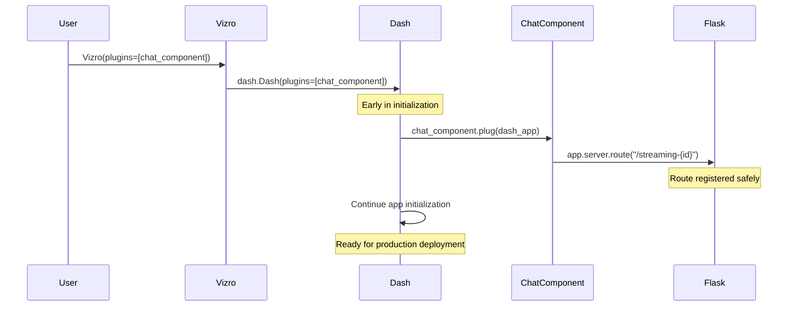

# Chat Component Architecture Documentation

## Overview

The Chat component (formerly VizroChatComponent) is a chat interface built for Vizro dashboards that provides smooth streaming responses with rich markdown support. It features a plugin-based architecture that separates data processing from UI rendering, enabling easy integration with different AI services.

**🚨 Important**: This component **must be passed as a plugin to Vizro** to properly register its streaming routes. See the [Dash Plugin Pattern](#-dash-plugin-pattern) section for details.

## 🏗️ Architecture Design

### Core Components

```
┌─────────────────┐    ┌──────────────────┐    ┌───────────────────┐
│   Data Source   │ -> │   ChatProcessor  │ -> │      Chat        │
│  (LLM/AI API)   │    │   (Plugin API)   │    │   (UI Component)  │
└─────────────────┘    └──────────────────┘    └───────────────────┘
```

### 1. **ChatProcessor Layer** (Data Processing)
- **Responsibility**: Convert various data sources into standardized `ChatMessage` objects
- **Interface**: Abstract base class with `get_response()` method
- **Output**: Stream of typed `ChatMessage` objects
- **Flexibility**: Easy to implement custom processors for different AI services

### 2. **Chat Component Layer** (UI & Experience)
- **Responsibility**: Handle all UI concerns, animations, user interactions
- **Features**: Smooth streaming, markdown rendering, clipboard functionality
- **Performance**: Client-side buffering and animation for optimal UX

### 3. **Communication Layer** (SSE Streaming)
- **Technology**: Server-Sent Events (SSE) for real-time streaming
- **Format**: JSON-serialized `ChatMessage` objects
- **Benefits**: Low latency, automatic reconnection, browser-native support

### 🎯 **Separation of Concerns Principle**

**Chat Model Focus**: The Chat component should remain focused on **UI/UX concerns**:
- Rendering messages and markdown content
- Handling streaming animations and user interactions  
- Managing chat history and persistence
- Providing clipboard functionality and visual feedback

**Processor Focus**: ChatProcessors handle their own **configuration and response generation logic**:
- API key management and authentication
- Model-specific configuration (temperature, model selection, etc.)
- Raw data processing and token generation
- Error handling for their specific AI service

This separation ensures:
- **Clean Architecture**: Each component has a single, well-defined responsibility
- **Reusability**: Processors can be swapped without affecting UI logic
- **Testability**: UI and AI logic can be tested independently
- **Maintainability**: Changes to AI services don't require UI modifications

**Example of Good Separation**:
```python
# ✅ Chat focuses on UI/UX
chat = Chat(
    id="my-chat",
    input_placeholder="Ask me anything...",
    processor=OpenAIProcessor(api_key="sk-...")  # Processor handles config
)

# ❌ Avoid: Chat handling processor-specific concerns
# chat = Chat(api_key="sk-...", model="gpt-4")  # Don't do this
```

## 🔌 Dash Plugin Pattern

### Why We Use the Plugin Pattern

The Chat component implements Dash's plugin interface to safely register streaming routes. This approach solves critical production deployment issues:

```python
class Chat(VizroBaseModel):
    def plug(self, app):
        """Called by Dash during app initialization to register routes."""
        @app.server.route(f"/streaming-{self.id}", methods=["POST"])
        def streaming_chat():
            # Direct access to self - no registry needed!
            return self.handle_streaming_request()
```

### Route Registration Approaches Comparison

| Approach | When Routes Register | Worker Safety | Component Access | Production Ready |
|----------|---------------------|---------------|------------------|------------------|
| **Plugin Pattern** ✅ | During Dash init | ✅ Before worker fork | ✅ Direct `self` access | ✅ Yes |
| `add_startup_route` | During Dash init | ✅ Before worker fork | ⚠️ Needs registry | ✅ Yes |
| `pre_build` registration | During component build | ❌ After worker fork | ✅ Direct `self` access | ❌ No |
| Route hooks | At import time | ✅ Before worker fork | ❌ Global state needed | ⚠️ Complex |

### Problems with Previous Approach

**Before (problematic)**:
```python
# ❌ Routes registered in pre_build() - UNSAFE for production
class Chat:
    def pre_build(self):
        @dash.get_app().server.route(f"/streaming-{self.id}")
        def streaming_chat():
            return self.handle_request()
```

**Issues**:
- 🚨 **Worker Safety**: Routes registered after app forks to workers
- 🚨 **Timing Issues**: Registration happens during component building, not app initialization
- 🚨 **Production Failures**: Breaks with gunicorn, uvicorn, and other WSGI servers

### Plugin Pattern Benefits

**Now (safe and robust)**:
```python
# ✅ Plugin pattern - SAFE for production
class Chat:
    def plug(self, app):
        @app.server.route(f"/streaming-{self.id}")
        def streaming_chat():
            return self.handle_request()  # Direct access to self!

# Usage
app = Vizro(plugins=[chat_component])  # Routes registered here
```

**Benefits**:
- ✅ **Production Safe**: Routes registered before worker processes fork
- ✅ **Clean Architecture**: No global state or component registries needed  
- ✅ **Direct Access**: Route handlers have direct access to component instance
- ✅ **Dash Convention**: Uses Dash's official plugin system
- ✅ **Easy Testing**: Each component can be tested in isolation

### Plugin Lifecycle



## 📊 Data Flow Architecture

### Complete Data Flow Pipeline

```
[LLM Token Stream] 
        ↓
[ChatProcessor.get_response()]
        ↓ 
[ChatMessage Objects]
        ↓
[JSON Serialization]
        ↓
[SSE Stream]
        ↓
[Chat Component Callbacks]
        ↓
[Stream Buffer Store]
        ↓
[Direct Markdown Update]
        ↓
[Rendered UI]
```

### Step-by-Step Flow

1. **Data Source** → Raw tokens/chunks from LLM or AI service
2. **Processor** → Parses and structures data into `ChatMessage` objects
3. **Serialization** → Converts to JSON for network transmission
4. **SSE Streaming** → Real-time streaming to browser
5. **Component Callbacks** → Server-side Dash callbacks receive data
6. **Buffer Management** → Accumulates content in stream buffer store
7. **Direct Update** → Updates markdown component directly as content arrives
8. **UI Rendering** → Final display with markdown, syntax highlighting, clipboard

## 🔧 Special Design Features

### 1. Simplified Streaming System

**Purpose**: Provide real-time streaming display of AI responses as they arrive.

**How It Works**:
```python
# Server-side: Stream individual tokens/messages
for chat_message in processor.get_response(messages, prompt):
    yield sse_message(chat_message.to_json())

# Client-side: Direct update to markdown component
@callback(
    Output("streaming-markdown", "children"),
    Input("stream-buffer", "data")
)
def update_streaming_display(buffer_content):
    return buffer_content
```

**Benefits**:
- Real-time display of content as it arrives from the AI
- Simple and robust implementation
- No complex client-side animation logic needed
- Natural typing effect from token-by-token streaming

### 2. Server-Sent Events (SSE) Integration

**Why SSE**: 
- Browser-native streaming support
- Automatic reconnection handling
- Lower overhead than WebSockets for one-way communication
- Works through proxies and firewalls

**Implementation**:
```python
# Server-side streaming endpoint
@app.route("/streaming-{component_id}", methods=["POST"])
def streaming_chat():
    def response_stream():
        for chat_message in processor.get_response(messages, prompt):
            yield sse_message(chat_message.to_json())
        yield sse_message()  # Signal completion
    
    return Response(response_stream(), mimetype="text/event-stream")

# Client-side SSE consumption
<SSE id="sse-component" url="/streaming-endpoint" />
```

### 3. Persistence and Storage

**Message Storage**:
- Uses `dcc.Store` with `storage_type="local"` for persistence
- Messages stored immediately, including placeholders for assistant responses
- Visual history rebuilt from storage on page load

**Flow**:
1. User message → Stored immediately
2. Assistant placeholder → Added immediately to ensure persistence
3. Streaming content → Updates buffer in real-time
4. Completion signal → Updates stored assistant message with final content

### 4. Safe Markdown Parsing During Streaming

**Challenge**: Handle both regular text and code blocks during streaming.

**Solution**: The `parse_markdown_stream` function yields tokens immediately for text:

```python
def parse_markdown_stream(token_stream):
    for token in token_stream:
        if in_code_block:
            # Buffer code until closing delimiter
            buffer += token
            if "```" in buffer:
                # Yield complete code block
        else:
            if "```" in buffer:
                # Start code block
            else:
                # Yield text token immediately
                yield ChatMessage(type=MessageType.TEXT, content=token)
```

**Benefits**:
- Real-time text streaming
- Proper code block handling
- Clean separation of text and code content

### 5. Dynamic Clipboard System

**Architecture**: 
```javascript
// Detect new code blocks as they render
const codeBlocks = document.querySelectorAll('pre');

codeBlocks.forEach(pre => {
    // Create clipboard button with SVG icon
    const clipboardBtn = document.createElement('button');
    clipboardBtn.innerHTML = `<svg>...</svg>`;
    
    // Position in top-right corner
    clipboardBtn.style.position = 'absolute';
    clipboardBtn.style.top = '5px';
    clipboardBtn.style.right = '5px';
    
    // Copy functionality
    clipboardBtn.onclick = () => {
        navigator.clipboard.writeText(pre.textContent);
        showSuccessFeedback();
    };
    
    pre.appendChild(clipboardBtn);
});
```

**Features**:
- **Auto-detection**: Dynamically adds buttons to new code blocks
- **Visual feedback**: Icon changes to checkmark on successful copy
- **Claude-style UX**: Hidden until hover, smooth transitions

## 🔌 ChatProcessor Plugin Architecture

> **Note**: This section covers the ChatProcessor plugin system for AI integrations. For the Dash plugin pattern used for route registration, see [Dash Plugin Pattern](#-dash-plugin-pattern) above.

### Creating Custom Processors

```python
from vizro_ai.components import ChatProcessor, ChatMessage, MessageType

class CustomProcessor(ChatProcessor):
    def get_response(self, messages, prompt):
        # Connect to your AI service
        response = my_ai_service.generate(prompt)
        
        # Stream character by character
        for char in response:
            yield ChatMessage(
                type=MessageType.TEXT,
                content=char
            )
        
        # Or yield complete blocks
        yield ChatMessage(
            type=MessageType.CODE,
            content="print('hello')",
            metadata={"language": "python"}
        )

# Use with Chat component
chat = Chat(
    id="my-chat",
    processor=CustomProcessor()
)
```

### Supported Message Types

```python
class MessageType(str, Enum):
    TEXT = "text"      # Regular text content
    CODE = "code"      # Code blocks with syntax highlighting
    ERROR = "error"    # Error messages with special styling
```

### Message Schema

```python
class ChatMessage(BaseModel):
    type: MessageType = MessageType.TEXT
    content: str                              # The actual content
    metadata: Dict[str, Any] = {}            # Additional data (e.g., language for code)
    
    def to_json(self) -> str:
        return self.model_dump_json()
```

## 🎯 Performance Optimizations

### 1. **Efficient Re-rendering Prevention**
- Uses `dash.no_update` to prevent unnecessary component updates
- Direct markdown updates minimize re-renders
- Completion trigger prevents duplicate store updates

### 2. **Memory Management**
- Streaming buffer is cleared between messages
- Clipboard buttons are cleaned up and recreated to prevent memory leaks
- Messages stored efficiently with immediate persistence

### 3. **Network Efficiency**
- SSE provides persistent connection for streaming
- JSON serialization minimizes payload size
- Graceful error handling prevents connection drops
- Proper cache control headers for optimal streaming

## 🔧 Configuration Options

### Component Configuration

```python
Chat(
    id="chat-component",
    input_placeholder="Ask me anything...",
    input_height="80px",
    button_text="Send",
    initial_message="Hello! How can I help?",
    processor=YourCustomProcessor()
)
```

### Styling Customization

The component uses CSS variables for theming:
- `--surfaces-bg-card`: Background colors
- `--text-primary`: Primary text color
- `--border-subtleAlpha01`: Border colors

### Streaming Configuration

The streaming behavior is controlled by:
- **SSE Animation**: `animate_chunk=5` - Process chunks every 5ms
- **Token Yield Rate**: Controlled by the ChatProcessor implementation
- **Buffer Updates**: Direct updates as tokens arrive for real-time display

## 🚀 Getting Started

### Basic Usage

```python
import vizro.models as vm
from vizro import Vizro
from vizro_ai.models import Chat, OpenAIProcessor

# Create the chat component
chat = Chat(
    id="ai-chat",
    processor=OpenAIProcessor(
        model="gpt-4o-mini",
        api_key="your-api-key"
    )
)

# Register the component type with Vizro
vm.Page.add_type("components", Chat)

# Create page with the chat component
page = vm.Page(
    title="AI Chat",
    components=[chat]
)

# Create dashboard
dashboard = vm.Dashboard(pages=[page])

# 🚨 IMPORTANT: Pass component as plugin to Vizro
app = Vizro(plugins=[chat])
app.build(dashboard).run()
```

### Migration from Previous Versions

If you're upgrading from a previous version, update your code:

**Before (old way)**:
```python
# ❌ This approach had production safety issues
app = Vizro()
app.build(dashboard).run()
```

**After (new plugin way)**:
```python
# ✅ Safe for production deployments
app = Vizro(plugins=[chat_component])
app.build(dashboard).run()
```

### Advanced Usage

```python
import vizro.models as vm
from vizro import Vizro
from vizro_ai.models import Chat, ChatProcessor, ChatMessage, MessageType

# Custom processor with agent framework
class AgentProcessor(ChatProcessor):
    def __init__(self, agent_config):
        self.agent = create_agent(agent_config)
    
    def get_response(self, messages, prompt):
        for step in self.agent.run_stream(prompt):
            if step.type == "thought":
                yield ChatMessage(
                    type=MessageType.TEXT,
                    content=f"💭 {step.content}",
                    metadata={"step_type": "reasoning"}
                )
            elif step.type == "code":
                yield ChatMessage(
                    type=MessageType.CODE,
                    content=step.content,
                    metadata={"language": step.language}
                )

# Create component with custom processor
chat = Chat(
    id="agent-chat",
    processor=AgentProcessor(agent_config)
)

# Register and use with Vizro
vm.Page.add_type("components", Chat)
page = vm.Page(title="Agent Chat", components=[chat])
dashboard = vm.Dashboard(pages=[page])

# Use plugin pattern for production safety
app = Vizro(plugins=[chat])
app.build(dashboard).run()
```

### Multiple Chat Components

For multiple chat components on different pages:

```python
# Create multiple chat components
chat1 = Chat(id="general-chat", processor=OpenAIProcessor())
chat2 = Chat(id="agent-chat", processor=AgentProcessor())

# Pass all components as plugins
app = Vizro(plugins=[chat1, chat2])
app.build(dashboard).run()
```

## 🔍 Debugging & Development

### Console Debugging

The component logs useful information to browser console:
```javascript
// Check for clipboard functionality
console.log('Found code blocks:', codeBlocks.length);
console.log('Processing code block:', pre);

// Server-side logs (Python)
print(f"[{self.id}] Streaming message: {message}")
print(f"[{self.id}] Buffer content: {buffer_content}")
```

### Route Registration Verification

To verify routes are properly registered:

```python
def verify_routes(app):
    """Debug helper to check registered routes."""
    routes = [rule.rule for rule in app.dash.server.url_map.iter_rules()]
    print("Registered routes:")
    for route in routes:
        print(f"  {route}")
    
    # Check for chat component routes
    chat_routes = [r for r in routes if r.startswith("/streaming-")]
    print(f"Found {len(chat_routes)} chat component routes")
    return chat_routes

# Usage
app = Vizro(plugins=[chat_component])
app.build(dashboard)
verify_routes(app)  # Check before running
```

### Common Issues

1. **Route not found errors**: 
   - ❌ **Cause**: Component not passed as plugin to Vizro
   - ✅ **Fix**: Add `plugins=[chat_component]` to `Vizro()` constructor

2. **Routes not working in production**:
   - ❌ **Cause**: Using old `pre_build()` route registration 
   - ✅ **Fix**: Upgrade to plugin pattern

3. **Multiple workers not working**:
   - ❌ **Cause**: Routes registered after worker fork
   - ✅ **Fix**: Use plugin pattern for early route registration

4. **No streaming effect**: Check that processor yields tokens individually, not all at once

5. **Clipboard not working**: Ensure HTTPS or localhost for clipboard API

6. **Markdown not rendering**: Verify CSS classes and selectors

7. **Completion not detected**: Check that completion signal is sent and parsed correctly

### Plugin Pattern Troubleshooting

```python
# ❌ Common mistake - forgetting plugin registration
app = Vizro()  # Component routes won't work!

# ✅ Correct approach 
app = Vizro(plugins=[chat_component])

# ❌ Another mistake - not registering component type
page = vm.Page(components=[chat_component])  # Will fail!

# ✅ Correct approach
vm.Page.add_type("components", Chat)
page = vm.Page(components=[chat_component])
```

## 📋 Quick Reference

### Essential Plugin Pattern Usage

```python
# 1. Create component
chat = Chat(id="my-chat", processor=YourProcessor())

# 2. Register component type  
vm.Page.add_type("components", Chat)

# 3. Create dashboard
dashboard = vm.Dashboard(pages=[vm.Page(components=[chat])])

# 4. 🚨 CRITICAL: Pass as plugin for route registration
app = Vizro(plugins=[chat])
app.build(dashboard).run()
```

### Key Benefits of Plugin Pattern

- ✅ **Production Safe**: Routes registered before worker processes fork
- ✅ **Multi-Worker Compatible**: Works with gunicorn, uvicorn, etc.  
- ✅ **Clean Architecture**: Direct component access, no registries
- ✅ **Dash Standard**: Uses official Dash plugin system

This architecture provides a robust, extensible foundation for building AI-powered chat interfaces in Vizro applications.