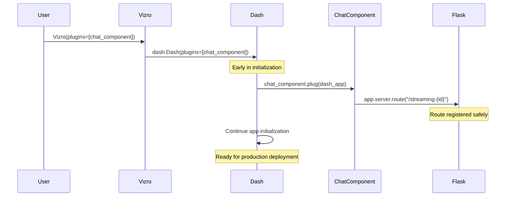

# Chat Component Architecture Documentation

## Overview

The Chat component is a streaming chat interface built for Vizro dashboards that provides real-time AI responses with rich markdown support. It features a plugin-based architecture that separates data processing from UI rendering, enabling easy integration with different AI services.

**🚨 Important**: This component **must be passed as a plugin to Vizro** to properly register its streaming routes. See the [Dash Plugin Pattern](#-dash-plugin-pattern) section for details.

## 🏗️ Architecture Design

### Core Components

```
┌─────────────────┐    ┌──────────────────┐    ┌───────────────────┐
│   Data Source   │ -> │   ChatProcessor  │ -> │      Chat        │
│  (LLM/AI API)   │    │   (Plugin API)   │    │   (UI Component)  │
└─────────────────┘    └──────────────────┘    └───────────────────┘
```

### Supported Content Types

The Chat component supports rich mixed content through structured `ChatMessage` types:

- **`TEXT`**: Regular text content with markdown support
- **`CODE`**: Syntax-highlighted code blocks with individual clipboard buttons
- **`PLOTLY_GRAPH`**: Interactive Plotly charts rendered directly in chat
- **`ERROR`**: Error messages with appropriate styling and handling

### 1. **ChatProcessor Layer** (Data Processing)
- **Responsibility**: Convert various data sources into standardized `ChatMessage` objects
- **Interface**: Abstract base class with `get_response()` method
- **Output**: Stream of typed `ChatMessage` objects
- **Flexibility**: Easy to implement custom processors for different AI services

### 2. **Chat Component Layer** (UI & Experience)
- **Responsibility**: Handle all UI concerns, streaming, user interactions
- **Features**: Real-time streaming, markdown rendering, clipboard functionality, smart scrolling
- **Performance**: SSE-based streaming with optimized animation for smooth UX

### 3. **Communication Layer** (SSE Streaming)
- **Technology**: Server-Sent Events (SSE) via dash-extensions
- **Format**: JSON-serialized `ChatMessage` objects
- **Completion**: Uses standard `[DONE]` signal and SSE `done` property
- **Benefits**: Low latency, automatic reconnection, browser-native support

### 🎯 **Separation of Concerns Principle**

**Chat Model Focus**: The Chat component handles **UI/UX concerns**:
- Real-time streaming display with smooth animations
- Markdown rendering with code block support
- Chat history persistence and restoration
- Smart auto-scrolling to keep user messages visible
- Clipboard functionality for code blocks
- Error handling and user feedback

**Processor Focus**: ChatProcessors handle **data generation logic**:
- API key management and authentication
- Model-specific configuration (temperature, model selection, etc.)
- Raw data processing and token generation
- Error handling for their specific AI service

This separation ensures:
- **Clean Architecture**: Each component has a single, well-defined responsibility
- **Reusability**: Processors can be swapped without affecting UI logic
- **Testability**: UI and AI logic can be tested independently
- **Maintainability**: Changes to AI services don't require UI modifications

**Example of Good Separation**:
```python
# ✅ Chat focuses on UI/UX
chat = Chat(
    id="my-chat",
    input_placeholder="Ask me anything...",
    processor=OpenAIProcessor(api_key="sk-...")  # Processor handles config
)

# ❌ Avoid: Chat handling processor-specific concerns
# chat = Chat(api_key="sk-...", model="gpt-4")  # Don't do this
```

## 🔌 Dash Plugin Pattern

### Why We Use the Plugin Pattern

The Chat component implements Dash's plugin interface to safely register streaming routes. This approach solves critical production deployment issues:

```python
class Chat(VizroBaseModel):
    def plug(self, app):
        """Called by Dash during app initialization to register routes."""
        @app.server.route(f"/streaming-{self.id}", methods=["POST"])
        def streaming_chat():
            # Direct access to self - no registry needed!
            return self.handle_streaming_request()
```

### Route Registration Approaches Comparison

| Approach | When Routes Register | Worker Safety | Component Access | Production Ready |
|----------|---------------------|---------------|------------------|------------------|
| **Plugin Pattern** ✅ | During Dash init | ✅ Before worker fork | ✅ Direct `self` access | ✅ Yes |
| `add_startup_route` | During Dash init | ✅ Before worker fork | ⚠️ Needs registry | ✅ Yes |
| `pre_build` registration | During component build | ❌ After worker fork | ✅ Direct `self` access | ❌ No |
| Route hooks | At import time | ✅ Before worker fork | ❌ Global state needed | ⚠️ Complex |

### Problems with Previous Approach

**Before (problematic)**:
```python
# ❌ Routes registered in pre_build() - UNSAFE for production
class Chat:
    def pre_build(self):
        @dash.get_app().server.route(f"/streaming-{self.id}")
        def streaming_chat():
            return self.handle_request()
```

**Issues**:
- 🚨 **Worker Safety**: Routes registered after app forks to workers
- 🚨 **Timing Issues**: Registration happens during component building, not app initialization
- 🚨 **Production Failures**: Breaks with gunicorn, uvicorn, and other WSGI servers

### Plugin Pattern Benefits

**Now (safe and robust)**:
```python
# ✅ Plugin pattern - SAFE for production
class Chat:
    def plug(self, app):
        @app.server.route(f"/streaming-{self.id}")
        def streaming_chat():
            return self.handle_request()  # Direct access to self!

# Usage
app = Vizro(plugins=[chat_component])  # Routes registered here
```

**Benefits**:
- ✅ **Production Safe**: Routes registered before worker processes fork
- ✅ **Clean Architecture**: No global state or component registries needed  
- ✅ **Direct Access**: Route handlers have direct access to component instance
- ✅ **Dash Convention**: Uses Dash's official plugin system
- ✅ **Easy Testing**: Each component can be tested in isolation

### Plugin Lifecycle



## 📊 Data Flow Architecture

### Complete Data Flow Pipeline

```
[LLM Token Stream] 
        ↓
[parse_markdown_stream()] ← (Optional: For automatic markdown parsing)
        ↓
[ChatProcessor.get_response()]
        ↓ 
[ChatMessage Objects] ← (TEXT, CODE, PLOTLY_GRAPH, ERROR)
        ↓
[JSON Serialization]
        ↓
[SSE Stream with [DONE] signal]
        ↓
[dash-extensions SSE Component]
        ↓
[Stream Buffer Store] ← (Structured content items)
        ↓
[Mixed Content Rendering] ← (Text, Code Blocks, Interactive Charts)
        ↓
[Rendered UI with Smart Scroll]
```

### Key Architectural Components

#### `parse_markdown_stream()` Function
Automatically detects and separates code blocks from streaming text:

```python
def parse_markdown_stream(token_stream):
    """Parse a stream of tokens and yield structured messages."""
    buffer = ""
    in_code_block = False
    
    for token in token_stream:
        if "```" in token:
            # Handle code block boundaries
            # Yield TEXT message for content before code
            # Yield CODE message for code content
        else:
            # Stream text tokens immediately for real-time effect
            yield ChatMessage(type=MessageType.TEXT, content=token)
```

**Benefits:**
- **Real-time streaming**: Text tokens yielded immediately
- **Smart parsing**: Automatically detects code block boundaries  
- **Structured output**: Separates text and code for proper rendering

### Step-by-Step Flow

1. **Data Source** → Raw tokens/chunks from LLM or AI service
2. **Processor** → Parses and structures data into `ChatMessage` objects
3. **Serialization** → Converts to JSON for network transmission
4. **SSE Streaming** → Real-time streaming to browser with `[DONE]` completion signal
5. **Component Callbacks** → Server-side Dash callbacks receive data via SSE animation
6. **Buffer Management** → Accumulates structured content in stream buffer store
7. **Content Rendering** → Updates streaming display with mixed text and code components
8. **Completion Detection** → Uses SSE `done` property to detect stream completion
9. **Message Persistence** → Converts structured content to markdown and stores in message history
10. **Smart Scrolling** → Auto-scrolls to keep user message visible during conversations

## 🔧 Special Design Features

### 1. Modern SSE Streaming System

**Purpose**: Provide real-time streaming display using standard SSE completion signals.

**How It Works**:
```python
# Server-side: Stream messages and send standard completion signal
for chat_message in processor.get_response(messages, prompt):
    yield sse_message(chat_message.to_json())
yield sse_message("[DONE]")  # Standard SSE completion

# Client-side: Use SSE done property for completion detection
@callback(
    Output("stream-buffer", "data"),
    Output("completion-trigger", "data"),
    Input("sse", "animation"),
    Input("sse", "done"),  # Built-in completion detection
)
def update_streaming_buffer(animation, done):
    # Process streaming content
    if done:
        return content, True  # Trigger completion
    return content, dash.no_update
```

**Benefits**:
- Uses standard `[DONE]` signal instead of custom completion markers
- Leverages dash-extensions built-in `done` property
- Clean separation between streaming and completion logic
- Optimized animation settings (`animate_chunk=20, animate_delay=5`) for smooth UX

### 2. Mixed Content Streaming System

**Purpose**: Handle streaming of text, code blocks, and interactive Plotly charts in real-time.

**Implementation**:
```python
def update_streaming_buffer(animation, done):
    # Parse SSE chunks into structured content
    content_items = []
    current_text = ""
    code_block_index = 0
    graph_index = 0
    
    for msg in messages:
        msg_type = msg.get("type", "text")
        msg_content = msg.get("content", "")
        msg_metadata = msg.get("metadata", {})
        
        if msg_type == "code":
            # Flush accumulated text, then add code block
            if current_text:
                content_items.append({"type": "text", "content": current_text})
                current_text = ""
            content_items.append({
                "type": "code", 
                "content": msg_content, 
                "index": code_block_index
            })
            code_block_index += 1
            
        elif msg_type == "plotly_graph":
            # Flush accumulated text, then add interactive chart
            if current_text:
                content_items.append({"type": "text", "content": current_text})
                current_text = ""
            content_items.append({
                "type": "plotly_graph",
                "content": msg_content,  # JSON serialized Plotly figure
                "index": graph_index,
                "metadata": msg_metadata  # Chart title, etc.
            })
            graph_index += 1
            
        else:  # text or other types
            current_text += msg_content
    
    return content_items, completion_status
```

**Rendering Logic**:
```python
def update_streaming_display(buffer_data):
    components = []
    for item in buffer_data:
        if item["type"] == "text":
            components.append(dcc.Markdown(item["content"]))
        elif item["type"] == "code":
            code_id = f"code-{item['index']}"
            components.append(create_code_block_component(item["content"], code_id))
        elif item["type"] == "plotly_graph":
            fig_data = json.loads(item["content"])
            components.append(dcc.Graph(figure=go.Figure(fig_data)))
    return components
```

**Benefits**:
- **Multi-type streaming**: Supports text, code, and interactive charts
- **Real-time rendering**: Text streams immediately, structured content buffers properly
- **Individual components**: Each code block and chart gets unique IDs and functionality
- **Rich metadata**: Charts can include titles and other display information

### 3. Smart Auto-Scrolling

**Purpose**: Automatically scroll to keep user messages visible during conversations.

**Implementation**:
```javascript
// Clientside callback triggered by message submission
function(n_clicks, n_submit) {
    if (!n_clicks && !n_submit) return window.dash_clientside.no_update;
    setTimeout(() => {
        const historyDiv = document.getElementById('chat-history');
        const children = historyDiv?.children;
        const userMessage = children?.[children.length - 2]; // Second-to-last
        if (userMessage) historyDiv.scrollTop = userMessage.offsetTop;
    }, 200);
    return window.dash_clientside.no_update;
}
```

**Features**:
- **Trigger**: Activates on message submission (button click or Enter key)
- **Target**: Scrolls to the user message (second-to-last child in history)
- **Method**: Uses direct `scrollTop` assignment for precise positioning
- **Timing**: 200ms delay to ensure DOM updates are complete

### 4. Enhanced Code Block System

**Architecture**: 
```python
def create_code_block_component(code_content, code_id):
    return html.Div([
        dcc.Clipboard(
            target_id=code_id,
            className="code-clipboard",
            style={
                "position": "absolute",
                "top": "8px", "right": "8px",
                "opacity": 0.7, "zIndex": 1000,
                "transition": "opacity 0.2s ease",
            },
            title="Copy code"
        ),
        dcc.Markdown(
            f"```\n{code_content}\n```",
            id=code_id,
            className="markdown-container code-block-container",
        ),
    ], style=CODE_BLOCK_CONTAINER_STYLE)
```

**Features**:
- **Individual Clipboard**: Each code block gets its own clipboard button
- **Visual Feedback**: Hover effects and smooth transitions
- **Proper Positioning**: Absolute positioning in top-right corner
- **Consistent Styling**: Uses theme variables for colors and spacing

### 5. Robust Message Persistence

**Challenge**: Maintain chat history across page reloads while handling streaming content.

**Solution**: Dual-layer persistence system:

```python
# Immediate persistence with placeholders
user_message = {"role": "user", "content": value.strip()}
messages_array.append(user_message)
assistant_placeholder = {"role": "assistant", "content": ""}
messages_array.append(assistant_placeholder)

# Update placeholder with final content on completion
def update_messages_store_on_completion(completion_triggered, content, messages):
    messages_array = json.loads(messages)
    # Find and update the last assistant message placeholder
    for i in range(len(messages_array) - 1, -1, -1):
        if messages_array[i].get("role") == "assistant":
            messages_array[i]["content"] = markdown_content.strip()
            break
```

**Benefits**:
- **Immediate Persistence**: User messages and placeholders stored immediately
- **Stream Safety**: Streaming content doesn't affect stored data until completion
- **Reload Resilience**: Chat history rebuilds correctly from storage
- **No Duplicates**: Updates placeholders instead of adding new messages

## 🔧 Configuration Options

### Component Configuration

```python
Chat(
    id="chat-component",
    input_placeholder="Ask me anything...",    # Input field placeholder
    input_height="80px",                       # Height of input area
    button_text="Send",                        # Send button text
    initial_message="Hello! How can I help?",  # First message shown
    height="100%",                             # Component wrapper height
    storage_type="session",                    # "memory", "session", or "local"
    processor=YourCustomProcessor()            # Chat processor implementation
)
```

### SSE Streaming Configuration

```python
# In build() method - SSE component with optimized settings
SSE(
    id=f"{self.id}-sse", 
    concat=True,           # Concatenate streaming data
    animate_chunk=20,      # Process 20 characters per animation frame
    animate_delay=5        # 5ms delay between animation frames
)
```

**Animation Settings Explained**:
- `animate_chunk=20`: Processes 20 characters at a time for smooth streaming effect
- `animate_delay=5`: 5ms delay creates natural typing animation
- These settings ensure animation completes before stream ends, preventing content dumps

### Styling Customization

The component uses CSS variables for theming:
- `--surfaces-bg-card`: Background colors for messages and input
- `--text-primary`: Primary text color
- `--border-subtleAlpha01`: Border colors
- `--right-side-bg`: Assistant message background

### Storage Configuration

```python
# Choose storage type based on use case
storage_type="memory"   # Lost on page reload (testing/demos)
storage_type="session"  # Persists during browser session (default)
storage_type="local"    # Persists across browser sessions (long-term)
```

## 🚀 Getting Started

### Basic Usage

```python
import vizro.models as vm
from vizro import Vizro
from vizro_ai.models import Chat, EchoProcessor

# Create the chat component
chat = Chat(
    id="ai-chat",
    processor=EchoProcessor()  # Simple echo processor for testing
)

# Register the component type with Vizro
vm.Page.add_type("components", Chat)

# Create page with the chat component
page = vm.Page(
    title="AI Chat",
    components=[chat]
)

# Create dashboard
dashboard = vm.Dashboard(pages=[page])

# 🚨 IMPORTANT: Pass component as plugin to Vizro
app = Vizro(plugins=[chat])
app.build(dashboard).run()
```

### Available Processors

#### 1. EchoProcessor (Testing)
Simple processor that echoes user input:
```python
from vizro_ai.models import EchoProcessor

chat = Chat(processor=EchoProcessor())
```

#### 2. OpenAIProcessor (Production)
Full OpenAI integration with streaming:
```python
from vizro_ai.models import OpenAIProcessor

processor = OpenAIProcessor(
    model="gpt-4o-mini",
    temperature=0.7,
    api_key="your-api-key"
)
chat = Chat(processor=processor)
```

#### 3. GraphProcessor (Demo)
Shows mixed content including interactive Plotly charts:
```python
from vizro_ai.models import GraphProcessor

chat = Chat(
    processor=GraphProcessor(),
    initial_message="I can show text, code, and interactive charts!"
)
```

### Custom Processor Implementation

```python
from vizro_ai.models import ChatProcessor, ChatMessage, MessageType
import plotly.express as px

class CustomStreamingProcessor(ChatProcessor):
    def get_response(self, messages, prompt):
        # Stream text response
        for char in f"You asked: {prompt}\n\n":
            yield ChatMessage(type=MessageType.TEXT, content=char)
        
        # Add code example
        yield ChatMessage(
            type=MessageType.CODE, 
            content="import pandas as pd\ndf = pd.read_csv('data.csv')",
            metadata={"language": "python"}
        )
        
        # Add interactive chart
        fig = px.scatter(px.data.iris(), x='sepal_width', y='sepal_length')
        yield ChatMessage(
            type=MessageType.PLOTLY_GRAPH,
            content=fig.to_json(),
            metadata={"title": "Sample Chart"}
        )

# Use with Chat component
chat = Chat(
    id="streaming-chat",
    processor=CustomStreamingProcessor()
)
```

### Multiple Chat Components

For multiple chat components with different processors:

```python
from vizro_ai.models import EchoProcessor, OpenAIProcessor, GraphProcessor

# Create multiple chat components with different processors
echo_chat = Chat(id="echo-chat", processor=EchoProcessor())
ai_chat = Chat(id="ai-chat", processor=OpenAIProcessor(api_key="sk-..."))
graph_chat = Chat(id="graph-chat", processor=GraphProcessor())

# Register component type
vm.Page.add_type("components", Chat)

# Create pages with different chat capabilities
demo_page = vm.Page(title="Echo Demo", components=[echo_chat])
ai_page = vm.Page(title="AI Assistant", components=[ai_chat])  
viz_page = vm.Page(title="Data Visualization", components=[graph_chat])

# Pass all components as plugins
app = Vizro(plugins=[echo_chat, ai_chat, graph_chat])
app.build(vm.Dashboard(pages=[demo_page, ai_page, viz_page])).run()
```


### Key Architecture Benefits

- ✅ **Modern SSE**: Uses standard `[DONE]` completion signal with dash-extensions
- ✅ **Smart Scrolling**: Auto-scrolls to keep user messages visible
- ✅ **Rich Content Streaming**: Handles text, code blocks, and interactive Plotly charts
- ✅ **Production Safe**: Plugin pattern works with all WSGI servers
- ✅ **Real-time UX**: Optimized animation for smooth streaming experience
- ✅ **Robust Persistence**: Dual-layer system prevents data loss
- ✅ **Extensible Processors**: Easy integration with any AI service or data source
- ✅ **Mixed Content Support**: Seamlessly renders text, code, and visualizations together

### Performance Optimizations

- **SSE Animation**: `animate_chunk=20, animate_delay=5` for optimal streaming
- **Direct Scrolling**: Uses `scrollTop` for precise scroll positioning  
- **Structured Buffering**: Separates text and code for efficient rendering
- **Completion Detection**: Uses built-in SSE `done` property
- **Memory Management**: Clears buffers and prevents component duplication

This architecture provides a robust, production-ready foundation for building AI-powered chat interfaces in Vizro applications with smooth streaming, smart UX features, and reliable deployment characteristics.