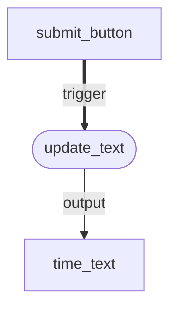
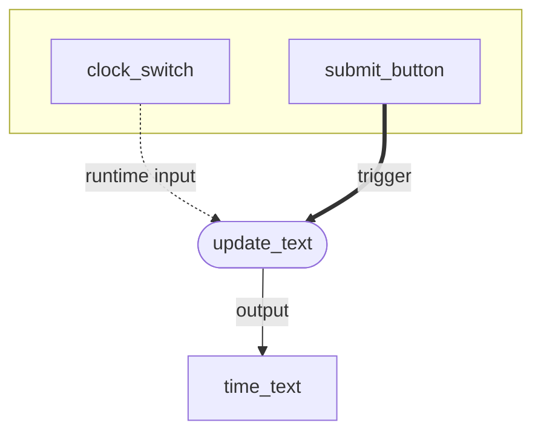
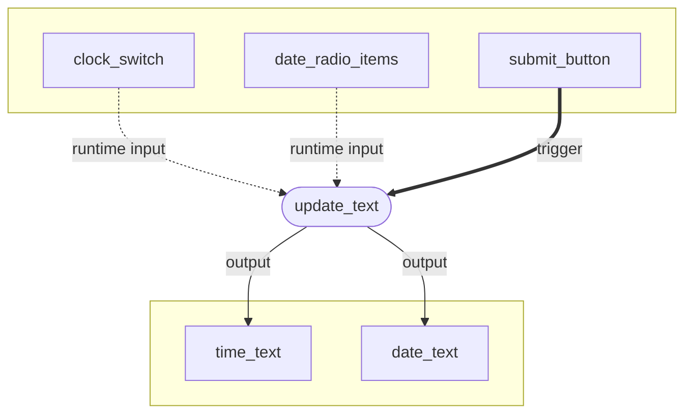
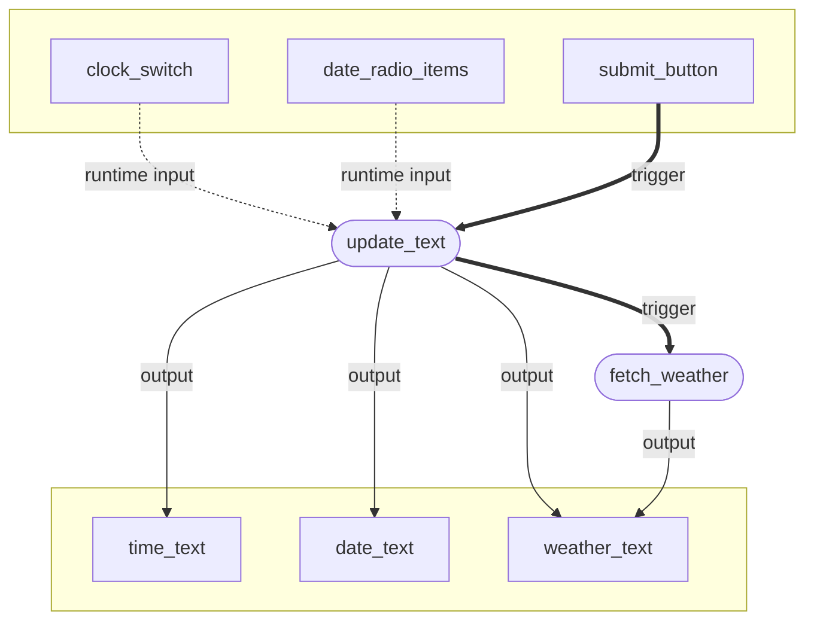
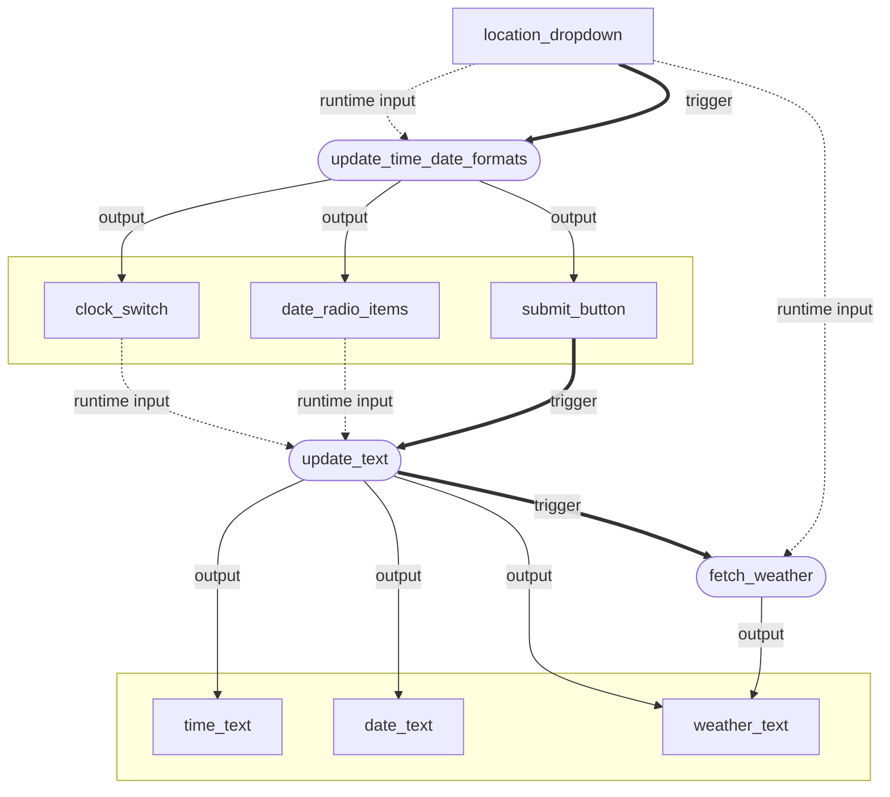
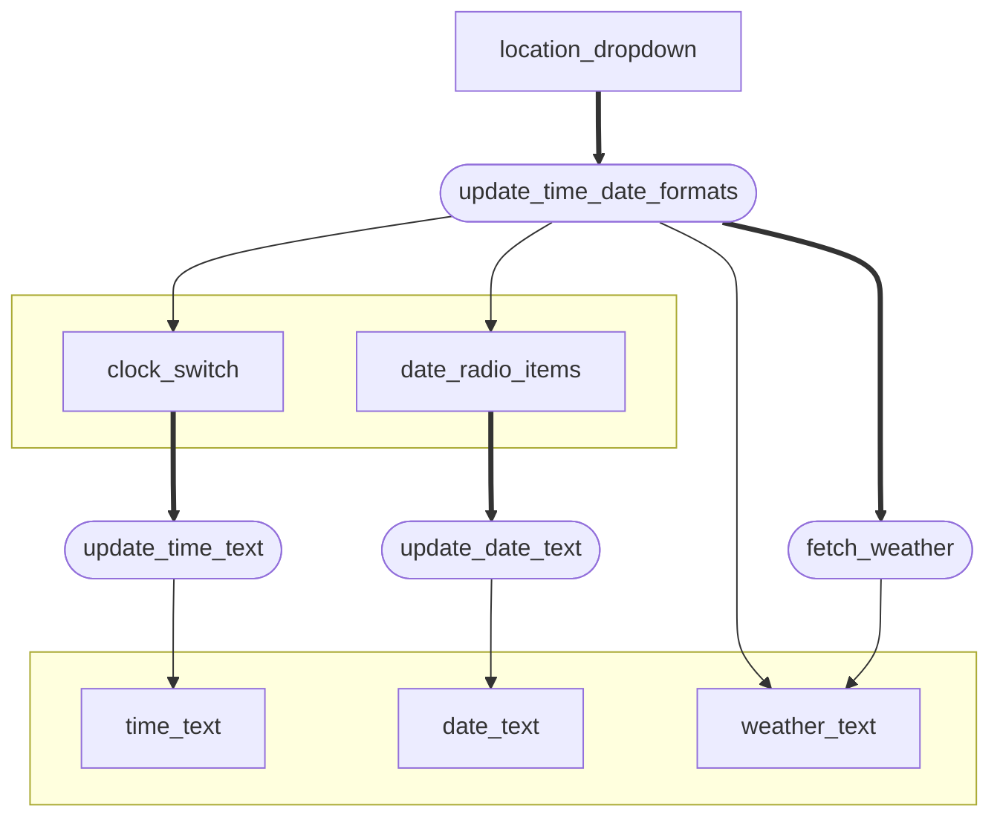

# Write your own custom actions

In this tutorial, you will learn...

!!! note

    This tutorial assumes a basic knowledge of Vizro. If you haven't already done so, you should get started with Vizro in the [first dashboard tutorial](first-dashboard.md) or work through a [more in-depth tutorial](explore-components.md).

## What is an action?

Vizro models such as `vm.Dashboard`, `vm.Page`, `vm.Graph` and `vm.Filter` configure two separate parts of your app:

* Layout. This controls _what your app looks like_, for example which components you would like to see on your pages and where to place them. Under the hood, this uses [Dash layout](https://dash.plotly.com/layout).
* Interactivity. This controls _how your app behaves in response to user input_, for example what happens when someone clicks a button in your app. This uses _actions_, which under the hood use [Dash callbacks](https://dash.plotly.com/basic-callbacks).

For example, the [`vm.Filter`](../user-guides/filters.md) model configures both the layout and the interactivity of a filter. The `selector` argument configures which selector component (such as a dropdown or checklist) to render on screen. There's also an `actions` argument that configures what happens when a user changes the value of the selector. You generally don't set this `actions `argument because by default it is set to a filtering action that updates components on the page that depend on the column being filtered. 

Many Vizro models have an `actions` argument that can contain one or more actions. Each action is a Python function that is _triggered_ when a user interacts with a component. This function can depend on _inputs_ from the user's screen and update _outputs_ on the user's screen.

In Vizro, there are two types of action:

* [Built-in actions](../user-guides/actions.md). These cover many common dashboard operations such as downloading data and cross-filtering. These actions can be imported from `vizro.actions`.
* [Custom actions](../user-guides/custom-actions.md). These are written by a user to achieve behaviour outside of Vizro's built-in actions.

!!! note

    Do you have an idea for a built-in action that you think would be useful for many Vizro users? Let us know by submitting a [feature request](https://github.com/mckinsey/vizro/issues/new?template=feature-request.yml)!

This tutorial mainly concerns how to write your own custom actions, although you will also gain a better understanding of how Vizro's built-in actions work. You do not need to know anything about Dash callbacks to complete the tutorial other than the section on [combining Dash callbacks and Vizro actions](...). If you are already familiar with Dash callbacks then you might like to read our [explanation of how Vizro actions compare to Dash callbacks](...).

## A simple action

Let's start with a very simple single-page app that contains a [button](../user-guides/button.md) and some [text](../user-guides/text.md).

!!! example "App layout"

    === "app.py"

        ```{.python pycafe-link}
        import vizro.models as vm
        from vizro import Vizro
        

        page = vm.Page(
            title="My first custom action",
            layout=vm.Flex(),
            components=[
                vm.Button(),
                vm.Text(text="Click the button"),
            ],
        )
        
        dashboard = vm.Dashboard(pages=[page])
        Vizro().build(dashboard).run()
        ```

    === "Result"

        TODO screenshot

So far we have specified that a button should be included in the page layout but haven't configured what should happen when the button is clicked. Let's define an action for that.

!!! example "A simple action"

    === "app.py"

        ```{.python pycafe-link hl_lines="1 5-13 21-24 26"}
        from datetime import datetime, timezone

        import vizro.models as vm
        from vizro import Vizro
        from vizro.models.types import capture        
        

        @capture("action")  # (1)!
        def update_text():  # (2)!
            time_format = "%H:%M:%S %Z"
            now = datetime.now(timezone.utc)
            time = now.strftime(time_format)
            return f"The time is {time}"  # (3)!
        
        
        page = vm.Page(
            title="My first custom action",
            layout=vm.Flex(),
            components=[
                vm.Button(
                    actions=vm.Action(  # (4)!
                        function=update_text(),
                        outputs="time_text",
                    )
                ),
                vm.Text(id="time_text", text="Click the button"),  # (5)!
            ],
        )
        
        dashboard = vm.Dashboard(pages=[page])
        Vizro().build(dashboard).run()
        ```

        1. You can write a simple action using the `capture("action")` decorator. This prepares a function to be used as a Vizro action.
        2. For now, the `update_text` function has no arguments.
        3. An action doesn't need to have outputs, but this one returns a string. An action can return values of any Python type that can be converted to JSON.
        4. We attach the action to the `vm.Button` model using the `actions` argument. We call the action function with `function=update_text()` (remember the `()`) and set the output to `"time_text"`.
        5. To use the `vm.Text` as an output, we supply `id="time_text"` that matches onto the action's `outputs`. It does not matter that this component is defined after the `vm.Action` that uses it.

    === "Result"

        TODO screenshot

Congratulations on writing your first action! Before clicking the button, the text shows "Click the button". When you click the button, the `update_text` action is triggered. This Python function executes on the server to find the current time in the UTC timezone and return a string "The time is ...". The resulting value is sent back to the user's screen and updates the text of the component with `id="time_text"`. As explained in the [Dash documentation](https://dash.plotly.com/basic-callbacks), this is called _reactive programming_.

As we cover increasingly uses for actions, it can be very helpful to understand the actions using a flowchart similar to Dash dev tool's [callback graph](https://dash.plotly.com/devtools#callback-graph). We can visualise the above example as follows:



In this flowchart, the rectangular boxes refer to Vizro models that are used as trigger and output for an action. The action function is shown in a round box, and we use a thick line for the trigger. The `vm.Button` does not yet have `id="submit_button"` set; we use this label pre-emptively in the diagram to refer to the `vm.Button`.


## Runtime input

Now we will see how you can add a _runtime input_ to your actions. A runtime input is the value or _state_ of a component on the user's screen while the dashboard is running. What this means will soon become clear by extending our example! As before, let's start by adding something to the layout and then consider how to extend our action. Here we create a small form by adding a [`Switch`][vizro.models.Switch] to the layout that lets the user specify whether they would like to use a 12- or 24-hour clock.

!!! example "Add `Switch` to layout"

    === "app.py"

        ```{.python pycafe-link hl_lines="16 22-26"}
        from datetime import datetime, timezone
        
        import vizro.models as vm
        from vizro import Vizro
        from vizro.models.types import capture

        
        @capture("action")
        def update_text():
            time_format = "%H:%M:%S %Z"
            now = datetime.now(timezone.utc)
            time = now.strftime(time_format)
            return f"The time is {time}"
        
        
        vm.Container.add_type("components", vm.Switch)  # (1)!
        
        page = vm.Page(
            title="My first custom action",
            layout=vm.Flex(),
            components=[
                vm.Container(  # (2)!
                    layout=vm.Flex(direction="row"),
                    variant="outlined",
                    components=[
                        vm.Switch(id="clock_switch", title="24-hour clock", value=True),  # (3)!
                        vm.Button(
                            actions=vm.Action(
                                function=update_text(),
                                outputs="time_text",
                            ),
                        ),
                    ],
                ),
                vm.Text(id="time_text", text="Click the button"),
            ],
        )
        
        dashboard = vm.Dashboard(pages=[page])
        Vizro().build(dashboard).run()
        ```

        1. Currently [`Switch`][vizro.models.Switch] is designed to be used as a [control selectors](../user-guides/selectors.md). In future, Vizro will have a dedicated `Form` model for the creation of forms. For now, we add them directly as `components` inside a [`Container`][vizro.models.Container]. For this to be a valid configuration we must first do `add_type` as for a [custom component](../user-guides/custom-components.md).
        2. We group the form inputs into a [styled container](../user-guides/container.md#styled-containers) to achieve some visual separation of the form inputs and outputs. This is purely stylistic and does not affect the operation of actions.
        3. We have already set `id` for the `Switch` in anticipation of it being used in `update_text`. 
        
    === "Result"

           TODO screenshot

Now we need to connect `vm.Switch(id="clock_switch")` to our `update_text` action. We add an argument `use_24_hour_clock` to the `update_text` function and configure the function call in `vm.Action` to link this argument to the `clock_switch` component.

!!! example "Connect `Switch` to `update_text`"

    === "app.py"

        ```{.python pycafe-link hl_lines="9-10 29"}
        from datetime import datetime, timezone

        import vizro.models as vm
        from vizro import Vizro
        from vizro.models.types import capture
        
        
        @capture("action")
        def update_text(use_24_hour_clock):   # (1)!
             time_format = "%H:%M:%S %Z" if use_24_hour_clock else "%I:%M:%S %p %Z"   # (2)!
             now = datetime.now(timezone.utc)
             time = now.strftime(time_format)
             return f"The time is {time}"
        
        
        vm.Container.add_type("components", vm.Switch)
        
        page = vm.Page(
             title="My first custom action",
             layout=vm.Flex(),
             components=[
                 vm.Container(
                     layout=vm.Flex(direction="row"),
                     variant="outlined",
                     components=[
                         vm.Switch(id="clock_switch", title="24-hour clock", value=True),
                         vm.Button(
                             actions=vm.Action(
                                 function=update_text(use_24_hour_clock="clock_switch"),  # (3)!
                                 outputs="time_text",
                             ),
                         ),
                     ],
                 ),
                 vm.Text(id="time_text", text="Click the button"),
             ],
        )
        
        dashboard = vm.Dashboard(pages=[page])
        Vizro().build(dashboard).run()
        ```

        1. We add an argument `use_24_hour_clock` to `update_text`. This will receive a boolean value `True` or `False`.
        2. `time_format` now changes depending on the the value of `use_24_hour_clock`.
        3. The argument `use_24_hour_clock` is _bound_ at runtime to the value of the `clock_switch` component. This will be `True` or `False` depending on whether the switch is toggled on or off. Here we used keyword argument as `update_text(use_24_hour_clock="clock_switch")` but, just like a normal Python function call, we could also use a positional argument as `update_text("clock_switch")`.
          
    === "Result"

        TODO screenshot

Let's look at what the actions flowchart looks like. We now have a new model with `id="clock_switch"` that is used as runtime input to the `update_text` action. We indicate runtime inputs using a dotted line. 




Note that toggling the `clock_switch` does not by itself trigger `update_text`. The switch is used as a runtime input but the action is triggered only by clicking the button. In fact, this is a key principle governing Vizro actions: **an action can have any number of inputs and outputs but only one trigger**.  

## Multiple inputs and outputs

We have just said that an action can have any number of inputs and outputs, so let's extend our example to show how this works. Now we will have two inputs that the user can configure before clicking the button and two outputs that are updated simultaneously.

!!! example "Multiple inputs and outputs"

    === "app.py"

        ```{.python pycafe-link hl_lines="9 11 14-15 19 30 33 34 40"}
        from datetime import datetime, timezone
        
        import vizro.models as vm
        from vizro import Vizro
        from vizro.models.types import capture
        
        
        @capture("action")
        def update_text(use_24_hour_clock, date_format):  # (1)!
             time_format = "%H:%M:%S %Z" if use_24_hour_clock else "%I:%M:%S %p %Z"
             date_format = "%d/%m/%y" if date_format == "DD/MM/YY" else "%m/%d/%y"
             now = datetime.now(timezone.utc)
             time = now.strftime(time_format)
             date = now.strftime(date_format)
             return f"The time is {time}", f"The date is {date}"  # (2)!
        
        
        vm.Container.add_type("components", vm.Switch)
        vm.Container.add_type("components", vm.RadioItems)
        
        page = vm.Page(
             title="My first custom action",
             layout=vm.Flex(),
             components=[
                 vm.Container(
                     layout=vm.Flex(direction="row"),
                     variant="outlined",
                     components=[
                         vm.Switch(id="clock_switch", title="24-hour clock", value=True),
                         vm.RadioItems(id="date_radio_items", options=["DD/MM/YY", "MM/DD/YY"]),
                         vm.Button(
                             actions=vm.Action(
                                 function=update_text(use_24_hour_clock="clock_switch", date_format="date_radio_items"),   # (3)!
                                 outputs=["time_text", "date_text"],   # (4)!
                             ),
                         ),
                     ],
                 ),
                 vm.Text(id="time_text", text="Click the button"),
                 vm.Text(id="date_text", text="Click the button"),
             ],
        )
        
        dashboard = vm.Dashboard(pages=[page])
        Vizro().build(dashboard).run()
        ```

        1. We add an argument `date_format` to `update_text`. This will receive a string value `"DD/MM/YY"` or `"MM/DD/YY"`.
        2. We now return _two_ strings. It would work exactly the same if we returned a list `[f"The time is {time}", f"The date is {date}"]`. 
        3. The new argument `date_format` is bound to the `vm.RadioItems(date_radio_items)`.
        4. There are now two outputs: `time_text` and `date_text`.

    === "Result"

        TODO screenshot

Here's the updated actions flowchart: 



The returned values are matched to the `outputs` in order. If your action has many outputs then it can be a good idea to instead return a dictionary where returned values are labelled by string keys. In this case, `outputs` should also be a dictionary with matching keys, and the order of entries does not matter. For example:

```py
@capture("action")
def update_text(use_24_hour_clock, date_format):
    ...
    return {"time_output": f"The time is {time}", "date_output": f"The date is {date}"}

...

vm.Action(
   function=update_text(use_24_hour_clock="clock_switch", date_format="date_radio_items"),
   outputs={"time_output": "time_text", "date_output": "date_text"},  # (1)!
)
```

1. `outputs={"date_output": "date_text", "time_output": "time_text"}` would work exactly the same; the order of entries does not matter.

## Actions chains

Sometimes you need a single trigger to execute multiple actions. Vizro uses _chains_ of actions to achieve this. There are two different ways to form an actions chain:

* Explicit actions chain. When you specify multiple actions as `actions=[action_1, action_2, ...]` then Vizro executes these actions in order, so that `action_2` executes only when `action_1` has completed.
* Implicit actions chain. When one action outputs a trigger of another action then the subsequent action is triggered automatically. For example, say that `action_submit` is triggerd by `vm.Button(id="submit_button")`, in other words when the button is clicked. If another action that has `output="submit_button"` completes then `action_submit` is automatically triggered as if the button had been clicked. 

Looking at some examples of each of these types of actions chain will make it much clearer.

### Explicit actions chain

Let's add some new functionality to our app that fetches the current weather in Berlin. To do this we use the [Open-Meteo](https://open-meteo.com/) weather API, which is free and does not require an API key. So far our actions have executed very quck and simple operations on the server. Making a request to an external API can be much slower. We perform the operation in two stages so that the user knows what is going on:

1. Update text on the screen to give the time and date, as before, but also update to say that we're fetching the weather. This is done in the `update_text` action.
2. Request the Open-Meteo API and update the text on the screen again to give the current temperature in Berlin. This is done in the `fetch_weather` action.

We explicitly chain together these two actions when the button is clicked by specifying a list of `actions` as follows: 

```python
vm.Button(
      actions=[
          vm.Action(
              function=update_text(use_24_hour_clock="clock_switch", date_format="date_radio_items"),
              outputs=["time_text", "date_text", "weather_text"],
          ),
          vm.Action(function=fetch_weather(), outputs="weather_text"),
      ],
)
```

The full code for this explicit actions chain is shown below.

!!! example "Explicit actions chain"

    === "app.py"

        ```{.python pycafe-link hl_lines="3 16 19-24 41-48 54"}
        from datetime import datetime, timezone

        import requests  # (1)!
        import vizro.models as vm
        from vizro import Vizro
        from vizro.models.types import capture
        
        
        @capture("action")
        def update_text(use_24_hour_clock, date_format):
            time_format = "%H:%M:%S %Z" if use_24_hour_clock else "%I:%M:%S %p %Z"
            date_format = "%d/%m/%y" if date_format == "DD/MM/YY" else "%m/%d/%y"
            now = datetime.now(timezone.utc)
            time = now.strftime(time_format)
            date = now.strftime(date_format)
            return f"The time is {time}", f"The date is {date}", "Fetching current weather..."  # (2)!
        
        
        @capture("action")
        def fetch_weather():  # (3)!
            berlin_params = {"latitude": 52.5, "longitude": 13.4, "current": "temperature_2m"}
            r = requests.get("https://api.open-meteo.com/v1/forecast", params=berlin_params)
            temperature = r.json()["current"]["temperature_2m"]
            return f"The current temperature in Berlin is {temperature}°C"
        
        
        vm.Container.add_type("components", vm.Switch)
        vm.Container.add_type("components", vm.RadioItems)
        
        page = vm.Page(
            title="My first custom action",
            layout=vm.Flex(),
            components=[
                vm.Container(
                    layout=vm.Flex(direction="row"),
                    variant="outlined",
                    components=[
                        vm.Switch(id="clock_switch", title="24-hour clock", value=True),
                        vm.RadioItems(id="date_radio_items", options=["DD/MM/YY", "MM/DD/YY"]),
                        vm.Button(
                            id="submit_button",  # (4)!
                            actions=[
                                vm.Action(
                                    function=update_text(use_24_hour_clock="clock_switch", date_format="date_radio_items"),
                                    outputs=["time_text", "date_text", "weather_text"],
                                ),
                                vm.Action(function=fetch_weather(), outputs="weather_text"),
                            ],
                        ),
                    ],
                ),
                vm.Text(id="time_text", text="Click the button"),
                vm.Text(id="date_text", text="Click the button"),
                vm.Text(id="weather_text", text="Click the button"),
            ],
        )
        
        dashboard = vm.Dashboard(pages=[page])
        Vizro().build(dashboard).run()        
        ```

        1. [Requests](https://requests.readthedocs.io/) is a popular Python library for performing HTTP requests. It is a third party library but is a dependency of Dash and so should already be available without any further `pip install`s.
        2. This now return _three_ strings. "Fetching current weather..." only shows on the screen briefly while the `fetch_weather` action is executing. 
        3. We make a request to the Open-Meteo API to fetch the current temperature at the latitude and longitude of Berlin. For full details, see the [Open-Meteo documentation](https://open-meteo.com/en/docs). This request often generally completes very quickly and so "Fetching current weather..." won't appear on your screen for long! If you'd like to artifically slow down the `fetch_weather` action to see it more clearly then you can add `time.sleep(3)` to the function body to add a delay of 3 seconds.
        4. We don't need to set `id="submit_button"` but have added it in anticipation of the next section. 

    === "Result"

        TODO screenshot

The actions flowchart now has a new output for `weather_text` and also a new action `fetch_weather`. The trigger for this is completion of the action `update_text`. Note that both these actions share the same `weather_text`; in Vizro, a model can be an input or output for any number of actions.



### Implicit actions chain

Now we're going to add a dropdown menu that allows the user to choose between seeing the weather in Washington, D.C. or in Berlin. When the user selects the city we also update the time and date shown to the format preferred by that location: for Washington, D.C., this is 12-hour clock and MM/DD/YY format; for Berlin, it is 24-hour clock and DD/MM/YY format. When these formats update, we also want to submit the form just as if the user had clicked `vm.Button(id="submit_button")`.

To achieve this, we write a new action `update_time_date_formats` that sets the time and date formats and also outputs to `submit_button`. When this action completes, Vizro automatically triggers the actions that would be triggered by clicking `submit_button`. This forms an implicit connection between the `update_time_date_formats` action and the actions associated with the button. Even though we have not explicitly chained the `update_time_date_formats` action to any others, it is implicitly chained to `update_text` since the `update_time_date_formats` automatically triggers `update_text`. Since `update_text` is itself the first action in an explicit chain, after it has completed, the subsequent action `fetch_weather` executes. 

Hence when the location dropdown is updated, the following three actions are triggered in order:

1. `update_time_date_formats`
2. `update_text`
3. `fetch_weather`

!!! example "Implicit actions chain"

    === "app.py"

        ```{.python pycafe-link hl_lines="19-26 29-33 48-57 67"}
        from datetime import datetime, timezone

        import requests
        import vizro.models as vm
        from vizro import Vizro
        from vizro.models.types import capture
        
  
        @capture("action")
        def update_text(use_24_hour_clock, date_format):
            time_format = "%H:%M:%S %Z" if use_24_hour_clock else "%I:%M:%S %p %Z"
            date_format = "%d/%m/%y" if date_format == "DD/MM/YY" else "%m/%d/%y"
            now = datetime.now(timezone.utc)
            time = now.strftime(time_format)
            date = now.strftime(date_format)
            return f"The time is {time}", f"The date is {date}", "Fetching current weather..."
        
        
        @capture("action")
        def fetch_weather(location):  # (1)!
            berlin_params = {"latitude": 52.5, "longitude": 13.4, "current": "temperature_2m"}
            washington_dc_params = {"latitude": 38.9, "longitude": -77.0, "current": "temperature_2m"}
            params = berlin_params if location == "Berlin" else washington_dc_params
            r = requests.get("https://api.open-meteo.com/v1/forecast", params=params)
            temperature = r.json()["current"]["temperature_2m"]
            return f"The current temperature in {location} is {temperature}°C"
        
        
        @capture("action")
        def update_time_date_formats(location):  # (2)! 
            if location == "Berlin":
                return True, "DD/MM/YY", 1
            return False, "MM/DD/YY", 1 
        
        
        vm.Container.add_type("components", vm.Switch)
        vm.Container.add_type("components", vm.RadioItems)
        vm.Container.add_type("components", vm.Dropdown)
        
        page = vm.Page(
            title="My first custom action",
            layout=vm.Flex(),
            components=[
                vm.Container(
                    layout=vm.Flex(direction="row"),
                    variant="outlined",
                    components=[
                        vm.Dropdown(
                            id="location_dropdown",
                            options=["Berlin", "Washington, D.C."],
                            multi=False,
                            actions=vm.Action(
                                function=update_time_date_formats("location_dropdown"),
                                outputs=["clock_switch", "date_radio_items", "submit_button"],  # (3)!
                            ),
                            extra={"style": {"min-width": "200px"}},
                        ),
                        vm.Switch(id="clock_switch", title="24-hour clock", value=True),
                        vm.RadioItems(id="date_radio_items", options=["DD/MM/YY", "MM/DD/YY"]),
                        vm.Button(
                            id="submit_button",
                            actions=[
                                vm.Action(
                                    function=update_text(use_24_hour_clock="clock_switch", date_format="date_radio_items"),
                                    outputs=["time_text", "date_text", "weather_text"],
                                ),
                                vm.Action(function=fetch_weather("location_dropdown"), outputs="weather_text"),
                            ],
                        ),
                    ],
                ),
                vm.Text(id="time_text", text="Click the button"),
                vm.Text(id="date_text", text="Click the button"),
                vm.Text(id="weather_text", text="Click the button"),
            ],
        )
        
        dashboard = vm.Dashboard(pages=[page])
        Vizro().build(dashboard).run()
        ```

        1. `fetch_weather` has been updated to take in `location`. This chooses between Washington, D.C. and Berlin.
        2. When the location is Berlin, `update_time_date_formats` sets the app to use 24-hour clock and date format DD/MM/YY; otherwise, for Washington, D.C., we use 12-hour clock and date format MM/DD/YY. In both cases we return 1 to the third output, which is `vm.Button(id="submit_button")`. This effectively tells Vizro that the button has been clicked 1 time in total. The choice of 1 is arbitrary and does not matter unless you need to keep track of the actual number of times the button has been clicked.
        3. `update_time_date_formats` sets the `clock_switch` and `date_radio_items` form fields and also updates `submit_button`. This update of `submit_button` triggers the actions chain associated with the submit button.

    === "Result"

        TODO screenshot

Our actions flowchart is starting to grow quite large now that there's three actions, but really all that's different is the new `update_time_date_formats` actions and its associated inputs, outputs and triggers. Try following the line of triggers denoted with thick arrows. The actions `[update_date, fetch_weather]` that are in an explicit chain are directly connected by a thick arrow. On the other hand, the implicit connection between `update_time_date_formats` and `update_text` is not a direct connection but instead goes through the `submit_button` model. Note also that the `location_dropdown` model is used as a trigger and a runtime input simultaneously.



An implicit action chain can only be formed by triggering the _first_ action of an explicit chain (or a single action, if there is only one action in the chain). Here, `update_time_date_formats` triggers the first action `update_text` in the chain `[update_text, fetch_weather]`, which then triggers the chained action `fetch_weather`. It is not possible for an action to implicitly chain on to `fetch_weather` directly: there is no way for `fetch_weather` to run other than through the completion of `update_text`. 

!!! tip
  
  When you're building more complicated chains of actions, it's often useful to _start_ by sketching an actions flowchart and then work out how to configure the actions to achieve it.

It is still possible to set the time and date formats and submit the form manually, as before. For example, you might like to know the weather in Berlin but prefer to use the 12-hour clock. A user can select Berlin, click the switch to use 12-hour clock and then submit the form again. However, clicking the submit button now feels quite cumbersome. We are going to implement a few final enhancements to our example to improve the user experience. 

## Parallel actions

To make the app feel more responsive, we're going to remove the submit button and instead use  `clock_switch` and `date_radio_items` as triggers themselves. The `update_text` action currently uses both `clock_switch` and `date_radio_items` as inputs and returns both `time_text` and `date_text` as outputs. However, really the `clock_switch` only affects `time_text`, and `date_radio_items` only affects `date_text`. Let's split `update_text` into two independent actions to reflect this: `update_time_text`, which updates only `time_text`, and `update_date_text`, which updates only `date_text`. As an additional enhancement we add `location_dropdown` as an input to these actions so that we can use the correct timezone for Washington, D.C. and Berlin. 

!!! example "Parallel actions"

    === "app.py"
        ```{.python pycafe-link hl_lines="1-2 10-25 41-42 64 66 74 79"}
        from datetime import datetime
        from zoneinfo import ZoneInfo
        
        import requests
        import vizro.models as vm
        from vizro import Vizro
        from vizro.models.types import capture
        
        
        @capture("action")
        def update_time_text(use_24_hour_clock, location):
            time_format = "%H:%M:%S %Z" if use_24_hour_clock else "%I:%M:%S %p %Z"
            timezone_name = "Europe/Berlin" if location == "Berlin" else "America/New_York"
            now = datetime.now(ZoneInfo(timezone_name))  # (1)!
            time = now.strftime(time_format)
            return f"The time is {time}"
        
        
        @capture("action")
        def update_date_text(date_format, location):
            date_format = "%d/%m/%y" if date_format == "DD/MM/YY" else "%m/%d/%y"
            timezone_name = "Europe/Berlin" if location == "Berlin" else "America/New_York"
            now = datetime.now(ZoneInfo(timezone_name))
            date = now.strftime(date_format)
            return f"The date is {date}"
        
        
        @capture("action")
        def fetch_weather(location):
            berlin_params = {"latitude": 52.5, "longitude": 13.4, "current": "temperature_2m"}
            washington_dc_params = {"latitude": 38.9, "longitude": -77.0, "current": "temperature_2m"}
            params = berlin_params if location == "Berlin" else washington_dc_params
            r = requests.get("https://api.open-meteo.com/v1/forecast", params=params)
            temperature = r.json()["current"]["temperature_2m"]
            return f"The current temperature in {location} is {temperature}°C"
        
        
        @capture("action")
        def update_time_date_formats(location):
            if location == "Berlin":
                return True, "DD/MM/YY", "Fetching current weather..."  # (1)!
            return False, "MM/DD/YY", "Fetching current weather..."
        
        
        vm.Container.add_type("components", vm.Switch)
        vm.Container.add_type("components", vm.RadioItems)
        vm.Container.add_type("components", vm.Dropdown)
        
        page = vm.Page(
            title="My first custom action",
            layout=vm.Flex(),
            components=[
                vm.Container(
                    layout=vm.Flex(direction="row"),
                    variant="outlined",
                    components=[
                        vm.Dropdown(
                            id="location_dropdown",
                            options=["Berlin", "Washington, D.C."],
                            multi=False,
                            actions=[
                                vm.Action(
                                    function=update_time_date_formats("location_dropdown"),
                                    outputs=["clock_switch", "date_radio_items", "weather_text"],
                                ),
                                vm.Action(function=fetch_weather("location_dropdown"), outputs="weather_text"),
                            ],
                            extra={"style": {"min-width": "200px"}},
                        ),
                        vm.Switch(
                            id="clock_switch",
                            title="24-hour clock",
                            value=True,
                            actions=vm.Action(function=update_time_text("clock_switch", "location_dropdown"), outputs="time_text"),  # (3)!
                        ),
                        vm.RadioItems(
                            id="date_radio_items",
                            options=["DD/MM/YY", "MM/DD/YY"],
                            actions=vm.Action(function=update_date_text("date_radio_items", "location_dropdown"), outputs="date_text"),
                        ),
                    ],
                ),
                vm.Text(id="time_text", text="Click the button"),
                vm.Text(id="date_text", text="Click the button"),
                vm.Text(id="weather_text", text="Click the button"),
            ],
        )
        
        dashboard = vm.Dashboard(pages=[page])
        Vizro().build(dashboard).run()
        ```
        

        1. `update_time_text` and `update_date_text` are now timezone-sensitive. We use the `location` set by the dropdown to choose the appropriate timezone.
        2. Now that `submit_button` no longer exists, it is the responsibility of `update_time_date_formats` to update `weather_text` with the "Fetching current weather..." text. This action is otherwise unchanged. 

    === "Result"

        TODO screenshot

Play around with the app for a while to make sure you understand its behavior, When you click the switch, just the time text updates, and when you click the radio items, just the date text updates. When you use the dropdown, the switch and radio items update (which in turns updates the time and date text) and the weather is fetched after an initial holding message is shown.

Now that you're familiar with the notation of an actions flowchart we're going to make a few simplifications so that it doesn't get too large to understand easily. We no longer show the runtime inputs at all, and we omit the labels from the lines showing outputs and triggers (still shown with thick lines). 



We still have an explicit actions chain `[update_time_date_formats, fetch_weather]`, since these are directly connected by a thick arrow. The connection between `update_time_date_formats` and the `update_time_text` and `update_date_text` actions is implicit since there is no direct connection; the line goes through intermediate models `clock_switch` and `date_radio_items`.

In terms of execution order, we know that `fetch_weather` can only execute once `update_time_date_formats` has completed since these are in an explicit actions chain. But when `update_time_date_formats` completes, as well as triggering `fetch_weather`, it also implicitly triggers `update_time_text` and `update_date_text` simultaneously. Looking at the flowchart, we can see that all three of these actions can run in parallel and, in general, will do so. Each action will update its output(s) on screen as soon as it has completed. If you add `time.sleep(3)` to each of the `fetch_weather`, `update_time_text` and `update_date_text` actions to make them take 3 seconds longer to complete then the total delay will be 3 seconds rather than 9 seconds.

??? details Parallel execution is not guaranteed

    The reason we say that the actions will _in general_ run in parallel is that, as [explained in the Dash documentation](https://dash.plotly.com/advanced-callbacks#as-a-direct-result-of-user-interaction), execution depends on the server environment. If you [use the Flask development server](../user-guides/run-deploy.md#develop-in-python-script), it is set to run multi-threaded and so actions can execute in parallel. In production, if you [use gunicorn](../user-guides/run-deploy.md#gunicorn) with multiple workers then multiple actions can run in parallel.

    However, if you [work in PyCafe](../user-guides/run-deploy.md#develop-in-pycafe) you will find that multiple actions cannot run in parallel. This is a [known limitation of PyCafe](https://py.cafe/docs/how#limitations-of-pycafe). In this case, the three actions `fetch_weather`, `update_time_text` and `update_date_text` run serially, in an order that should not be relied upon. The same would happen if you ran the Flask development server with `threaded=False` or ran `gunicorn` with a single worker.

## Handle errors and debug

So far we have just considered the "happy path" where all actions run as planned. Let's briefly look at what happens if an action does not complete successfully.

For example, let's say that the HTTP request to Open-Meteo in `fetch_weather` failed due to a network problem. You can simulate this just by putting a typo in the URL requested by `requests.get` so that a Python exception `requests.exceptions.ConnectionError`  is raised. If you run the above example then when the `fetch_weather` action runs you will see an error message about `requests.exceptions.ConnectionError` in the logs where you execute `python app.py`. If you develop in [debug mode with `run(debug=True)`](../user-guides/run-deploy.md#automatic-reloading-and-debugging) then the exception and traceback is shown in your browser, which tends to be more convenient.

Once a Python exception has been raised in a Vizro action, execution of the action ceases immediately and no outputs of that action will be updated, Any actions that would be triggered by successful completion of the action, either in an explicit or implicit action chain, will not execute. To the end user it will not be apparent that an error has occurred; their screen will simply not show an update.  

!!! tip
  
  If you wish to deliberately cancel execution of an action then you can [`raise dash.exceptions.PreventUpdate`](https://dash.plotly.com/advanced-callbacks#catching-errors-with-preventupdate). This will mean that none of the action's outputs are updated, and hence no chained actions execute. For more fine-grained control, you can instead prevent update to only _some_ of the outputs of an action by [returning `dash.no_update`](https://dash.plotly.com/advanced-callbacks#displaying-errors-with-dash.no_update). In this case, only those chained actions that are triggered by outputs that did not update will be prevented from executing.
  
When developing your app, it can also be very useful to insert a breakpoint inside the code of an action. This enables you to pause execution of an action, inspect variables and understand what is happening. You can add breakpoints with most popular coding tools, for example [VS Code](https://code.visualstudio.com/docs/debugtest/debugging#_breakpoints).

## Security
yCHeck Dash security guide

Keep it Independent of Dash


## Performance

hint about cscb referring to new Dash section
serverside inefficient. here could be done frontend
warning about many chained callbacks and how it's many HTTP requests


stateless, users don't interfere so long as don't alter global variables - need to point to Dash explanation for this


## Challenges

```
# challenge to change to farenheit using state
# advanced: more items in dropdown. Click on map of world and get long/lat
```


## Recap
action contains inputs/outpust etc.
explain key principles of actions like single trigger

TODO changelog
update other bits of docs
AgGrid inner ID - should be no examples like that to remove but check
NEED TO UPDATE ALL DOCS function=export_data() etc. Search throughout
Update all actions examples in docs that have unecssary [actions] or [outputs]


 I think "built in" and "custom" is the best terminology to use but we can also say "user-defined" since it makes sense. Let's avoid using "predefined" though. SEARCH FOR USAGE OF THIS

deprecations - do after


https://github.com/mckinsey/vizro/pull/1054
vizro_download, vizro_url  https://github.com/McK-Internal/vizro-internal/issues/1611
Y direct reference to component, field name https://github.com/McK-Internal/vizro-internal/issues/1610 https://github.com/McK-Internal/vizro-internal/issues/1609
Y dict output format https://github.com/McK-Internal/vizro-internal/issues/1608
Y single [action] allowed
Y single [output] allowed
built in special arguments (though structure of `_controls` not finalised)
two sorts of action (Abstract and normal)
Y actions chain 
callbacks + actions combined
page lifecyle - on page load, filter callback, etc.
YAML configuration of captured callable

---

Tutorial more than how-to. Tutorial refers to more detail in explanation. Tutorial is learning-oriented
How to use built in actions and How to write a custom action. How to is task-oriented


---
collapse - built in action will be much clearer
change tab
update tooltip
add alert
change page - not for now

Good example ideas:
CRUD
table as input
filter/parameter that updates text too - Example states input that uses filter - would need to implement vm.Filter _action_input first
API call/run model example - simple calculation but not full model. Scenario from table example
database? save to file?
click on table to drilldown to product page like labs telemetry - even before proper interact


update tooltip
popup when selected rows clicked to do alert
remove selected rows and save to disk
download png button? Or download selected data?
clear selection button
want input/output aggrid?
output text
update graph description
select aggrid rows
editable table
remove rows, write to disk
could be parameter interaction even though built in
something where action doesn't work and we need Dash callback
trigger not there explicitly
filters populate options but only fetches data on submit
"sample button"
update and download
refresh page - yes, even if have it built into actions


Tutorial on drillthrough etc. Do want this even before it's properly built in and will remain useful because it shows how things work. Definitely do this with controls in containers 
But do how to guide first since easier?
drill through - probably don't document yet. Maybe write more about URL query params?
---

same example as in simple action that changes page and uses store 

state to store that's then used e.g. on a different page

toast alert for successful validation, clear form
change collapse of navigation accordion by default - something to do with opl

collapse/uncollapse all containers
text saying what controls are selected e.g. in graph header
live updates - refresh page
back button like in browser

check #vizro-users Petar answers - most recent one that Li asked about
check deepresearch summarising our issues
narrow down the options while user is typing: https://vizro-cnx-demo.alpha.mckinsey.digital/customer-view---germany


Reference for built in arguments, objects, properties/fields

---
# Dash compared to Vizro 

## Rough notes
Vizro vs Dash notes
runtime input vs. state
trigger vs. input
vizro has built in actions
attach to trigger not define globally
need to provide id in Dash for trigger component
trigger not passed in
duplicated outputs fine
one vs multiple triggers
prevent_initial_call=True always
actions loop


In Vizro there are two types of runtime input. In section on runtime inputs, refer later to see what other non-runtime inputs might be

Where to put explanation or Dash compared to Vizro? Put in explanation section we already have.
Write Dash equivalent or simple vizro app
Show some output field and property which isn't just model name

## Dash callback graph
??? details

    We haven't yet defined any actions, but behind the scenes Vizro has already defined some Dash callbacks for you:

    * A callback to change the dashboard theme when the theme selector is toggled. 
    * A callback associated with [Dash pages](https://dash.plotly.com/urls) that will make the app work when more pages are added.

    While developing, you can see all the Dash callbacks in Dash dev tool's [callback graph](https://dash.plotly.com/devtools#callback-graph). This is shown when running in debug mode with [`run(debug=True)`](../user-guides/run-deploy.md#/#automatic-reloading-and-debugging).

    TODO screenshot

    For a large or complex app, the callback graph quickly grows and becomes difficult to navigate. To make debugging easier you can temporarily comment out all but one page in your app to show only the relevant callbacks in the graph. 


## Trigger, input and output properties

Don't put this section here - too much Dash. Yes - just keep it simple and not talking about multiple properties and components here until gets more advanced.

A single Vizro model produces one or more Dash components, each of which has several properties. For example, the Dash component corresponding to `vm.Text` is [`dcc.Markdown`](https://dash.plotly.com/dash-core-components/markdown). The above examples' `vm.Text(id="time_text", text="Click the button")` produces something like the following Dash component:
```py
dcc.Markdown(id="time_text", children="Click the button")
```

To update the text shown in this component as an output in a Dash callback, you would refer to `Output("time_text", "children")`. In Vizro, you could instead refer to `outputs="time_text.children"`. However, to simplify the notation, Vizro offers several shorthands:
* `outputs="time_text.text"` where the format is `<model_id>.<argument_name>`. Here we update the `text` argument of the `vm.Text` model that has `id="time_text"`. 
* `outputs="time_text"` where the format is `<model_id>`. This automatically connects to the default Dash component property that is part of the Vizro model. The default depends on the Vizro model but corresponds to the most commonly used property. In this example it would target the `text` argument of the `vm.Text` model because that is the most common part to update. 

The above two shorthands work exactly the same as the full `outputs="time_text.children"`.

Let's look at another example. The Dash component corresponding to `vm.Switch` is [`dbc.Switch`](https://www.dash-bootstrap-components.com/docs/components/input/). The above examples' `vm.Switch(id="clock_switch", title="24-hour clock", value=True)` produces something like the following:
```py
dbc.Switch(
    id="clock_switch",
    value=True,
    label=html.Span(id="clock_switch_title", children="24-hour-clock"),
)
```

As well as the "core" `dbc.Switch` component, the `vm.Switch` model produces a `html.Span` component to contain the label. When using `vm.Switch` model as an action trigger or runtime input (as in the examples' `use_24_hour_clock="clock_switch"`), the `value` of the switch is the default Dash component property. Hence `use_24_hour_clock="clock_switch"` is shorthand for `use_24_hour_clock="clock_switch.value"`.

If the `vm.Switch` is used as an output then there are multiple different Dash components and properties that could be updated:
* `outputs="clock_switch"` is equivalent to `outputs="clock_switch.value"` and updates the `value` of the `dbc.Switch`.
* `outputs="clock_switch.title` is equivalent to `outputs="clock_switch_title.children"` and updates the `title` of the `dbc.Switch`. 

A Vizro action always uses a specific Dash component and property for the action trigger, runtime inputs and outputs. However, as explained in the [how to](...) you should prefer to use the Vizro shorthands where possible rather than referring to the underlying Dash components (for example, use `clock_switch.title` in preference to `clock_switch_title.children`). This is more intuitive and more stable. While using a pure Dash component `id` and property will remain possible in Vizro actions, we consider the exact underlying Dash components to be implementation details, and so the Dash components available and their `id`s may change between non-breaking Vizro releases.

!!! note

    Are you targetting an underlying Dash component that you think should be addressed by Vizro more easily? Let us know by submitting a [feature request](https://github.com/mckinsey/vizro/issues/new?template=feature-request.yml)!


