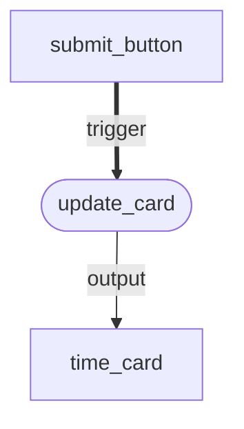
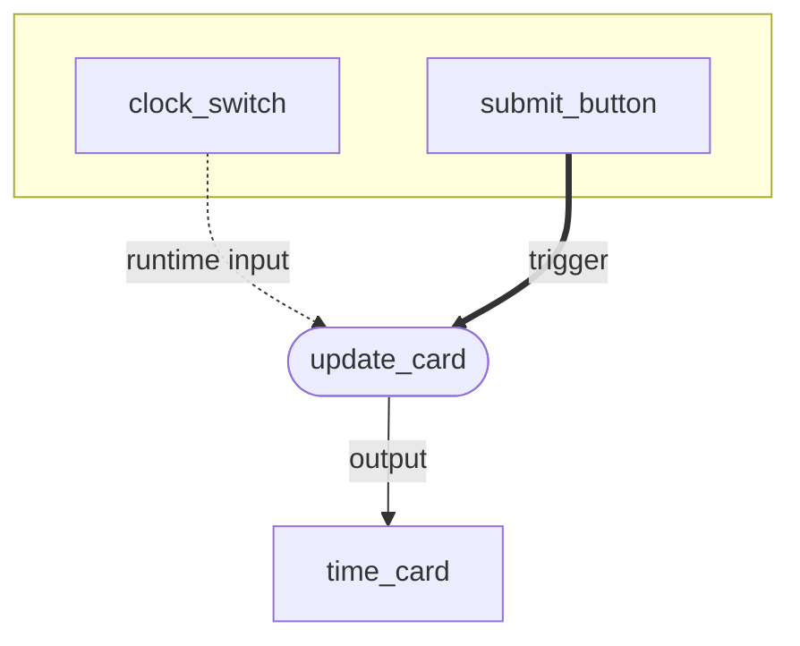
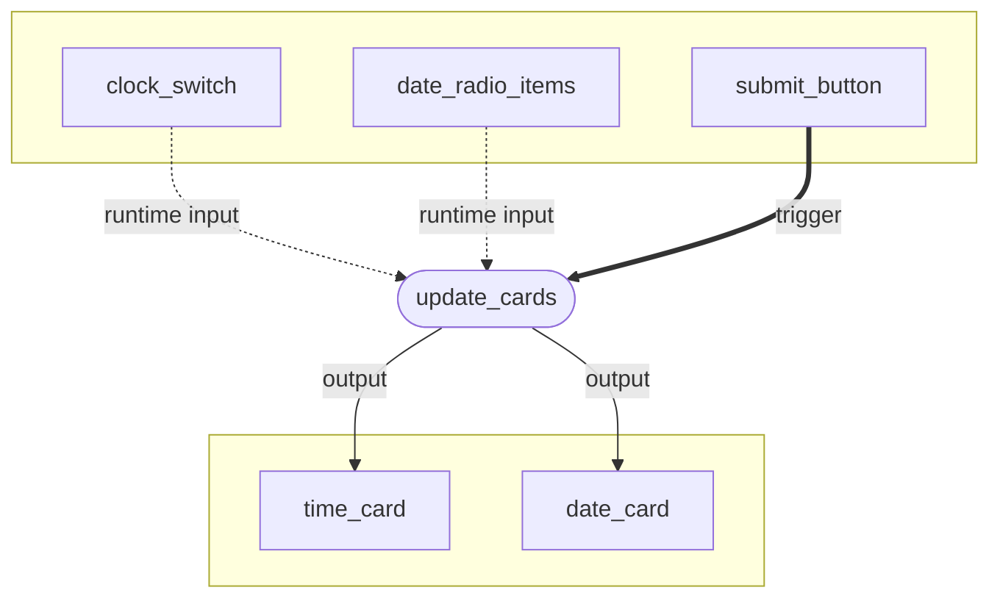
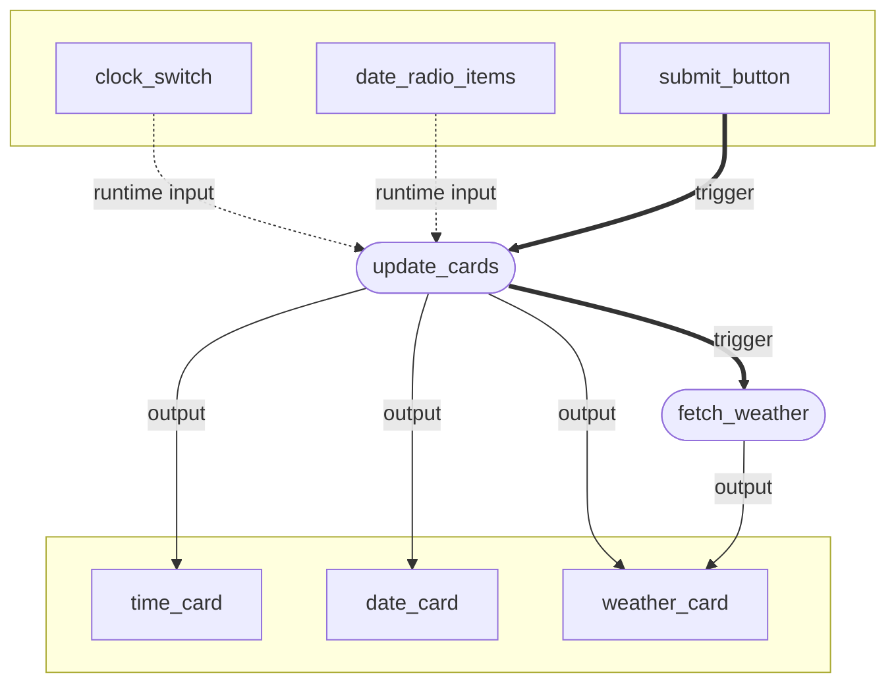
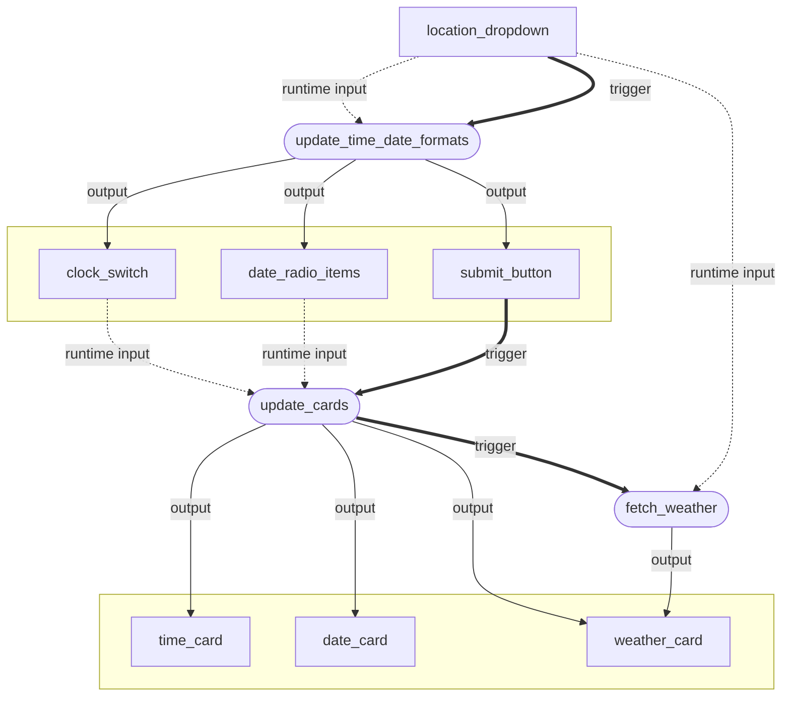
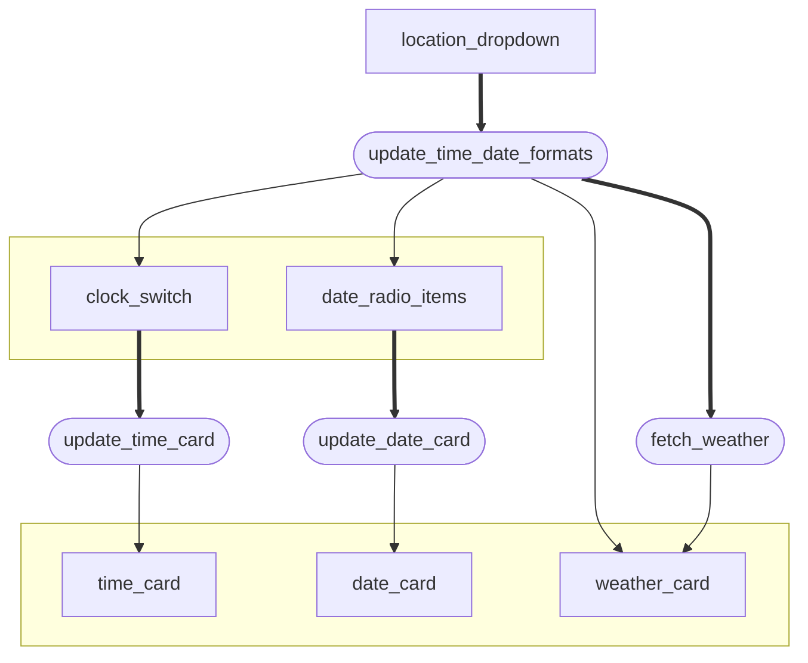

# Write your own actions

Actions control how your app responds to user input such as clicking a button or a point on a graph. Vizro provides [built-in actions](../user-guides/actions.md) and also enables you to write your own [custom actions](../user-guides/custom-actions.md). In this tutorial you will learn how to write your own custom actions.

!!! note

    This tutorial assumes a basic knowledge of Vizro. If you haven't already done so, you should get started with Vizro in the [quickstart tutorial](quickstart-tutorial.md) or work through a [more in-depth tutorial](explore-components.md).

Vizro's actions are built on top of [Dash callbacks](https://dash.plotly.com/basic-callbacks), but you do not need to know anything about Dash callbacks to complete the tutorial. We also have an [explanation of how Vizro actions work](../explanation/actions-explanation.md) and their similarities and differences compared to Dash callbacks.

This tutorial should take **about an hour to finish**. You will gradually build a single-page app of a simple form that uses custom actions to show the current time, date and weather in Washington, D.C. or Berlin. Here's the final app in action:

[![CustAction8]][custaction8]

## A simple action

Let's start by making a very simple single-page app that tells us the current time when the user clicks on a button. We begin by configuring the layout: a [button](../user-guides/button.md) and a [card with text](../user-guides/card.md) in a [flex layout](../user-guides/layouts.md).

!!! example "App layout"

    === "app.py"

        ```{.python pycafe-link}
        import vizro.models as vm
        from vizro import Vizro


        page = vm.Page(
            title="My first action",
            layout=vm.Flex(),
            components=[
                vm.Button(),
                vm.Card(text="Click the button"),
            ],
        )

        dashboard = vm.Dashboard(pages=[page])
        Vizro().build(dashboard).run()
        ```

    === "Result"

        [![CustAction1]][custaction1]

We have specified that a button should be included in the page layout but haven't configured what should happen when it is clicked. Let's define an action for that and [attach it to the button](../user-guides/custom-actions.md#trigger-an-action-with-a-button) with the `actions` argument and the [`Action`][vizro.models.Action] model.

!!! example "A simple action"

    === "app.py"

        ```{.python pycafe-link hl_lines="1 5-13 21-24 26"}
        from datetime import datetime, timezone

        import vizro.models as vm
        from vizro import Vizro
        from vizro.models.types import capture


        @capture("action")  # (1)!
        def update_card():  # (2)!
            time_format = "%H:%M:%S %Z"
            now = datetime.now(timezone.utc)
            time = now.strftime(time_format)
            return f"🕰️ The time is {time}"  # (3)!


        page = vm.Page(
            title="My first action",
            layout=vm.Flex(),
            components=[
                vm.Button(
                    actions=vm.Action(  # (4)!
                        function=update_card(),
                        outputs="time_card",
                    )
                ),
                vm.Card(id="time_card", text="Click the button"),  # (5)!
            ],
        )

        dashboard = vm.Dashboard(pages=[page])
        Vizro().build(dashboard).run()
        ```

        1. You can write a simple action using the `capture("action")` decorator. This prepares a function to be used as a Vizro action.
        1. For now, the `update_card` function has no arguments.
        1. An action doesn't need to have outputs, but this one returns a string. An action can return values of any Python type that can be converted to JSON.
        1. We attach the action to the `vm.Button` model using the `actions` argument. We call the action function with `function=update_card()` (remember the `()`) and set the output to `"time_card"`.
        1. To use the `vm.Card` as an output, we supply `id="time_card"` that matches onto the action's `outputs`. It does not matter that this component is defined after the `vm.Action` that uses it.

    === "Result"

        [![CustAction2]][custaction2]

Congratulations on writing your first action! Before clicking the button, the card's text is "Click the button". When you click the button, the `update_card` action is _triggered_. This Python function executes on the server to find the current time in the UTC timezone and return a string "The time is ...". The resulting value is sent back to the user's screen and updates the text of the component with `id="time_card"`. This is the action's _output_.

As we cover increasingly complex actions, it can be very helpful to understand the actions using a flowchart similar to Dash dev tools' [callback graph](https://dash.plotly.com/devtools#callback-graph). We can visualize the above example as follows:



In this flowchart, the rectangular boxes refer to Vizro models that are used as a trigger and output for an action. The action function is shown in a round box, and we use a thick line for the trigger.

## Runtime input

Let's extend our action to depend on an _input_ from the user's screen. As before, let's start by adding something to the layout and then handle the action. Here we create a small form by adding a [`Switch`][vizro.models.Switch] to the layout that lets the user specify whether they would like to use the 12- or 24-hour clock.

!!! example "Add `Switch` to layout"

    === "app.py"

        ```{.python pycafe-link hl_lines="16 22-24 26"}
        from datetime import datetime, timezone

        import vizro.models as vm
        from vizro import Vizro
        from vizro.models.types import capture


        @capture("action")
        def update_card():
            time_format = "%H:%M:%S %Z"
            now = datetime.now(timezone.utc)
            time = now.strftime(time_format)
            return f"🕰️ The time is {time}"


        vm.Container.add_type("components", vm.Switch)  # (1)!

        page = vm.Page(
            title="My first action",
            layout=vm.Flex(),
            components=[
                vm.Container(  # (2)!
                    layout=vm.Flex(direction="row"),
                    variant="outlined",
                    components=[
                        vm.Switch(id="clock_switch", title="24-hour clock", value=True),
                        vm.Button(
                            actions=vm.Action(
                                function=update_card(),
                                outputs="time_card",
                            ),
                        ),
                    ],
                ),
                vm.Card(id="time_card", text="Click the button"),
            ],
        )

        dashboard = vm.Dashboard(pages=[page])
        Vizro().build(dashboard).run()
        ```

        1. Currently [`Switch`][vizro.models.Switch] is designed to be used as a [control selector](../user-guides/selectors.md). In future, Vizro will have a dedicated `Form` model for the creation of forms. For now, we add them directly as `components` inside a [`Container`][vizro.models.Container]. For this to be a valid configuration we must first do `add_type` as for a [custom component](../user-guides/custom-components.md).
        1. We group the form inputs into a [styled container](../user-guides/container.md#styled-containers) to achieve some visual separation of the form inputs and outputs. This is purely stylistic and does not affect the operation of actions.

    === "Result"

        [![CustAction3]][custaction3]

Now we need to connect `vm.Switch(id="clock_switch")` to our `update_card` action. We add an argument `use_24_hour_clock` to the `update_card` function and configure the function call in `vm.Action` to use the `clock_switch` component as the input value of this argument.

!!! example "Connect `Switch` to `update_card`"

    === "app.py"

        ```{.python pycafe-link hl_lines="9-10 29"}
        from datetime import datetime, timezone

        import vizro.models as vm
        from vizro import Vizro
        from vizro.models.types import capture


        @capture("action")
        def update_card(use_24_hour_clock):   # (1)!
             time_format = "%H:%M:%S %Z" if use_24_hour_clock else "%I:%M:%S %p %Z"   # (2)!
             now = datetime.now(timezone.utc)
             time = now.strftime(time_format)
             return f"🕰️ The time is {time}"


        vm.Container.add_type("components", vm.Switch)

        page = vm.Page(
             title="My first action",
             layout=vm.Flex(),
             components=[
                 vm.Container(
                     layout=vm.Flex(direction="row"),
                     variant="outlined",
                     components=[
                         vm.Switch(id="clock_switch", title="24-hour clock", value=True),
                         vm.Button(
                             actions=vm.Action(
                                 function=update_card(use_24_hour_clock="clock_switch"),  # (3)!
                                 outputs="time_card",
                             ),
                         ),
                     ],
                 ),
                 vm.Card(id="time_card", text="Click the button"),
             ],
        )

        dashboard = vm.Dashboard(pages=[page])
        Vizro().build(dashboard).run()
        ```

        1. We add an argument `use_24_hour_clock` to `update_card`. This will receive a boolean value `True` or `False`.
        1. `time_format` now depends on the value of `use_24_hour_clock`.
        1. The argument `use_24_hour_clock` is set at runtime to the value of the `clock_switch` component. This will be `True` or `False` depending on whether the switch is toggled on or off. Here we use a keyword argument but, just like a normal Python function call, we could also use a positional argument as `update_card("clock_switch")`.

    === "Result"

        [![CustAction4]][custaction4]

Have a go at toggling the switch and clicking the button. You should find that the format of the time shown changes between 12- and 24-hour clock. Note that toggling the `clock_switch` does not by itself trigger `update_card`. The switch is used as a runtime input but the action is triggered only by clicking the button. In fact, this is a key principle governing Vizro actions: an action can have **any number** of inputs and outputs but **only one** trigger.

Let's look at what the actions flowchart looks like. We now have a new model with `id="clock_switch"` that is used as runtime input to the `update_card` action. We indicate runtime inputs using a dotted line.



Action inputs and outputs can be used in multiple actions; there can be any number of actions that use the same `clock_switch`, `submit_button` and `time_card` as inputs or outputs.

## Multiple inputs and outputs

Let's extend our example to handle multiple inputs and outputs. We add another card to show the date and a [`RadioItems`][vizro.models.RadioItems] to allow the user to configure the date format.

!!! example "Multiple inputs and outputs"

    === "app.py"

        ```{.python pycafe-link hl_lines="9 11 14-15 19 30 33 34 40"}
        from datetime import datetime, timezone

        import vizro.models as vm
        from vizro import Vizro
        from vizro.models.types import capture


        @capture("action")
        def update_cards(use_24_hour_clock, date_format):  # (1)!
             time_format = "%H:%M:%S %Z" if use_24_hour_clock else "%I:%M:%S %p %Z"
             date_format = "%d/%m/%y" if date_format == "DD/MM/YY" else "%m/%d/%y"
             now = datetime.now(timezone.utc)
             time = now.strftime(time_format)
             date = now.strftime(date_format)
             return f"🕰️ The time is {time}", f"📅 The date is {date}"  # (2)!


        vm.Container.add_type("components", vm.Switch)
        vm.Container.add_type("components", vm.RadioItems)

        page = vm.Page(
             title="My first action",
             layout=vm.Flex(),
             components=[
                 vm.Container(
                     layout=vm.Flex(direction="row"),
                     variant="outlined",
                     components=[
                         vm.Switch(id="clock_switch", title="24-hour clock", value=True),
                         vm.RadioItems(id="date_radio_items", options=["DD/MM/YY", "MM/DD/YY"]),
                         vm.Button(
                             actions=vm.Action(
                                 function=update_cards(use_24_hour_clock="clock_switch", date_format="date_radio_items"),   # (3)!
                                 outputs=["time_card", "date_card"],   # (4)!
                             ),
                         ),
                     ],
                 ),
                 vm.Card(id="time_card", text="Click the button"),
                 vm.Card(id="date_card", text="Click the button"),
             ],
        )

        dashboard = vm.Dashboard(pages=[page])
        Vizro().build(dashboard).run()
        ```

        1. We rename the function `update_cards` with an `s` and an argument `date_format`. This will receive a string value `"DD/MM/YY"` or `"MM/DD/YY"`.
        1. We now return _two_ strings.
        1. The new argument `date_format` is set by `vm.RadioItems(date_radio_items)`.
        1. There are now two outputs: `time_card` and `date_card`.

    === "Result"

        [![CustAction5]][custaction5]

Here's the updated actions flowchart. We now have two inputs and two outputs that are updated simultaneously when the `update_cards` action is triggered:



The returned values are matched to the `outputs` in order. If your action has many outputs then it can be a good idea to instead return a dictionary where returned values are labeled by string keys. In this case, `outputs` should also be a dictionary with matching keys, and the order of entries does not matter:

```py
@capture("action")
def update_cards(use_24_hour_clock, date_format):
    ...
    return {"time_output": f"🕰️ The time is {time}", "date_output": f"📅 The date is {date}"}

...

vm.Action(
   function=update_cards(use_24_hour_clock="clock_switch", date_format="date_radio_items"),
   outputs={"time_output": "time_card", "date_output": "date_card"},  # (1)!
)
```

1. `outputs={"date_output": "date_card", "time_output": "time_card"}` would work exactly the same; the order of entries does not matter.

## Actions chains

Sometimes you need a single trigger to execute multiple actions. Vizro uses [_chains_ of actions](../user-guides/actions.md#multiple-actions) to achieve this. There are two different ways to form an actions chain:

- Explicit actions chain. When you specify multiple actions as `actions=[action_1, action_2, ...]` then Vizro executes these actions in order, so that `action_2` executes only when `action_1` has completed.
- Implicit actions chain. When one action outputs a trigger of another action then the subsequent action is triggered automatically.

!!! note

    In fact, the examples you have seen so far already contain action chains, just they have been chains with only one action in them. Behind the scenes, `actions=action` gets converted into `actions=[action]`, an action chains of length one.

### Explicit actions chain

Let's add some new functionality to our app that fetches the current weather in Berlin using the [Open-Meteo](https://open-meteo.com/) weather API, which is free and does not require an API key. So far our actions have executed quick operations on the server. Making a request to an external API can be much slower. When the button is clicked, we perform the operation in two stages so that the user knows what is happening:

1. Update cards on the screen to give the time and date, as before, but also give a temporary placeholder message to say that we're fetching the weather. This is done in the `update_cards` action.
1. Request the Open-Meteo API and update the placeholder message to give the current temperature in Berlin. This is done in the `fetch_weather` action.

We explicitly chain together these two actions when the button is clicked by specifying a list of `actions` as follows:

```python
vm.Button(
    actions=[
        vm.Action(
            function=update_cards(use_24_hour_clock="clock_switch", date_format="date_radio_items"),
            outputs=["time_card", "date_card", "weather_card"],
        ),
        vm.Action(function=fetch_weather(), outputs="weather_card"),
    ],
)
```

The full code is shown below.

??? example "Explicit actions chain"

    === "app.py"

        ```{.python pycafe-link hl_lines="3 16 19-24 41-48 54"}
        from datetime import datetime, timezone

        import requests  # (1)!
        import vizro.models as vm
        from vizro import Vizro
        from vizro.models.types import capture


        @capture("action")
        def update_cards(use_24_hour_clock, date_format):
            time_format = "%H:%M:%S %Z" if use_24_hour_clock else "%I:%M:%S %p %Z"
            date_format = "%d/%m/%y" if date_format == "DD/MM/YY" else "%m/%d/%y"
            now = datetime.now(timezone.utc)
            time = now.strftime(time_format)
            date = now.strftime(date_format)
            return f"🕰️ The time is {time}", f"📅 The date is {date}", "Fetching current weather..."  # (2)!


        @capture("action")
        def fetch_weather():  # (3)!
            berlin_params = {"latitude": 52.5, "longitude": 13.4, "current": "temperature_2m"}
            r = requests.get("https://api.open-meteo.com/v1/forecast", params=berlin_params)
            temperature = r.json()["current"]["temperature_2m"]
            return f"The current temperature in Berlin is {temperature}°C"


        vm.Container.add_type("components", vm.Switch)
        vm.Container.add_type("components", vm.RadioItems)

        page = vm.Page(
            title="My first action",
            layout=vm.Flex(),
            components=[
                vm.Container(
                    layout=vm.Flex(direction="row"),
                    variant="outlined",
                    components=[
                        vm.Switch(id="clock_switch", title="24-hour clock", value=True),
                        vm.RadioItems(id="date_radio_items", options=["DD/MM/YY", "MM/DD/YY"]),
                        vm.Button(
                            id="submit_button",  # (4)!
                            actions=[
                                vm.Action(
                                    function=update_cards(use_24_hour_clock="clock_switch", date_format="date_radio_items"),
                                    outputs=["time_card", "date_card", "weather_card"],
                                ),
                                vm.Action(function=fetch_weather(), outputs="weather_card"),
                            ],
                        ),
                    ],
                ),
                vm.Card(id="time_card", text="Click the button"),
                vm.Card(id="date_card", text="Click the button"),
                vm.Card(id="weather_card", text="Click the button"),
            ],
        )

        dashboard = vm.Dashboard(pages=[page])
        Vizro().build(dashboard).run()
        ```

        1. [Requests](https://requests.readthedocs.io/) is a popular Python library for performing HTTP requests. It is a third party library but is a dependency of Dash and so should already be available without a `pip install`.
        1. This now return _three_ strings. "Fetching current weather..." only shows on the screen briefly while the `fetch_weather` action is executing.
        1. We make a request to the [Open-Meteo API](https://open-meteo.com/en/docs) to fetch the current temperature at the latitude and longitude of Berlin.
        1. We don't actually need to set `id="submit_button"` yet but have added it in anticipation of the next section.

    === "Result"

        [![CustAction6]][custaction6]

When you click the button, the `update_cards` action executes and sets the placeholder message "Fetching current weather...". When this action completes, the `fetch_weather` action executes to find the actual weather and update the message. The Open-Meteo API request generally completes very quickly and so "Fetching current weather..." will only flash on your screen very briefly. If you'd like to artificially slow down the `fetch_weather` action to see it more clearly then you can add `from time import sleep; sleep(3)` to the function body to add a delay of 3 seconds.

The actions flowchart now has a new output `weather_card` and a new action `fetch_weather`. The trigger for this action is completion of the `update_cards` action. Note that both these actions share the same output `weather_card`. In Vizro, a model can be an input or output for any number of actions.



### Implicit actions chain

Now we're going to re-work the example to demonstrate an implicit actions chain. Let's add a dropdown menu that allows the user to choose between seeing the weather in Washington, D.C. or in Berlin. When the user selects the city we also update the time and date shown to the format preferred by that location: for Washington, D.C., this is 12-hour clock and MM/DD/YY format; for Berlin, it is 24-hour clock and DD/MM/YY format.

When the city is selected in the dropdown, we want to immediately update the cards _without requiring the user to click `submit_button`_. To achieve this, we write a new action `update_time_date_formats` triggered by the dropdown that outputs to `submit_button`.

!!! example "Implicit actions chain"

    === "app.py"

        ```{.python pycafe-link hl_lines="19-26 29-33 48-57 67"}
        from datetime import datetime, timezone

        import requests
        import vizro.models as vm
        from vizro import Vizro
        from vizro.models.types import capture


        @capture("action")
        def update_cards(use_24_hour_clock, date_format):
            time_format = "%H:%M:%S %Z" if use_24_hour_clock else "%I:%M:%S %p %Z"
            date_format = "%d/%m/%y" if date_format == "DD/MM/YY" else "%m/%d/%y"
            now = datetime.now(timezone.utc)
            time = now.strftime(time_format)
            date = now.strftime(date_format)
            return f"🕰️ The time is {time}", f"📅 The date is {date}", "Fetching current weather..."


        @capture("action")
        def fetch_weather(location):  # (1)!
            berlin_params = {"latitude": 52.5, "longitude": 13.4, "current": "temperature_2m"}
            washington_dc_params = {"latitude": 38.9, "longitude": -77.0, "current": "temperature_2m"}
            params = berlin_params if location == "Berlin" else washington_dc_params
            r = requests.get("https://api.open-meteo.com/v1/forecast", params=params)
            temperature = r.json()["current"]["temperature_2m"]
            return f"🌡️ The current temperature in {location} is {temperature}°C"


        @capture("action")
        def update_time_date_formats(location):  # (2)!
            if location == "Berlin":
                return True, "DD/MM/YY", 1  # (3)!
            return False, "MM/DD/YY", 1


        vm.Container.add_type("components", vm.Switch)
        vm.Container.add_type("components", vm.RadioItems)
        vm.Container.add_type("components", vm.Dropdown)

        page = vm.Page(
            title="My first action",
            layout=vm.Flex(),
            components=[
                vm.Container(
                    layout=vm.Flex(direction="row"),
                    variant="outlined",
                    components=[
                        vm.Dropdown(
                            id="location_dropdown",
                            options=["Berlin", "Washington, D.C."],
                            multi=False,
                            actions=vm.Action(
                                function=update_time_date_formats("location_dropdown"),
                                outputs=["clock_switch", "date_radio_items", "submit_button"],  # (4)!
                            ),
                            extra={"style": {"min-width": "200px"}},
                        ),
                        vm.Switch(id="clock_switch", title="24-hour clock", value=True),
                        vm.RadioItems(id="date_radio_items", options=["DD/MM/YY", "MM/DD/YY"]),
                        vm.Button(
                            id="submit_button",
                            actions=[
                                vm.Action(
                                    function=update_cards(use_24_hour_clock="clock_switch", date_format="date_radio_items"),
                                    outputs=["time_card", "date_card", "weather_card"],
                                ),
                                vm.Action(function=fetch_weather("location_dropdown"), outputs="weather_card"),
                            ],
                        ),
                    ],
                ),
                vm.Card(id="time_card", text="Click the button"),
                vm.Card(id="date_card", text="Click the button"),
                vm.Card(id="weather_card", text="Click the button"),
            ],
        )

        dashboard = vm.Dashboard(pages=[page])
        Vizro().build(dashboard).run()
        ```

        1. `fetch_weather` has been updated to take in `location`. This chooses between Washington, D.C. and Berlin.
        1. When the location is Berlin, `update_time_date_formats` sets the app to use 24-hour clock and date format DD/MM/YY; otherwise, for Washington, D.C., we use 12-hour clock and date format MM/DD/YY.
        1. In both cases we return 1 to the third output, which is `vm.Button(id="submit_button")`. This effectively tells Vizro that the button has been clicked 1 time in total. The choice of 1 is arbitrary and does not matter unless you need to keep track of the actual number of times the button has been clicked.
        1. `update_time_date_formats` sets the `clock_switch` and `date_radio_items` form fields and also updates `submit_button`. This update of `submit_button` triggers the actions chain associated with the submit button.

    === "Result"

        [![CustAction7]][custaction7]

Selecting a city in the dropdown triggers the `update_time_date_formats` action. When this action completes, Vizro automatically triggers the actions that would have been triggered by actually clicking `submit_button`. This forms an _implicit_ connection between the `update_time_date_formats` action and the actions associated with `submit_button`.

Hence when the location dropdown is updated, the following three actions are triggered in order:

1. `update_time_date_formats`: triggered by the location dropdown
1. `update_cards`: triggered implicitly by completion of `update_time_date_formats`
1. `fetch_weather`: triggered explicitly by completion of `update_cards`

Our actions flowchart is starting to grow quite large now that there's three actions, but really all that's different is the new `update_time_date_formats` actions and its associated inputs, outputs and triggers. Try following the line of triggers denoted with thick arrows. The actions `[update_date, fetch_weather]` that are in an explicit chain are directly connected by a thick arrow. On the other hand, the implicit connection between `update_time_date_formats` and `update_cards` is not a direct connection but instead goes through the `submit_button` model. Note also that the `location_dropdown` model is used as a trigger and a runtime input simultaneously.



An implicit action chain can only be formed by triggering the _first_ action of an explicit chain (or a single action, if there is only one action in the chain). Here, `update_time_date_formats` triggers the first action `update_cards` in the chain `[update_cards, fetch_weather]`, which then triggers the chained action `fetch_weather`. It is not possible for an action to implicitly chain on to `fetch_weather` directly: there is no way for `fetch_weather` to run other than through the completion of `update_cards`.

!!! tip

    When you're building more complicated chains of actions, it's often useful to _start_ by sketching an actions flowchart and then work out how to configure the actions to achieve it.

## Parallel actions

We are going to implement a few final enhancements to our example to improve the user experience. To make the app feel more responsive, we're going to remove the submit button and instead use `clock_switch` and `date_radio_items` as triggers themselves.

The `update_cards` action currently uses both `clock_switch` and `date_radio_items` as inputs and returns both `time_card` and `date_card` as outputs. However, really `clock_switch` only affects `time_card`, and `date_radio_items` only affects `date_card`. Let's split `update_cards` into two independent actions to reflect this:

- `update_time_card`, which updates only `time_card`
- `update_date_card`, which updates only `date_card`

As an additional enhancement we add `location_dropdown` as an input to these actions so that we can use the correct timezone for Washington, D.C. and Berlin.

??? example "Parallel actions"

    === "app.py"

        ```{.python pycafe-link hl_lines="1-2 10-25 41-42 64 66 74 80"}
        from datetime import datetime
        from zoneinfo import ZoneInfo

        import requests
        import vizro.models as vm
        from vizro import Vizro
        from vizro.models.types import capture


        @capture("action")
        def update_time_card(use_24_hour_clock, location):
            time_format = "%H:%M:%S %Z" if use_24_hour_clock else "%I:%M:%S %p %Z"
            timezone_name = "Europe/Berlin" if location == "Berlin" else "America/New_York"
            now = datetime.now(ZoneInfo(timezone_name))  # (1)!
            time = now.strftime(time_format)
            return f"🕰️ The time is {time}"


        @capture("action")
        def update_date_card(date_format, location):
            date_format = "%d/%m/%y" if date_format == "DD/MM/YY" else "%m/%d/%y"
            timezone_name = "Europe/Berlin" if location == "Berlin" else "America/New_York"
            now = datetime.now(ZoneInfo(timezone_name))
            date = now.strftime(date_format)
            return f"📅 The date is {date}"


        @capture("action")
        def fetch_weather(location):
            berlin_params = {"latitude": 52.5, "longitude": 13.4, "current": "temperature_2m"}
            washington_dc_params = {"latitude": 38.9, "longitude": -77.0, "current": "temperature_2m"}
            params = berlin_params if location == "Berlin" else washington_dc_params
            r = requests.get("https://api.open-meteo.com/v1/forecast", params=params)
            temperature = r.json()["current"]["temperature_2m"]
            return f"🌡️ The current temperature in {location} is {temperature}°C"


        @capture("action")
        def update_time_date_formats(location):
            if location == "Berlin":
                return True, "DD/MM/YY", "Fetching current weather..."  # (2)!
            return False, "MM/DD/YY", "Fetching current weather..."


        vm.Container.add_type("components", vm.Switch)
        vm.Container.add_type("components", vm.RadioItems)
        vm.Container.add_type("components", vm.Dropdown)

        page = vm.Page(
            title="My first action",
            layout=vm.Flex(),
            components=[
                vm.Container(
                    layout=vm.Flex(direction="row"),
                    variant="outlined",
                    components=[
                        vm.Dropdown(
                            id="location_dropdown",
                            options=["Berlin", "Washington, D.C."],
                            multi=False,
                            actions=[
                                vm.Action(
                                    function=update_time_date_formats("location_dropdown"),
                                    outputs=["clock_switch", "date_radio_items", "weather_card"],
                                ),
                                vm.Action(function=fetch_weather("location_dropdown"), outputs="weather_card"),
                            ],
                            extra={"style": {"min-width": "200px"}},
                        ),
                        vm.Switch(
                            id="clock_switch",
                            title="24-hour clock",
                            value=True,
                            actions=vm.Action(function=update_time_card("clock_switch", "location_dropdown"), outputs="time_card"),

                        ),
                        vm.RadioItems(
                            id="date_radio_items",
                            options=["DD/MM/YY", "MM/DD/YY"],
                            actions=vm.Action(function=update_date_card("date_radio_items", "location_dropdown"), outputs="date_card"),
                        ),
                    ],
                ),
                vm.Card(id="time_card", text="Click the button"),
                vm.Card(id="date_card", text="Click the button"),
                vm.Card(id="weather_card", text="Click the button"),
            ],
        )

        dashboard = vm.Dashboard(pages=[page])
        Vizro().build(dashboard).run()
        ```

        1. `update_time_card` and `update_date_card` are now timezone-sensitive. We use the `location` set by the dropdown to choose the appropriate timezone.
        1. Now that `submit_button` no longer exists, it is the responsibility of `update_time_date_formats` to update `weather_card` with the "Fetching current weather..." placeholder. This action is otherwise unchanged.

    === "Result"

        [![CustAction8]][custaction8]

Play around with the app for a while to make sure you understand its behavior:

- When you click the switch, just the time card updates.
- When you click the radio items, just the date card updates.
- When you use the dropdown, the switch and radio items update, which in turns updates the time and date cards, and the weather is fetched after an initial placeholder message is shown.

Now that you're familiar with the notation of an actions flowchart we're going to make a few simplifications so that it doesn't get too large to understand. We no longer show the runtime inputs at all, and we omit the labels from the lines showing outputs and triggers (still shown with thick lines).



We still have an explicit actions chain `[update_time_date_formats, fetch_weather]`, since these are directly connected by a thick arrow. The connections between `update_time_date_formats` and the `update_time_card` and `update_date_card` actions are implicit since there is no direct connection; the lines go through intermediate models `clock_switch` and `date_radio_items` respectively.

In terms of execution order, we know that `fetch_weather` can only execute once `update_time_date_formats` has completed since these are in an explicit actions chain. But when `update_time_date_formats` completes, as well as triggering `fetch_weather`, it also implicitly triggers `update_time_card` and `update_date_card` simultaneously. Looking at the flowchart, we can see that all three of these actions can run in parallel and, in general, will do so. Each action will update its outputs on screen as soon as it has completed.

??? details "Parallel execution is not guaranteed"

    The reason we say that the actions will _in general_ run in parallel wherever possible is that, as [explained in the Dash documentation](https://dash.plotly.com/advanced-callbacks#as-a-direct-result-of-user-interaction), execution depends on the server environment. If you [use the Flask development server](../user-guides/run-deploy.md#develop-in-python-script), it is by default set to run multi-threaded and so actions can execute in parallel. In production, if you [use gunicorn](../user-guides/run-deploy.md#gunicorn) with multiple workers then multiple actions can run in parallel.

    However, if you [work in PyCafe](../user-guides/run-deploy.md#develop-in-pycafe) you will find that multiple actions cannot run in parallel. This is a [known limitation of PyCafe](https://py.cafe/docs/how#limitations-of-pycafe). In this case, the three actions `fetch_weather`, `update_time_card` and `update_date_card` run serially, in an order that should not be relied upon. The same would happen if you ran the Flask development server with `threaded=False` or ran `gunicorn` with a single worker.

## Handle errors and debug

So far we have just considered the "happy path" where all actions run as planned. Let's also look at what happens if an action does not complete successfully.

For example, let's say that the [HTTP request](https://developer.mozilla.org/en-US/docs/Web/HTTP/Guides/Overview) to Open-Meteo in `fetch_weather` fails, for example due to a network problem or an incorrect URL. If we forget to include the `http://` in the request URL then `requests` raises a Python exception `requests.exceptions.MissingSchema`:

```python hl_lines="4"
@capture("action")
def fetch_weather(location):
    ...
    r = requests.get("api.open-meteo.com/v1/forecast", params=params)
```

Now when the `fetch_weather` action runs you will see an error message about `requests.exceptions.MissingSchema` in the logs of the terminal where you run `python app.py`. Once a Python exception has been raised in a Vizro action, execution of the action ceases immediately and no outputs of that action will be updated. To the dashboard user it will not be apparent that an error has occurred; their screen will simply not show an update. In this example, `weather_card` will be stuck showing the placeholder message "Fetching current weather...".

For a better user experience, we can wrap the relevant code in `try/except` so that the placeholder message updates with a clear failure message in the case that the HTTP request fails. The full code is shown below.

??? example "Handle errors"

    === "app.py"

        ```{.python pycafe-link hl_lines="33-37"}
        from datetime import datetime
        from zoneinfo import ZoneInfo

        import requests
        import vizro.models as vm
        from vizro import Vizro
        from vizro.models.types import capture


        @capture("action")
        def update_time_card(use_24_hour_clock, location):
            time_format = "%H:%M:%S %Z" if use_24_hour_clock else "%I:%M:%S %p %Z"
            timezone_name = "Europe/Berlin" if location == "Berlin" else "America/New_York"
            now = datetime.now(ZoneInfo(timezone_name))
            time = now.strftime(time_format)
            return f"🕰️ The time is {time}"


        @capture("action")
        def update_date_card(date_format, location):
            date_format = "%d/%m/%y" if date_format == "DD/MM/YY" else "%m/%d/%y"
            timezone_name = "Europe/Berlin" if location == "Berlin" else "America/New_York"
            now = datetime.now(ZoneInfo(timezone_name))
            date = now.strftime(date_format)
            return f"📅 The date is {date}"


        @capture("action")
        def fetch_weather(location):
            berlin_params = {"latitude": 52.5, "longitude": 13.4, "current": "temperature_2m"}
            washington_dc_params = {"latitude": 38.9, "longitude": -77.0, "current": "temperature_2m"}
            params = berlin_params if location == "Berlin" else washington_dc_params
            try:
                r = requests.get("api.open-meteo.com/v1/forecast", params=params)
                temperature = r.json()["current"]["temperature_2m"]  # (1)!
            except:
                return "❗ Could not fetch weather"
            return f"🌡️ The current temperature in {location} is {temperature}°C"


        @capture("action")
        def update_time_date_formats(location):
            if location == "Berlin":
                return True, "DD/MM/YY", "Fetching current weather..."
            return False, "MM/DD/YY", "Fetching current weather..."


        vm.Container.add_type("components", vm.Switch)
        vm.Container.add_type("components", vm.RadioItems)
        vm.Container.add_type("components", vm.Dropdown)

        page = vm.Page(
            title="My first action",
            layout=vm.Flex(),
            components=[
                vm.Container(
                    layout=vm.Flex(direction="row"),
                    variant="outlined",
                    components=[
                        vm.Dropdown(
                            id="location_dropdown",
                            options=["Berlin", "Washington, D.C."],
                            multi=False,
                            actions=[
                                vm.Action(
                                    function=update_time_date_formats("location_dropdown"),
                                    outputs=["clock_switch", "date_radio_items", "weather_card"],
                                ),
                                vm.Action(function=fetch_weather("location_dropdown"), outputs="weather_card"),
                            ],
                            extra={"style": {"min-width": "200px"}},
                        ),
                        vm.Switch(
                            id="clock_switch",
                            title="24-hour clock",
                            value=True,
                            actions=vm.Action(function=update_time_card("clock_switch", "location_dropdown"), outputs="time_card"),

                        ),
                        vm.RadioItems(
                            id="date_radio_items",
                            options=["DD/MM/YY", "MM/DD/YY"],
                            actions=vm.Action(function=update_date_card("date_radio_items", "location_dropdown"), outputs="date_card"),
                        ),
                    ],
                ),
                vm.Card(id="time_card", text="Click the button"),
                vm.Card(id="date_card", text="Click the button"),
                vm.Card(id="weather_card", text="Click the button"),
            ],
        )

        dashboard = vm.Dashboard(pages=[page])
        Vizro().build(dashboard).run()
        ```

        1. Fetching `temperature` from the response is another potential source of an exception, for example if the structure of the Open-Meteo response changes, so we also put this line inside the `try`.

    === "Result"

        [![CustAction9]][custaction9]

If an action raises an uncaught exception then any actions that would be triggered by successful completion of the action, either in an explicit or implicit action chain, will also not execute. If you wish to deliberately cancel execution of an action then you can [`raise dash.exceptions.PreventUpdate`](https://dash.plotly.com/advanced-callbacks#catching-errors-with-preventupdate). This will mean that none of the action's outputs are updated and no chained actions execute. For more fine-grained control, you can instead prevent update to only _some_ of the outputs of an action by [returning `dash.no_update`](https://dash.plotly.com/advanced-callbacks#displaying-errors-with-dash.no_update). In this case, only those chained actions that are triggered by outputs that did not update will be prevented from executing.

!!! tip

    If you develop in [debug mode with `run(debug=True)`](../user-guides/run-deploy.md#automatic-reloading-and-debugging) then the exception and traceback are shown in your browser, which is usually more convenient.

    When developing your app, it can also be very useful to insert a breakpoint inside the code of an action. This enables you to pause execution of an action, inspect variables and understand what is happening. You can add breakpoints with most popular coding tools, for example [VS Code](https://code.visualstudio.com/docs/debugtest/debugging#_breakpoints).

## Security

When writing actions, you should always [be careful when handling runtime input from untrusted users](https://community.plotly.com/t/writing-secure-dash-apps-community-thread/54619). When a Vizro action is triggered, there is an HTTP request sent from the user's browser to the server. In theory, this contains the values of the action's runtime inputs fetched from the user's screen. However, there are ways for a malicious user to artificially construct an HTTP request that sends arbitrary values to the server. You should never assume that the values of runtime inputs in your Python action function are restricted to those that you have configured to be shown on the user's screen.

For example, our `vm.Dropdown(id="location_dropdown")` has `options=["Berlin", "Washington, D.C."]`, which presents only those two location options on the user's screen. Let's look at one action which uses this as runtime input:

```py
@capture("action")
def update_time_card(use_24_hour_clock, location):
    ...
    timezone_name = "Europe/Berlin" if location == "Berlin" else "America/New_York"
```

We might expect the value of `location` to be either "Berlin" or "Washington, D.C.", as per the dropdown's available options, but we can never guarantee that this is the case. A malicious user can trigger `update_time_card` with _any_ JSON-compatible value for `location`. The code written here has no security risk because if `location` is set to any value other than "Berlin" then the timezone is set to "America/New_York". This will be the case for both the expected trusted user input `location="Washington, D.C."` and arbitrary untrusted input such as `location="Paris"` and `location=42`.

However, imagine that we had a secret database of all the world's timezones that includes some classified locations not known to the general public. The `update_time_card` action looks up the timezone of the input `location` in the database:

```py
SECRET_TIMEZONE_DATABASE = {
    "Berlin": "Europe/Berlin",
    "Washington, D.C.": "America/New_York",
    "Area 51": "America/Los_Angeles",
    "Top secret bunker": "Europe/London",
}

@capture("action")
def update_time_card(use_24_hour_clock, location):
    ...
    timezone_name = SECRET_TIMEZONE_DATABASE[location]
```

Even though we have set `options=["Berlin", "Washington, D.C."]` in our `vm.Dropdown`, a malicious user could construct an HTTP request that sets `location="Top secret bunker"`. There would be nothing to stop `update_time_card` running and exposing the time at the top secret bunker! You could protect against this by validating that the `location` value is indeed one of the expected values and [raising an exception if not](#handle-errors-and-debug):

```py
from dash.exceptions import PreventUpdate

@capture("action")
def update_time_card(use_24_hour_clock, location):
    if location not in ["Berlin", "Washington, D.C."]:
        raise PreventUpdate
    timezone_name = SECRET_TIMEZONE_DATABASE[location]
```

In many cases, untrusted user input does _not_ pose a security risk. For example, if we looked up `SECRET_TIMEZONE_DATABASE["nonexistent key"]` then Python would raise a `KeyError` exception, which would also cancel execution of the action and not update any information on the user's screen. However, there are [certain scenarios](https://community.plotly.com/t/writing-secure-dash-apps-community-thread/54619), such as file system manipulation and SQL queries, where you should be particularly vigilant.

## Key principles of actions

Congratulations on completing the tutorial! You should now be able to write quite complex custom actions. To recap, let's summarize some of the key principles of how actions work.

- An action is a Python function that executes when it is triggered by a user interacting with a component on their screen.
- An action can have any number of inputs and outputs but only one trigger.
- Any number of actions can be chained together. There are two ways to chain actions:
    - Explicitly: when you set `actions=[action_1, action_2, ...]` then `action_2` only runs after `action_1` has completed.
    - Implicitly: when one action outputs something that automatically triggers another action.
- When multiple actions are triggered simultaneously, they usually execute in parallel.
- You can cancel execution of an action and subsequent chained actions by raising an exception.
- For security, you should always assume that inputs to your actions have been generated by an untrusted user.

[custaction1]: ../../assets/tutorials/actions/01_action.png
[custaction2]: ../../assets/tutorials/actions/02_action.gif
[custaction3]: ../../assets/tutorials/actions/03_action.png
[custaction4]: ../../assets/tutorials/actions/04_action.gif
[custaction5]: ../../assets/tutorials/actions/05_action.gif
[custaction6]: ../../assets/tutorials/actions/06_action.gif
[custaction7]: ../../assets/tutorials/actions/07_action.gif
[custaction8]: ../../assets/tutorials/actions/08_action.gif
[custaction9]: ../../assets/tutorials/actions/09_action.gif
