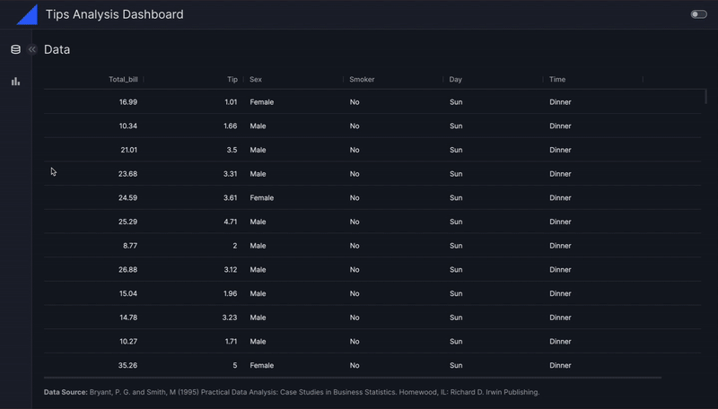

# Explore Vizro

In this tutorial, you'll learn how to build an interactive dashboard with multiple pages, incorporating a wide range of Vizro's components. This tutorial should take **about an hour to finish**, so grab a coffee or tea and let's dive in!

!!! note

    If you're looking for a quick start to get up and running with Vizro, consider reviewing the [first dashboard tutorial](../tutorials/first-dashboard.md) before diving into this one.

**By the end of this tutorial, you have learned how to:**

- Explore most of [Vizro's components](../user-guides/components.md).
- Use the [Vizro visual vocabulary](https://vizro-demo-visual-vocabulary.hf.space/) to guide your chart creation.
- Design custom charts with [Plotly Express](https://plotly.com/python-api-reference/plotly.express.html).
- Develop multiple pages for the dashboard.
- Customize the layout of the pages.
- Add interactivity using filters and parameters.
- Add a logo and title to the dashboard.
- Customize the dashboard navigation.

This tutorial uses the [tips dataset](https://plotly.com/python-api-reference/generated/plotly.express.data.html#plotly.express.data.tips), which was collected by a waiter who recorded information about each tip he received over several months at a restaurant.

[Here is a preview of the dashboard you'll build](https://py.cafe/app/vizro-official/vizro-tips-analysis-tutorial):



## 1. Install Vizro or run on PyCafe

There's no need to install Vizro locally because you can experiment with the complete code for the tutorial directly on [PyCafe](https://py.cafe/vizro-official/vizro-tips-analysis-tutorial) in your browser. We recommend starting with a [blank Vizro project on PyCafe](https://py.cafe/snippet/vizro/v1) and copying the code snippets from this tutorial into it, to build it up from scratch and see how it fits together.

For more information about working with Vizro on PyCafe, check out the [PyCafe documentation](https://py.cafe/docs/apps/vizro).

??? note "If you prefer working in a Notebook or Python script"

    To work in a Notebook or locally using a Python script, you need to [install Vizro](../user-guides/install.md).

    Paste the code from the tutorial into a Notebook cell, run the Notebook, and evaluate it.

    You will need to restart the kernel each time you run the code. Otherwise, you may encounter errors such as *"Components must uniquely map..."* because those components persist from the previous execution. As an alternative to restarting the kernel each time, you can add a cell containing `from vizro import Vizro; Vizro._reset()` to the top of your Notebook and re-run it each time you re-run your code. With this method, there is no need to restart the Jupyter kernel.

    ---

    If you prefer using Python scripts instead of Notebooks, follow these steps:

    1. Create a new script called `app.py`.
    1. Copy the code above into the script.
    1. Navigate to the directory where `app.py` file is located using your terminal.
    1. Run the script by executing the command `python app.py`.

    Once the script is running, open your web browser and navigate to `localhost:8050` to view the dashboard. To enable debug mode for hot reloading, add `debug=True` inside the run() method at the end of your `app.py` file:

    `Vizro().build(dashboard).run(debug=True)`

## 2. Understand the basics

Before we dive in, let's quickly cover some basics:

At the top level, you'll be creating a [`Dashboard`][vizro.models.Dashboard]. Here's what you can configure at the dashboard-level:

- **Pages**: You can add multiple pages; they are the building blocks of your dashboard.
- **Navigation**: You can customize navigation between those different pages.
- **Title/Logo**: You can add your own titles and logos.

For each [`Page`][vizro.models.Page], you can also configure the following:

- **Components**: Add charts, tables, input/output interfaces, and more.
- **Controls**: Include filters and parameters.
- **Layouts**: Customize the placement of components within a page.
- **Actions**: Create interactions between components using actions.

## 3. Create a first page

In this section, you learn how to create a new [`Page`][vizro.models.Page] and store it in a variable called `first_page`.

A [`Page`][vizro.models.Page] model is the foundation of any Vizro dashboard. It uses a set of components to display content. For a comprehensive list of all Vizro components, refer to the [components overview page](../user-guides/components.md).

### 3.1. Add a table

To start, let's get an overview of the data by displaying it in a table using [`AgGrid`][vizro.models.AgGrid]. These steps create a page and add a table to it:

1. Import the necessary packages and load the dataset.
1. Create a [`Page`][vizro.models.Page] and set its `title` to `"Data"`.
1. Add an [`AgGrid`][vizro.models.AgGrid] component to the `components` list.
1. Use the [`dash_ag_grid`][vizro.tables.dash_ag_grid] function inside the `figure` argument of `AgGrid`.
1. Provide details about the data source in the `footer` argument of `AgGrid`.
1. Add the newly created page to the list of `pages` in the [Dashboard][vizro.models.Dashboard].

!!! example "First Page"

    === "Code - Dashboard"

        ```{.python pycafe-link}
        import vizro.models as vm
        import vizro.plotly.express as px
        from vizro import Vizro
        from vizro.tables import dash_ag_grid
        from vizro.models.types import capture
        from vizro.figures import kpi_card
        from vizro.actions import export_data

        tips = px.data.tips()

        first_page = vm.Page(
            title="Data",
            components=[
                vm.AgGrid(
                    figure=dash_ag_grid(tips),
                    footer="""**Data Source:** Bryant, P. G. and Smith, M. (1995).
                    Practical Data Analysis: Case Studies in Business Statistics.
                    Homewood, IL: Richard D. Irwin Publishing.""",
                ),
            ],
        )

        dashboard = vm.Dashboard(pages=[first_page])
        Vizro().build(dashboard).run()
        ```

    === "Result"

        [![FirstPage]][firstpage]

After running your code (either locally or on PyCafe), you can now view the dashboard (on `localhost:8050` if you ran it locally, or on the right part of the screen if you are using PyCafe).

Take a moment to explore the data in the table. You can sort, filter, and search within the `AgGrid` columns to better understand the dataset.

In the top-right corner of the dashboard, you'll notice a toggle to switch between dark and light themes. Try it out!

### 3.2. Add an `export data` button

Next, you'll add a button that lets users export the data currently shown in your dashboard.

Vizro provides several built-in actions you can reuse. You can explore the full list in our [guide on built-in actions](../user-guides/actions.md#built-in-actions).

These steps add an export data button:

1. Add a [`Button`][vizro.models.Button] to the `components` list and set `text="Export Data"`.
1. Use the `actions` argument of the `Button` to define an [`Action`][vizro.models.Button].
1. Inside the [`Action`][vizro.models.Action], specify the built-in [`export_data`][vizro.actions.export_data] function.

!!! example "Export Data Button"

    === "Snippet - Button"

        ```py
        vm.Button(text="Export Data", actions=[vm.Action(function=export_data())])
        ```

    === "Code - Dashboard"

        ```{.python pycafe-link hl_lines="20"}
        import vizro.models as vm
        import vizro.plotly.express as px
        from vizro import Vizro
        from vizro.tables import dash_ag_grid
        from vizro.models.types import capture
        from vizro.figures import kpi_card
        from vizro.actions import export_data

        tips = px.data.tips()

        first_page = vm.Page(
            title="Data",
            components=[
                vm.AgGrid(
                    figure=dash_ag_grid(tips),
                    footer="""**Data Source:** Bryant, P. G. and Smith, M. (1995).
                    Practical Data Analysis: Case Studies in Business Statistics.
                    Homewood, IL: Richard D. Irwin Publishing.""",
                ),
                vm.Button(text="Export Data", actions=[vm.Action(function=export_data())]),
            ],
        )

        dashboard = vm.Dashboard(pages=[first_page])
        Vizro().build(dashboard).run()
        ```

    === "Result"

        [![FirstPageButton]][firstpagebutton]

**Click on the Button and see what happens! 📂**

### 3.3. Configure the layout

Notice there is extra blank space below the button. In this step, you’ll learn how to improve the layout by arranging components more efficiently.

Vizro supports two layout models: [`Grid`][vizro.models.Grid] and [`Flex`][vizro.models.Flex]. To understand the differences between them, check out our [guide on layouts](../user-guides/layouts.md#layout-options-grid-and-flex).

By default, Vizro uses the `Grid` layout, which arranges components in the order they appear inside `components` and gives them equal space. However, in our case, we want the `Button` and `AgGrid` to only take up the space they need — not equal space.

To achieve this, we'll switch to the `Flex` layout and set a `height` for the `AgGrid`, as the default is `400px` otherwise.

1. In the `layout` argument of the `Page`, use the [`Flex`][vizro.models.Flex] layout model via `layout = vm.Flex()`
1. Specify `style= {"height": "600px"}` inside the `dash_ag_grid`, as it would otherwise default to `400px`.

!!! example "Use Flex layout"

    === "Snippet - flex layout"

        ```py
        layout = vm.Flex()
        ```

    === "Code - Dashboard"

        ```{.python pycafe-link hl_lines="13 16"}
        import vizro.models as vm
        import vizro.plotly.express as px
        from vizro import Vizro
        from vizro.tables import dash_ag_grid
        from vizro.models.types import capture
        from vizro.figures import kpi_card
        from vizro.actions import export_data

        tips = px.data.tips()

        first_page = vm.Page(
            title="Data",
            layout=vm.Flex(),
            components=[
                vm.AgGrid(
                    figure=dash_ag_grid(tips, style= {"height": "600px"}),
                    footer="""**Data Source:** Bryant, P. G. and Smith, M. (1995).
                    Practical Data Analysis: Case Studies in Business Statistics.
                    Homewood, IL: Richard D. Irwin Publishing.""",
                ),
                vm.Button(text="Export Data", actions=[vm.Action(function=export_data())]),
            ],
        )

        dashboard = vm.Dashboard(pages=[first_page])
        Vizro().build(dashboard).run()
        ```

    === "Result"

        [![FirstPageLayout]][firstpagelayout]

**Looks much better already! Great job - you've successfully created your first dashboard page!**

## 4. Create a second page

### 4.1. Add a chart

Next, you'll learn how to add a second page to the dashboard that features charts and KPI (Key Performance Indicator) cards.

Vizro uses [`Graph`][vizro.models.Graph] models and [Plotly Express functions](https://plotly.com/python/plotly-express/) to create various types of charts. You can explore some of the available chart types and their code examples in the [Vizro visual vocabulary](https://vizro-demo-visual-vocabulary.hf.space).

These steps add a histogram to the page:

1. Create a second [`Page`][vizro.models.Page] and store it in a variable called `second_page`. Set its `title` to `"Summary"`.
1. Add a [`Graph`][vizro.models.Graph] to the `components` list.
1. Inside the `figure` argument of the `Graph`, use the code for the [px.histogram from the visual vocabulary](https://vizro-demo-visual-vocabulary.hf.space/distribution/histogram).
1. Add the new page to the list of `pages` in the [`Dashboard`][vizro.models.Dashboard] by calling `vm.Dashboard(pages=[first_page, second_page])`.

!!! example "Second Page"

    === "Snippet - Second Page"

        ```py
        second_page = vm.Page(
            title="Summary",
            components=[
                vm.Graph(figure=px.histogram(tips, x="total_bill")),
                vm.Graph(figure=px.histogram(tips, x="tip")),
            ],
        )
        dashboard = vm.Dashboard(pages=[first_page, second_page])
        ```

    === "Code - Dashboard"

        ```{.python pycafe-link hl_lines="24-30 32"}
        import vizro.models as vm
        import vizro.plotly.express as px
        from vizro import Vizro
        from vizro.tables import dash_ag_grid
        from vizro.models.types import capture
        from vizro.figures import kpi_card
        from vizro.actions import export_data

        tips = px.data.tips()

        first_page = vm.Page(
            title="Data",
            components=[
                vm.AgGrid(
                    figure=dash_ag_grid(tips),
                    footer="""**Data Source:** Bryant, P. G. and Smith, M. (1995).
                    Practical Data Analysis: Case Studies in Business Statistics.
                    Homewood, IL: Richard D. Irwin Publishing.""",
                ),
                vm.Button(text="Export Data", actions=[vm.Action(function=export_data())]),
            ],
        )

        second_page = vm.Page(
            title="Summary",
            components=[
                vm.Graph(figure=px.histogram(tips, x="total_bill")),
                vm.Graph(figure=px.histogram(tips, x="tip")),
            ],
        )

        dashboard = vm.Dashboard(pages=[first_page, second_page])
        Vizro().build(dashboard).run()
        ```

    === "Result"

        [![SecondPage]][secondpage]

Notice that the charts are automatically stacked vertically in the order specified under `components`, each taking up equal space. This is the default behavior in Vizro, but you'll learn how to customize the layout later!

Also, a page navigation menu has been added to the left side of the dashboard, enabling you to switch between the two pages we’ve created.

You'll also notice that the left-side menu can be collapsed to provide more space for the dashboard content. **Give it a try!**

### 4.2. Add KPI cards

You can combine and arrange various types of `components` on a dashboard page. Refer to the [components overview page](../user-guides/components.md) for a comprehensive list of available components.

These steps add two KPI cards to the second page:

1. Add a [`Figure`][vizro.models.Figure] to the list of `components`.
1. Inside the `figure` argument of the `Figure`, use the [`kpi_card`][vizro.figures.kpi_card] function.
1. Configure your `kpi_card` by setting the `value_column`, `agg_func`, `value_format`, and `title`. To learn more about configuring KPI cards, check out our [guide to KPI cards](../user-guides/figure.md#key-performance-indicator-kpi-cards).
1. Repeat the above steps to add another KPI card to the page.

!!! example "Add KPI Cards"

    === "Snippet - KPI Card I"

        ```py
        vm.Figure(
            figure=kpi_card(
                data_frame=tips,
                value_column="total_bill",
                agg_func="mean",
                value_format="${value:.2f}",
                title="Average Bill",
            )
        )
        ```

    === "Snippet - KPI Card II"

        ```py
        vm.Figure(
            figure=kpi_card(
                data_frame=tips,
                value_column="tip",
                agg_func="mean",
                value_format="${value:.2f}",
                title="Average Tips"
            )
        )
        ```

    === "Code - dashboard"

        ```{.python pycafe-link hl_lines="27-44"}
        import vizro.models as vm
        import vizro.plotly.express as px
        from vizro import Vizro
        from vizro.tables import dash_ag_grid
        from vizro.models.types import capture
        from vizro.figures import kpi_card
        from vizro.actions import export_data

        tips = px.data.tips()

        first_page = vm.Page(
            title="Data",
            components=[
                vm.AgGrid(
                    figure=dash_ag_grid(tips),
                    footer="""**Data Source:** Bryant, P. G. and Smith, M. (1995).
                    Practical Data Analysis: Case Studies in Business Statistics.
                    Homewood, IL: Richard D. Irwin Publishing.""",
                ),
                vm.Button(text="Export Data", actions=[vm.Action(function=export_data())]),
            ],
        )

        second_page = vm.Page(
            title="Summary",
            components=[
                vm.Figure(
                    figure=kpi_card(
                        data_frame=tips,
                        value_column="total_bill",
                        agg_func="mean",
                        value_format="${value:.2f}",
                        title="Average Bill",
                    )
                ),
                vm.Figure(
                    figure=kpi_card(
                        data_frame=tips,
                        value_column="tip",
                        agg_func="mean",
                        value_format="${value:.2f}",
                        title="Average Tips"
                    )
                ),
                vm.Graph(figure=px.histogram(tips, x="total_bill")),
                vm.Graph(figure=px.histogram(tips, x="tip")),
            ],
        )

        dashboard = vm.Dashboard(pages=[first_page, second_page])
        Vizro().build(dashboard).run()
        ```

    === "Result"

        [![SecondPage2]][secondpage2]

### 4.3. Add tabs to switch views

You may not want to display both histograms simultaneously and instead prefer to switch between views. You can achieve this by using the [`Tabs`][vizro.models.Tabs] component. For more details, refer to Vizro's [tabs user guide](../user-guides/tabs.md).

These steps place the two histograms in separate tabs:

1. Add each `Graph` to the `components` of a [`Container`][vizro.models.Container].
1. Set the `title` argument inside each `Container` to the desired tab name.
1. Add the containers to the `tabs` list of the `Tabs` component.
1. Add the `Tabs` component to the `components` of the `Page`.

!!! example "Add Tabs"

    === "Snippet - Tabs"

        ```py
        vm.Tabs(
            tabs=[
                vm.Container(
                    title="Total Bill ($)",
                    components=[
                        vm.Graph(figure=px.histogram(tips, x="total_bill")),
                    ],
                ),
                vm.Container(
                    title="Total Tips ($)",
                    components=[
                        vm.Graph(figure=px.histogram(tips, x="tip")),
                    ],
                ),
            ],
        )
        ```

    === "Code - dashboard"

        ```{.python pycafe-link hl_lines="45-60"}
        import vizro.models as vm
        import vizro.plotly.express as px
        from vizro import Vizro
        from vizro.tables import dash_ag_grid
        from vizro.models.types import capture
        from vizro.figures import kpi_card
        from vizro.actions import export_data

        tips = px.data.tips()

        first_page = vm.Page(
            title="Data",
            components=[
                vm.AgGrid(
                    figure=dash_ag_grid(tips),
                    footer="""**Data Source:** Bryant, P. G. and Smith, M. (1995).
                    Practical Data Analysis: Case Studies in Business Statistics.
                    Homewood, IL: Richard D. Irwin Publishing.""",
                ),
                vm.Button(text="Export Data", actions=[vm.Action(function=export_data())]),
            ],
        )

        second_page = vm.Page(
            title="Summary",
            components=[
                vm.Figure(
                    figure=kpi_card(
                        data_frame=tips,
                        value_column="total_bill",
                        agg_func="mean",
                        value_format="${value:.2f}",
                        title="Average Bill",
                    )
                ),
                vm.Figure(
                    figure=kpi_card(
                        data_frame=tips,
                        value_column="tip",
                        agg_func="mean",
                        value_format="${value:.2f}",
                        title="Average Tips"
                    )
                ),
                vm.Tabs(
                    tabs=[
                        vm.Container(
                            title="Total Bill ($)",
                            components=[
                                vm.Graph(figure=px.histogram(tips, x="total_bill")),
                            ],
                        ),
                        vm.Container(
                            title="Total Tips ($)",
                            components=[
                                vm.Graph(figure=px.histogram(tips, x="tip")),
                            ],
                        ),
                    ],
                )
            ],
        )

        dashboard = vm.Dashboard(pages=[first_page, second_page])
        Vizro().build(dashboard).run()
        ```

    === "Result"

        [![SecondPage3]][secondpage3]

**Take a moment to switch between the tabs!**

As you explore the dashboard, you might notice that the current layout could use some adjustment. The histograms appear cramped, and the KPI cards have too much space. In the next section, you'll learn how to configure the layout and better arrange the components.

### 4.4. Configure the layout

In this section, you'll customize the [`Grid`][vizro.models.Grid] to control the placement and size of components on the page.

The following layout configuration is divided into **four columns** and **four rows**. The numbers in the grid correspond to the index of the components in the `components` list.

- The first KPI card (0) is positioned at the top, occupying the first cell in the first row.
- The second KPI card (1) is positioned to the right of the first KPI card.
- There are two empty cells to the right of the KPI cards (-1).
- The `Tabs` component (2) is placed below the KPI cards, spanning all cells across the remaining three rows.

<!-- Don't change below to python code, as otherwise it will be put on one line. -->

```
grid = [[0, 1,-1,-1],
        [2, 2, 2, 2],
        [2, 2, 2, 2],
        [2, 2, 2, 2]]
```

Run the code below to apply the layout to the dashboard page:

!!! example "Code - Layout"

    === "Snippet - Layout"

        ```py
        layout = vm.Grid(
            grid=[[0, 1, -1, -1],
                  [2, 2, 2, 2],
                  [2, 2, 2, 2],
                  [2, 2, 2, 2]]
        )
        ```

    === "Code - Dashboard"

        ```{.python pycafe-link hl_lines="26"}
        import vizro.models as vm
        import vizro.plotly.express as px
        from vizro import Vizro
        from vizro.tables import dash_ag_grid
        from vizro.models.types import capture
        from vizro.figures import kpi_card
        from vizro.actions import export_data

        tips = px.data.tips()

        first_page = vm.Page(
            title="Data",
            components=[
                vm.AgGrid(
                    figure=dash_ag_grid(tips),
                    footer="""**Data Source:** Bryant, P. G. and Smith, M (1995)
                    Practical Data Analysis: Case Studies in Business Statistics.
                    Homewood, IL: Richard D. Irwin Publishing.""",
                ),
                vm.Button(text="Export Data", actions=[vm.Action(function=export_data())]),
            ],
        )

        second_page = vm.Page(
            title="Summary",
            layout=vm.Grid(grid=[[0, 1, -1, -1], [2, 2, 2, 2], [2, 2, 2, 2], [2, 2, 2, 2]]),
            components=[
                vm.Figure(
                    figure=kpi_card(
                        data_frame=tips,
                        value_column="total_bill",
                        agg_func="mean",
                        value_format="${value:.2f}",
                        title="Average Bill",
                    )
                ),
                vm.Figure(
                    figure=kpi_card(
                        data_frame=tips,
                        value_column="tip",
                        agg_func="mean",
                        value_format="${value:.2f}",
                        title="Average Tips"
                    )
                ),
                vm.Tabs(
                    tabs=[
                        vm.Container(
                            title="Total Bill ($)",
                            components=[
                                vm.Graph(figure=px.histogram(tips, x="total_bill")),
                            ],
                        ),
                        vm.Container(
                            title="Total Tips ($)",
                            components=[
                                vm.Graph(figure=px.histogram(tips, x="tip")),
                            ],
                        ),
                    ],
                )
            ],
        )

        dashboard = vm.Dashboard(pages=[first_page, second_page])
        Vizro().build(dashboard).run()
        ```

    === "Result"

        [![SecondPage4]][secondpage4]

**Much better, don't you think? The layout now provides sufficient space for the charts!**

### 4.5. Add a filter

You can use a [`Filter`][vizro.models.Filter] to interact with the dashboard by selecting specific data points to display.

These steps add a filter to the dashboard:

1. Add a [`Filter`][vizro.models.Filter] to the `controls` list of the `Page`.
1. Specify the column to be filtered using the `column` argument of the [Filter][vizro.models.Filter].
1. Change the `selector` in one of the `Filters` to a [`Checklist`][vizro.models.Checklist]. For further customization, refer to the guide on [`How to use selectors`](../user-guides/selectors.md).

!!! example "Add a filter"

    === "Snippet - Filter"

        ```py
        controls = [vm.Filter(column="day"), vm.Filter(column="time", selector=vm.Checklist()), vm.Filter(column="size")]
        ```

    === "Code - Dashboard"

        ```{.python pycafe-link hl_lines="63"}
        import vizro.models as vm
        import vizro.plotly.express as px
        from vizro import Vizro
        from vizro.tables import dash_ag_grid
        from vizro.models.types import capture
        from vizro.figures import kpi_card
        from vizro.actions import export_data

        tips = px.data.tips()

        first_page = vm.Page(
            title="Data",
            components=[
                vm.AgGrid(
                    figure=dash_ag_grid(tips),
                    footer="""**Data Source:** Bryant, P. G. and Smith, M (1995)
                    Practical Data Analysis: Case Studies in Business Statistics.
                    Homewood, IL: Richard D. Irwin Publishing.""",
                ),
                vm.Button(text="Export Data", actions=[vm.Action(function=export_data())]),
            ],
        )

        second_page = vm.Page(
            title="Summary",
            layout=vm.Grid(grid=[[0, 1, -1, -1], [2, 2, 2, 2], [2, 2, 2, 2], [2, 2, 2, 2]]),
            components=[
                vm.Figure(
                    figure=kpi_card(
                        data_frame=tips,
                        value_column="total_bill",
                        agg_func="mean",
                        value_format="${value:.2f}",
                        title="Average Bill",
                    )
                ),
                vm.Figure(
                    figure=kpi_card(
                        data_frame=tips,
                        value_column="tip",
                        agg_func="mean",
                        value_format="${value:.2f}",
                        title="Average Tips"
                    )
                ),
                vm.Tabs(
                    tabs=[
                        vm.Container(
                            title="Total Bill ($)",
                            components=[
                                vm.Graph(figure=px.histogram(tips, x="total_bill")),
                            ],
                        ),
                        vm.Container(
                            title="Total Tips ($)",
                            components=[
                                vm.Graph(figure=px.histogram(tips, x="tip")),
                            ],
                        ),
                    ],
                )
            ],
            controls = [vm.Filter(column="day"), vm.Filter(column="time", selector=vm.Checklist()), vm.Filter(column="size")]
        )

        dashboard = vm.Dashboard(pages=[first_page, second_page])
        Vizro().build(dashboard).run()
        ```

    === "Result"

        [![SecondPage5]][secondpage5]

You'll see that a [`Dropdown`][vizro.models.Dropdown] is selected by default for categorical data, while a [`RangeSlider`][vizro.models.RangeSlider] is used for numerical data. Also, filters are applied to all components on the page.

If you want to apply a filter to specific components only, check out [How to use filters](../user-guides/filters.md).

**Great work! You've just made a second dashboard page and learned how to:**

1. [Add a chart to a page using the visual vocabulary](#41-add-a-chart)
1. [Add KPI cards to display summary statistics](#42-add-kpi-cards)
1. [Add tabs to switch views](#43-add-tabs-to-switch-views)
1. [Arrange components by customizing the layout](#44-configure-the-layout)
1. [Add a filter to interact with the dashboard](#45-add-a-filter)

## 5. Create a third page

Now that you've learned how to create pages, add components, and configure layouts, you'll create a third page for the dashboard. This will give you the opportunity to practice your skills alongside learning some new concepts!

This page takes inspiration from the [Vizro visual vocabulary](https://vizro-demo-visual-vocabulary.hf.space/). It will feature:

- a [bar chart](https://vizro-demo-visual-vocabulary.hf.space/magnitude/bar)
- a [violin chart](https://vizro-demo-visual-vocabulary.hf.space/distribution/violin)
- a [heatmap](https://vizro-demo-visual-vocabulary.hf.space/time/heatmap)

### 5.1. Add multiple charts

These steps should feel familiar, as they add three charts to the new page.

1. Create a third [`Page`][vizro.models.Page] and store it in a variable called `third_page`. Set its `title` to "Analysis".
1. Add three [`Graph`][vizro.models.Graph] models to the `components` of the `Page`.
1. For each `Graph`, use the `figure` argument to provide one of the Plotly express functions:
    - [px.violin](https://vizro-demo-visual-vocabulary.hf.space/distribution/violin) (copy the code directly)
    - [px.bar](https://vizro-demo-visual-vocabulary.hf.space/magnitude/column) (copy the code directly)
    - [px.density_heatmap](https://vizro-demo-visual-vocabulary.hf.space/time/heatmap) (update the `data`, `x`, and `y` arguments to match the dataset)
1. Provide a `title` for each `Graph`.
1. Add the new `Page` to the list of `pages` in the [`Dashboard`][vizro.models.Dashboard].

!!! example "Third page"

    === "Snippet - third page"

        ```py
        third_page = vm.Page(
            title="Analysis",
            components=[
                vm.Graph(
                    title="Where do we get more tips?",
                    figure=px.bar(tips, y="tip", x="day"),
                ),
                vm.Graph(
                    title="Is the average driven by a few outliers?",
                    figure=px.violin(tips, y="tip", x="day", color="day", box=True),
                ),
                vm.Graph(
                    title="Which group size is more profitable?",
                    figure=px.density_heatmap(tips, x="day", y="size", z="tip", histfunc="avg", text_auto="$.2f"),
                ),
            ],
        )

        dashboard = vm.Dashboard(pages=[first_page, second_page, third_page])
        ```

    === "Code - dashboard"

        ```{.python pycafe-link hl_lines="70-86 88"}
        import vizro.models as vm
        import vizro.plotly.express as px
        from vizro import Vizro
        from vizro.tables import dash_ag_grid
        from vizro.models.types import capture
        from vizro.figures import kpi_card
        from vizro.actions import export_data

        tips = px.data.tips()

        first_page = vm.Page(
            title="Data",
            components=[
                vm.AgGrid(
                    figure=dash_ag_grid(tips),
                    footer="""**Data Source:** Bryant, P. G. and Smith, M. (1995)
                    Practical Data Analysis: Case Studies in Business Statistics.
                    Homewood, IL: Richard D. Irwin Publishing.""",
                ),
                vm.Button(text="Export Data", actions=[vm.Action(function=export_data())]),
            ],
        )

        second_page = vm.Page(
            title="Summary",
            layout=vm.Grid(grid=[[0, 1, -1, -1], [2, 2, 2, 2], [2, 2, 2, 2], [2, 2, 2, 2]]),
            components=[
                vm.Figure(
                    figure=kpi_card(
                        data_frame=tips,
                        value_column="total_bill",
                        agg_func="mean",
                        value_format="${value:.2f}",
                        title="Average Bill",
                    )
                ),
                vm.Figure(
                    figure=kpi_card(
                        data_frame=tips,
                        value_column="tip",
                        agg_func="mean",
                        value_format="${value:.2f}",
                        title="Average Tips",
                    )
                ),
                vm.Tabs(
                    tabs=[
                        vm.Container(
                            title="Total Bill ($)",
                            components=[
                                vm.Graph(figure=px.histogram(tips, x="total_bill")),
                            ],
                        ),
                        vm.Container(
                            title="Total Tips ($)",
                            components=[
                                vm.Graph(figure=px.histogram(tips, x="tip")),
                            ],
                        ),
                    ],
                ),
            ],
            controls=[
                vm.Filter(column="day"),
                vm.Filter(column="time", selector=vm.Checklist()),
                vm.Filter(column="size"),
            ],
        )

        third_page = vm.Page(
            title="Analysis",
            components=[
                vm.Graph(
                    title="Where do we get more tips?",
                    figure=px.bar(tips, y="tip", x="day"),
                ),
                vm.Graph(
                    title="Is the average driven by a few outliers?",
                    figure=px.violin(tips, y="tip", x="day", color="day", box=True),
                ),
                vm.Graph(
                    title="Which group size is more profitable?",
                    figure=px.density_heatmap(tips, x="day", y="size", z="tip", histfunc="avg", text_auto="$.2f"),
                ),
            ],
        )

        dashboard = vm.Dashboard(pages=[first_page, second_page, third_page])
        Vizro().build(dashboard).run()
        ```

    === "Result"

        [![ThirdPage]][thirdpage]

Depending on your screen size, you may notice that the third chart is not visible. This issue can occur with Plotly charts when there isn't enough space to display them properly. Let's revise the layout to allocate more space for the heatmap.

### 5.2. Configure the layout

This step should also feel familiar by now. In the following new layout configuration, divide layout into **two columns** and **two rows**:

- The bar chart (0) and violin chart (1) are placed side by side in the first row.
- The heatmap (2) spans the entire second row.

Remember, the index corresponds to the order in which the components are added to the `components` of the `Page`.

<!-- Don't change below to python code, as otherwise it will be put on one line. -->

```
grid = [[0, 1],
        [2, 2]]
```

Run the code below to apply the layout to the dashboard page:

!!! example "Code - Layout"

    === "Snippet - Layout"

        ```py
        layout=vm.Grid(grid=[[0, 1], [2, 2]]),
        ```

    === "Code - dashboard"

        ```{.python pycafe-link hl_lines="68"}
        import vizro.models as vm
        import vizro.plotly.express as px
        from vizro import Vizro
        from vizro.tables import dash_ag_grid
        from vizro.models.types import capture
        from vizro.figures import kpi_card
        from vizro.actions import export_data

        tips = px.data.tips()

        first_page = vm.Page(
            title="Data",
            components=[
                vm.AgGrid(
                    figure=dash_ag_grid(tips),
                    footer="""**Data Source:** Bryant, P. G. and Smith, M (1995)
                    Practical Data Analysis: Case Studies in Business Statistics.
                    Homewood, IL: Richard D. Irwin Publishing.""",
                ),
                vm.Button(text="Export Data", actions=[vm.Action(function=export_data())]),
            ],
        )

        second_page = vm.Page(
            title="Summary",
            layout=vm.Grid(grid=[[0, 1, -1, -1], [2, 2, 2, 2], [2, 2, 2, 2], [2, 2, 2, 2]]),
            components=[
                vm.Figure(
                    figure=kpi_card(
                        data_frame=tips,
                        value_column="total_bill",
                        agg_func="mean",
                        value_format="${value:.2f}",
                        title="Average Bill",
                    )
                ),
                vm.Figure(
                    figure=kpi_card(
                        data_frame=tips,
                        value_column="tip",
                        agg_func="mean",
                        value_format="${value:.2f}",
                        title="Average Tips"
                    )
                ),
                vm.Tabs(
                    tabs=[
                        vm.Container(
                            title="Total Bill ($)",
                            components=[
                                vm.Graph(figure=px.histogram(tips, x="total_bill")),
                            ],
                        ),
                        vm.Container(
                            title="Total Tips ($)",
                            components=[
                                vm.Graph(figure=px.histogram(tips, x="tip")),
                            ],
                        ),
                    ],
                )
            ],
            controls=[vm.Filter(column="day"), vm.Filter(column="time", selector=vm.Checklist()), vm.Filter(column="size")]
        )

        third_page = vm.Page(
            title="Analysis",
            layout=vm.Grid(grid=[[0, 1], [2, 2]]),
            components=[
                vm.Graph(
                    title="Where do we get more tips?",
                    figure=px.bar(tips, y="tip", x="day"),
                ),
                vm.Graph(
                    title="Is the average driven by a few outliers?",
                    figure=px.violin(tips, y="tip", x="day", color="day", box=True),
                ),
                vm.Graph(
                    title="Which group size is more profitable?",
                    figure=px.density_heatmap(tips, x="day", y="size", z="tip", histfunc="avg", text_auto="$.2f"),
                ),
            ],
        )

        dashboard = vm.Dashboard(pages=[first_page, second_page, third_page])
        Vizro().build(dashboard).run()
        ```

    === "Result"

        [![ThirdPage2]][thirdpage2]

**Fantastic work! The heatmap looks great, doesn't it?**

### 5.3. Add a parameter

This section explains how to add a [`Parameter`][vizro.models.Parameter] to your dashboard, which enables you to dynamically change a component's argument, making the dashboard more interactive. For more information about configuration, refer to the [guide to parameters](../user-guides/parameters.md).

In this section, you learn how to switch the `x` and `color` arguments across all charts, enabling data analysis from different perspectives.

These steps add a parameter to the dashboard:

1. Add a [`Parameter`][vizro.models.Parameter] to the `controls` of the `Page`.
1. Assign an `id` to each `Graph` that the [Parameter][vizro.models.Parameter] should target.
1. Define the parameter's `targets` using the format `component-id.argument`.
1. Set the `selector` of the [Parameter][vizro.models.Parameter] to a [`RadioItems`][vizro.models.RadioItems].
1. Provide options for the `RadioItems` selector.

!!! example "Add a parameter"

    === "Snippet - parameter"

        ```py
        controls=[
            vm.Parameter(
                targets=["violin.x", "violin.color", "heatmap.x", "bar.x"],
                selector=vm.RadioItems(
                    options=["day", "time", "sex", "smoker", "size"], value="day", title="Change x-axis inside charts:"
                ),
            ),
        ]
        ```

    === "Code - dashboard"

        ```{.python pycafe-link hl_lines="71 76 86-93"}
        import vizro.models as vm
        import vizro.plotly.express as px
        from vizro import Vizro
        from vizro.tables import dash_ag_grid
        from vizro.models.types import capture
        from vizro.figures import kpi_card
        from vizro.actions import export_data

        tips = px.data.tips()

        first_page = vm.Page(
            title="Data",
            components=[
                vm.AgGrid(
                    figure=dash_ag_grid(tips),
                    footer="""**Data Source:** Bryant, P. G. and Smith, M (1995)
                    Practical Data Analysis: Case Studies in Business Statistics.
                    Homewood, IL: Richard D. Irwin Publishing.""",
                ),
                vm.Button(text="Export Data", actions=[vm.Action(function=export_data())]),
            ],
        )

        second_page = vm.Page(
            title="Summary",
            layout=vm.Grid(grid=[[0, 1, -1, -1], [2, 2, 2, 2], [2, 2, 2, 2], [2, 2, 2, 2]]),
            components=[
                vm.Figure(
                    figure=kpi_card(
                        data_frame=tips,
                        value_column="total_bill",
                        agg_func="mean",
                        value_format="${value:.2f}",
                        title="Average Bill",
                    )
                ),
                vm.Figure(
                    figure=kpi_card(
                        data_frame=tips,
                        value_column="tip",
                        agg_func="mean",
                        value_format="${value:.2f}",
                        title="Average Tips"
                    )
                ),
                vm.Tabs(
                    tabs=[
                        vm.Container(
                            title="Total Bill ($)",
                            components=[
                                vm.Graph(figure=px.histogram(tips, x="total_bill")),
                            ],
                        ),
                        vm.Container(
                            title="Total Tips ($)",
                            components=[
                                vm.Graph(figure=px.histogram(tips, x="tip")),
                            ],
                        ),
                    ],
                )
            ],
            controls=[vm.Filter(column="day"), vm.Filter(column="time", selector=vm.Checklist()), vm.Filter(column="size")]
        )

        third_page = vm.Page(
            title="Analysis",
            layout=vm.Grid(grid=[[0, 1], [2, 2]]),
            components=[
                vm.Graph(
                    id="bar",
                    title="Where do we get more tips?",
                    figure=px.bar(tips, y="tip", x="day"),
                ),
                vm.Graph(
                    id="violin",
                    title="Is the average driven by a few outliers?",
                    figure=px.violin(tips, y="tip", x="day", color="day", box=True),
                ),
                vm.Graph(
                    id="heatmap",
                    title="Which group size is more profitable?",
                    figure=px.density_heatmap(tips, x="day", y="size", z="tip", histfunc="avg", text_auto="$.2f"),
                ),
            ],
            controls=[
                vm.Parameter(
                    targets=["violin.x", "violin.color", "heatmap.x", "bar.x"],
                    selector=vm.RadioItems(
                        options=["day", "time", "sex", "smoker", "size"], value="day", title="Change x-axis inside charts:"
                    ),
                ),
            ],
        )

        dashboard = vm.Dashboard(pages=[first_page, second_page, third_page])
        Vizro().build(dashboard).run()
        ```

    === "Result"

        [![ThirdPage3]][thirdpage3]

Take a moment to interact with the parameter. Notice how the x-axis of all charts updates dynamically based on your selection.

**Isn't it amazing how effortlessly it is to shift the data analysis perspective now?**

### 5.4. Add a custom chart

You may notice that the `bar` chart has many inner lines. This happens because each line represents a unique data point when an unaggregated dataset is provided to `px.bar`. To avoid this, you can aggregate the data before plotting. However, the aggregation needs to be dynamic, based on the parameter you added in the previous step. The following steps create a custom chart:

1. Create a function that takes the `data_frame` as input and returns a Plotly figure.
1. Decorate the function with the `@capture(graph)` decorator.
1. Inside the function, aggregate the data, provide a label for the chart, and update the bar width.
1. Use this custom function in the `Graph` component instead of `px.bar`.

For more information on when to create a custom chart, check out [How to create custom charts](../user-guides/custom-charts.md).

!!! example "Add custom chart"

    === "Snippet - custom chart"

        ```py
        @capture("graph")
        def bar_mean(data_frame, x, y):
            df_agg = data_frame.groupby(x).agg({y: "mean"}).reset_index()
            fig = px.bar(df_agg, x=x, y=y, labels={"tip": "Average Tip ($)"})
            fig.update_traces(width=0.6)
            return fig
        ```

    === "Code - dashboard"

        ```{.python pycafe-link hl_lines="12-17 82"}
        import vizro.models as vm
        import vizro.plotly.express as px
        from vizro import Vizro
        from vizro.tables import dash_ag_grid
        from vizro.models.types import capture
        from vizro.figures import kpi_card
        from vizro.actions import export_data

        tips = px.data.tips()


        @capture("graph")
        def bar_mean(data_frame, x, y):
            df_agg = data_frame.groupby(x).agg({y: "mean"}).reset_index()
            fig = px.bar(df_agg, x=x, y=y, labels={"tip": "Average Tip ($)"})
            fig.update_traces(width=0.6)
            return fig


        first_page = vm.Page(
            title="Data",
            components=[
                vm.AgGrid(
                    figure=dash_ag_grid(tips),
                    footer="""**Data Source:** Bryant, P. G. and Smith, M (1995)
                    Practical Data Analysis: Case Studies in Business Statistics.
                    Homewood, IL: Richard D. Irwin Publishing.""",
                ),
                vm.Button(text="Export Data", actions=[vm.Action(function=export_data())]),
            ],
        )

        second_page = vm.Page(
            title="Summary",
            layout=vm.Grid(grid=[[0, 1, -1, -1], [2, 2, 2, 2], [2, 2, 2, 2], [2, 2, 2, 2]]),
            components=[
                vm.Figure(
                    figure=kpi_card(
                        data_frame=tips,
                        value_column="total_bill",
                        agg_func="mean",
                        value_format="${value:.2f}",
                        title="Average Bill",
                    )
                ),
                vm.Figure(
                    figure=kpi_card(
                        data_frame=tips,
                        value_column="tip",
                        agg_func="mean",
                        value_format="${value:.2f}",
                        title="Average Tips"
                    )
                ),
                vm.Tabs(
                    tabs=[
                        vm.Container(
                            title="Total Bill ($)",
                            components=[
                                vm.Graph(figure=px.histogram(tips, x="total_bill")),
                            ],
                        ),
                        vm.Container(
                            title="Total Tips ($)",
                            components=[
                                vm.Graph(figure=px.histogram(tips, x="tip")),
                            ],
                        ),
                    ],
                )
            ],
            controls=[vm.Filter(column="day"), vm.Filter(column="time", selector=vm.Checklist()), vm.Filter(column="size")]
        )

        third_page = vm.Page(
            title="Analysis",
            layout=vm.Grid(grid=[[0, 1], [2, 2]]),
            components=[
                vm.Graph(
                    id="bar",
                    title="Where do we get more tips?",
                    figure=bar_mean(tips, y="tip", x="day"),
                ),
                vm.Graph(
                    id="violin",
                    title="Is the average driven by a few outliers?",
                    figure=px.violin(tips, y="tip", x="day", color="day", box=True),
                ),
                vm.Graph(
                    id="heatmap",
                    title="Which group size is more profitable?",
                    figure=px.density_heatmap(tips, x="day", y="size", z="tip", histfunc="avg", text_auto="$.2f"),
                ),
            ],
            controls=[
                vm.Parameter(
                    targets=["violin.x", "violin.color", "heatmap.x", "bar.x"],
                    selector=vm.RadioItems(
                        options=["day", "time", "sex", "smoker", "size"], value="day", title="Change x-axis inside charts:"
                    ),
                ),
            ],
        )

        dashboard = vm.Dashboard(pages=[first_page, second_page, third_page])
        Vizro().build(dashboard).run()
        ```

    === "Result"

        [![ThirdPage4]][thirdpage4]

**Fantastic job reaching this point!**

You've just completed the final dashboard page and learned how to:

1. [Add multiple charts](#51-add-multiple-charts)
1. [Customize a layout](#52-configure-the-layout)
1. [Add a parameter to interact with the charts](#53-add-a-parameter)
1. [Add a custom chart to the dashboard](#54-add-a-custom-chart)

## 6. Finishing touches

Now that you've created all the dashboard pages, let's add a title and logo, and customize the navigation.

### 6.1. Add a title and logo

The following steps add a title and logo to the dashboard:

1. Set the `title` attribute of the [Dashboard][vizro.models.Dashboard] to "Tips Analysis Dashboard".
1. Download the `logo` from [this link](https://raw.githubusercontent.com/mckinsey/vizro/refs/heads/main/vizro-core/examples/dev/assets/logo.svg) and save it in a folder named `assets`.
1. Place the `assets` folder in the same directory as your `app.py/app.ipynb` file.

Your directory structure should look like this:

```text title="Example folder structure"
├── app.py
├── assets
│   ├── logo.svg
```

!!! example "Add a dashboard title and logo"

    === "Snippet - dashboard title"

        ```py
        dashboard = vm.Dashboard(pages=[first_page, second_page, third_page], title="Tips Analysis Dashboard")
        ```

    === "Code - dashboard"

        ```{.python pycafe-link hl_lines="105"}
        import vizro.models as vm
        import vizro.plotly.express as px
        from vizro import Vizro
        from vizro.tables import dash_ag_grid
        from vizro.models.types import capture
        from vizro.figures import kpi_card
        from vizro.actions import export_data

        tips = px.data.tips()


        @capture("graph")
        def bar_mean(data_frame, x, y):
            df_agg = data_frame.groupby(x).agg({y: "mean"}).reset_index()
            fig = px.bar(df_agg, x=x, y=y, labels={"tip": "Average Tip ($)"})
            fig.update_traces(width=0.6)
            return fig


        first_page = vm.Page(
            title="Data",
            components=[
                vm.AgGrid(
                    figure=dash_ag_grid(tips),
                    footer="""**Data Source:** Bryant, P. G. and Smith, M (1995)
                    Practical Data Analysis: Case Studies in Business Statistics.
                    Homewood, IL: Richard D. Irwin Publishing.""",
                ),
                vm.Button(text="Export Data", actions=[vm.Action(function=export_data())]),
            ],
        )

        second_page = vm.Page(
            title="Summary",
            layout=vm.Grid(grid=[[0, 1, -1, -1], [2, 2, 2, 2], [2, 2, 2, 2], [2, 2, 2, 2]]),
            components=[
                vm.Figure(
                    figure=kpi_card(
                        data_frame=tips,
                        value_column="total_bill",
                        agg_func="mean",
                        value_format="${value:.2f}",
                        title="Average Bill",
                    )
                ),
                vm.Figure(
                    figure=kpi_card(
                        data_frame=tips,
                        value_column="tip",
                        agg_func="mean",
                        value_format="${value:.2f}",
                        title="Average Tips"
                    )
                ),
                vm.Tabs(
                    tabs=[
                        vm.Container(
                            title="Total Bill ($)",
                            components=[
                                vm.Graph(figure=px.histogram(tips, x="total_bill")),
                            ],
                        ),
                        vm.Container(
                            title="Total Tips ($)",
                            components=[
                                vm.Graph(figure=px.histogram(tips, x="tip")),
                            ],
                        ),
                    ],
                )
            ],
            controls=[vm.Filter(column="day"), vm.Filter(column="time", selector=vm.Checklist()), vm.Filter(column="size")]
        )

        third_page = vm.Page(
            title="Analysis",
            layout=vm.Grid(grid=[[0, 1], [2, 2]]),
            components=[
                vm.Graph(
                    id="bar",
                    title="Where do we get more tips?",
                    figure=bar_mean(tips, y="tip", x="day"),
                ),
                vm.Graph(
                    id="violin",
                    title="Is the average driven by a few outliers?",
                    figure=px.violin(tips, y="tip", x="day", color="day", box=True),
                ),
                vm.Graph(
                    id="heatmap",
                    title="Which group size is more profitable?",
                    figure=px.density_heatmap(tips, x="day", y="size", z="tip", histfunc="avg", text_auto="$.2f"),
                ),
            ],
            controls=[
                vm.Parameter(
                    targets=["violin.x", "violin.color", "heatmap.x", "bar.x"],
                    selector=vm.RadioItems(
                        options=["day", "time", "sex", "smoker", "size"], value="day", title="Change x-axis inside charts:"
                    ),
                ),
            ],
        )

        dashboard = vm.Dashboard(pages=[first_page, second_page, third_page], title="Tips Analysis Dashboard")
        Vizro().build(dashboard).run()
        ```

    === "Result"

        [![Dashboard]][dashboard]

You should see the logo in the top-left corner of your dashboard header, with the title displayed next to it. If you can't see the logo, make sure the image is called `logo` and is stored in the `assets` folder. For more details on supported image formats, refer to the guide on [how to add a logo](../user-guides/assets.md#add-a-logo-image).

### 6.2. Customize the navigation

By default, a navigation panel on the left side enables users to switch between the pages. In this section, you'll learn how to customize it by using a navigation bar with icons instead.

The navigation bar will have two icons: one for the "Data" page and another for the "Summary" and "Analysis" pages.

The following steps create a navigation bar:

1. Set the `navigation` attribute of the [Dashboard][vizro.models.Dashboard] to a [Navigation][vizro.models.Navigation] object.
1. Assign a [NavBar][vizro.models.NavBar] object to the `nav_selector` attribute of the `Navigation`.
1. Populate the `items` of the [NavBar][vizro.models.NavBar] object with a list of [NavLink][vizro.models.NavLink] objects.
1. Customize each [NavLink][vizro.models.NavLink] object by setting its `label`, `pages`, and `icon` attributes.
    - The `label` controls the text displayed in the tooltip when hovering over the navigation icon.
    - The `pages` controls the pages included in the accordion navigation for that icon.
    - The `icon` sets the icon to display using the [Material Design Icons library](https://fonts.google.com/icons).

!!! example "Customize navigation"

    === "Snippet - navigation"

        ```py
        navigation=vm.Navigation(
            nav_selector=vm.NavBar(
                items=[
                    vm.NavLink(label="Data", pages=["Data"], icon="database"),
                    vm.NavLink(label="Charts", pages=["Summary", "Analysis"], icon="bar_chart"),
                ]
            )
        )
        ```

    === "Code - dashboard"

        ```{.python pycafe-link hl_lines="108-115"}
        import vizro.models as vm
        import vizro.plotly.express as px
        from vizro import Vizro
        from vizro.tables import dash_ag_grid
        from vizro.models.types import capture
        from vizro.figures import kpi_card
        from vizro.actions import export_data

        tips = px.data.tips()


        @capture("graph")
        def bar_mean(data_frame, x, y):
            df_agg = data_frame.groupby(x).agg({y: "mean"}).reset_index()
            fig = px.bar(df_agg, x=x, y=y, labels={"tip": "Average Tip ($)"})
            fig.update_traces(width=0.6)
            return fig


        first_page = vm.Page(
            title="Data",
            components=[
                vm.AgGrid(
                    figure=dash_ag_grid(tips),
                    footer="""**Data Source:** Bryant, P. G. and Smith, M (1995)
                    Practical Data Analysis: Case Studies in Business Statistics.
                    Homewood, IL: Richard D. Irwin Publishing.""",
                ),
                vm.Button(text="Export Data", actions=[vm.Action(function=export_data())]),
            ],
        )

        second_page = vm.Page(
            title="Summary",
            layout=vm.Grid(grid=[[0, 1, -1, -1], [2, 2, 2, 2], [2, 2, 2, 2], [2, 2, 2, 2]]),
            components=[
                vm.Figure(
                    figure=kpi_card(
                        data_frame=tips,
                        value_column="total_bill",
                        agg_func="mean",
                        value_format="${value:.2f}",
                        title="Average Bill",
                    )
                ),
                vm.Figure(
                    figure=kpi_card(
                        data_frame=tips,
                        value_column="tip",
                        agg_func="mean",
                        value_format="${value:.2f}",
                        title="Average Tips"
                    )
                ),
                vm.Tabs(
                    tabs=[
                        vm.Container(
                            title="Total Bill ($)",
                            components=[
                                vm.Graph(figure=px.histogram(tips, x="total_bill")),
                            ],
                        ),
                        vm.Container(
                            title="Total Tips ($)",
                            components=[
                                vm.Graph(figure=px.histogram(tips, x="tip")),
                            ],
                        ),
                    ],
                )
            ],
            controls=[vm.Filter(column="day"), vm.Filter(column="time", selector=vm.Checklist()), vm.Filter(column="size")]
        )

        third_page = vm.Page(
            title="Analysis",
            layout=vm.Grid(grid=[[0, 1], [2, 2]]),
            components=[
                vm.Graph(
                    id="bar",
                    title="Where do we get more tips?",
                    figure=bar_mean(tips, y="tip", x="day"),
                ),
                vm.Graph(
                    id="violin",
                    title="Is the average driven by a few outliers?",
                    figure=px.violin(tips, y="tip", x="day", color="day", box=True),
                ),
                vm.Graph(
                    id="heatmap",
                    title="Which group size is more profitable?",
                    figure=px.density_heatmap(tips, x="day", y="size", z="tip", histfunc="avg", text_auto="$.2f"),
                ),
            ],
            controls=[
                vm.Parameter(
                    targets=["violin.x", "violin.color", "heatmap.x", "bar.x"],
                    selector=vm.RadioItems(
                        options=["day", "time", "sex", "smoker", "size"], value="day", title="Change x-axis inside charts:"
                    ),
                ),
            ],
        )

        dashboard = vm.Dashboard(
            pages=[first_page, second_page, third_page],
            title="Tips Analysis Dashboard",
            navigation=vm.Navigation(
                nav_selector=vm.NavBar(
                    items=[
                        vm.NavLink(label="Data", pages=["Data"], icon="database"),
                        vm.NavLink(label="Charts", pages=["Summary", "Analysis"], icon="bar_chart"),
                    ]
                )
            ),
        )
        Vizro().build(dashboard).run()
        ```

    === "Result"

        [![DashboardFinal]][dashboardfinal]

Take a moment to explore the navigation bar! Hover over the icons to view the tooltip text, and click on them to navigate between the pages.

**Congratulations on completing this tutorial!**

You now have the skills to configure layouts, and add components and interactivity to Vizro dashboards across multiple navigable pages.

## 7. Find out more

After completing the tutorial, you have a solid understanding of the main elements of Vizro and how to bring them together to create dynamic and interactive data visualizations.

You can find out more about Vizro's components by reading the [components overview page](../user-guides/components.md). To gain more in-depth knowledge about the usage and configuration details of individual controls, check out the guides dedicated to [Filters](../user-guides/filters.md), [Parameters](../user-guides/parameters.md), and [Selectors](../user-guides/selectors.md).

If you'd like to understand more about different ways to configure the navigation of your dashboard, head to [Navigation](../user-guides/navigation.md).

Vizro doesn't end here; we've only covered the key features, but there's still much more to explore! You can learn:

- How to use other built-in [actions](../user-guides/actions.md) such as cross-filters
- How to [extend and customize Vizro dashboards](../user-guides/extensions.md) by creating your own:
    - [custom components](../user-guides/custom-components.md).
    - [custom actions](../user-guides/custom-actions.md).
    - [custom tables](../user-guides/custom-tables.md).
    - [custom charts](../user-guides/custom-charts.md).
    - [custom figures](../user-guides/custom-figures.md).
- How to add custom styling using [static assets](../user-guides/assets.md) such as custom CSS or JavaScript files.
- How to [customize your data connection](../user-guides/data.md)
- How to create dashboards from `yaml`, `dict` or `json` following the [dashboard guide](../user-guides/dashboard.md).
- How to [deploy your dashboard](../user-guides/run-deploy.md)
- How to use gen AI to assist in chart and dashboard creation.
    - [Vizro-MCP](https://github.com/mckinsey/vizro/blob/main/vizro-mcp/README.md) helps you build charts and dashboards that adhere to the Vizro design template. It is the easiest way to use a generative AI (gen AI) application to help you work with Vizro.
    - [Vizro-AI](https://vizro.readthedocs.io/projects/vizro-ai/) is also available as a means of building Vizro charts and dashboards with gen AI. You will need some technical knowledge, and an API key to use with a large language model (LLM).

[dashboard]: ../../assets/tutorials/dashboard/11-dashboard-title-logo.png
[dashboardfinal]: ../../assets/tutorials/dashboard/12-dashboard-navigation.png
[firstpage]: ../../assets/tutorials/dashboard/01-first-page.png
[firstpagebutton]: ../../assets/tutorials/dashboard/01-first-page-button.png
[firstpagelayout]: ../../assets/tutorials/dashboard/01-first-page-layout.png
[secondpage]: ../../assets/tutorials/dashboard/02-second-page.png
[secondpage2]: ../../assets/tutorials/dashboard/03-second-page-kpi.png
[secondpage3]: ../../assets/tutorials/dashboard/04-second-page-tabs.png
[secondpage4]: ../../assets/tutorials/dashboard/05-second-page-layout.png
[secondpage5]: ../../assets/tutorials/dashboard/06-second-page-controls.png
[thirdpage]: ../../assets/tutorials/dashboard/07-third-page.png
[thirdpage2]: ../../assets/tutorials/dashboard/08-third-page-layout.png
[thirdpage3]: ../../assets/tutorials/dashboard/09-third-page-parameter.png
[thirdpage4]: ../../assets/tutorials/dashboard/10-third-page-custom-chart.png
