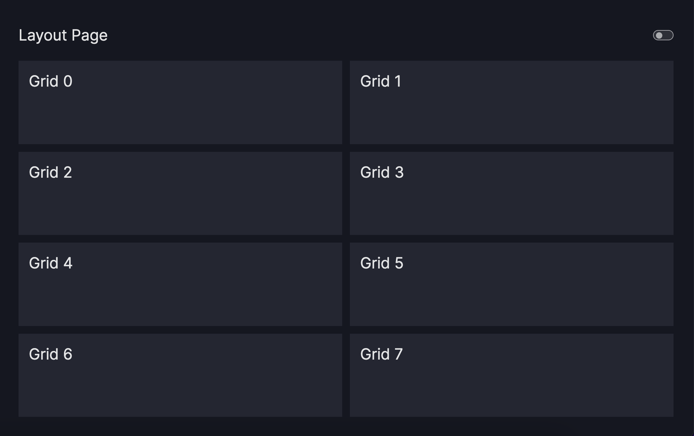
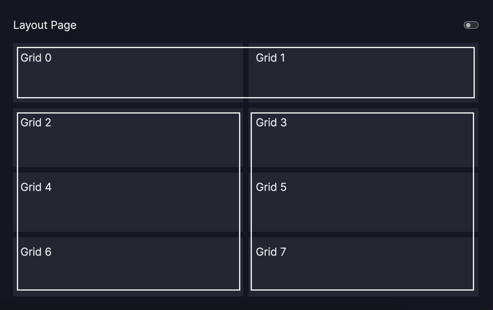
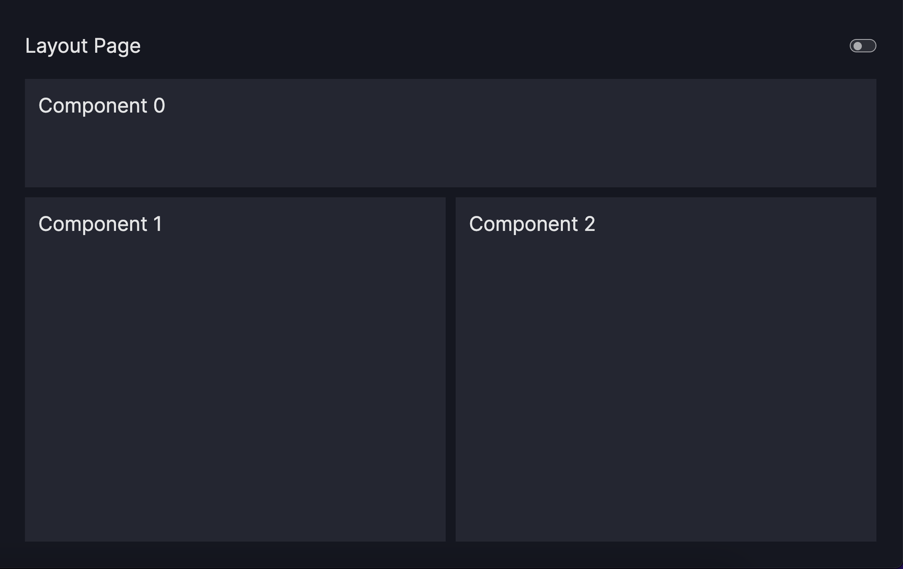

# Get started with your first dashboard

This tutorial guides you step-by-step through the process of creating a dashboard.

By the end of this tutorial, you will have gained a deep understanding of Vizro dashboards: their structure, adding
functionality, and configuring layouts to suit your specific needs.

This step-by-step guide is designed to equip you
with the knowledge and skills required to create your own dashboards using Vizro.

In case you are completely new, you may want to review our [Get started](../tutorials/first_dashboard.md) tutorial first.

## Let's get started!

### 1. Install Vizro and get ready to run your code

In order to get started with this tutorial, you should have Vizro installed, and be ready to evaluate your code, either by
pasting it into a Jupyter notebook cell, or by running it from a python script.


### 2. Create first dashboard page

At the core of every dashboard is a [`Page`][vizro.models.Page] object,
which serves as its foundation. Think of it as a blank canvas where you can arrange and customize elements like charts and text.

In this first section, you will explore how to create a page with different elements and delve into the layout
configuration.

#### 2.1. Add first component
First, let's define the structure of your dashboard page. Create a new [`Page`][vizro.models.Page] called
`first_page` and assign a title. Each [`Page`][vizro.models.Page] allows you to define a list of
`components`. These `components` are responsible for the content displayed on the page and can include a wide range of
elements such as charts, text boxes, buttons, and more.

Let's begin by adding a box plot showing the life expectancy per continent to the page. This can be done by including a
[`Graph`][vizro.models.Graph] in the `components` list and assigning it a unique id.
[`Graphs`][vizro.models.Graph] are utilized to incorporate charts to your page by specifying `figure` using the
plotly express standard.

!!! example "First component"
    === "app.py"
        ```py
        from vizro import Vizro
        import vizro.models as vm
        import vizro.plotly.express as px

        df = px.data.gapminder()
        gapminder_data = (
                df.groupby(by=["continent", "year"]).
                    agg({"lifeExp": "mean", "pop": "sum", "gdpPercap": "mean"}).reset_index()
            )

        first_page = vm.Page(
            title="First Page",
            components=[
                vm.Graph(
                    id="box_cont",
                    figure=px.box(gapminder_data, x="continent", y="lifeExp", color="continent",
                                    labels={"lifeExp": "Life Expectancy", "continent":"Continent"}),
                ),
            ],
        )

        dashboard = vm.Dashboard(pages=[first_page])
        Vizro().build(dashboard).run()
        ```
    === "Result"
        [![FirstPage1]][FirstPage1]

    [FirstPage1]: ../../assets/tutorials/dashboard/dashboard21.png

Let's give it a try and see your dashboard in action! Either paste the above code into a Jupyter notebook cell and evaluate it, or create a new Python script called `app.py` and copy the code from
above into the script. Next, navigate to the directory where the `app.py` file is located using your terminal or command
prompt. Run the script by executing the command:

```python
python app.py
```

Once the script is running, open your web browser and go to `localhost:8050`. You should now see your dashboard page
with the gapminder data displayed.

If everything worked correctly, you should be able to see your first dashboard page as shown in the `Result` tab above. Congratulations on creating your very first dashboard
page!

You may notice a couple of additions in the `app.py` script:

1. The import statement
`import vizro.plotly.express as px` allows the use of plotly express and facilitates seamless integration into Vizro
by defining figures with px.

2. The `first_page` is added to the [`Dashboard`][vizro.models.Dashboard] before
building and running it with `Vizro().build(dashboard).run()`. It's important to note that every
[`Page`][vizro.models.Page] that you want to display needs to be added to the
[`Dashboard`][vizro.models.Dashboard] object.

#### 2.2. Add further components

To further enhance your first dashboard page, let's add a [`Card`][vizro.models.Card] and another chart using
[`Graph`][vizro.models.Graph] to the `components` list. The [`Card`][vizro.models.Card] allows you to
insert text into your dashboard and can be configured using markdown syntax. For the second chart, we will incorporate a
bar chart that visualizes the GDP development per continent since 1952.

Remember, you can combine and arrange various types of `components` on a dashboard page. For more in-depth information
on using and configuring different `components`, refer to the user guide for
[components](../user_guides/components.md). It serves as a detailed resource to learn about the
wide range of `components` available and how to make the most of them in your dashboards.

??? info "Further information for `components`"
    Currently available types of `components`:

    - [`Card`][vizro.models.Card]
    - [`Graph`][vizro.models.Graph]
    - [`Button`][vizro.models.Button]

!!! example "Add components"
    === "Code first component"
        ```py

        vm.Card(
            text="""
                # First dashboard page
                This pages shows the inclusion of markdown text in a page and how components
                can be structured using Layout.
            """,
        )

        ```
    === "Code second component"
        ```py

        vm.Graph(
            id="line_gdp",
            figure=px.line(gapminder_data, x="year", y="gdpPercap", color="continent",
                            labels={"year": "Year", "continent": "Continent",
                            "gdpPercap":"GDP Per Cap"}),
        )
        ```

    === "app.py"
        ```py
        from vizro import Vizro
        import vizro.models as vm
        import vizro.plotly.express as px

        df = px.data.gapminder()
        gapminder_data = (
                df.groupby(by=["continent", "year"]).
                    agg({"lifeExp": "mean", "pop": "sum", "gdpPercap": "mean"}).reset_index()
            )

        first_page = vm.Page(
            title="First Page",
            components=[
                vm.Card(
                    text="""
                        # First dashboard page
                        This pages shows the inclusion of markdown text in a page and how components
                        can be structured using Layout.
                    """,
                ),
                vm.Graph(
                    id="box_cont",
                    figure=px.box(gapminder_data, x="continent", y="lifeExp", color="continent",
                                    labels={"lifeExp": "Life Expectancy", "continent":"Continent"}),
                ),
                vm.Graph(
                    id="line_gdp",
                    figure=px.line(gapminder_data, x="year", y="gdpPercap", color="continent",
                                    labels={"year": "Year", "continent": "Continent",
                                    "gdpPercap":"GDP Per Cap"}),
                ),

            ],
        )

        dashboard = vm.Dashboard(pages=[first_page])
        Vizro().build(dashboard).run()
        ```
    === "Result"
        [![FirstPage2]][FirstPage2]

    [FirstPage2]: ../../assets/tutorials/dashboard/dashboard22.png

Let's run the code and take a look at our dashboard.

!!! note "If using a Jupyter notebook..."
    If you are following this tutorial using a Jupyter notebook, we recommend restarting the kernel before re-evaluating your notebook. This avoids error messages about components already existing in the `model_manager`.


As you explore the added `components`, you may notice that the
current layout could be further enhanced. The charts may appear cramped, while the text component has ample unused
space. In the next section, we will learn how to configure the layout and effectively arrange the `components`.

#### 2.3. Configure layout
To configure the appearance for your [`Page`][vizro.models.Page], the [`Layout`][vizro.models.Layout] object is
utilized. It allows you to specify the placement and size of `components` on the grid. By default, each element is
placed in the order they are added to the `components` list with equal space, as observed in the previous section.

To improve the current layout, we aim to optimize the space by positioning the text at the top and the two charts side
by side while giving the charts more space relative to the text component. This can be achieved using the following
configuration: `grid=[[0, 0], [1, 2], [1, 2], [1, 2]]`.

Let's go through one-by-one. Firstly, the configuration divides the available space into two columns and
four rows. Each element in the list represents one row of the grid layout. An example of the generated grid is shown in
below.



Secondly, the `components` are placed on the grid as visualized with the white frames. The text
card, referenced by 0 as the first element in the `components` list, is placed in the first row and spans across both
columns (`[0, 0]`). The two charts, referenced by 1 and 2, are positioned next to each other and span across two columns
(`[1, 2]`).



It's important to note that the charts span over three rows, denoted by `[1, 2], [1, 2], [1, 2]`, while the
text card only occupies one row `[0, 0]`. As a result, the charts occupy three-quarters of the vertical space, while the
text card occupies one-quarter of it.



Let's see how it is looks on the dashboard when applied to the three components. If you like to learn more about how to
configure layouts, check out the [user guide](../user_guides/layouts.md)

!!! example "Configure layout"
    === "Code"
        ```py
        layout=vm.Layout(grid=[[0, 0], [1, 2], [1, 2], [1, 2]])
        ```

    === "app.py"
        ```py
        from vizro import Vizro
        import vizro.models as vm
        import vizro.plotly.express as px

        df = px.data.gapminder()
        gapminder_data = (
                df.groupby(by=["continent", "year"]).
                    agg({"lifeExp": "mean", "pop": "sum", "gdpPercap": "mean"}).reset_index()
            )

        first_page = vm.Page(
            title="First Page",
            layout=vm.Layout(grid=[[0, 0], [1, 2], [1, 2], [1, 2]]),
            components=[
                vm.Card(
                    text="""
                        # First dashboard page
                        This pages shows the inclusion of markdown text in a page and how components
                        can be structured using Layout.
                    """,
                ),
                vm.Graph(
                    id="box_cont",
                    figure=px.box(gapminder_data, x="continent", y="lifeExp", color="continent",
                                    labels={"lifeExp": "Life Expectancy", "continent":"Continent"}),
                ),
                vm.Graph(
                    id="line_gdp",
                    figure=px.line(gapminder_data, x="year", y="gdpPercap", color="continent",
                                    labels={"year": "Year", "continent": "Continent",
                                    "gdpPercap":"GDP Per Cap"}),
                    ),
            ],
        )

        dashboard = vm.Dashboard(pages=[first_page])
        Vizro().build(dashboard).run()
        ```
    === "Result"
        [![FirstPage3]][FirstPage3]

    [FirstPage3]: ../../assets/tutorials/dashboard/dashboard23.png


#### 2.4. Configure filter

The next thing you will learn is how to add functionality to your first dashboard page. This is achieved by adding
`controls` to the [`Page`][vizro.models.Page]. `Controls` enable interaction with the `components` and empower users
with functionality. In general, `controls` can be of two types. The first one are [`Filters`][vizro.models.Filter],
which allows users to filter a column of the underlying data. The second type is
[`Parameters`][vizro.models.Parameter], which enables users to modify arguments or properties of the `components`
themselves, such as adjusting colors.

By incorporating `controls` into your dashboard, you enhance its interactivity and make it more dynamic, enabling users
to have greater control and customization over the displayed data and components.

??? info "Further information for `controls`"
    The user guides for [Filters](../user_guides/filters.md) and [Parameters](../user_guides/parameters.md) provide a comprehensive overview on how to apply
    [`Filters`][vizro.models.Filter] and [`Parameters`][vizro.models.Parameter]. For further customization, refer to the [user guide on selectors](../user_guides/selectors.md).

In order to link the `controls` to your two charts, it's important to understand the unique
id assigned to each `component`. This id is unique across all dashboard pages and serves as a reference for
targeting specific `components`.

For your first dashboard page, a [`Filter`][vizro.models.Filter] is added to enable filtering on specific
continents of the underlying data. The [`Filter`][vizro.models.Filter] requires the `column` argument, that denotes
the target column to be filtered. Each `control` also has a `targets` parameter, which allows you to specify the
datasets and components that will be affected by the `control`. In the case of your first dashboard page, both charts
are listed in the `targets` parameter, meaning that the filter will be applied to both charts. However, you also have
the flexibility to apply the [`Filter`][vizro.models.Filter] to only one specific chart if desired.

!!! example "Configure filter"
    === "Code"
        ```py
        controls=[
                vm.Filter(column="continent", targets=["box_cont", "line_gdp"]),
            ]
        ```
    === "app.py"
        ```py
        from vizro import Vizro
        import vizro.models as vm
        import vizro.plotly.express as px

        df = px.data.gapminder()
        gapminder_data = (
                df.groupby(by=["continent", "year"]).
                    agg({"lifeExp": "mean", "pop": "sum", "gdpPercap": "mean"}).reset_index()
            )

        first_page = vm.Page(
            title="First Page",
            layout=vm.Layout(grid=[[0, 0], [1, 2], [1, 2], [1, 2]]),
            components=[
                vm.Card(
                    text="""
                        # First dashboard page
                        This pages shows the inclusion of markdown text in a page and how components
                        can be structured using Layout.
                    """,
                ),
                vm.Graph(
                    id="box_cont",
                    figure=px.box(gapminder_data, x="continent", y="lifeExp", color="continent",
                                    labels={"lifeExp": "Life Expectancy", "continent":"Continent"}),
                ),
                vm.Graph(
                    id="line_gdp",
                    figure=px.line(gapminder_data, x="year", y="gdpPercap", color="continent",
                                    labels={"year": "Year", "continent": "Continent",
                                    "gdpPercap":"GDP Per Cap"}),
                    ),
            ],
            controls=[
                vm.Filter(column="continent", targets=["box_cont", "line_gdp"]),
            ],
        )

        dashboard = vm.Dashboard(pages=[first_page])
        Vizro().build(dashboard).run()
        ```
    === "Result"
        [![FirstPage4]][FirstPage4]

        [FirstPage4]: ../../assets/tutorials/dashboard/dashboard24.png

Fantastic job! By completing your first dashboard page, you have gained valuable skills in creating a
[`Page`][vizro.models.Page] with multiple `components`, arranging them using layout  configuration, and adding
functionality to your dashboard.

### 3. Create second dashboard page

Moving forward, you will add your second dashboard page to delve deeper into `controls` and explore different types
of `selectors`. The structure is similar to the page you just created, and you configure two charts to visualize
the iris data set.

#### 3.1. Configure parameter

Next, you add two [`Parameters`][vizro.models.Parameter] to the `controls`. The first parameter will allow for
changing the color of the virginica data, targeting both charts. The second parameter will adjust the opacity of the
first chart. Unlike [`Filters`][vizro.models.Filter] where you are required to set the `column`,
[`Parameters`][vizro.models.Parameter] require you to define the `targets`.

For instance, the opacity of the scatter chart can be changed by defining `scatter_iris.opacity` in the `targets`. In
general, `targets` for [`Parameters`][vizro.models.Parameter] are set following the structure of
`component_id.argument`. In certain cases, you may encounter a nested structure for the `targets`. An example of this is
`scatter_iris.color_discrete_map.virginica`.  This nested structure allows you to target a specific attribute within a
component. In this particular example, it specifies that only the color of the virginica flower type should be changed.
More information on how to set `targets` for [`Parameters`][vizro.models.Parameter] can be found in the [user guide
for parameters](../user_guides/parameters.md).

!!! example "Second page"
    === "Code"
        ```py
        iris_data = px.data.iris()
        second_page = vm.Page(
            title="Second Page",
            components=[
                vm.Graph(
                    id="scatter_iris",
                    figure=px.scatter(iris_data, x="sepal_width", y="sepal_length", color="species",
                        color_discrete_map={"setosa": "#00b4ff", "versicolor": "#ff9222"},
                        labels={"sepal_width": "Sepal Width", "sepal_length": "Sepal Length",
                                "species": "Species"},
                    ),
                ),
                vm.Graph(
                    id="hist_iris",
                    figure=px.histogram(iris_data, x="sepal_width", color="species",
                        color_discrete_map={"setosa": "#00b4ff", "versicolor": "#ff9222"},
                        labels={"sepal_width": "Sepal Width", "count": "Count",
                                "species": "Species"},
                    ),
                ),
            ],
            controls=[
                vm.Parameter(
                    targets=["scatter_iris.color_discrete_map.virginica",
                                "hist_iris.color_discrete_map.virginica"],
                    selector=vm.Dropdown(
                        options=["#ff5267", "#3949ab"], multi=False, value="#3949ab", title="Color Virginica"),
                    ),
                vm.Parameter(
                    targets=["scatter_iris.opacity", "hist_iris.opacity"],
                    selector=vm.Slider(min=0, max=1, value=0.8, title="Opacity"),
                ),
            ],
        )
        ```
    === "app.py"
        ```py
        from vizro import Vizro
        import vizro.models as vm
        import vizro.plotly.express as px

        df = px.data.gapminder()
        gapminder_data = (
                df.groupby(by=["continent", "year"]).
                    agg({"lifeExp": "mean", "pop": "sum", "gdpPercap": "mean"}).reset_index()
            )
        first_page = vm.Page(
            title="First Page",
            layout=vm.Layout(grid=[[0, 0], [1, 2], [1, 2], [1, 2]]),
            components=[
                vm.Card(
                    text="""
                        # First dashboard page
                        This pages shows the inclusion of markdown text in a page and how components
                        can be structured using Layout.
                    """,
                ),
                vm.Graph(
                    id="box_cont",
                    figure=px.box(gapminder_data, x="continent", y="lifeExp", color="continent",
                                    labels={"lifeExp": "Life Expectancy", "continent":"Continent"}),
                ),
                vm.Graph(
                    id="line_gdp",
                    figure=px.line(gapminder_data, x="year", y="gdpPercap", color="continent",
                                    labels={"year": "Year", "continent": "Continent",
                                    "gdpPercap":"GDP Per Cap"}),
                    ),
            ],
            controls=[
                vm.Filter(column="continent", targets=["box_cont", "line_gdp"]),
            ],
        )

        iris_data = px.data.iris()
        second_page = vm.Page(
            title="Second Page",
            components=[
                vm.Graph(
                    id="scatter_iris",
                    figure=px.scatter(iris_data, x="sepal_width", y="sepal_length", color="species",
                        color_discrete_map={"setosa": "#00b4ff", "versicolor": "#ff9222"},
                        labels={"sepal_width": "Sepal Width", "sepal_length": "Sepal Length",
                                "species": "Species"},
                    ),
                ),
                vm.Graph(
                    id="hist_iris",
                    figure=px.histogram(iris_data, x="sepal_width", color="species",
                        color_discrete_map={"setosa": "#00b4ff", "versicolor": "#ff9222"},
                        labels={"sepal_width": "Sepal Width", "count": "Count",
                                "species": "Species"},
                    ),
                ),
            ],
            controls=[
                vm.Parameter(
                    targets=["scatter_iris.color_discrete_map.virginica",
                                "hist_iris.color_discrete_map.virginica"],
                    selector=vm.Dropdown(
                        options=["#ff5267", "#3949ab"], multi=False, value="#3949ab", title="Color Virginica"),
                    ),
                vm.Parameter(
                    targets=["scatter_iris.opacity", "hist_iris.opacity"],
                    selector=vm.Slider(min=0, max=1, value=0.8, title="Opacity"),
                ),
            ],
        )

        dashboard = vm.Dashboard(pages=[first_page,second_page])
        Vizro().build(dashboard).run()
        ```
    === "Result"
        [![SecondPage]][SecondPage]

    [SecondPage]: ../../assets/tutorials/dashboard/dashboard3.png

#### 3.2. Customize with selectors

When examining the code, you will notice the usage of two different types of `selectors`, namely
[`Dropdown`][vizro.models.Dropdown] and [`Slider`][vizro.models.Slider], within the
[`Parameters`][vizro.models.Parameter]. These `selectors` provide additional configuration options for the `controls`
and allow you to customize their behavior and appearance.

The first parameter of your page is a [`Dropdown`][vizro.models.Dropdown]. It is configured with two available
options, disables multi-selection and has a default `value` set to blue. This means users can choose a single option
from the dropdown. The second parameter is a [`Slider`][vizro.models.Slider] with a default value of 0.8. It allows
users to adjust a value within the specified range of `min=0` and `max=1`. As you can see, `selectors` offer
flexibility in configuring the controls and are applicable to both [`Filters`][vizro.models.Filter] and
[`Parameters`][vizro.models.Parameter]. They allow you to fine-tune the behavior and appearance of the controls to
suit your specific needs.

??? info "Further information for `selectors`"
    Currently available `selectors` for [`Filter`][vizro.models.Filter] and
    [`Parameter`][vizro.models.Parameter]:

    - [`Checklist`][vizro.models.Checklist]
    - [`Dropdown`][vizro.models.Dropdown]
    - [`RadioItems`][vizro.models.RadioItems]
    - [`RangeSlider`][vizro.models.RangeSlider]
    - [`Slider`][vizro.models.Slider]

### 4. Create final dashboard

Finally, it's time to put everything together and create a cohesive dashboard. In this section, we will focus on
creating a homepage for your dashboard and provide seamless navigation to the previously built pages.

To enable easy navigation within your dashboard, we will create the homepage that serves as the entry point for the user.
For that, we will utilize two [`Cards`][vizro.models.Card] and include them in the `components` list. Each
[`Card`][vizro.models.Card] serves as a customizable tile that can be configured with a title, text, and an
image. These cards will act as links to the subpages within your dashboard.

To bring everything together, you will now reference the two subpages within the [`Cards`][vizro.models.Card]
on the homepage by specifying their respective `href` attributes as `href="/first-page"` and `href="/second-page"`. This
establishes the navigation links from the homepage to each of the subpages.

Furthermore, the created pages need to be added to the dashboard using the following line of code:
`vm.Dashboard(pages=[home_page, first_page, second_page])`. This ensures that all the pages are accessible in the dashboard.

Once everything is put together, you will have a functional dashboard where you can navigate from the homepage to each
of the subpages. Additionally, you can use the navigation panel on the left side to switch between the three pages,
providing a seamless and interactive user experience.

!!! example "Final dashboard"
    === "Code"
        ```py
        home_page = vm.Page(
            title="Homepage",
            components=[
                vm.Card(
                    text="""
                    

                    ### First Page

                    Exemplary first dashboard page.
                    """,
                    href="/first-page",
                ),
                vm.Card(
                    text="""
                    

                    ### Second Page

                    Exemplary second dashboard page.
                    """,
                    href="/second-page",
                ),
            ],
        )
        ```
        ```py
        dashboard = vm.Dashboard(pages=[home_page, first_page, second_page])
        ```
    === "app.py"
        ```py
        from vizro import Vizro
        import vizro.models as vm
        import vizro.plotly.express as px

        home_page = vm.Page(
            title="Homepage",
            components=[
                vm.Card(
                    text="""
                    

                    ### First Page

                    Exemplary first dashboard page.
                    """,
                    href="/first-page",
                ),
                vm.Card(
                    text="""
                    

                    ### Second Page

                    Exemplary second dashboard page.
                    """,
                    href="/second-page",
                ),
            ],
        )

        df = px.data.gapminder()
        gapminder_data = (
                df.groupby(by=["continent", "year"]).
                    agg({"lifeExp": "mean", "pop": "sum", "gdpPercap": "mean"}).reset_index()
            )
        first_page = vm.Page(
            title="First Page",
            layout=vm.Layout(grid=[[0, 0], [1, 2], [1, 2], [1, 2]]),
            components=[
                vm.Card(
                    text="""
                        # First dashboard page
                        This pages shows the inclusion of markdown text in a page and how components
                        can be structured using Layout.
                    """,
                ),
                vm.Graph(
                    id="box_cont",
                    figure=px.box(gapminder_data, x="continent", y="lifeExp", color="continent",
                                    labels={"lifeExp": "Life Expectancy", "continent":"Continent"}),
                ),
                vm.Graph(
                    id="line_gdp",
                    figure=px.line(gapminder_data, x="year", y="gdpPercap", color="continent",
                                    labels={"year": "Year", "continent": "Continent",
                                    "gdpPercap":"GDP Per Cap"}),
                    ),
            ],
            controls=[
                vm.Filter(column="continent", targets=["box_cont", "line_gdp"]),
            ],
        )

        iris_data = px.data.iris()
        second_page = vm.Page(
            title="Second Page",
            components=[
                vm.Graph(
                    id="scatter_iris",
                    figure=px.scatter(iris_data, x="sepal_width", y="sepal_length", color="species",
                        color_discrete_map={"setosa": "#00b4ff", "versicolor": "#ff9222"},
                        labels={"sepal_width": "Sepal Width", "sepal_length": "Sepal Length",
                                "species": "Species"},
                    ),
                ),
                vm.Graph(
                    id="hist_iris",
                    figure=px.histogram(iris_data, x="sepal_width", color="species",
                        color_discrete_map={"setosa": "#00b4ff", "versicolor": "#ff9222"},
                        labels={"sepal_width": "Sepal Width", "count": "Count",
                                "species": "Species"},
                    ),
                ),
            ],
            controls=[
                vm.Parameter(
                    targets=["scatter_iris.color_discrete_map.virginica",
                                "hist_iris.color_discrete_map.virginica"],
                    selector=vm.Dropdown(
                        options=["#ff5267", "#3949ab"], multi=False, value="#3949ab", title="Color Virginica"),
                    ),
                vm.Parameter(
                    targets=["scatter_iris.opacity", "hist_iris.opacity"],
                    selector=vm.Slider(min=0, max=1, value=0.8, title="Opacity"),
                ),
            ],
        )

        dashboard = vm.Dashboard(pages=[home_page, first_page, second_page])
        Vizro().build(dashboard).run()
        ```
    === "Homepage"
        [![FinalPage]][FinalPage]

    [FinalPage]: ../../assets/tutorials/dashboard/dashboard4.png

    === "Subpage1"
        [![FinalPage1]][FinalPage1]

        [FinalPage1]: ../../assets/tutorials/dashboard/dashboard2.png

    === "Subpage2"
        [![FinalPage2]][FinalPage2]

        [FinalPage2]: ../../assets/tutorials/dashboard/dashboard3.png

Congratulations on completing this tutorial! You have acquired skills in configuring layouts, adding components, and
implementing functionality in Vizro dashboards. By building your own dashboard with multiple pages, you have gained
hands-on experience in creating dynamic and interactive data visualizations.

## Further reference

After completing the tutorial you now have a solid understanding of the main elements required to build dashboard pages
and how to bring them together.

For future dashboard creations, you can explore more about the available dashboard `components` by going through the
[user guide](../user_guides/components.md). To gain more in-depth knowledge about the usage and configuration
details of `controls`, check out the user guides dedicated to [Filters](../user_guides/filters.md), [Parameters](../user_guides/parameters.md)
and [Selectors](../user_guides/selectors.md). This guide will provide you with valuable insights on utilizing and
customizing controls for interactive functionality in your dashboards.

Vizro doesn't end here, and we only covered the key features, but there is still much more to explore! You can learn:

- How to create you own components under [custom components](../user_guides/custom_components.md)
- How to add custom styling using [custom css](../user_guides/assets.md)
- How to use [Actions](../user_guides/actions.md) for e.g. chart interaction or custom controls
- How to create dashboards from `yaml`, `dict` or `json` following the [user guide](../user_guides/dashboard.md)
