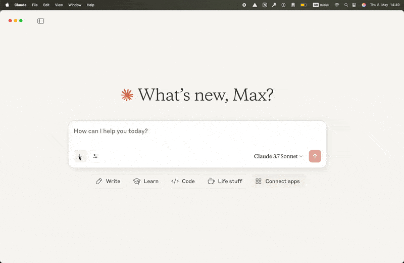

# A first dashboard

There is no setup needed for your first dashboard, thanks to the amazing [PyCafe](https://py.cafe/).

Click on the **Run and edit this code in Py.Cafe** link below to live-edit the dashboard.

!!! example "First dashboard"

    === "app.py"

        ```{.python pycafe-link}
        import vizro.plotly.express as px
        from vizro import Vizro
        import vizro.models as vm

        df = px.data.iris()

        page = vm.Page(
            title="My first dashboard",
            components=[
                vm.Graph(figure=px.scatter(df, x="sepal_length", y="petal_width", color="species")),
                vm.Graph(figure=px.histogram(df, x="sepal_width", color="species")),
            ],
            controls=[
                vm.Filter(column="species", selector=vm.Dropdown(value=["ALL"])),
            ],
        )

        dashboard = vm.Dashboard(pages=[page])
        Vizro().build(dashboard).run()
        ```

    === "Result"

        [![FirstDash]][firstdash]

<!-- vale off -->

## Can I break this code?

<!-- vale on -->

When you click the link to "**Run and edit this code in Py.Cafe**" the dashboard starts running inside your browser. Any changes you make are local and you don't need to worry about breaking the code for others. Nobody else sees the changes you make unless you publish your copy of the project as your own Vizro PyCafe project.

<!-- vale off -->

## How can I make my own dashboards?

<!-- vale on -->

You can use PyCafe to experiment with your own Vizro dashboards by dropping code onto a new project. Check out the [PyCafe documentation](https://py.cafe/docs/apps/vizro) for more information.

We make all our examples available. Throughout our documentation, follow the "**Run and edit this code in Py.Cafe**" link below a code snippet to open and interact with it.

You can also generative AI (gen AI) to help you create dashboards:

- [Vizro-MCP](https://github.com/mckinsey/vizro/blob/main/vizro-mcp/README.md) helps you build charts and dashboards that adhere to the Vizro design template. Vizro-MCP is the easiest way to use a gen AI application to help you work with Vizro.



- [Vizro-AI](https://vizro.readthedocs.io/projects/vizro-ai/) is also available as a means of building Vizro charts and dashboards with gen AI. You will need some technical knowledge, and an API key to use with an large language model (LLM).

## Where next?

You are now ready to explore Vizro further by working through the ["Explore Vizro" tutorial](explore-components.md) or by consulting the [how-to guides](../user-guides/dashboard.md).

[firstdash]: ../../assets/tutorials/dashboard/first-dashboard.png
