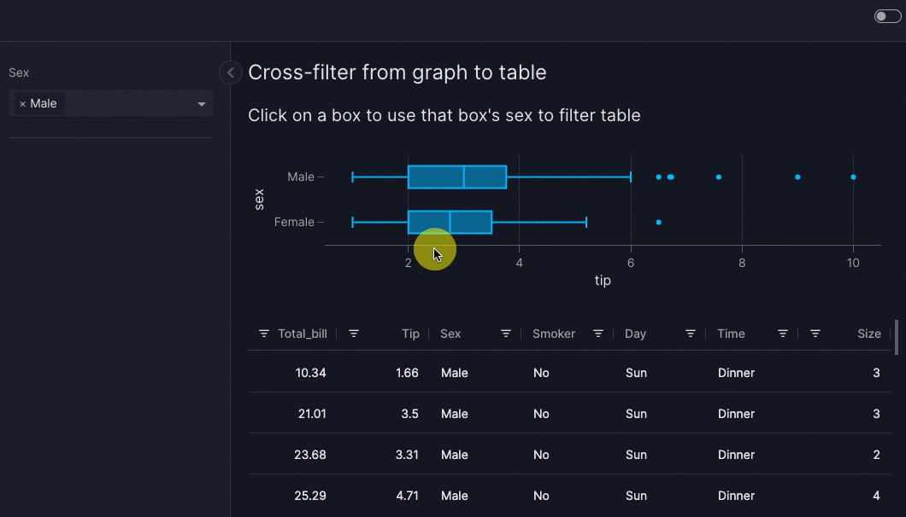

# How to use actions

Actions control how your app responds to user input such as clicking a button or a point on a graph. If an action is not built into Vizro then you can [write your own custom action](custom-actions.md). In these guides we show how to use built-in actions across a range of areas:

- [Handle data](data-actions.md), for example to export data.
- [Graph and table interactions](graph-table-actions.md), for example to cross-filter.

A complete list of built-in actions in given in the [API documentation][vizro.actions]. We also have an in-depth [tutorial on writing your own action](../tutorials/custom-actions-tutorial.md) and an [explanation of how Vizro actions work](../explanation/actions-explanation.md).

!!! note

    Do you have an idea for a built-in action? Submit a [feature request](https://github.com/mckinsey/vizro/issues/new?template=feature-request.yml)!

## General principles

Many [Vizro models][vizro.models] have an `actions` argument that can contain one or more actions. Each action is a Python function that is _triggered_ by a user interaction.

To use an action:

1. add `import vizro.actions as va` to your imports
1. call the relevant action in the `actions` argument of the model that triggers the action

You can also execute [multiple actions with a single trigger](#multiple-actions).

Some actions are typically triggered by certain components, for example [`export_data`](data-actions.md#export-data) is usually triggered by clicking a [button](button.md). However, many actions can be triggered by any component, for example:

- you can trigger a chart and filter interaction by clicking on a [`card`](card.md#trigger-an-action-with-a-card). There's an illustration of this in the [trigger an action with a card](card.md#trigger-an-action-with-a-card) example.

!!! note

    Unlike [custom actions](custom-actions.md), built-in actions do not use the [`Action`][vizro.models.Action] model.

## Trigger an action with a button

Here is an example action that uses the [`export_data` action](data-actions.md#export-data) when a [button](button.md) is clicked.

!!! example "Action triggered by button"

    === "app.py"

        ```{.python pycafe-link hl_lines="12"}
        import vizro.actions as va
        import vizro.models as vm
        import vizro.plotly.express as px
        from vizro import Vizro

        df = px.data.iris()

        page = vm.Page(
            title="Action triggered by a button",
            components=[
                vm.Graph(figure=px.histogram(df, x="sepal_length")),
                vm.Button(text="Export data", actions=va.export_data()),
            ],
            controls=[vm.Filter(column="species")],
        )

        dashboard = vm.Dashboard(pages=[page])
        Vizro().build(dashboard).run()
        ```

    === "app.yaml"

        ```yaml
        # Still requires a .py to add data to the data manager and parse YAML configuration
        # See yaml_version example
        pages:
          - components:
              - type: graph
                figure:
                  _target_: histogram
                  x: sepal_length
              - type: button
                text: Export data
                actions:
                  - type: export_data
          - controls:
              - type: filter
                column: species
            layout:
              type: flex
            title: Action triggered by a button
        ```

    === "Result"

        [![ExportData]][exportdata]

When you click the "Export data" button, the data for all graphs, tables and figures on the page is downloaded. In this example, this will produce a csv file for the graph's source data `px.data.iris()`.

!!! tip

    If you have many buttons that trigger actions then you might like to [give them icons](button.md/#add-an-icon). You can even have icon-only buttons with no text.

## Trigger an action with a graph

Here is an example that [performs a cross-filter](graph-table-actions.md#cross-filter-from-graph) between a graph and a table. When you click on a box in the graph, the table is cross-filtered to show data for only one sex.

!!! example "Cross-filter from graph to table"

    === "app.py"

        ```{.python pycafe-link hl_lines="15"}
        import vizro.actions as va
        import vizro.models as vm
        import vizro.plotly.express as px
        from vizro import Vizro
        from vizro.tables import dash_ag_grid

        tips = px.data.tips()

        page = vm.Page(
            title="Cross-filter from graph to table",
            components=[
                vm.Graph(
                    title="Click on a box to use that box's sex to filter table",
                    figure=px.box(tips, x="tip", y="sex"),
                    actions=va.set_control(control="sex_filter", value="y"),
                ),
                vm.AgGrid(id="tips_table", figure=dash_ag_grid(tips)),  # (1)!
            ],
            controls=[vm.Filter(id="sex_filter", column="sex", targets=["tips_table"])],  # (2)!
        )

        dashboard = vm.Dashboard(pages=[page])
        Vizro().build(dashboard).run()
        ```

        1. We give the `vm.AgGrid` an `id` so that it can be targeted explicitly by `vm.Filter(id="sex_filter")`.
        1. We give the `vm.Filter` an `id` so that it can be set explicitly by `va.set_control`.

    === "app.yaml"

        ```yaml
        # Still requires a .py to add data to the data manager and parse YAML configuration
        # See yaml_version example
        pages:
          - components:
              - actions:
                  - control: sex_filter
                    type: set_control
                    value: y
                figure:
                  _target_: box
                  data_frame: tips
                  x: tip
                  y: sex
                title: Click on a box to use that box's sex to filter table
                type: graph
              - figure:
                  _target_: dash_ag_grid
                  data_frame: tips
                id: tips_table
                type: ag_grid
            controls:
              - column: sex
                id: sex_filter
                targets:
                  - tips_table
                type: filter
            title: Cross-filter from graph to table
        ```

    === "Result"

        

## Multiple actions

When you specify multiple actions as `actions=[action_1, action_2, ...]` then Vizro _chains_ these actions in order, so that `action_2` executes only when `action_1` has completed. You can freely mix built-in actions and [custom actions](custom-actions.md) in an actions chain. For more details on how actions chains execute, see our [tutorial on custom actions](../tutorials/custom-actions-tutorial.md).

Here is an example actions chain that uses a custom `action_function` action and the built-in `export_data` action:

```python
import vizro.actions as va
import vizro.models as vm

actions = [
    va.export_data(),
    vm.Action(
        function=action_function("input_id_1", "input_id_2"),
        outputs="output_id",
    ),
]
```

[exportdata]: ../../assets/user_guides/actions/actions_export.png
