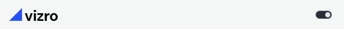

# How to add static assets

This guide shows you how to add static assets to your dashboard. Static assets are images that you would like to show in your dashboard, or custom CSS and JS files with which you would like to enhance/change the appearance of your dashboard.

To add images, custom CSS or JS files, create a folder named `assets` in the root of your app directory and insert your files. Assets included in that folder are automatically served after serving Vizro's static files via the `external_stylesheets` and `external_scripts` arguments of [Dash](https://dash.plotly.com/external-resources#adding-external-css/javascript). The user's `assets` folder thus always takes precedence.

```text title="Example folder structure"
├── app.py
├── assets
│   ├── css
│       ├── **/*.css
│   ├── images
│       ├── icons
│           ├── collections.svg
│       ├── app.svg
│       ├── logo.svg
│   ├── favicon.ico
```

!!! note "Dash Bootstrap Themes"

    Vizro is not compatible with other [Dash Bootstrap themes](https://dash-bootstrap-components.opensource.faculty.ai/docs/themes/), as it uses its own Bootstrap theme. If you like, you can [use the Vizro Bootstrap theme in a pure Dash app](themes.md#vizro-bootstrap-in-a-pure-dash-app).

## Change the favicon

To change the default favicon (website icon appearing in the browser tab), add a file named `favicon.ico` to your `assets` folder. For more information, see the [Dash documentation](https://dash.plotly.com/external-resources#changing-the-favicon).

## Add a logo image

### Single logo

If an image named `logo.<extension>` is present in the assets folder, Vizro automatically incorporates the logo in the top-left corner of the dashboard.

**Supported image extensions:** `apng`, `avif`, `gif`, `jpeg`, `jpg`, `png`, `svg`, and `webp`

### Theme-specific logos

You can also supply two images named `logo_dark.<extension>` and `logo_light.<extension>` to switch logos based on the theme (dark or light).

Note that both `logo_light.<extension>` and `logo_dark.<extension>` must be supplied together, unless a single `logo.<extension>` is supplied for both light and dark themes. That is, the valid configurations are as follows:

- Single logo: Supply only `logo.<extension>`, which is used for dark and light themes. **Do not include light and dark theme logos**.
- Theme logos: Supply both `logo_light.<extension>` and `logo_dark.<extension>` for light/dark themes. **Do not include `logo.<extension>`**.
- No logo: No logo images supplied.

 

## Change the `assets` folder path

If you do not want to place your `assets` folder in the root directory of your app, you can specify an alternative path through the `assets_folder` argument of the [`Vizro`][vizro.Vizro] class.

```python
Vizro(assets_folder="path/to/assets/folder").build(dashboard).run()
```

## Include a meta tags image

Vizro automatically adds [meta tags](https://metatags.io/) to display a preview card when your app is shared on social media and chat clients. To include an image in the preview, place an image file in the assets folder named `app.<extension>` or `logo.<extension>`. Vizro searches the assets folder and uses the first one it finds.

Image types of `apng`, `avif`, `gif`, `jpeg`, `jpg`, `png`, `svg`, and `webp` are supported.

## Order of serving CSS files

CSS properties will be applied with the last served file taking precedence. The order of serving is:

1. Dash built-in stylesheets
1. Vizro built-in stylesheets
1. User assets folder stylesheets

Within each of these categories, individual files are served in alphanumeric order.
