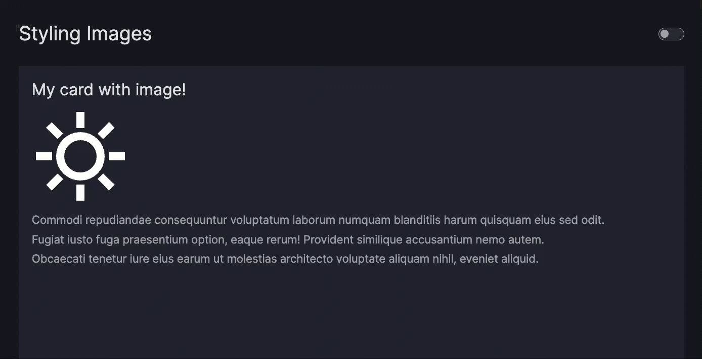

# How to use cards

This guide shows you how to use cards in your dashboard.

!!! note "Card and Text components"

    The `Card` component and [`Text`](text.md) component both enable you to add text to your page using [Markdown syntax](https://markdown-guide.readthedocs.io/en/latest/) through the underlying Dash component [`dcc.Markdown`](https://dash.plotly.com/dash-core-components/markdown/).

    You should use `Text` to display plain Markdown text without any extra styling like borders or background, for example to add an introductory paragraph to your page.

    You should use `Card` to display Markdown text that needs attention drawn to it. Generally, this would be relatively short portions of text. Unlike `Text`, a `Card` can also be [used for navigation](#create-a-navigation-card).

You can add a [`Card`][vizro.models.Card] to your dashboard by inserting the [`Card`][vizro.models.Card] into the `components` argument of the [`Page`][vizro.models.Page] or the [`Container`][vizro.models.Container] model.

!!! example "Card"

    === "app.py"

        ```{.python pycafe-link}
        import vizro.models as vm
        from vizro import Vizro

        page = vm.Page(
            title="Card",
            layout=vm.Flex(),  # (1)!
            components=[
                vm.Card(
                    text="""
                        ### Card Title
                        Commodi repudiandae consequuntur voluptatum.
                    """,
                ),
            ],
        )

        dashboard = vm.Dashboard(pages=[page])
        Vizro().build(dashboard).run()
        ```

        1. We use a [`Flex`][vizro.models.Flex] layout to ensure the `Card` only occupies the vertical space it needs. Without this, it would default to filling the entire available space.

    === "app.yaml"

        ```yaml
        # Still requires a .py to add data to the data manager and parse YAML configuration
        # See yaml_version example
        pages:
          - components:
              - text: |
                  Commodi repudiandae consequuntur voluptatum.
                title: Card Title
                type: card
            layout:
              type: flex
            title: Card
        ```

    === "Result"

        [![Card]][card]

## Customize card text

The [`Card`][vizro.models.Card] uses the `dcc.Markdown` component from Dash as its underlying text component. For more details on customizing the [Markdown text](https://markdown-guide.readthedocs.io/), refer to the [`dcc.Markdown` component documentation](https://dash.plotly.com/dash-core-components/markdown). Based on examples from Dash, the [`Card`][vizro.models.Card] model supports the following:

- Headers
- Emphasis
- Lists
- Block Quotes
- Images
- Links

!!! example "Card using markdown"

    === "app.py"

        ```{.python pycafe-link}
        import vizro.models as vm
        from vizro import Vizro

        page = vm.Page(
            title="Customizing Text",  # (1)!
            components=[
                vm.Card(
                    text="""
                        # Header level 1 <h1>

                        ## Header level 2 <h2>

                        ### Header level 3 <h3>

                        #### Header level 4 <h4>
                    """,
                ),
                vm.Card(
                    text="""
                         ### Paragraphs
                         Commodi repudiandae consequuntur voluptatum laborum numquam blanditiis harum quisquam eius sed odit.

                         Fugiat iusto fuga praesentium option, eaque rerum! Provident similique accusantium nemo autem.

                         Obcaecati tenetur iure eius earum ut molestias architecto voluptate aliquam nihil, eveniet aliquid.

                         Culpa officia aut! Impedit sit sunt quaerat, odit, tenetur error, harum nesciunt ipsum debitis quas.
                    """,
                ),
                vm.Card(
                    text="""
                        ### Block Quotes

                        >
                        > A block quote is a long quotation, indented to create a separate block of text.
                        >
                    """,
                ),
                vm.Card(
                    text="""
                        ### Lists

                        * Item A
                            * Sub Item 1
                            * Sub Item 2
                        * Item B
                    """,
                ),
                vm.Card(
                    text="""
                        ### Emphasis

                        This word will be *italic*

                        This word will be **bold**

                        This word will be _**bold and italic**_
                    """,
                ),
            ],
        )

        dashboard = vm.Dashboard(pages=[page])
        Vizro().build(dashboard).run()
        ```

        1. Note that we don't explicitly define a `layout` here, so it defaults to the [`Grid`][vizro.models.Grid] layout. This layout automatically arranges all components to fit on a single page, giving each one equal space. As a result, all `Card` components are evenly sized and fill the entire screen.

    === "app.yaml"

        ```yaml
        # Still requires a .py to add data to the data manager and parse YAML configuration
        # See yaml_version example
        pages:
          - components:
              - text: |
                  # Header level 1 <h1>

                  ## Header level 2 <h2>

                  ### Header level 3 <h3>

                  #### Header level 4 <h4>
                type: card
              - text: |
                  Commodi repudiandae consequuntur voluptatum laborum numquam blanditiis harum quisquam eius sed odit.

                  Fugiat iusto fuga praesentium option, eaque rerum! Provident similique accusantium nemo autem.

                  Obcaecati tenetur iure eius earum ut molestias architecto voluptate aliquam nihil, eveniet aliquid.

                  Culpa officia aut! Impedit sit sunt quaerat, odit, tenetur error, harum nesciunt ipsum debitis quas.
                title: Paragraphs
                type: card
              - text: |
                  >
                  > A block quote is a long quotation, indented to create a separate block of text.
                  >
                title: Block Quotes
                type: card
              - text: |
                  * Item A
                    * Sub Item 1
                    * Sub Item 2
                  * Item B
                title: Lists
                type: card
              - text: |
                  This word will be *italic*

                  This word will be **bold**

                  This word will be _**bold and italic**_
                title: Emphasis
                type: card
            title: Customizing Text
        ```

    === "Result"

        [![CardText]][cardtext]

## Place an image on a card

Images can be added to the `text` parameter by using the standard markdown syntax:

``

An image ALT text offers a description to your image and serves as a text placeholder or to improve the accessibility of your app. Providing an image ALT text is optional.

1. To use a relative Image URL, place an image of your choice into your `assets` folder first
1. Use markdown to render your image by using one of the following syntax:
    - Relative Image URL: ``
    - Absolute Image URL: ``

!!! example "Card with image"

    === "app.py"

        ```py
        import vizro.models as vm
        from vizro import Vizro

        page = vm.Page(
             title="Placing Images",
             components=[
                 vm.Card(
                     text="""
                     ### My card with image!

                     

                      Commodi repudiandae consequuntur voluptatum laborum numquam blanditiis harum quisquam eius sed odit.

                      Fugiat iusto fuga praesentium option, eaque rerum! Provident similique accusantium nemo autem.

                      Obcaecati tenetur iure eius earum ut molestias architecto voluptate aliquam nihil, eveniet aliquid.
                 """,
                 ),
             ],
         )

        dashboard = vm.Dashboard(pages=[page])
        Vizro().build(dashboard).run()
        ```

        <b><a target="_blank" href="https://py.cafe/vizro-official/vizro-placing-images">Run and edit this code in PyCafe</a></b>

    === "app.yaml"

        ```yaml
        # Still requires a .py to add data to the data manager and parse YAML configuration
        # See yaml_version example
        pages:
          - components:
              - text: |
                  

                  Commodi repudiandae consequuntur voluptatum laborum numquam blanditiis harum quisquam eius sed odit.

                  Fugiat iusto fuga praesentium option, eaque rerum! Provident similique accusantium nemo autem.

                  Obcaecati tenetur iure eius earum ut molestias architecto voluptate aliquam nihil, eveniet aliquid.
                title: My card with image!
                type: card
            title: Placing Images
        ```

    === "Result"

        [![CardImageDefault]][cardimagedefault]

!!! note

    Note that inserting images using HTML is by default turned off by the `dcc.Markdown` to prevent users being exposed to cross-site scripting attacks. If you need to turn it on, a custom component would have to be created.

You might notice that the image is quite large. You'll find out how to style images in terms of their position and size in the next section.

## Change image dimensions

To change the size or position of the image, add a URL hash to your image like this:

``

Note the added URL hash `#my-image`. Now create a CSS file placed in your `assets` folder and give an attribute selector to select images with that matching URL hash.

!!! example "Card with styled image"

    === "images.css"

        ```css
        img[src*="#my-image"] {
            width: 120px;
            height: 120px;
        }
        ```

    === "app.py"

        ```py
        import vizro.models as vm
        from vizro import Vizro

        page = vm.Page(
            title="Styling Images",
            layout=vm.Flex(),  # (1)!
            components=[
               vm.Card(
                     text="""
                     ### My card with image!

                     

                      Commodi repudiandae consequuntur voluptatum laborum numquam blanditiis harum quisquam eius sed odit.

                      Fugiat iusto fuga praesentium option, eaque rerum! Provident similique accusantium nemo autem.

                      Obcaecati tenetur iure eius earum ut molestias architecto voluptate aliquam nihil, eveniet aliquid.
                 """
               ),
            ]
        )

        dashboard = vm.Dashboard(pages=[page])
        Vizro().build(dashboard).run()
        ```

        1. We use a [`Flex`][vizro.models.Flex] layout to ensure the `Card` only occupies the vertical space it needs. Without this, it would default to filling the entire available space.

        <b><a target="_blank" href="https://py.cafe/vizro-official/vizro-styling-images">Run and edit this code in PyCafe</a></b>

    === "app.yaml"

        ```yaml
        # Still requires a .py to add data to the data manager and parse YAML configuration
        # See yaml_version example
        pages:
          - components:
              - text: |
                  

                  Commodi repudiandae consequuntur voluptatum laborum numquam blanditiis harum quisquam eius sed odit.

                  Fugiat iusto fuga praesentium option, eaque rerum! Provident similique accusantium nemo autem.

                  Obcaecati tenetur iure eius earum ut molestias architecto voluptate aliquam nihil, eveniet aliquid.
                title: My card with image!
                type: card
            layout:
              type: flex
            title: Styling Images
        ```

    === "Result"

        [![CardImageStyled]][cardimagestyled]

Use the following pre-defined URL hashes in your image path to apply Vizro's default styling.

## Float an image inside the card

To float an image for example to the right of the text, use the `src` attribute as a CSS selector. Follow these steps:

1. Add a hash (#) to the image URL, e.g., ``
1. Target that hash in your custom CSS file `img[src*="#my-image"] { float: right; }`

!!! example "Card with floating image"

    === "images.css"

        ```css
        img[src*="#my-image"] {
            width: 120px;
            height: 120px;
            float: right;
        }
        ```

    === "app.py"

        ```py
        import vizro.models as vm
        from vizro import Vizro

        page = vm.Page(
             title="Floating Images",
             layout=vm.Flex(),  # (1)!
             components=[
                 vm.Card(
                     text="""
                     ### My card with floating image!

                     

                     Commodi repudiandae consequuntur voluptatum laborum numquam blanditiis harum quisquam eius sed odit.

                     Fugiat iusto fuga praesentium option, eaque rerum! Provident similique accusantium nemo autem.

                     Obcaecati tenetur iure eius earum ut molestias architecto voluptate aliquam nihil, eveniet aliquid.

                     Culpa officia aut! Impedit sit sunt quaerat, odit, tenetur error, harum nesciunt ipsum debitis quas.

                     Obcaecati tenetur iure eius earum ut molestias architecto voluptate aliquam nihil, eveniet aliquid.

                     Culpa officia aut! Impedit sit sunt quaerat, odit, tenetur error, harum nesciunt ipsum debitis quas.
                 """,
                 ),
             ],
        )

        dashboard = vm.Dashboard(pages=[page])
        Vizro().build(dashboard).run()
        ```

        1. We use a [`Flex`][vizro.models.Flex] layout to ensure the `Card` only occupies the vertical space it needs. Without this, it would default to filling the entire available space.

        <b><a target="_blank" href="https://py.cafe/vizro-official/vizro-floating-images-explorer">Run and edit this code in PyCafe</a></b>

    === "app.yaml"

        ```yaml
        # Still requires a .py to add data to the data manager and parse YAML configuration
        # See yaml_version example
        pages:
          - components:
              - text: |
                  

                  Commodi repudiandae consequuntur voluptatum laborum numquam blanditiis harum quisquam eius sed odit.

                  Fugiat iusto fuga praesentium option, eaque rerum! Provident similique accusantium nemo autem.

                  Obcaecati tenetur iure eius earum ut molestias architecto voluptate aliquam nihil, eveniet aliquid.

                  Culpa officia aut! Impedit sit sunt quaerat, odit, tenetur error, harum nesciunt ipsum debitis quas.

                  Obcaecati tenetur iure eius earum ut molestias architecto voluptate aliquam nihil, eveniet aliquid.

                  Culpa officia aut! Impedit sit sunt quaerat, odit, tenetur error, harum nesciunt ipsum debitis quas.
                title: My card with floating image!
                type: card
            layout:
              type: flex
            title: Floating Images
        ```

    === "Result"

        [![CardImageFloating]][cardimagefloating]

## Make an icon responsive to theme switch

To make an icon responsive to theme switching, override its [`filter` CSS property](https://developer.mozilla.org/en-US/docs/Web/CSS/filter).

In this example, we use the `--fill-icon-image-card` CSS variable from the `vizro-bootstrap` CSS file. It uses the `invert()` function to flip the icon's color during a theme switch.

This approach works if your icon initially has a white fill color. If not, modify the SVG code by adding `fill="white"`.

```css
img[src*="#my-image"] {
    filter: var(--fill-icon-image-card);
}
```

!!! example "Responsive icon"

    

## Create a navigation card

This section describes how to use the [`Card`][vizro.models.Card] component to create a navigation card, enabling users to navigate to another page by clicking on the card area.

For a button-style link navigation component, see the [separate guide on creating a link button](button.md#create-a-link-button). To configure the navigation panel on the left hand side of the screen, refer to the [separate guide on navigation](navigation.md).

To create a navigation card:

1. Insert the [`Card`][vizro.models.Card] into the `components` argument of the [`Page`][vizro.models.Page].
1. Pass your [Markdown text](https://markdown-guide.readthedocs.io/) to the `Card.text`.
1. Pass a relative or absolute URL to the `Card.href`.

!!! example "Navigation Card"

    === "app.py"

        ```{.python pycafe-link}
        import vizro.models as vm
        import vizro.plotly.express as px
        from vizro import Vizro

        iris = px.data.iris()

        page_1 = vm.Page(
            title="Homepage",
            components=[
                vm.Card(
                    text="""
                    ### Filters and parameters

                    Leads to the first page on click.
                    """,
                    href="/filters-and-parameters",
                ),
                vm.Card(
                    text="""
                    ### Google - External Link

                    Leads to an external link on click.
                    """,
                    href="https://google.com",
                ),
            ],
        )

        page_2 = vm.Page(
            title="Filters and parameters",
            components=[
                vm.Graph(figure=px.scatter(iris, x="sepal_length", y="petal_width", color="sepal_width")),
            ],
        )

        dashboard = vm.Dashboard(pages=[page_1, page_2])
        Vizro().build(dashboard).run()
        ```

    === "app.yaml"

        ```yaml
        # Still requires a .py to add data to the data manager and parse YAML configuration
        # See yaml_version example
        pages:
          - components:
              - text: |
                  ### Filters and parameters

                  Leads to the first page on click
                href: /filters-and-parameters
                type: card
              - text: |
                  ### Google - External Link

                  Leads to an external link on click.
                href: https://google.com
                type: card
            title: Homepage
          - components:
              - figure:
                  _target_: scatter
                  color: sepal_width
                  data_frame: iris
                  x: sepal_length
                  y: petal_width
                type: graph
            title: Filters and parameters
        ```

    === "Result"

        [![NavCard]][navcard]

If you now click on the card area, you should automatically be redirected to the relevant `href`.

!!! note

    When using the [`Card`][vizro.models.Card], keep the following in mind:

    - If the href given is a relative URL, it should match the `path` of the [`Page`][vizro.models.Page] that the [`Card`][vizro.models.Card] should navigate to.
    - If the href given is an absolute link, it should start with `https://` or an equivalent protocol.

## Create a KPI card

To create a KPI card, you can use the existing KPI card functions from [`vizro.figures`](../API-reference/figure-callables.md). Unlike the static text card `vm.Card`, a KPI card must be created using a figure function, which enables the text content of the KPI to change based on input from controls or actions.

For detailed examples on how to create a KPI card, refer to the [figure user guide on KPI cards](figure.md#key-performance-indicator-kpi-cards).

## The `extra` argument

The `Card` is based on the underlying Dash component [`dbc.Card`](https://dash-bootstrap-components.opensource.faculty.ai/docs/components/card/). Using the `extra` argument you can pass extra arguments to `dbc.Card` in order to alter it beyond the chosen defaults.

!!! note

    Using `extra` is a quick and flexible way to alter a component beyond what Vizro offers. However, [it is not a part of the official Vizro schema](../explanation/schema.md#what-is-the-vizro-json-schema) and the underlying implementation details may change. If you want to guarantee that your apps keep running, we recommend that you pin your Vizro version.

An example use would be to specify a fixed `Card` height and width. For this, you can use `extra={"style": {"height": "100px", "width": "200px"}}`. This would be a shortcut to using custom CSS in the assets folder as explained in [our guide on CSS](../user-guides/custom-css.md).

!!! example "Card with limited height"

    === "app.py"

        ```{.python pycafe-link hl_lines="9"}
        import vizro.models as vm
        from vizro import Vizro

        page = vm.Page(
             title="Card with fixed dimensions",
             components=[
                 vm.Card(
                     text="This card has fixed dimensions 200x100.",
                     extra={"style": {"height": "100px", "width": "200px"}},
                 ),
             ],
        )

        dashboard = vm.Dashboard(pages=[page])
        Vizro().build(dashboard).run()
        ```

    === "app.yaml"

        ```{.yaml hl_lines="6-9"}
        pages:
          - title: Card with fixed dimensions
            components:
              - type: card
                text: This card has fixed dimensions 200x100.
                extra:
                  style:
                    height: 100px
                    width: 200px
        ```

    === "Result"

        [![CardStyle]][cardstyle]

[card]: ../../assets/user_guides/components/card.png
[cardimagedefault]: ../../assets/user_guides/components/card_image_default.png
[cardimagefloating]: ../../assets/user_guides/components/card_image_floating.png
[cardimagestyled]: ../../assets/user_guides/components/card_image_styled.png
[cardstyle]: ../../assets/user_guides/components/cardstyle.png
[cardtext]: ../../assets/user_guides/components/card_text.png
[navcard]: ../../assets/user_guides/components/nav_card.png
