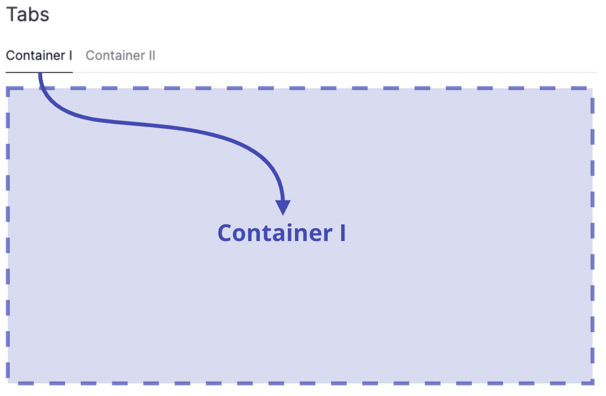

# How to use containers

This guide shows you how to use containers to group your components into sections and subsections within the page.

A [Container][vizro.models.Container] complements a [Page][vizro.models.Page], and both models share nearly identical arguments. While `Page.layout` provides a method for structuring the overall page layout, a `Container` offers more detailed control within a particular section of the page. The `Container` is based on the underlying Dash component [`dbc.Container`](https://dash-bootstrap-components.opensource.faculty.ai/docs/components/layout/).

Unlike `Page`, the `Container` model offers additional visual customization options:

- **`variant`**: Enables you to select a visual style for the container, making it stand out from the rest of the page content.
- **`collapsed`**: Enables collapsible behavior. You can define whether the container's contents are initially shown or hidden.

!!! note "Displaying multiple containers inside Tabs"

    An alternative way to display multiple containers on one page is to place them inside [Tabs](tabs.md).

    [`Tabs`][vizro.models.Tabs] organize and separate groups of related content in a dashboard, letting users switch between different sections or views. They are a way of putting multiple containers into the same screen space, and letting the user switch between them.

    { width="500" }

## When to use containers

In general, any arbitrarily granular layout can already be achieved by [using `Page.layout`](layouts.md) alone, which is our recommended approach if you want to arrange components on a page with consistent row and/or column spacing.

Both `Page.layout` and `Container.layout` now accept either a [`Grid`][vizro.models.Grid] (default) or a [`Flex`][vizro.models.Flex] layout model, giving you full flexibility when arranging components.

- `Page.layout` defines the overall layout of the page using either `Grid` or `Flex`.
- `Container.layout` allows you to insert a nested `Grid` or `Flex` layout within the page layout, offering more granular control by breaking the page into independently arranged sublayouts.

Here are a few cases where you might want to use a `Container` instead of `Page.layout`:

- Split up your sections into subsections to organize components together
- Add a title to your section
- Different row and column spacing between sections
- Apply a background color or borders to [visually distinguish your content](#styled-containers)
- Make your [content collapsible](#collapsible-containers)
- Apply controls to selected sections

## Basic containers

To add a [`Container`][vizro.models.Container] to your page, do the following:

1. Insert the `Container` into the `components` argument of the [`Page`][vizro.models.Page]
1. Configure your `components`, [read the overview page for various options](components.md)
1. (optional) Set a `title` for your `Container`
1. (optional) Configure your `layout`, see [the guide on layouts](layouts.md)
1. (optional) Configure container specific [`controls`](#add-controls-to-container)

!!! example "Container"

    === "app.py"

        ```{.python pycafe-link}

        import vizro.models as vm
        import vizro.plotly.express as px
        from vizro import Vizro

        iris = px.data.iris()

        page = vm.Page(
            title="Containers",
            components=[  # (1)!
                vm.Container(
                    title="Container I",
                    layout=vm.Grid(grid=[[0, 1]]),  # (2)!
                    components=[
                        vm.Graph(
                            figure=px.scatter(
                                iris,
                                x="sepal_length",
                                y="petal_width",
                                color="species",
                                title="Container I - Scatter"
                            )
                        ),
                        vm.Graph(
                            figure=px.bar(
                                iris,
                                x="sepal_length",
                                y="sepal_width",
                                color="species",
                                title="Container I - Bar"
                            )
                        ),
                    ],
                ),
                vm.Container(
                    title="Container II",
                    components=[
                        vm.Graph(
                            figure=px.scatter(
                                iris,
                                x="sepal_width",
                                y="sepal_length",
                                color="species",
                                marginal_y="violin",
                                marginal_x="box",
                                title="Container II - Scatter",
                            )
                        ),
                    ],
                ),
            ],
        )

        dashboard = vm.Dashboard(pages=[page])
        Vizro().build(dashboard).run()
        ```

        1. Note that the `Page.layout` argument is not specified here and will therefore defaults to `[[0], [1]]`, meaning the containers will be **vertically stacked** down the page in one column.
        1. **Horizontally stack** the components side-by-side inside this `Container` in one row.

    === "app.yaml"

        ```yaml
        # Still requires a .py to add data to the data manager and parse YAML configuration
        # See yaml_version example
        pages:
          - components:
              - components:
                  - figure:
                      _target_: scatter
                      data_frame: iris
                      x: sepal_length
                      y: petal_width
                      color: species
                      title: Container I - Scatter
                    type: graph
                  - figure:
                      _target_: bar
                      data_frame: iris
                      x: sepal_length
                      y: petal_width
                      color: species
                      title: Container I - Bar
                    type: graph
                layout:
                  grid: [[0, 1]]
                  type: grid
                type: container
                title: Container I
              - components:
                  - figure:
                      _target_: scatter
                      data_frame: iris
                      x: sepal_width
                      y: sepal_length
                      color: species
                      marginal_y: violin
                      marginal_x: box
                      title: Container II - Scatter
                    type: graph
                type: container
                title: Container II
            title: Containers
        ```

    === "Result"

        [![Container]][container]

Note that an almost identical layout can also be achieved using solely the [`Page.layout`](layouts.md) by configuring the `Page.layout` as `vm.Grid(grid = [[0, 1], [2, 2]])`.

## Nested containers

Containers can be nested, providing a hierarchical structure for organizing components. This nesting capability enables users to create more complex layouts and manage related components at any level of granularity.

To create nested containers, add a `Container` to the `components` argument of another `Container`.

```python title="Example"
vm.Container(
    title="Parent Container",
    components=[
        vm.Container(
            title="Child Container",
            components=[vm.Button()],
        )
    ],
)
```

## Styled containers

To make the `Container` stand out as a distinct section in your dashboard, you can select from the predefined styles available in its `variant` argument.

!!! example "Container with different styles"

    === "app.py"

        ```{.python pycafe-link}
        import vizro.models as vm
        import vizro.plotly.express as px
        from vizro import Vizro

        iris = px.data.iris()

        page = vm.Page(
            title="Containers with different styles",
            layout=vm.Grid(grid=[[0, 1]]),
            components=[
                vm.Container(
                    title="Container with background color",
                    components=[vm.Graph(figure=px.scatter(iris, x="sepal_width", y="sepal_length", color="species"))],
                    variant="filled",
                ),
                vm.Container(
                    title="Container with borders",
                    components=[vm.Graph(figure=px.box(iris, x="species", y="sepal_length", color="species"))],
                    variant="outlined",
                )
            ],
        )

        dashboard = vm.Dashboard(pages=[page])
        Vizro().build(dashboard).run()
        ```

    === "app.yaml"

        ```yaml
        # Still requires a .py to add data to the data manager and parse YAML configuration
        # See yaml_version example
        pages:
          - title: Containers with different styles
            layout:
              grid: [[0, 1]]
              type: grid
            components:
              - type: container
                title: Container with background color
                components:
                  - type: graph
                    figure:
                      _target_: scatter
                      data_frame: iris
                      x: sepal_width
                      y: sepal_length
                      color: species
                variant: filled
              - type: container
                title: Container with borders
                components:
                  - type: graph
                    figure:
                      _target_: box
                      data_frame: iris
                      x: species
                      y: sepal_length
                      color: species
                variant: outlined
        ```

    === "Result"

        [![StyleContainer]][stylecontainer]

If you want to style your `Container` beyond the styling options available inside `variant`, please refer to our user guide on [overwriting CSS for selected components](custom-css.md#overwrite-css-for-selected-components).

## Collapsible containers

To make a Container collapsible, use the `collapsed` argument:

- Set `collapsed=True` to have the container start in a collapsed (hidden) state.
- Set `collapsed=False` to have it expanded (visible) by default.

Once defined, dashboard users can toggle the container’s visibility interactively.

Collapsible containers are supported in both `Grid` and `Flex` layouts. However, we recommend using them within a `Flex` layout for optimal behavior, as `Flex` is better suited to dynamic sizing and more efficient use of space when content is shown or hidden.

!!! example "Collapsible container inside `Flex`"

    === "app.py"

        ```{.python pycafe-link}
        import vizro.models as vm
        import vizro.plotly.express as px
        from vizro import Vizro

        iris = px.data.iris()

        page = vm.Page(
            title="Collapsible containers",
            layout=vm.Flex(),  # (1)!
            components=[
                vm.Container(
                    title="Initially collapsed container",
                    components=[vm.Graph(figure=px.scatter(iris, x="sepal_width", y="sepal_length", color="species"))],
                    collapsed=True,
                ),
                vm.Container(
                    title="Initially expanded container",
                    components=[vm.Graph(figure=px.box(iris, x="species", y="sepal_length", color="species"))],
                    collapsed=False,
                )
            ],
        )

        dashboard = vm.Dashboard(pages=[page])
        Vizro().build(dashboard).run()
        ```

        1. We use a [`Flex`][vizro.models.Flex] layout to make sure the `Container` only occupy as much space as they need, regardless of their collapsed state.

    === "app.yaml"

        ```yaml
        # Still requires a .py to add data to the data manager and parse YAML configuration
        # See yaml_version example
        pages:
          - title: Collapsible containers
            layout:
              type: flex
            components:
              - type: container
                title: Initially collapsed container
                components:
                  - type: graph
                    figure:
                      _target_: scatter
                      data_frame: iris
                      x: sepal_width
                      y: sepal_length
                      color: species
                collapsed: true
              - type: container
                title: Initially expanded container
                components:
                  - type: graph
                    figure:
                      _target_: box
                      data_frame: iris
                      x: species
                      y: sepal_length
                      color: species
                collapsed: false
        ```

    === "Result"

        [![CollapsibleContainerFlex]][collapsiblecontainerflex]

Collapsible containers can be used in `Grid` layout as well.

!!! example "Collapsible container inside `Grid`"

    === "app.py"

        ```{.python pycafe-link}
        import vizro.models as vm
        import vizro.plotly.express as px
        from vizro import Vizro

        iris = px.data.iris()

        page = vm.Page(
            title="Collapsible containers",
            layout=vm.Grid(grid=[[0, 1]]),
            components=[
                vm.Container(
                    title="Initially collapsed container",
                    components=[vm.Graph(figure=px.scatter(iris, x="sepal_width", y="sepal_length", color="species"))],
                    collapsed=True,
                ),
                vm.Container(
                    title="Initially expanded container",
                    components=[vm.Graph(figure=px.box(iris, x="species", y="sepal_length", color="species"))],
                    collapsed=False,
                )
            ],
        )

        dashboard = vm.Dashboard(pages=[page])
        Vizro().build(dashboard).run()
        ```

    === "app.yaml"

        ```yaml
        # Still requires a .py to add data to the data manager and parse YAML configuration
        # See yaml_version example
        pages:
          - title: Collapsible containers
            layout:
              grid: [[0, 1]]
              type: grid
            components:
              - type: container
                title: Initially collapsed container
                components:
                  - type: graph
                    figure:
                      _target_: scatter
                      data_frame: iris
                      x: sepal_width
                      y: sepal_length
                      color: species
                collapsed: true
              - type: container
                title: Initially expanded container
                components:
                  - type: graph
                    figure:
                      _target_: box
                      data_frame: iris
                      x: species
                      y: sepal_length
                      color: species
                collapsed: false
        ```

    === "Result"

        [![CollapsibleContainerGrid]][collapsiblecontainergrid]

## Add a tooltip

The `description` argument enables you to add helpful context to your container by displaying an info icon next to its title. Hovering over the icon shows a tooltip with your chosen text.

You can provide [Markdown text](https://markdown-guide.readthedocs.io/) as a string to use the default info icon or a [`Tooltip`][vizro.models.Tooltip] model to use any icon from the [Google Material Icons library](https://fonts.google.com/icons).

!!! example "Container with tooltip"

    === "app.py"

        ```{.python pycafe-link hl_lines="14-18"}
        import vizro.models as vm
        import vizro.plotly.express as px
        from vizro import Vizro

        iris = px.data.iris()

        page = vm.Page(
            title="Container with tooltip",
            layout=vm.Grid(grid=[[0, 1]]),
            components=[
                vm.Container(
                    title="Container with tooltip",
                    components=[vm.Graph(figure=px.scatter(iris, x="sepal_width", y="sepal_length", color="species"))],
                    description="""
                        The Iris dataset includes measurements of 150 iris flowers across three types: Setosa, Versicolor, and Virginica.

                        While all samples are labeled by type, they can appear similar when looking at just some features—making it a useful dataset for exploring patterns and challenges in classification.
                    """,
                ),
                vm.Container(
                    title="Container title",
                    components=[vm.Graph(figure=px.box(iris, x="species", y="sepal_length", color="species"))],
                )
            ],
        )

        dashboard = vm.Dashboard(pages=[page])
        Vizro().build(dashboard).run()
        ```

    === "app.yaml"

        ```{.yaml hl_lines="20-23"}
        # Still requires a .py to add data to the data manager and parse YAML configuration
        # See yaml_version example
        pages:
          - title: Container with tooltip
            layout:
              grid: [[0, 1]]
              type: grid
            components:
              - type: container
                title: Container with tooltip
                components:
                  - type: graph
                    figure:
                      _target_: scatter
                      data_frame: iris
                      x: sepal_width
                      y: sepal_length
                      color: species
                collapsed: true
                description: |
                  The Iris dataset includes measurements of 150 iris flowers across three types: Setosa, Versicolor, and Virginica.

                  While all samples are labeled by type, they can appear similar when looking at just some features—making it a useful dataset for exploring patterns and challenges in classification.
              - type: container
                title: Container title
                components:
                  - type: graph
                    figure:
                      _target_: box
                      data_frame: iris
                      x: species
                      y: sepal_length
                      color: species
                collapsed: false
        ```

    === "Result"

        [![ContainerInfoIcon]][containerinfoicon]

## Add controls to container

The `Container` has a `controls` argument, where you can define container-specific controls to group related components for better interaction. By default, controls only affect components inside their own container.

Here are a few cases where you might want to use `controls` within a `Container`:

- displaying multiple datasets on the same page
- isolating container-specific data without affecting the rest of the page
- providing detailed views that don't influence page-level data

!!! example "Container with controls"

    === "app.py"

        ```{.python pycafe-link hl_lines="14-18"}
        import vizro.models as vm
        import vizro.plotly.express as px
        from vizro import Vizro

        iris = px.data.iris()
        gapminder = px.data.gapminder()

        page = vm.Page(
            title="Containers with controls",
            layout=vm.Grid(grid=[[0, 1]]),
            components=[
                vm.Container(
                    title="Container with gapminder data",
                    components=[vm.Graph(id="bar_chart", figure=px.bar(gapminder, x="country", y="gdpPercap"))],
                    controls=[vm.Filter(column="continent", selector=vm.RadioItems())],
                ),
                vm.Container(
                    title="Container with iris data",
                    components=[vm.Graph(figure=px.box(iris, x="species", y="sepal_length", color="species"))],
                    controls=[vm.Filter(column="species", selector=vm.Checklist())],
                )
            ],
        )

        dashboard = vm.Dashboard(pages=[page])
        Vizro().build(dashboard).run()
        ```

    === "app.yaml"

        ```{.yaml hl_lines="20-23"}
        # Still requires a .py to add data to the data manager and parse YAML configuration
        # See yaml_version example
        pages:
          - title: Containers with controls
            layout:
              grid: [[0, 1]]
              type: grid
            components:
              - type: container
                title: Container with gapminder data
                components:
                  - type: graph
                    figure:
                      _target_: bar
                      data_frame: gapminder
                      x: country
                      y: gdpPercap
                controls:
                  - column: continent
                    selector:
                      type: radioitems
                    type: filter
              - type: container
                title: Container with iris data
                components:
                  - type: graph
                    figure:
                      _target_: box
                      data_frame: iris
                      x: species
                      y: sepal_length
                      color: species
                controls:
                  - column: species
                    selector:
                      type: checklist
                    type: filter
        ```

    === "Result"

        [![ContainerWithControls]][containerwithcontrols]

## The `extra` argument

The `Container` is based on the underlying Dash component [`dbc.Container`](https://dash-bootstrap-components.opensource.faculty.ai/docs/components/layout/). Using the `extra` argument you can pass extra arguments to `dbc.Container` in order to alter it beyond the chosen defaults.

!!! note

    Using `extra` is a quick and flexible way to alter a component beyond what Vizro offers. However, [it is not a part of the official Vizro schema](../explanation/schema.md#what-is-the-vizro-json-schema) and the underlying implementation details may change. If you want to guarantee that your apps keep running, we recommend that you pin your Vizro version.

For examples of how to use the `extra` argument, see an example in the documentation of [`Card`](card.md#the-extra-argument).

[collapsiblecontainerflex]: ../../assets/user_guides/components/collapsible-containers-flex.gif
[collapsiblecontainergrid]: ../../assets/user_guides/components/collapsible-containers-grid.gif
[container]: ../../assets/user_guides/components/containers.png
[containerinfoicon]: ../../assets/user_guides/components/container-info-icon.png
[containerwithcontrols]: ../../assets/user_guides/components/container-with-controls.png
[stylecontainer]: ../../assets/user_guides/components/container-styled.png
