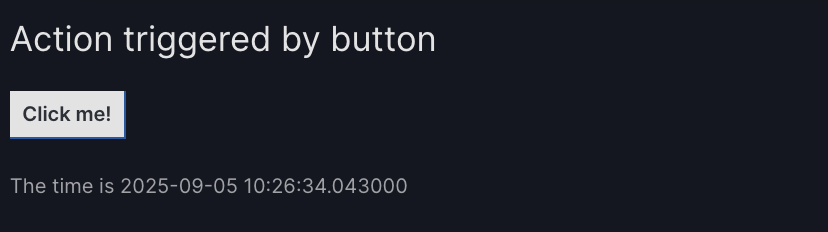
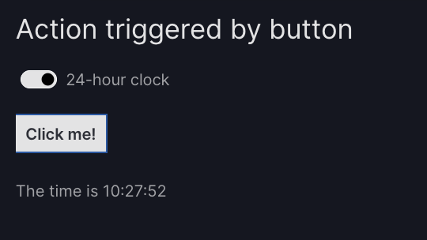
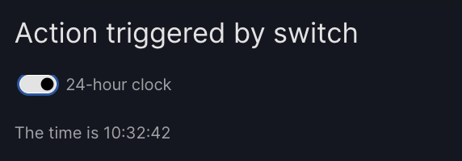
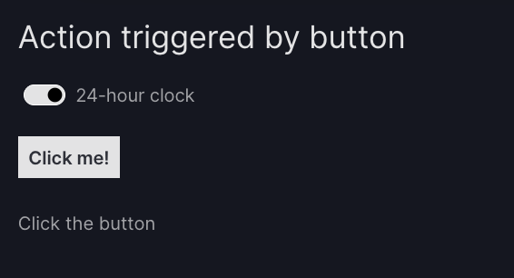

# How to create custom actions

Actions control how your app responds to user input such as clicking a button or a point on a graph. If an action is not available in Vizro's [built-in actions](actions.md) then you can create a custom action. In this guide we show how to do this.

We also have an in-depth [tutorial on creating an action](../tutorials/custom-actions-tutorial.md) and an [explanation of how Vizro actions work](../explanation/actions-explanation.md).

!!! note

    Do you have an idea for a built-in action? Submit a [feature request](https://github.com/mckinsey/vizro/issues/new?template=feature-request.yml)!

## General principles

Many [Vizro models][vizro.models] have an `actions` argument that can contain one or more actions. Each action is a Python function that is _triggered_ by a user interaction. The function can optionally have any number of _inputs_ and _outputs_ that refer to a Vizro model `id`.

To define your own action:

1. write a Python function and decorate it with `@capture("action")`:

    ```python
    from vizro.models.types import capture


    @capture("action")
    def action_function(input_1, input_2):
        ...
        return "My string value, potentially dependent on input_1 and input_2"
    ```

1. attach it to the `actions` argument of a Vizro model using [`Action`][vizro.models.Action]:

    1. call it using the `function` argument
    1. if your action has one or more inputs then specify them as function arguments
    1. if your action has one or more outputs then specify them as `outputs`

    ```python
    import vizro.models as vm

    actions = vm.Action(
        function=action_function(input_1="input_id_1", input_2="input_id_2"),  # (1)!
        outputs="output_id_1",  # (2)!
    )
    ```

    1. When the dashboard is running, the action's `input_1` will be set to the runtime value of the Vizro model with `id="input_id_1"` and similarly for `input_2`.
    1. When the dashboard is running, the action's output "My string value..." will set the value of the Vizro model with `id="output_id_1"`.

You can also execute [multiple actions with a single trigger](#multiple-actions).

!!! warning

    You should never assume that the values of inputs in your action function are restricted to those that show on the user's screen. A malicious user can execute your action functions with arbitrary inputs. In the tutorial, we discuss in more detail [how to write secure actions](../tutorials/custom-actions-tutorial.md#security).

## Trigger an action with a button

Here is an example action that gives the current time when a [button](button.md) is clicked.

```python
from datetime import datetime
from vizro.models.types import capture


@capture("action")
def current_time_text():  # (1)!
    time = datetime.now()
    return f"The time is {time}"  # (2)!
```

1. The function has no input arguments.
1. The function returns a single value.

To attach the action to a button model, we use it inside the `actions` argument as follows:

```python
vm.Button(
    actions=vm.Action(
        function=current_time_text(),  # (1)!
        outputs="time_text",  # (2)!
    ),
)
```

1. Call the action function with `function=current_time_text()` (remember the `()`).
1. The returned value "The time is ..." will update the component `id="time_text"` (not yet defined).

Here is the full example code that includes the output component `vm.Time(id="time_text")`.

!!! example "Trigger an action with a button"

    === "app.py"

        ```{.python pycafe-link hl_lines="8-11 18-23"}
        from datetime import datetime

        import vizro.models as vm
        from vizro import Vizro
        from vizro.models.types import capture


        @capture("action")
        def current_time_text():
            time = datetime.now()
            return f"The time is {time}"


        page = vm.Page(
            title="Action triggered by button",
            layout=vm.Flex(),
            components=[
                vm.Button(
                    actions=vm.Action(
                        function=current_time_text(),
                        outputs="time_text",
                    )
                ),
                vm.Text(id="time_text", text="Click the button"),
            ],
        )

        dashboard = vm.Dashboard(pages=[page])
        Vizro().build(dashboard).run()
        ```

    === "app.yaml"

        ```yaml
        # Still requires a .py to define a CapturedCallables custom action and parse YAML configuration
        # More explanation in the docs on `Dashboard` and extensions.
        pages:
          - components:
              - type: button
                actions:
                  - type: action
                    function:
                      _target_: __main__.current_time_text
                    outputs: time_text
              - type: text
                id: time_text
                text: Click the button
            layout:
              type: flex
            title: Action triggered by button
        ```

    === "Result"

        

Before clicking the button, the text shows "Click the button". When you click the button, the `current_time_text` action is triggered. This finds the current time and returns a string "The time is ...". The resulting value is sent back to the user's screen and updates the text of the model `vm.Text(id="time_text")`.

!!! tip

    If you have many buttons that trigger actions then you might like to [give them icons](button.md/#add-an-icon). You can even have icon-only buttons with no text.

## Trigger an action with a graph

This is already possible, and documentation is coming soon!

## Trigger with a runtime input

This extends the [above example](#trigger-an-action-with-a-button) of an action triggered by a button to include an input. Here is the action function:

```python
from datetime import datetime
from vizro.models.types import capture


@capture("action")
def current_time_text(use_24_hour_clock):  # (1)!
    time_format = "%H:%M:%S" if use_24_hour_clock else "%I:%M:%S %p"
    time = datetime.now().strftime(time_format)
    return f"The time is {time}"  # (2)!
```

1. The function has one argument, which will receive a boolean value `True` or `False` to determine the time format used.
1. The function returns a single value.

To attach the action to a button model, we use it inside the `actions` argument as follows:

```python
vm.Button(
    actions=vm.Action(
        function=current_time_text(use_24_hour_clock="clock_switch"),  # (1)!
        outputs="time_text",  # (2)!
    ),
)
```

1. The argument `use_24_hour_clock` corresponds to the value of the component with `id="clock_switch"` (not yet defined). Here we used a keyword argument `use_24_hour_clock="clock_switch"` but, as with normal Python function call, we could instead use a positional argument with `current_time_text("clock_switch")`.
1. The returned value "The time is ..." will update the component `id="time_text"` (not yet defined).

Here is the full example code that includes the input component `vm.Switch(id="clock_switch")` and the output component `vm.Time(id="time_text")`.

!!! example "Use runtime inputs"

    === "app.py"

        ```{.python pycafe-link hl_lines="8-12 22-27"}
        from datetime import datetime

        import vizro.models as vm
        from vizro import Vizro
        from vizro.models.types import capture


        @capture("action")
        def current_time_text(use_24_hour_clock):
            time_format = "%H:%M:%S" if use_24_hour_clock else "%I:%M:%S %p"
            time = datetime.now().strftime(time_format)
            return f"The time is {time}"


        vm.Page.add_type("components", vm.Switch)  # (1)!

        page = vm.Page(
            title="Action triggered by button",
            layout=vm.Flex(),
            components=[
                vm.Switch(id="clock_switch", title="24-hour clock", value=True),
                vm.Button(
                    actions=vm.Action(
                        function=current_time_text(use_24_hour_clock="clock_switch"),
                        outputs="time_text",
                    ),
                ),
                vm.Text(id="time_text", text="Click the button"),
            ],
        )

        dashboard = vm.Dashboard(pages=[page])
        Vizro().build(dashboard).run()

        ```

        1. Currently [`Switch`][vizro.models.Switch] is designed to be used as a [control selectors](../user-guides/selectors.md). In future, Vizro will have a dedicated `Form` model for the creation of forms. For now, we add them directly as `components` inside a [`Container`][vizro.models.Container]. For this to be a valid configuration we must first do `add_type` as for a [custom component](../user-guides/custom-components.md).

    === "app.yaml"
        ```yaml
        # Custom components and added component types (with `add_type`) are currently only possible via Python configuration
        ```
    === "Result"

        

Before clicking the button, the text shows "Click the button". When you click the button, the `current_time_text` action is triggered. This finds the current time and returns a string "The time is ..." with a time format that depends on the switch's setting. The resulting value is sent back to the user's screen and updates the text of the model `vm.Text(id="time_text")`.

### Multiple inputs and outputs

An action can have any number of inputs and outputs (including zero). Here is an action with two inputs and two outputs:

```python
from vizro.models.types import capture


@capture("action")
def action_function(input_1, input_2):
    ...
    return "My string value 2", "My string value 2"
```

This would be attached to an `actions` argument as follows:

```python
import vizro.models as vm

actions = vm.Action(
    function=action_function(input_1="input_id_1", input_2="input_id_2"),  # (1)!
    outputs=["output_id_1", "output_id_2"],
)
```

1. As with an ordinary Python function call, this could also be written using positional arguments as `action_function("input_id_1", "input_id_2")`.

The returned values of an action function with multiple outputs are matched to the `outputs` in order. For actions with many return values, it can be a good idea to instead return a dictionary where returned values are labeled by string keys. In this case, `outputs` should also be a dictionary with matching keys, and the order of entries does not matter:

```python
@capture("action")
def action_function(input_1, input_2):
    ...
    return {"key 1": "My string value 2", "key 2": "My string value 2"}


actions = vm.Action(
    function=action_function(input_1="input_id_1", input_2="input_id_2"),
    outputs={"key 1": "output_id_1", "key 2": "output_id_2"},  # (1)!
)
```

1. Specifying outputs in the "wrong" order as `outputs={"key 2": "output_id_2", "key 1": "output_id_1"}` would work exactly the same way.

A full real world example of using multiple inputs and outputs is [given in the tutorial](../tutorials/custom-actions-tutorial.md#multiple-inputs-and-outputs).

## Multiple actions

When you specify multiple actions as `actions=[action_1, action_2, ...]` then Vizro _chains_ these actions in order, so that `action_2` executes only when `action_1` has completed. You can freely mix [built-in actions](actions.md) and custom actions in an actions chain. For more details on how actions chains execute, see our [tutorial on custom actions](../tutorials/custom-actions-tutorial.md).

Here is an example actions chain that uses a custom `action_function` action and the built-in `export_data` action:

```python
import vizro.actions as va
import vizro.models as vm

actions = [
    va.export_data(),
    vm.Action(
        function=action_function("input_id_1", "input_id_2"),
        outputs="output_id",
    ),
]
```

## Address specific parts of a model

For most actions that you write, you should only need to specify `<model_id>` for the `outputs` or as input arguments to the action function. However, some models have multiple arguments that you may want to use in an action. This is possible with the syntax [`<model_id>.<argument_name>`](#model-arguments-as-input-and-output). For more advanced use cases you can even [address the underlying Dash component and property](#dash-properties-as-input-and-output).

### Model arguments as input and output

The syntax for using a particular model argument as an action input or output is `<model_id>.<argument_name>`.

For example, let's alter the [above example](#trigger-with-a-runtime-input) of a switch that toggles between formatting time with the 12- and 24-hour clock. [`Switch`][vizro.models.Switch] has an argument `title` that adds a label to the switch. We can update this in an action by including `clock_switch.title` in the action's `outputs`.

!!! example "Use model argument as output"

    === "app.py"

        ```{.python pycafe-link hl_lines="8-13 26-29"}
        from datetime import datetime

        import vizro.models as vm
        from vizro import Vizro
        from vizro.models.types import capture


        @capture("action")
        def current_time_text(use_24_hour_clock):
            time_format = "%H:%M:%S" if use_24_hour_clock else "%I:%M:%S %p"
            switch_title = "24-hour clock" if use_24_hour_clock else "12-hour clock"
            time = datetime.now().strftime(time_format)
            return f"The time is {time}", switch_title


        vm.Page.add_type("components", vm.Switch)  # (1)!

        page = vm.Page(
            title="Action triggered by switch",
            layout=vm.Flex(),
            components=[
                vm.Switch(
                    id="clock_switch",
                    title="24-hour clock",
                    value=True,
                    actions=vm.Action(  # (2)!
                        function=current_time_text(use_24_hour_clock="clock_switch"),
                        outputs=["time_text", "clock_switch.title"],  # (3)!
                    ),
                ),
                vm.Text(id="time_text", text="Toggle the switch"),
            ],
        )

        dashboard = vm.Dashboard(pages=[page])
        Vizro().build(dashboard).run()
        ```

        1. Currently [`Switch`][vizro.models.Switch] is designed to be used as a [control selectors](../user-guides/selectors.md). In future, Vizro will have a dedicated `Form` model for the creation of forms. For now, we add them directly as `components` inside a [`Container`][vizro.models.Container]. For this to be a valid configuration we must first do `add_type` as for a [custom component](../user-guides/custom-components.md).
        1. In the [previous example](#trigger-with-a-runtime-input), the action was triggered when a button is clicked; now we change the action to be triggered when the switch itself is clicked.
        1. This action now has [two `outputs`](#multiple-inputs-and-outputs). We refer to `"clock_switch.title"` to update the title of the switch.

    === "app.yaml"
        ```yaml
        # Custom components and added component types (with `add_type`) are currently only possible via Python configuration
        ```
    === "Result"

        

### Dash properties as input and output

Sometimes you might like to use as input or output a component that is on the screen but cannot be addressed explicitly with `<model_id>.<argument_name>`. Vizro actions in fact accept as input and output _any_ Dash component in the format `<component_id>.<property>`.

For example, let's alter the [above example](#trigger-with-a-runtime-input) of a switch that toggles between formatting time with the 12- and 24-hour clock. We want to disable the switch when the button is clicked so that it can no longer be toggled. [`Switch`][vizro.models.Switch] does not contain an argument to disable the switch, but the underlying Dash component [`dbc.Switch`](https://www.dash-bootstrap-components.com/docs/components/input/) does. We can address this by using `"clock_switch.disabled"` in our `outputs`.

!!! example "Use Dash property as input"

    === "app.py"

        ```{.python pycafe-link hl_lines="8-12 22-27"}
        from datetime import datetime

        import vizro.models as vm
        from vizro import Vizro
        from vizro.models.types import capture


        @capture("action")
        def current_time_text(use_24_hour_clock):
            time_format = "%H:%M:%S" if use_24_hour_clock else "%I:%M:%S %p"
            time = datetime.now().strftime(time_format)
            return f"The time is {time}", True  # (1)!


        vm.Page.add_type("components", vm.Switch)  # (2)!

        page = vm.Page(
            title="Action triggered by button",
            layout=vm.Flex(),
            components=[
                vm.Switch(id="clock_switch", title="24-hour clock", value=True),
                vm.Button(
                    actions=vm.Action(
                        function=current_time_text(use_24_hour_clock="clock_switch"),
                        outputs=["time_text", "clock_switch.disabled"],  # (3)!
                    ),
                ),
                vm.Text(id="time_text", text="Click the button"),
            ],
        )

        dashboard = vm.Dashboard(pages=[page])
        Vizro().build(dashboard).run()
        ```

        1. We disable the switch by returning `True` to its `disabled` property. After this action runs, the switch can no longer the clicked. To reset it, you must refresh the page.
        1. Currently [`Switch`][vizro.models.Switch] is designed to be used as a [control selectors](../user-guides/selectors.md). In future, Vizro will have a dedicated `Form` model for the creation of forms. For now, we add them directly as `components` inside a [`Container`][vizro.models.Container]. For this to be a valid configuration we must first do `add_type` as for a [custom component](../user-guides/custom-components.md).
        1. This action now has [two `outputs`](#multiple-inputs-and-outputs). We refer to `"clock_switch.disabled"` to update the `disabled` property of the component with `id="clock_switch"`.

    === "app.yaml"
        ```yaml
        # Custom components and added component types (with `add_type`) are currently only possible via Python configuration
        ```
    === "Result"

        
