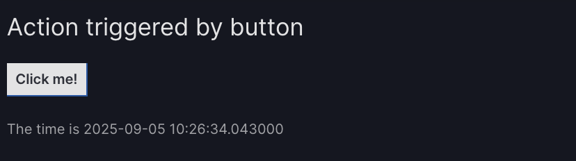
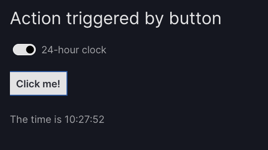
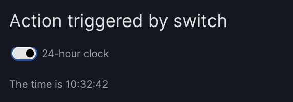
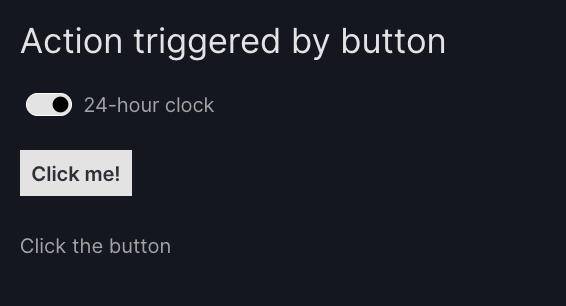

# How to create custom actions

Actions control how your app responds to user input such as clicking a button or a point on a graph. If an action is not available in Vizro's [built-in actions](actions.md) then you can create a custom action. In this guide we show how to do this.

We also have an in-depth [tutorial on creating an action](../tutorials/custom-actions-tutorial.md) and an [explanation of how Vizro actions work](../explanation/actions-explanation.md).

!!! note

    Do you have an idea for a built-in action? Submit a [feature request](https://github.com/mckinsey/vizro/issues/new?template=feature-request.yml)!

## General principles

Many [Vizro models][vizro.models] have an `actions` argument that can contain one or more actions. Each action is a Python function that is _triggered_ by a user interaction. The function can optionally have any number of _inputs_ and _outputs_ that refer to a Vizro model `id`.

To define your own action:

1. write a Python function and decorate it with `@capture("action")`:

    ```python
    from vizro.models.types import capture


    @capture("action")
    def action_function(input_1, input_2):
        ...
        return "My string value, potentially dependent on input_1 and input_2"
    ```

1. attach it to the `actions` argument of a Vizro model using [`Action`][vizro.models.Action]:

    1. call it using the `function` argument
    1. if your action has one or more inputs then specify them as function arguments
    1. if your action has one or more outputs then specify them as `outputs`

    ```python
    import vizro.models as vm

    actions = vm.Action(
        function=action_function(input_1="input_id_1", input_2="input_id_2"),  # (1)!
        outputs="output_id_1",  # (2)!
    )
    ```

    1. When the dashboard is running, the action's `input_1` will be set to the runtime value of the Vizro model with `id="input_id_1"` and similarly for `input_2`.
    1. When the dashboard is running, the action's output "My string value..." will set the value of the Vizro model with `id="output_id_1"`.

You can also execute [multiple actions with a single trigger](#multiple-actions) and [attach notifications](#notifications) to your action.

!!! warning

    You should never assume that the values of inputs in your action function are restricted to those that show on the user's screen. A malicious user can execute your action functions with arbitrary inputs. In the tutorial, we discuss in more detail [how to write secure actions](../tutorials/custom-actions-tutorial.md#security).


## Trigger an action with a button

Here is an example action that gives the current time when a [button](./button.md) is clicked.

```python
from datetime import datetime
from vizro.models.types import capture


@capture("action")
def current_time_text():  # (1)!
    time = datetime.now()
    return f"The time is {time}"  # (2)!
```

1. The function has no input arguments.
1. The function returns a single value.

To attach the action to a button model, we use it inside the `actions` argument as follows:

```python
vm.Button(
    actions=vm.Action(
        function=current_time_text(),  # (1)!
        outputs="time_text",  # (2)!
    ),
)
```

1. Call the action function with `function=current_time_text()` (remember the `()`).
1. The returned value "The time is ..." will update the component `id="time_text"` (not yet defined).

Here is the full example code that includes the output component `vm.Time(id="time_text")`.

!!! example "Trigger an action with a button"

    === "app.py"

        ```{.python pycafe-link hl_lines="8-11 18-23"}
        from datetime import datetime

        import vizro.models as vm
        from vizro import Vizro
        from vizro.models.types import capture


        @capture("action")
        def current_time_text():
            time = datetime.now()
            return f"The time is {time}"


        page = vm.Page(
            title="Action triggered by button",
            layout=vm.Flex(),
            components=[
                vm.Button(
                    actions=vm.Action(
                        function=current_time_text(),
                        outputs="time_text",
                    )
                ),
                vm.Text(id="time_text", text="Click the button"),
            ],
        )

        dashboard = vm.Dashboard(pages=[page])
        Vizro().build(dashboard).run()
        ```

    === "app.yaml"

        ```yaml
        # Still requires a .py to define a CapturedCallables custom action and parse YAML configuration
        # More explanation in the docs on `Dashboard` and extensions.
        pages:
          - components:
              - type: button
                actions:
                  - type: action
                    function:
                      _target_: __main__.current_time_text
                    outputs: time_text
              - type: text
                id: time_text
                text: Click the button
            layout:
              type: flex
            title: Action triggered by button
        ```

    === "Result"

        

Before clicking the button, the text shows "Click the button". When you click the button, the `current_time_text` action is triggered. This finds the current time and returns a string "The time is ...". The resulting value is sent back to the user's screen and updates the text of the model `vm.Text(id="time_text")`.

!!! tip

    If you have many buttons that trigger actions then you might like to [give them icons](./button/#add-an-icon). You can even have icon-only buttons with no text.

## Trigger with a runtime input

This extends the [above example](#trigger-an-action-with-a-button) of an action triggered by a button to include an input. Here is the action function:

```python
from datetime import datetime
from vizro.models.types import capture


@capture("action")
def current_time_text(use_24_hour_clock):  # (1)!
    time_format = "%H:%M:%S" if use_24_hour_clock else "%I:%M:%S %p"
    time = datetime.now().strftime(time_format)
    return f"The time is {time}"  # (2)!
```

1. The function has one argument, which will receive a boolean value `True` or `False` to determine the time format used.
1. The function returns a single value.

To attach the action to a button model, we use it inside the `actions` argument as follows:

```python
vm.Button(
    actions=vm.Action(
        function=current_time_text(use_24_hour_clock="clock_switch"),  # (1)!
        outputs="time_text",  # (2)!
    ),
)
```

1. The argument `use_24_hour_clock` corresponds to the value of the component with `id="clock_switch"` (not yet defined). Here we used a keyword argument `use_24_hour_clock="clock_switch"` but, as with normal Python function call, we could instead use a positional argument with `current_time_text("clock_switch")`.
1. The returned value "The time is ..." will update the component `id="time_text"` (not yet defined).

Here is the full example code that includes the input component `vm.Switch(id="clock_switch")` and the output component `vm.Time(id="time_text")`.

!!! example "Use runtime inputs"

    === "app.py"

        ```{.python pycafe-link hl_lines="8-12 22-27"}
        from datetime import datetime

        import vizro.models as vm
        from vizro import Vizro
        from vizro.models.types import capture


        @capture("action")
        def current_time_text(use_24_hour_clock):
            time_format = "%H:%M:%S" if use_24_hour_clock else "%I:%M:%S %p"
            time = datetime.now().strftime(time_format)
            return f"The time is {time}"


        vm.Page.add_type("components", vm.Switch)  # (1)!

        page = vm.Page(
            title="Action triggered by button",
            layout=vm.Flex(),
            components=[
                vm.Switch(id="clock_switch", title="24-hour clock", value=True),
                vm.Button(
                    actions=vm.Action(
                        function=current_time_text(use_24_hour_clock="clock_switch"),
                        outputs="time_text",
                    ),
                ),
                vm.Text(id="time_text", text="Click the button"),
            ],
        )

        dashboard = vm.Dashboard(pages=[page])
        Vizro().build(dashboard).run()

        ```

        1. Currently [`Switch`][vizro.models.Switch] is designed to be used as a [control selectors](../user-guides/selectors.md). In future, Vizro will have a dedicated `Form` model for the creation of forms. For now, we add them directly as `components` inside a [`Container`][vizro.models.Container]. For this to be a valid configuration we must first do `add_type` as for a [custom component](../user-guides/custom-components.md).

    === "app.yaml"
        ```yaml
        # Custom components and added component types (with `add_type`) are currently only possible via Python configuration
        ```
    === "Result"

        

Before clicking the button, the text shows "Click the button". When you click the button, the `current_time_text` action is triggered. This finds the current time and returns a string "The time is ..." with a time format that depends on the switch's setting. The resulting value is sent back to the user's screen and updates the text of the model `vm.Text(id="time_text")`.

### Multiple inputs and outputs

An action can have any number of inputs and outputs (including zero). Here is an action with two inputs and two outputs:

```python
from vizro.models.types import capture


@capture("action")
def action_function(input_1, input_2):
    ...
    return "My string value 2", "My string value 2"
```

This would be attached to an `actions` argument as follows:

```python
import vizro.models as vm

actions = vm.Action(
    function=action_function(input_1="input_id_1", input_2="input_id_2"),  # (1)!
    outputs=["output_id_1", "output_id_2"],
)
```

1. As with an ordinary Python function call, this could also be written using positional arguments as `action_function("input_id_1", "input_id_2")`.

The returned values of an action function with multiple outputs are matched to the `outputs` in order. For actions with many return values, it can be a good idea to instead return a dictionary where returned values are labeled by string keys. In this case, `outputs` should also be a dictionary with matching keys, and the order of entries does not matter:

```python
@capture("action")
def action_function(input_1, input_2):
    ...
    return {"key 1": "My string value 2", "key 2": "My string value 2"}


actions = vm.Action(
    function=action_function(input_1="input_id_1", input_2="input_id_2"),
    outputs={"key 1": "output_id_1", "key 2": "output_id_2"},  # (1)!
)
```

1. Specifying outputs in the "wrong" order as `outputs={"key 2": "output_id_2", "key 1": "output_id_1"}` would work exactly the same way.

A full real world example of using multiple inputs and outputs is [given in the tutorial](../tutorials/custom-actions-tutorial.md#multiple-inputs-and-outputs).

## Multiple actions

When you specify multiple actions as `actions=[action_1, action_2, ...]` then Vizro _chains_ these actions in order, so that `action_2` executes only when `action_1` has completed. You can freely mix [built-in actions](actions.md) and custom actions in an actions chain. For more details on how actions chains execute, see our [tutorial on custom actions](../tutorials/custom-actions-tutorial.md).

Here is an example actions chain that uses a custom `action_function` action and the built-in `export_data` action:

```python
import vizro.actions as va
import vizro.models as vm

actions = [
    va.export_data(),
    vm.Action(
        function=action_function("input_id_1", "input_id_2"),
        outputs="output_id",
    ),
]
```

## Address specific parts of a model

For most actions that you write, you should only need to specify `<model_id>` for the `outputs` or as input arguments to the action function. However, some models have multiple arguments that you may want to use in an action. This is possible with the syntax [`<model_id>.<argument_name>`](#model-arguments-as-input-and-output). For more advanced use cases you can even [address the underlying Dash component and property](#dash-properties-as-input-and-output).

### Model arguments as input and output

The syntax for using a particular model argument as an action input or output is `<model_id>.<argument_name>`.

For example, let's alter the [above example](#trigger-with-a-runtime-input) of a switch that toggles between formatting time with the 12- and 24-hour clock. [`Switch`][vizro.models.Switch] has an argument `title` that adds a label to the switch. We can update this in an action by including `clock_switch.title` in the action's `outputs`.

!!! example "Use model argument as output"

    === "app.py"

        ```{.python pycafe-link hl_lines="8-13 26-29"}
        from datetime import datetime

        import vizro.models as vm
        from vizro import Vizro
        from vizro.models.types import capture


        @capture("action")
        def current_time_text(use_24_hour_clock):
            time_format = "%H:%M:%S" if use_24_hour_clock else "%I:%M:%S %p"
            switch_title = "24-hour clock" if use_24_hour_clock else "12-hour clock"
            time = datetime.now().strftime(time_format)
            return f"The time is {time}", switch_title


        vm.Page.add_type("components", vm.Switch)  # (1)!

        page = vm.Page(
            title="Action triggered by switch",
            layout=vm.Flex(),
            components=[
                vm.Switch(
                    id="clock_switch",
                    title="24-hour clock",
                    value=True,
                    actions=vm.Action(  # (2)!
                        function=current_time_text(use_24_hour_clock="clock_switch"),
                        outputs=["time_text", "clock_switch.title"],  # (3)!
                    ),
                ),
                vm.Text(id="time_text", text="Toggle the switch"),
            ],
        )

        dashboard = vm.Dashboard(pages=[page])
        Vizro().build(dashboard).run()
        ```

        1. Currently [`Switch`][vizro.models.Switch] is designed to be used as a [control selectors](../user-guides/selectors.md). In future, Vizro will have a dedicated `Form` model for the creation of forms. For now, we add them directly as `components` inside a [`Container`][vizro.models.Container]. For this to be a valid configuration we must first do `add_type` as for a [custom component](../user-guides/custom-components.md).
        1. In the [previous example](#trigger-with-a-runtime-input), the action was triggered when a button is clicked; now we change the action to be triggered when the switch itself is clicked.
        1. This action now has [two `outputs`](#multiple-inputs-and-outputs). We refer to `"clock_switch.title"` to update the title of the switch.

    === "app.yaml"
        ```yaml
        # Custom components and added component types (with `add_type`) are currently only possible via Python configuration
        ```
    === "Result"

        

### Dash properties as input and output

Sometimes you might like to use as input or output a component that is on the screen but cannot be addressed explicitly with `<model_id>.<argument_name>`. Vizro actions in fact accept as input and output _any_ Dash component in the format `<component_id>.<property>`.

For example, let's alter the [above example](#trigger-with-a-runtime-input) of a switch that toggles between formatting time with the 12- and 24-hour clock. We want to disable the switch when the button is clicked so that it can no longer be toggled. [`Switch`][vizro.models.Switch] does not contain an argument to disable the switch, but the underlying Dash component [`dbc.Switch`](https://www.dash-bootstrap-components.com/docs/components/input/) does. We can address this by using `"clock_switch.disabled"` in our `outputs`.

!!! example "Use Dash property as input"

    === "app.py"

        ```{.python pycafe-link hl_lines="8-12 22-27"}
        from datetime import datetime

        import vizro.models as vm
        from vizro import Vizro
        from vizro.models.types import capture


        @capture("action")
        def current_time_text(use_24_hour_clock):
            time_format = "%H:%M:%S" if use_24_hour_clock else "%I:%M:%S %p"
            time = datetime.now().strftime(time_format)
            return f"The time is {time}", True  # (1)!


        vm.Page.add_type("components", vm.Switch)  # (2)!

        page = vm.Page(
            title="Action triggered by button",
            layout=vm.Flex(),
            components=[
                vm.Switch(id="clock_switch", title="24-hour clock", value=True),
                vm.Button(
                    actions=vm.Action(
                        function=current_time_text(use_24_hour_clock="clock_switch"),
                        outputs=["time_text", "clock_switch.disabled"],  # (3)!
                    ),
                ),
                vm.Text(id="time_text", text="Click the button"),
            ],
        )

        dashboard = vm.Dashboard(pages=[page])
        Vizro().build(dashboard).run()
        ```

        1. We disable the switch by returning `True` to its `disabled` property. After this action runs, the switch can no longer the clicked. To reset it, you must refresh the page.
        1. Currently [`Switch`][vizro.models.Switch] is designed to be used as a [control selectors](../user-guides/selectors.md). In future, Vizro will have a dedicated `Form` model for the creation of forms. For now, we add them directly as `components` inside a [`Container`][vizro.models.Container]. For this to be a valid configuration we must first do `add_type` as for a [custom component](../user-guides/custom-components.md).
        1. This action now has [two `outputs`](#multiple-inputs-and-outputs). We refer to `"clock_switch.disabled"` to update the `disabled` property of the component with `id="clock_switch"`.

    === "app.yaml"
        ```yaml
        # Custom components and added component types (with `add_type`) are currently only possible via Python configuration
        ```
    === "Result"

        

## Notifications

You can use notifications to show the progress and outcome of a custom action with the built-in  `"progress"`, `"success"` and `"error"` keys in the action's `notifications` argument:

* `"progress"`: shown while an action runs.
* `"success"`: shown when an action completes successfully.
* `"error"`: shown when an action raises an exception.

These keys are all optional; you can define only the ones that are relevant for you.

!!! example "Progress, success and error notifications"

    === "app.py"

        ```{.python pycafe-link hl_lines="12-14 26-30"}
        import random
        from time import sleep

        import vizro.models as vm
        from vizro import Vizro
        from vizro.models.types import capture


        @capture("action")  # (1)!
        def run_pipeline():
            sleep(2)
            if random.choice([True, False]):
                raise Exception("Random error.")
            return "Metrics updated"


        page = vm.Page(
            title="Progress notification",
            layout=vm.Flex(),
            components=[
                vm.Button(
                    text="Run pipeline",
                    actions=vm.Action(
                        function=run_pipeline(),
                        outputs="pipeline_output",
                        notifications={
                            "progress": "Running pipeline...",  # (2)!
                            "success": "Pipeline completed.",
                            "error": "Pipeline failed.",
                        },
                    ),
                ),
                vm.Text(id="pipeline_output", text="Click the button to run the pipeline."),
            ],
        )

        dashboard = vm.Dashboard(pages=[page])
        Vizro().build(dashboard).run()
        ```

        1. Define a custom action function `run_pipeline` that takes 2 seconds and randomly chooses between returning a success message or raising an exception to simulate an error.
        1. A `"progress"` notification with the "Running pipeline..." text is shown immediately when the action starts, and then replaced by either the `"success"` or `"error"` notification once the action completes.


    === "app.yaml"

        ```yaml
        # Still requires a .py to define a CapturedCallables custom action and parse YAML configuration
        # More explanation in the docs on `Dashboard` and extensions.
        pages:
          - components:
              - type: button
                text: Run pipeline
                actions:
                  - type: action
                    function:
                      _target_: __main__.run_pipeline
                    outputs: pipeline_output
                    notifications:
                      progress: Running pipeline...
                      success: Pipeline completed.
                      error: Pipeline failed.
              - type: text
                id: pipeline_output
                text: Click the button to run the pipeline.
            layout:
              type: flex
            title: Progress notification
        ```

    === "Result"

        [![ProgressSuccessErrorNotification]][progresssuccesserrornotification]

### Custom notification keys

In addition to the built-in keys `"progress"`, `"success"`, `"error"`, you can define your own custom notification keys to handle more specific outcomes. Custom notifications are only shown when the action function explicitly selects them by returning a key or raising an exception with a key that matches one defined in `notifications`.

To show a custom notification on success, return the key alongside the result:

```python
return result_text, "pipeline_partial_success"
```

To show a custom notification on error, include the key when raising an exception:

```python
raise Exception("Pipeline failed.", "pipeline_partial_error")
```

Custom notifications use the "info" style by default unless [configured otherwise](#customize-notification-appearance-and-behavior).

??? example "Custom notification keys"

    === "app.py"

        ```{.python pycafe-link hl_lines="17 21 37-38"}
        import random
        from time import sleep

        import vizro.models as vm
        from vizro import Vizro
        from vizro.models.types import capture


        @capture("action")
        def run_pipeline():
            sleep(2)

            roll = random.choice(["A", "B", "C", "D"])
            if roll == "A":
                raise Exception("Random error.")  # (1)!
            if roll == "B":
                raise Exception("Random error.", "pipeline_partial_error")  # (2)!
            if roll == "C":
                return "Metrics updated"  # (3)!
            if roll == "D":
                return "Metrics updated", "pipeline_partial_success"  # (4)!


        page = vm.Page(
            title="Custom notification keys",
            layout=vm.Flex(),
            components=[
                vm.Button(
                    text="Run pipeline",
                    actions=vm.Action(
                        function=run_pipeline(),
                        outputs="pipeline_output",
                        notifications={
                            "progress": "Running pipeline...",
                            "success": "Pipeline completed.",
                            "error": "Pipeline failed.",
                            "pipeline_partial_success": "Pipeline partially completed.",
                            "pipeline_partial_error": "Pipeline partially failed.",
                        },
                    ),
                ),
                vm.Text(id="pipeline_output", text="Click the button to run the pipeline."),
            ],
        )

        dashboard = vm.Dashboard(pages=[page])
        Vizro().build(dashboard).run()
        ```

        1. Default `"error"` key is raised to show the "Pipeline failed." notification.
        1. Custom `"pipeline_partial_error"` key is raised to show the "Pipeline partially failed." notification.
        1. Default `"success"` key is returned to show the "Pipeline completed." notification.
        1. Custom `"pipeline_partial_success"` key is returned to show the "Pipeline partially completed." notification.

    === "app.yaml"

        ```yaml
        # Still requires a .py to define a CapturedCallables custom action and parse YAML configuration
        # More explanation in the docs on `Dashboard` and extensions.
        pages:
          - components:
              - type: button
                text: Run pipeline
                actions:
                  - type: action
                    function:
                      _target_: __main__.run_pipeline
                    outputs: pipeline_output
                    notifications:
                      progress: Running pipeline...
                      success: Pipeline completed.
                      error: Pipeline failed.
                      pipeline_partial_success: Pipeline partially completed.
                      pipeline_partial_error: Pipeline partially failed.
              - type: text
                id: pipeline_output
                text: Click the button to run the pipeline.
            layout:
              type: flex
            title: Custom notification keys
        ```

    === "Result"

        [![CustomNotificationKeys]][customnotificationkeys]


### Dynamic notification content

Notification messages can include _template variables_ that are filled with values from the action at runtime. This enables you to display dynamic information, such as results or error details, directly in the notification.

There are two templates to provide more informative and contextual feedback to users without hardcoding the message content:

  - `{result}`: Replaced with additional information returned by the action. This value is optional and can be included in the tuple alongside the notification key when the action completes or raises an exception.
  - `{error_msg}`: Replaced with the error message from an exception.

??? example "Templating with `{result}` and `{error_msg}`"

    === "app.py"

        ```{.python pycafe-link hl_lines="17 19 21 23 37-40"}
        import random
        from time import sleep

        import vizro.models as vm
        from vizro import Vizro
        from vizro.models.types import capture


        @capture("action")
        def run_pipeline():
            duration = random.uniform(1, 2)
            duration_result = f"Duration: {duration:.1f}s"
            sleep(duration)

            roll = random.choice(["A", "B", "C", "D"])
            if roll == "A":
                raise Exception("Random error.", ("error", duration_result))  # (1)!
            if roll == "B":
                raise Exception("Random error.", ("pipeline_partial_error", duration_result))  # (2)!
            if roll == "C":
                return "Metrics updated", ("success", duration_result)  # (3)!
            if roll == "D":
                return "Metrics updated", ("pipeline_partial_success", duration_result)  # (4)!


        page = vm.Page(
            title="Templated notifications",
            layout=vm.Flex(),
            components=[
                vm.Button(
                    text="Run pipeline",
                    actions=vm.Action(
                        function=run_pipeline(),
                        outputs="pipeline_output",
                        notifications={
                            "progress": "Running pipeline...",
                            "success": "Pipeline done. {result}",  # (5)!
                            "error": "Pipeline failed: {error_msg} {result}",  # (6)!
                            "pipeline_partial_success": "Pipeline partially completed. {result}",  # (7)!
                            "pipeline_partial_error": "Pipeline partially failed: {error_msg} {result}",  # (8)!
                        },
                    ),
                ),
                vm.Text(id="pipeline_output", text="Click the button to run the pipeline."),
            ],
        )

        dashboard = vm.Dashboard(pages=[page])
        Vizro().build(dashboard).run()
        ```

        1. Propagate dynamic value `duration_result` to the `"error"` notification text that replaces the `{result}` template.
        1. Propagate dynamic value `duration_result` to the `"pipeline_partial_error"` notification text that replaces the `{result}` template.
        1. Propagate dynamic value `duration_result` to the `"success"` notification text that replaces the `{result}` template.
        1. Propagate dynamic value `duration_result` to the `"pipeline_partial_success"` notification text that replaces the `{result}` template.
        1. Define the `"success"` notification text with the `{result}` template.
        1. Define the `"error"` notification text with both `{error_msg}` and `{result}` templates.
        1. Define the `"pipeline_partial_success"` notification text with the `{result}` template.
        1. Define the `"pipeline_partial_error"` notification text with both `{error_msg}` and `{result}` templates.

    === "app.yaml"

        ```yaml
        # Still requires a .py to define a CapturedCallables custom action and parse YAML configuration
        # More explanation in the docs on `Dashboard` and extensions.
        pages:
          - components:
              - type: button
                text: Run pipeline
                actions:
                  - type: action
                    function:
                      _target_: __main__.run_pipeline
                    outputs: pipeline_output
                    notifications:
                      progress: Running pipeline...
                      success: "Pipeline done. {result}"
                      error: "Pipeline failed: {error_msg} {result}"
                      pipeline_partial_success: "Pipeline partially completed. {result}"
                      pipeline_partial_error: "Pipeline partially failed: {error_msg} {result}"
              - type: text
                id: pipeline_output
                text: Click the button to run the pipeline.
            layout:
              type: flex
            title: Templated notifications
        ```

    === "Result"

        [![TemplatedNotifications]][templatednotifications]


In this example, `{result}` is filled with the additional detail returned by the action (for example, the duration of the pipeline run). The `{error_msg}` template is filled with the error message from the exception (for example, "Random error.").

### Action inputs in progress notifications

Progress notifications can also include template variables based on the runtime action's input values. These variables are referenced using the parameter names, for example `{param_name}`.

The progress message reflects the current inputs of the action to make it more informative. For example, you can display the number of retries configured while the action is running.

??? example "Dynamic progress text"

    === "app.py"

        ```{.python pycafe-link hl_lines="12 29 40 43"}
        import random
        from time import sleep

        import vizro.models as vm
        from vizro import Vizro
        from vizro.models.types import capture

        vm.Page.add_type("components", vm.Slider)


        @capture("action")
        def run_pipeline(max_retries: int = 1):  # (1)!
            for _ in range(max_retries):
                duration = random.uniform(1, 2)
                duration_result = f"Duration: {duration:.1f}s"
                sleep(duration)

                if random.choice([True, False]): # (2)!
                    roll = random.choice(["A", "B", "C", "D"])
                    if roll == "A":
                        raise Exception("Random error.", ("error", duration_result))
                    if roll == "B":
                        raise Exception("Random error.", ("pipeline_partial_error", duration_result))
                    if roll == "C":
                        return "Metrics updated", ("success", duration_result)
                    if roll == "D":
                        return "Metrics updated", ("pipeline_partial_success", duration_result)

            raise Exception("Random error.", ("pipeline_max_retries_error", max_retries))


        page = vm.Page(
            title="Templated notifications",
            layout=vm.Flex(),
            components=[
                vm.Slider(id="slider_id", min=1, max=3, step=1, value=1, title="Max retries"),
                vm.Button(
                    text="Run pipeline",
                    actions=vm.Action(
                        function=run_pipeline(max_retries="slider_id"),
                        outputs="pipeline_output",
                        notifications={
                            "progress": "Running pipeline... (max retries: {max_retries})...",  # (3)!
                            "success": "Pipeline done. {result}",
                            "error": "Pipeline failed: {error_msg} - {result}",
                            "pipeline_partial_success": "Pipeline partially completed. {result}",
                            "pipeline_partial_error": "Pipeline partially failed: {error_msg} - {result}",
                            "pipeline_max_retries_error": "Pipeline failed after {result} retries.",
                        },
                    ),
                ),
                vm.Text(id="pipeline_output", text="Click the button to run the pipeline."),
            ],
        )

        dashboard = vm.Dashboard(pages=[page])
        Vizro().build(dashboard).run()
        ```

        1. Action's input argument `max_retries` which dynamic value shows in the `"progress"` notification text.
        1. On each attempt, decide whether to run the A/B/C/D roll. If it is `False`, the loop tries again until `max_retries` is exhausted, and then the action raises an exception.
        1. Define the `"progress"` notification text with the `{max_retries}` template that gets replaced by the runtime value of the `max_retries` argument when the action runs.

    === "app.yaml"

        ```yaml
        # Still requires a .py to define the custom action, call vm.Page.add_type("components", vm.Slider),
        # and parse YAML configuration. See yaml_version example.
        pages:
          - components:
              - type: slider
                id: slider_id
                min: 1
                max: 3
                step: 1
                value: 1
                title: Max retries
              - type: button
                text: Run pipeline
                actions:
                  - type: action
                    function:
                      _target_: __main__.run_pipeline
                      max_retries: slider_id
                    outputs: pipeline_output
                    notifications:
                      progress: "Running pipeline... (max retries: {max_retries})..."
                      success: "Pipeline done. {result}"
                      error: "Pipeline failed: {error_msg} - {result}"
                      pipeline_partial_success: "Pipeline partially completed. {result}"
                      pipeline_partial_error: "Pipeline partially failed: {error_msg} - {result}"
                      pipeline_max_retries_error: "Pipeline failed after {result} retries."
              - type: text
                id: pipeline_output
                text: Click the button to run the pipeline.
            layout:
              type: flex
            title: Templated notifications
        ```

    === "Result"

        [![DynamicProgressText]][dynamicprogresstext]


### Customize notification appearance and behavior

Notifications do not have to be limited to plain text. You can customize how they look and behave, for example, by adjusting the variant, adding a title or icon, or controlling whether they close automatically. See the [notifications guide](notification-actions.md) for a full list of available options.

To customize notifications when you define them, use the [`show_notification`][vizro.actions.show_notification] or [`update_notification`][vizro.actions.update_notification] models instead of plain text as values in the `notifications` dictionary.

??? example "Customized notification with `show_notification`"

    === "app.py"

        ```{.python pycafe-link hl_lines="44 47-49"}
        import random
        from time import sleep

        import vizro.actions as va
        import vizro.models as vm
        from vizro import Vizro
        from vizro.models.types import capture

        vm.Page.add_type("components", vm.Slider)


        @capture("action")
        def run_pipeline(max_retries: int = 1):
            for _ in range(max_retries):
                duration = random.uniform(1, 2)
                duration_result = f"Duration: {duration:.1f}s"
                sleep(duration)

                if random.choice([True, False]):
                    roll = random.choice(["A", "B", "C", "D"])
                    if roll == "A":
                        raise Exception("Random error.", ("error", duration_result))
                    if roll == "B":
                        raise Exception("Random error.", ("pipeline_partial_error", duration_result))
                    if roll == "C":
                        return "Metrics updated", ("success", duration_result)
                    if roll == "D":
                        return "Metrics updated", ("pipeline_partial_success", duration_result)

            raise Exception("Random error.", ("pipeline_max_retries_error", max_retries))


        page = vm.Page(
            title="Templated notifications",
            layout=vm.Flex(),
            components=[
                vm.Slider(id="slider_id", min=1, max=3, step=1, value=1, title="Max retries"),
                vm.Button(
                    text="Run pipeline",
                    actions=vm.Action(
                        function=run_pipeline(max_retries="slider_id"),
                        outputs="pipeline_output",
                        notifications={
                            "progress": va.show_notification(id="progress_id", variant="progress", text="Running pipeline... (max retries: {max_retries})..."),  # (1)!
                            "success": "Pipeline done. {result}",
                            "error": "Pipeline failed: {error_msg} - {result}",
                            "pipeline_partial_success": va.update_notification(variant="success", notification="progress_id", text="Pipeline partially completed. {result}"),   # (2)!
                            "pipeline_partial_error": va.update_notification(variant="error", notification="progress_id", text="Pipeline partially failed: {error_msg} - {result}"),  # (3)!
                            "pipeline_max_retries_error": va.update_notification(variant="error", notification="progress_id", text="Pipeline failed after {result} retries."),  # (4)!
                        },
                    ),
                ),
                vm.Text(id="pipeline_output", text="Click the button to run the pipeline."),
            ],
        )

        dashboard = vm.Dashboard(pages=[page])
        Vizro().build(dashboard).run()
        ```

        1. Use `va.show_notification` to define the `"progress"` notification with an `id` that can be referenced by other notifications.
        1. Use `va.update_notification` to update the `"progress"` notification with new text and variant when the `"pipeline_partial_success"` key is returned.
        1. Use `va.update_notification` to update the `"progress"` notification with new text and variant when the `"pipeline_partial_error"` key is raised.
        1. Use `va.update_notification` to update the `"progress"` notification with new text and variant when the `"pipeline_max_retries_error"` key is raised.

    === "app.yaml"

        ```yaml
        # Still requires a .py to define the custom action, call vm.Page.add_type("components", vm.Slider),
        # and parse YAML configuration. See yaml_version example.
        pages:
          - components:
              - type: slider
                id: slider_id
                min: 1
                max: 3
                step: 1
                value: 1
                title: Max retries
              - type: button
                text: Run pipeline
                actions:
                  - type: action
                    function:
                      _target_: __main__.run_pipeline
                      max_retries: slider_id
                    outputs: pipeline_output
                    notifications:
                      progress:
                        type: show_notification
                        id: progress_id
                        variant: progress
                        text: "Running pipeline... (max retries: {max_retries})..."
                      success: "Pipeline done. {result}"
                      error: "Pipeline failed: {error_msg} - {result}"
                      pipeline_partial_success:
                        type: update_notification
                        notification: progress_id
                        variant: success
                        text: "Pipeline partially completed. {result}"
                      pipeline_partial_error:
                        type: update_notification
                        notification: progress_id
                        variant: error
                        text: "Pipeline partially failed: {error_msg} - {result}"
                      pipeline_max_retries_error:
                        type: update_notification
                        notification: progress_id
                        variant: error
                        text: "Pipeline failed after {result} retries."
              - type: text
                id: pipeline_output
                text: Click the button to run the pipeline.
            layout:
              type: flex
            title: Templated notifications
        ```

    === "Result"

        [![CustomizedNotification]][customizednotification]


### Debugging and error handling

By default, every custom action shows a generic error notification with message "Action failed" if something goes wrong. You can override this with a more specific message, or disable error notifications entirely by setting `"error": None`. If error notifications are disabled and the app is running in [debug mode](run-deploy.md#automatic-reloading-and-debugging), any unhandled exceptions are shown in the [Dash Dev Tools](https://dash.plotly.com/devtools) debugger instead of a notification. All exceptions, except `PreventUpdate`, are always logged to the server console, regardless of how notifications are configured.

`PreventUpdate` and `no_update` are handled as described in the [actions chain tutorial](../tutorials/custom-actions-tutorial.md#handle-errors-and-debug). Both are treated as a success (shows the `"success"` notification if defined) but only `PreventUpdate` cancels the action chain.

[progresssuccesserrornotification]: ../../assets/user_guides/conditional_notifications_actions/progress_success_error_notification.gif
[customnotificationkeys]: ../../assets/user_guides/conditional_notifications_actions/custom_notification_keys.gif
[templatednotifications]: ../../assets/user_guides/conditional_notifications_actions/templated_notifications.gif
[dynamicprogresstext]: ../../assets/user_guides/conditional_notifications_actions/dynamic_progress_text.gif
[customizednotification]: ../../assets/user_guides/conditional_notifications_actions/customized_notification.gif
