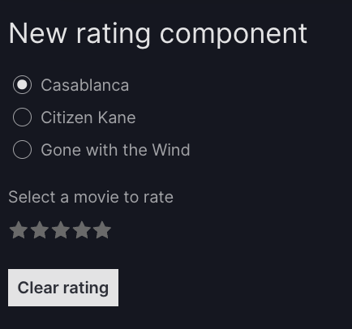
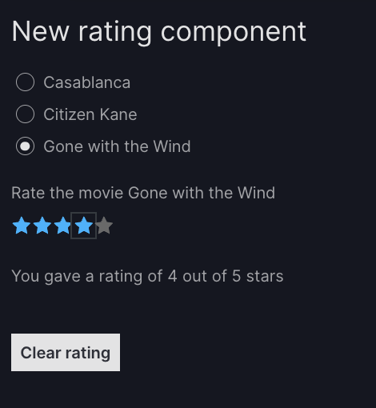

# How to create custom components

The number of [built-in Vizro models][vizro.models] is deliberately kept quite small to enable quick and easy configuration of a dashboard. However, Vizro is also extensible, so that you can modify any model or create an entirely new one. This guide shows you how to do so.

In general, you can create a custom component based on a Dash component from [any Dash component library](https://dash.plotly.com/#open-source-component-libraries), for example:

* [Dash Core Components](https://dash.plotly.com/dash-core-components)
* [Dash HTML Components](https://github.com/plotly/dash/tree/dev/components/dash-html-components)
* [Dash Bootstrap Components](https://www.dash-bootstrap-components.com/)
* [Dash Mantine Components](https://www.dash-mantine-components.com/)

## General principles

!!! note "Can you use `extra` instead of creating a custom component?"

    If you want to modify an existing component, you may not even need to create a custom component. Many of our models have an `extra` argument to pass arguments to the underlying Dash component directly, for example to make the [`RadioItem`][vizro.models.RadioItems] [inline instead of stacked](selectors.md#the-extra-argument).

To create a custom component:

1. Subclass the relevant model:
    * To extend an existing model such as [`RangeSlider`][vizro.models.RangeSlider], subclass it.
    * To create a new component, subclass [`VizroBaseModel`][vizro.models.VizroBaseModel].
1. Write the subclass:
    * To extend an existing model you could, for example, add or change model fields or override the `build` method.
    * To create a new component, you need to define fields and the `build` method from scratch.
1. Look at the field where your component will be used in the [API reference][vizro.models] and check whether it is described as a discriminated union. For example, in the [`Filter`][vizro.models.Filter] model the `selector` field of type [`SelectorType`][vizro.models.types.SelectorType] is a discriminated union but the `options` field of type [`OptionsType`][vizro.models.types.OptionsType] is not. If the field is a discriminated union, then:
    - You must ensure your model has a `type` field.
    - You must register the new type with its parent model with [`add_type`][vizro.models.VizroBaseModel.add_type].

We will refer back to these steps in the examples below.

## Extend an existing component

You may want to use this strategy to:

- Extend an existing component, for example to add a button to a [`Card`](../user-guides/card.md).
- Change default configuration of a Dash component set by a Vizro model, for example to set `allowCross=False` in [`RangeSlider`][vizro.models.RangeSlider].
- Change the fields of a models, for example to change the `title` field from `Optional` to have a default.

You can extend an existing component by subclassing the component you want to modify. Remember that when subclassing a component you have access to all fields of its parent model, but you can choose to overwrite any field or method or define entirely new ones.

In this example, we modify the [`RangeSlider`][vizro.models.RangeSlider] model so that
one slider handle cannot cross the other, and to have a permanent tooltip showing the current value. It is often easier to call `super()` and modify the result when overriding a complex method
such as the `build` method instead of writing it from scratch.

In this case, the general three steps translate into:

1. Subclass [`RangeSlider`][vizro.models.RangeSlider]:

```py
import vizro.models as vm

class TooltipNonCrossRangeSlider(vm.RangeSlider):
```

2. Modify the component by changing the underlying parent's `dcc.RangeSlider` Dash component in the `build` method:

```py
class TooltipNonCrossRangeSlider(vm.RangeSlider):
    def build(self):
        ...
        allowCross=False,
        tooltip={"placement": "bottom", "always_visible": True}
```
These lines are highlighted in the example below. They are the only material change to the original `build` method.

3. Since the new model will be inserted into the `selectors` argument of the [`Filter`][vizro.models.Filter] model or [`Parameter`][vizro.models.Parameter] model, it will be part of the discriminated union describing the allowed types for that argument, in this case the [`SelectorType`][vizro.models.types.SelectorType]. Hence we must:

    - define a new type:

```py
class TooltipNonCrossRangeSlider(vm.RangeSlider):
    type: Literal["other_range_slider"] = "other_range_slider"
    ...
```
    - register the type with the parent models:
```py
vm.Filter.add_type("selector", TooltipNonCrossRangeSlider)
vm.Parameter.add_type("selector", TooltipNonCrossRangeSlider)
```

??? example "Example based on existing component"

    === "app.py"
        ```{.python pycafe-link hl_lines="17-18 22-23 37 41"}
        from typing_extensions import Literal

        import vizro.models as vm
        import vizro.plotly.express as px
        from vizro import Vizro

        iris = px.data.iris()


        class TooltipNonCrossRangeSlider(vm.RangeSlider):
            """Custom numeric multi-selector `TooltipNonCrossRangeSlider`."""

            type: Literal["other_range_slider"] = "other_range_slider"  # (1)!

            def build(self):  # (2)!
                range_slider_build_obj = super().build()  # (3)!
                range_slider_build_obj[self.id].allowCross = False  # (4)!
                range_slider_build_obj[self.id].tooltip = {"always_visible": True, "placement": "bottom"}  # (5)!
                return range_slider_build_obj


        vm.Filter.add_type("selector", TooltipNonCrossRangeSlider)  # (6)!
        vm.Parameter.add_type("selector", TooltipNonCrossRangeSlider)  # (7)!

        page = vm.Page(
            title="Custom Component",
            components=[
                vm.Graph(
                    id="for_custom_chart",
                    figure=px.scatter(iris, title="Iris Dataset", x="sepal_length", y="petal_width", color="sepal_width"),
                ),
            ],
            controls=[
                vm.Filter(
                    column="sepal_length",
                    targets=["for_custom_chart"],
                    selector=TooltipNonCrossRangeSlider(),
                ),
                vm.Parameter(
                    targets=["for_custom_chart.range_x"],
                    selector=TooltipNonCrossRangeSlider(title="Select x-axis range", min=0, max=10),  # (8)!
                ),
            ],
        )

        dashboard = vm.Dashboard(pages=[page])

        Vizro().build(dashboard).run()
        ```

        1.  Here we provide a new type for the new component, so it can be distinguished in the discriminated union.
        2.  Here we override the `build` method by altering the output of `super().build()`. Alternatively one could copy the source code of the build method and alter it directly.
        3.  `range_slider_build_obj[self.id]` then fetches the underlying [`dcc.RangeSlider`](https://dash.plotly.com/dash-core-components/rangeslider) object.
        4.  This change prevents the `RangeSlider` from crossing itself when moving the handle.
        5.  This change displays the tooltip below the handle.
        6.  **Remember!** If part of a discriminated union, you must add the new component to the parent model where it will be inserted. In this case the new `TooltipNonCrossRangeSlider` will be inserted into the `selector` argument of the `Filter` model, and thus must be added as an allowed type.
        7.  **Remember!** If part of a discriminated union, you must add the new component to the parent model where it will be inserted. In this case the new `TooltipNonCrossRangeSlider` will be inserted into the `selector` argument of the `Parameter` model, and thus must be added as an allowed type.
        8.  The new component can now be inserted into a regular dashboard.

    === "yaml"
        ```yaml
        # Custom components are currently only possible via Python configuration
        ```
    === "Result"
        [![CustomComponent1]][CustomComponent1]

    [CustomComponent1]: ../../assets/user_guides/custom_components/custom-components0.png


## Create a new component

You may want to use this strategy to:

- Create a new component that does not exist as a [built-ninVizro model][vizro.models].
- Make extensive changes to an existing component.
- Combine multiple components into a single higher-level component, similar to a Dash [All-in-One component](https://dash.plotly.com/all-in-one-components).

We will create a new `Rating` component based on the Dash Mantine Component [`Rating`](https://www.dash-mantine-components.com/components/rating). This produces a form component that shows a set of 5 stars for the dashboard user to give a rating. We also include `html.Legend` in our custom component to label the form component.

1. Create the new component by subclassing [`VizroBaseModel`][vizro.models.VizroBaseModel]:
```py
import vizro.models as vm

class Rating(vm.VizroBaseModel):
```

2. Build the component in the `build` method:
    - This can return any Dash component but is often a "container" component such as `html.Div` that includes multiple Dash components.
    - Typically you use `id=self.id` for the "core" component, in this case `dmc.Rating`.
    - Typically you prefix with `self.id` the `id` for a component that is not the core one.

    ```py hl_lines="6-12"
    from dash import html
    import dash_mantine_components as dmc

    class Rating(vm.VizroBaseModel):
        ...
        def build(self):
            return html.Div( # (1)!
                [
                    html.Legend(id=f"{self.id}_title", ...), # (2)!
                    dmc.Rating(id=self.id, ...) # (3)!
                ]
            )
    ```

    1. In this example, for simplicity we use [`html.Div`](https://dash.plotly.com/dash-html-components/Div) to provide the outer container. You could also use [`html.Fieldset`](https://dash.plotly.com/dash-html-components/fieldset), which is specifically designed for grouping a form legend with a set of controls.
    1. This is not the core component but we will later [address it with an action](#model-fields-as-input-and-output), so it must have an `id` set. We prefix its `id` with `self.id`.
    1. This is the core component, and so it has `id=self.id`.

1. Since the new model will be inserted into the `components` argument of the [`Page`][vizro.models.Page] model, it will be part of the discriminated union [`ComponentType`][vizro.models.types.ComponentType]. Hence we must:
    - define a new type:
```py
class Rating(vm.VizroBaseModel):
    type: Literal["rating"] = "rating"
    ...
```
    - register the type with the parent model:
```py
vm.Page.add_type("components", Rating)
```

Here is the full code for `Rating` and a simple app containing it.

!!! example "New component creation"

    === "app.py"
        ```{.python pycafe-link hl_lines="9-20 23 29"}
        from typing import Literal

        from dash import html
        import dash_mantine_components as dmc
        import vizro.models as vm
        from vizro import Vizro


        class Rating(vm.VizroBaseModel):
            type: Literal["rating"] = "rating"
            title: str # (1)!
            color: str = "#00b4ff" # (2)!

            def build(self):
                return html.Div( # (3)!
                    [
                        html.Legend(id=f"{self.id}_title", children=self.title, className="form-label"),
                        dmc.Rating(id=self.id, color=self.color),
                    ]
                )


        vm.Page.add_type("components", Rating)  # (4)!

        page = vm.Page(
            title="New rating component",
            layout=vm.Flex(),
            components=[
                Rating(title="Rate the last movie you watched"),  # (5)!
            ],
        )

        dashboard = vm.Dashboard(pages=[page])
        Vizro().build(dashboard).run()

        ```

        1. You can optionally define [other Pydantic fields](https://docs.pydantic.dev/2.0/usage/types/types/) to configure our custom component. Here we define a mandatory `title` field that must be a string.
        1. This field `color` is optional and has a default value. Here we specify the field to be a string, but there also exists a special [`Color` type](https://docs.pydantic.dev/2.0/usage/types/extra_types/color_types/) in the `pydantic-extra-types` package that would perform stricter validation and additional functionality.
        1. We use the values of the Pydantic fields `id` (inherited from `vm.VizroBaseModel`), `title` and `color` in the Dash components.
        1. **Don't forget!** If part of a discriminated union, you must add the new component to the parent model where it will be inserted. In this case the new `Rating` will be inserted into the `components` argument of the `Page` model, and thus must be added as an allowed type.
        1. The `title` field is mandatory; `id` and `color` are optional and not specified here.

    === "yaml"
        ```yaml
        # Custom components are currently only possible via Python configuration
        ```
    === "Result"

        

## Use custom components with actions

Custom components can be used with both [built-in actions](actions.md) and [custom actions](custom-actions.md). Here we demonstrate how the [above `Rating` component](#create-a-new-component) can be used with actions.

### Dash properties as input and output

To use your custom component as an input or output for an action, you must explicitly specify an `id` when using the component, for example `Rating(id="my_rating")`.

It is then immediately possible to [address the properties of Dash components](custom-actions.md#dash-properties-as-input-and-output) built by the custom component. For example, we could use `"my_rating.value"` as the input or output of an action to target the `value` property of the [`dmc.Rating`](https://www.dash-mantine-components.com/components/rating) component. Here is an example [button that triggers a custom action](../user-guides/custom-actions.md#trigger-an-action-with-a-button) to set this Dash property by including `outputs="my_rating.value"`.

!!! example "Use custom component Dash properties as an action output"

    === "app.py"

        ```{.python pycafe-link hl_lines="6 27-29 36-40"}
        from typing import Literal

        from dash import html
        import dash_mantine_components as dmc
        import vizro.models as vm
        from vizro.models.types import capture
        from vizro import Vizro


        class Rating(vm.VizroBaseModel):
            type: Literal["rating"] = "rating"
            title: str
            color: str = "#00b4ff"

            def build(self):
                return html.Div(
                    [
                        html.Legend(id=f"{self.id}_title", children=self.title, className="form-label"),
                        dmc.Rating(id=self.id, color=self.color),
                    ]
                )


        vm.Page.add_type("components", Rating)


        @capture("action") # (1)!
        def clear_rating():
            return 0


        page = vm.Page(
            title="New rating component",
            layout=vm.Flex(),
            components=[
                Rating(id="my_rating", title="Rate the last movie you watched"), # (2)!
                vm.Button(
                    text="Clear rating",
                    actions=vm.Action(function=clear_rating(), outputs="my_rating.value"), # (3)!
                ),
            ],
        )

        dashboard = vm.Dashboard(pages=[page])
        Vizro().build(dashboard).run()
        ```

        1. We write a [custom action](custom-actions.md) `clear_rating` that has no inputs and returns `0`.
        1. To use our `Rating` component in a custom action, we must explicitly specify an `id`.
        1. We attach the `clear_rating` action to the button so that it is triggered when the button is clicked. The output of `clear_rating` sets the value of `"my_rating.value"`, which corresponds to the `value` property of the [`dmc.Rating`](https://www.dash-mantine-components.com/components/rating) component produced by our custom `Rating` component.

    === "yaml"
        ```yaml
        # Custom components are currently only possible via Python configuration
        ```
    === "Result"

        

### Model ID as input and output

!!! note
    You do not need to follow these steps if any of these conditions holds:

    * Your custom component is an [extension of an existing component](#extend-an-existing-component), in which case your model inherits the `_action_inputs` and `_action_outputs` properties automatically.
    * You are happy to [use Dash properties as input and output](#dash-properties-as-input-and-output).

Generally when we use actions and built-in Vizro components, we refer only to the `id` (in this example `"my_rating"`) rather than a Dash component property such as `"my_rating.value"`. To enable this, we must define some extra information in the custom component using `_action_inputs` and `_action_outputs`. Here we define a mapping that tells actions to map `"my_rating"` onto `"my_rating.value"`.

```python
class Rating(vm.VizroBaseModel):
    ...

    @property
    def _action_inputs(self):
        return {"__default__": f"{self.id}.value"}  # (1)!

    @property
    def _action_outputs(self):
        return {"__default__": f"{self.id}.value"}
```

1. The `"__default__"` key corresponds to the Dash component property used when an action input or output specifies only the `id` of `"my_rating"`. Typically this maps onto the most commonly used property of the core component produced by your custom component, which has `id=self.id`.

This enables you to replace in your dashboard configuration all action input and output references to `"my_rating.value"` with just `"my_rating"`. The full code is given below.

??? example "Use custom component model ID as an action output"

    === "app.py"

        ```{.python pycafe-link hl_lines="15-21 47"}
        from typing import Literal

        from dash import html
        import dash_mantine_components as dmc
        import vizro.models as vm
        from vizro.models.types import capture
        from vizro import Vizro


        class Rating(vm.VizroBaseModel):
            type: Literal["rating"] = "rating"
            title: str
            color: str = "#00b4ff"

            @property
            def _action_inputs(self):
                return {"__default__": f"{self.id}.value"}

            @property
            def _action_outputs(self):
                return {"__default__": f"{self.id}.value"}

            def build(self):
                return html.Div(
                    [
                        html.Legend(id=f"{self.id}_title", children=self.title, className="form-label"),
                        dmc.Rating(id=self.id, color=self.color),
                    ]
                )


        vm.Page.add_type("components", Rating)


        @capture("action")
        def clear_rating():
            return 0


        page = vm.Page(
            title="New rating component",
            layout=vm.Flex(),
            components=[
                Rating(id="my_rating", title="Rate the last movie you watched"),
                vm.Button(
                    text="Clear rating",
                    actions=vm.Action(function=clear_rating(), outputs="my_rating"),  # (1)!
                ),
            ],
        )

        dashboard = vm.Dashboard(pages=[page])
        Vizro().build(dashboard).run()
        ```

        1. We replace `outputs="my_rating.value"` with `outputs="my_rating"`. This will look up the `"__default__"` key in the `_action_outputs` mapping defined for the the model with `id="my_rating"`.

    === "yaml"
        ```yaml
        # Custom components are currently only possible via Python configuration
        ```
    === "Result"

        

### Model fields as input and output

!!! note
    You do not need to follow these steps if any of these conditions holds:

    * You do not wish to address anything other than your custom component's core component.
    * You are happy to [use Dash properties as input and output](#dash-properties-as-input-and-output).

To [map your model's fields onto Dash component properties](../user-guides/custom-actions.md#model-arguments-as-input-and-output) you can define further entries in `_action_inputs` and `_action_outputs`. For example, let's say we wanted to add a [radio items][vizro.models.RadioItems] model so the user can select which movie to rate. When the movie is selected, it will trigger an action that updates the `title` of our custom `Rating` component. This corresponds to the following Dash component produced in the `Rating` model's `build` method:

```python
html.Legend(id=f"{self.id}_title", children=self.title, className="form-label")
```

We can already [address this Dash property](#dash-properties-as-input-and-output) by using `"my_rating_title.children"` as an action input or output. To enable us to instead address the field with `"my_rating.title"`, we must add an additional mapping to `_action_inputs` and/or `_action_outputs`:

```python
@property
def _action_outputs(self):
    return {"__default__": f"{self.id}.value", "title": f"{self.id}_title.children"}
```

This enables you to replace in your dashboard configuration all references to `output="my_rating_title.children"` with `output="my_rating.title"`. The full code is given below.

??? example "Use custom component model field as an action output"

    === "app.py"

        ```{.python pycafe-link hl_lines="21 33 41-43 50-57"}
        from typing import Literal

        from dash import html
        import dash_mantine_components as dmc
        import vizro.models as vm
        from vizro.models.types import capture
        from vizro import Vizro


        class Rating(vm.VizroBaseModel):
            type: Literal["rating"] = "rating"
            title: str
            color: str = "#00b4ff"

            @property
            def _action_inputs(self):
                return {"__default__": f"{self.id}.value"}

            @property
            def _action_outputs(self):
                return {"__default__": f"{self.id}.value", "title": f"{self.id}_title.children"}

            def build(self):
                return html.Div(
                    [
                        html.Legend(id=f"{self.id}_title", children=self.title, className="form-label"),
                        dmc.Rating(id=self.id, color=self.color),
                    ]
                )


        vm.Page.add_type("components", Rating)
        vm.Page.add_type("components", vm.RadioItems) # (1)!


        @capture("action")
        def clear_rating():
            return 0


        @capture("action") # (2)!
        def set_movie_title(title):
            return f"Rate the movie {title}"


        page = vm.Page(
            title="New rating component",
            layout=vm.Flex(),
            components=[
                vm.RadioItems( # (3)!
                    id="movie_title",
                    options=["Casablanca", "Citizen Kane", "Gone with the Wind"],
                    actions=vm.Action(
                        function=set_movie_title(title="movie_title"), # (4)!
                        outputs="my_rating.title" # (5)!
                    ),
                ),
                Rating(id="my_rating", title="Select a movie to rate"),
                vm.Button(
                    text="Clear rating",
                    actions=vm.Action(function=clear_rating(), outputs="my_rating"),
                ),
            ],
        )

        dashboard = vm.Dashboard(pages=[page])
        Vizro().build(dashboard).run()
        ```

        1. Currently [`RadioItems`][vizro.models.RadioItems] is designed to be used as a [control selector](../user-guides/selectors.md). In future, Vizro will have a dedicated `Form` model for the creation of forms. For now, we add form components directly as `components` inside the `Page`. For this to be a valid configuration we must first do `add_type` as for a custom component.
        1. We write a [custom action](custom-actions.md) `set_movie_title` that takes in the `title` specified and returns a string "Rate the movie ...".
        1. We attach the `set_movie_title` action to the radio items, so that it is triggered when an option is selected.
        1. The input `"movie_title"` corresponds to the value selected in the radio items and sets the `title` argument of the `set_movie_title` action.
        1. The output of `set_movie_title` sets the value of `"my_rating.title"`, which maps onto the contents of the legend in the `Rating(id="my_rating")` component.

    === "yaml"
        ```yaml
        # Custom components are currently only possible via Python configuration
        ```
    === "Result"

        

### Trigger actions

!!! note
    You do not need to follow these steps if your custom component is an [extension of an existing component](#extend-an-existing-component), in which case your model inherits the `_action_triggers` property automatically.

To enable your custom component to trigger one or [multiple actions](actions.md#multiple-actions):

1. Add a field `actions` of type [`ActionsType`][vizro.models.types.ActionsType].
1. Set the action trigger using `make_actions_chain` and `_action_triggers`.
1. When the custom component is used, attach one or more [built-in actions](actions.md) or [custom actions](custom-actions.md) to it by setting the `actions` field.

For example, let's make our `Rating` component trigger an action when the user clicks on the stars. Clicking the stars updates the `value` property, and so this must be linked to the `"__default__"` key in the `_action_triggers` mapping as follows:

```python
from pydantic import model_validator
from vizro.models._models_utils import make_actions_chain
from vizro.models.types import ActionsType


class Rating(vm.VizroBaseModel):
    ...
    actions: ActionsType

    _make_actions_chain = model_validator(mode="after")(make_actions_chain)

    @property
    def _action_triggers(self):
        return {"__default__": f"{self.id}.value"}
```

In our dashboard configuration we would then attach the actions to trigger when we configure the `Rating` component:

```python
Rating(..., actions=...)
```

A full example is given below.

??? example "Trigger actions with a custom component"

    === "app.py"

        ```{.python pycafe-link hl_lines="5 7 8 16-22 55-59 77-80 82"}
        from typing import Literal

        from dash import html
        import dash_mantine_components as dmc
        from pydantic import model_validator
        import vizro.models as vm
        from vizro.models._models_utils import make_actions_chain
        from vizro.models.types import capture, ActionsType
        from vizro import Vizro


        class Rating(vm.VizroBaseModel):
            type: Literal["rating"] = "rating"
            title: str
            color: str = "#00b4ff"
            actions: ActionsType

            _make_actions_chain = model_validator(mode="after")(make_actions_chain)

            @property
            def _action_triggers(self):
                return {"__default__": f"{self.id}.value"}

            @property
            def _action_inputs(self):
                return {"__default__": f"{self.id}.value"}

            @property
            def _action_outputs(self):
                return {"__default__": f"{self.id}.value", "title": f"{self.id}_title.children"}

            def build(self):
                return html.Div(
                    [
                        html.Legend(id=f"{self.id}_title", children=self.title, className="form-label"),
                        dmc.Rating(id=self.id, color=self.color),
                    ]
                )


        vm.Page.add_type("components", Rating)
        vm.Page.add_type("components", vm.RadioItems)


        @capture("action")
        def clear_rating():
            return 0


        @capture("action")
        def set_movie_title(title):
            return f"Rate the movie {title}"


        @capture("action")
        def update_rating_text(rating_value): # (1)!
            if rating_value:
                return f"You gave a rating of {rating_value} out of 5 stars"
            return "You have not provided a rating"


        page = vm.Page(
            title="New rating component",
            layout=vm.Flex(),
            components=[
                vm.RadioItems(
                    id="movie_title",
                    options=["Casablanca", "Citizen Kane", "Gone with the Wind"],
                    actions=vm.Action(
                        function=set_movie_title("movie_title"),
                        outputs="my_rating.title"
                    ),
                ),
                Rating(
                    id="my_rating",
                    title="Select a movie to rate",
                    actions=vm.Action(
                        function=update_rating_text("my_rating"), # (2)!
                        outputs="rating_text" # (3)!
                    ),
                ),
                vm.Text(id="rating_text", text="You have not provided a rating"),
                vm.Button(
                    text="Clear rating",
                    actions=vm.Action(function=clear_rating(), outputs="my_rating"),
                ),
            ],
        )

        dashboard = vm.Dashboard(pages=[page])
        Vizro().build(dashboard).run()
        ```

        1. We write a [custom action](custom-actions.md) `update_rating_text` that takes in the `rating_value` (an integer between 1 and 5) and returns a string "You gave a rating of ...".
        1. We attach the `update_rating_text` action to our custom `Rating` component, so that it is triggered when the rating stars are clicked. The input `"my_rating"` (which also maps onto `"my_rating.value"`) sets the `rating_value` argument of the `update_rating_text` action.
        1. The output of `update_rating_text` sets the value of `"rating_text"`, which maps onto the contents of the `vm.Text(id="rating_text")` component.
    === "yaml"
        ```yaml
        # Custom components are currently only possible via Python configuration
        ```
    === "Result"

        

## Persistence

By default, all Dash components in Vizro that persist clientside data set [`persistence_type="session"` to use `window.SessionStorage`](https://dash.plotly.com/persistence), which is cleared upon closing the browser.

Be careful when using any custom components that persist data beyond this scope: it is your responsibility to ensure compliance with any legal requirements affecting jurisdictions in which your app operates.
