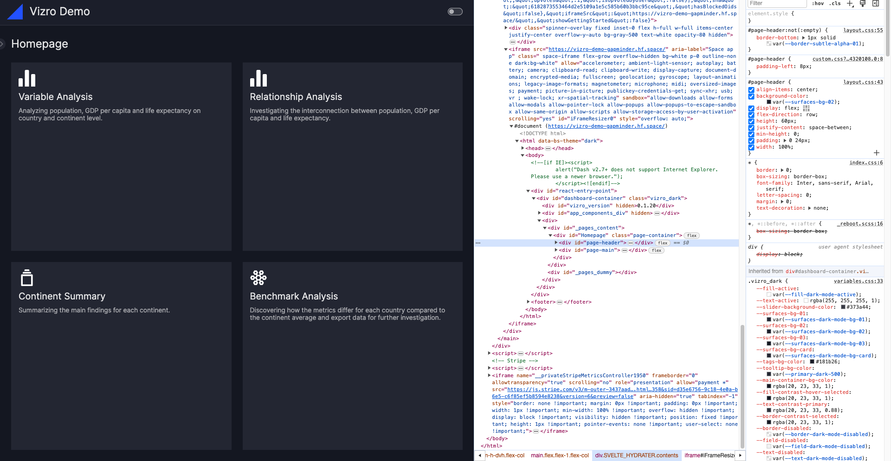
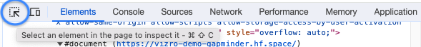
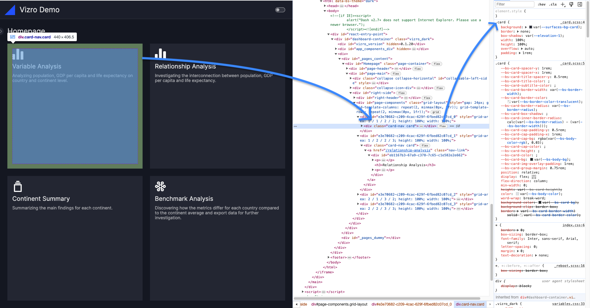
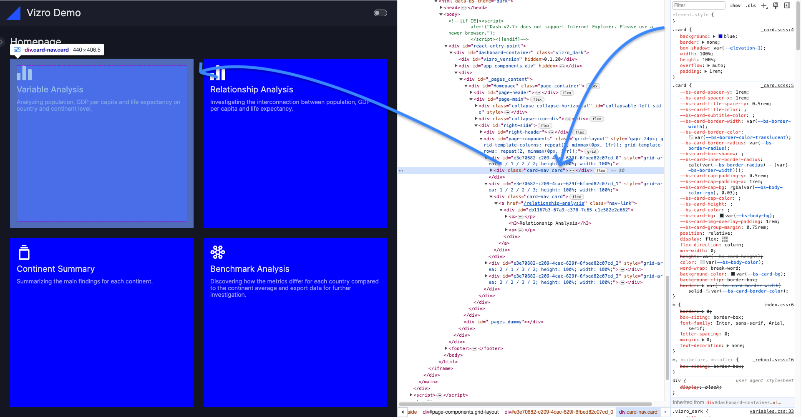
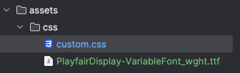
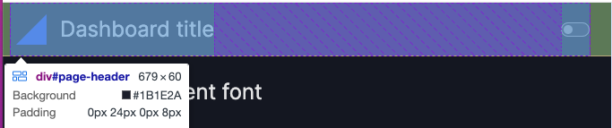

# How to customize dashboard CSS

Vizro is opinionated about visual formatting, and some elements, such as the layout of the navigation and controls, are fixed. You can customize some settings such as background colors, fonts, and other styles via CSS overrides.

To make customizations, you need to:

1. **Add a CSS file to your `assets` folder**. Refer to our user guide on [adding static assets](assets.md#how-to-add-static-assets).
1. **Identify the correct CSS selector** for the component you want to style.
1. **Change the relevant CSS properties** in your CSS file.

!!! note "For quick visual fixes, you may shortcut by using the `extra` argument"

    If you want to alter the visual appearance of a single component quickly, or if you are not yet comfortable with creating a CSS file, you could opt for an alternative approach. Many of our models have an `extra` argument, that let's you pass arguments to the underlying Dash component directly. Often these components have a `style` or `className` argument that let's you alter the style directly. You can check the [API reference](../API-reference/models.md) of the model in question. An example of this would be to make the [`Button`][vizro.models.Button] [outlined and green](../user-guides/button.md).

## Introduction to Vizro CSS

For a short introduction to CSS, we recommend reading this article: [Get Started with CSS in 5 Minutes](https://www.freecodecamp.org/news/get-started-with-css-in-5-minutes-e0804813fc3e/).

For a more comprehensive tutorial, refer to the [W3Schools CSS tutorial](https://www.w3schools.com/css/default.asp). The entire tutorial is beneficial, but the section on [CSS selectors](https://www.w3schools.com/css/css_selectors.asp) will be particularly useful.

In Vizro, the CSS file is read in as an external stylesheet. The most common way of applying any styling to Vizro is therefore through the use of CSS selectors:

- **Element Selector**: Applies the style to all elements inside the Vizro app.

    ```
    h1 {
        font-size: 20px;
    }

    p {
        color: green;
    }
    ```

- **Class selector:** Targets all elements with the given class for styling. All CSS classes must be preceded with a `.` symbol.

    ```
    .card {
        background: lightblue;
    }
    ```

- **ID selector:** Targets the element with the given ID for styling. All CSS IDs must be preceded by a `#` symbol.

    ```
    #my-card {
        background: lightblue;
    }
    ```

## Identify the correct CSS selector

Use Chrome DevTools or a similar tool (Web Inspector, Web Developer Tools, etc.) to inspect the HTML document in your browser.

1. **Open DevTools:** In Google Chrome, right-click on the app and select "Inspect" from the context menu. This opens the HTML document of your Vizro app.

    

1. **Select an element:** Suppose you want to change the background color of your cards. Click the "Select an element in the page to inspect it" icon in the top left corner of the inspect panel.

    

1. **Find the HTML Block:** Hover over the component you want to style. The corresponding HTML block will be highlighted in the HTML document.

    

    Notice that the selected HTML block corresponds to the container of the card and has a CSS class, here it is `card`.

1. **Apply CSS:** Use this CSS class to style the card component. In your CSS file, you can write:

    ```
    .card {
        background-color: blue;
    }
    ```

    This changes the background color for any HTML element with the `card` class.

**Tip:** You can also test your CSS live by editing the CSS attributes in the "Elements" panel. For example, temporarily add `background: blue;`. Note that this change will be lost upon reloading the page.



## CSS overwrites

### Overwrite CSS globally

To overwrite any global CSS property, you need to target the element selector and place your CSS file with the overwrites in the `assets` folder.

!!! example "Overwrite CSS globally"

    === "my_css_file.css"

        ```css
        h1,
        h2 {
            color: hotpink;
        }
        ```

    === "app.py"

        ```py
        import os
        import vizro.models as vm
        from vizro import Vizro

        page = vm.Page(
                title="Changing the header color",
                components=[
                    vm.Card(
                        text="""

                            # This is an <h1> tag

                            ## This is an <h2> tag

                            ###### This is an <h6> tag
                        """)
                    ],
                )

        dashboard = vm.Dashboard(pages=[page])
        Vizro().build(dashboard).run()
        ```

        <b><a target="_blank" href="https://py.cafe/vizro-official/vizro-custom-header-colors">Run and edit this code in PyCafe</a></b>

    === "app.yaml"

        ```yaml
        # Still requires a .py to add data to the data manager and parse YAML configuration
        # See yaml_version example
        pages:
          - components:
              - text: |
                  # This is an <h1> tag

                  ## This is an <h2> tag

                  ###### This is an <h6> tag
                type: card
            title: Changing the header color
        ```

    === "Result"

        [![AssetsCSS]][assetscss]

### Overwrite CSS for selected pages

To style components for a specific page, use the page's `id` in the CSS selectors. By default, this is the [same as the page `title`](pages.md), but such a value might not be a valid CSS identifier.

A suitable `id` must be unique across all models in the dashboard and should contain only alphanumeric characters, hyphens (`-`) and underscores (`_`). In particular, note that spaces are _not_ allowed.

Suppose you want to hide the page title on one page only. Here's how you can achieve this:

1. Give a valid `id` to the `Page`, for example `Page(id="page-with-hidden-title", title="Page with hidden title", ...)`.
1. Identify the CSS class or CSS `id` you need to target. To hide the page title, you need to hide the parent container with the id `right-header`.
1. Use the `id` to hide the content.
1. Add your custom css file to the `assets` folder.

!!! example "Hide page title on selected pages"

    === "my_css_file.css"

        ```css
        #page-with-hidden-title #right-header {
            display: none;
        }
        ```

    === "app.py"

        ```py
        import vizro.models as vm
        from vizro import Vizro

        page_one = vm.Page(
            id="page-with-hidden-title",
            title="Page with hidden title",
            components=[vm.Card(text="""# Placeholder""")]
        )

        page_two = vm.Page(
            title="Page with shown title",
            components=[vm.Card(text="""# Placeholder""")]
        )

        dashboard = vm.Dashboard(pages=[page_one, page_two])
        Vizro().build(dashboard).run()
        ```

        <b><a target="_blank" href="https://py.cafe/vizro-official/vizro-multi-page-example">Run and edit this code in PyCafe</a></b>

    === "app.yaml"

        ```yaml
        # Still requires a .py to add data to the data manager and parse YAML configuration
        # See yaml_version example
        pages:
          - components:
              - text: |
                  # Placeholder
                type: card
            title: Page with hidden title
            id: page-with-hidden-title
          - components:
              - text: |
                  # Placeholder
                type: card
            title: Page with shown title
        ```

    === "Result"

        [![PageTitle]][pagetitle]

### Overwrite CSS for selected components

To adjust CSS properties for specific components, such as altering the appearance of a selected [`Card`][vizro.models.Card] rather than all Cards, you need to supply an `id` to the component you want to style.

Let's say we want to change the `background-color` and `color` of a specific `Card`.

Here's how you can do it:

1. Assign a unique `id` to the relevant `Card`, for example: `Card(id="custom-card", ...)`
1. Run your dashboard and open it in your browser
1. View the HTML document to find the appropriate CSS class or element you need to target, as explained in the section on [identifying the correct CSS selector](#identify-the-correct-css-selector).

It's essential to understand the relationship between the targeted CSS class or element and the component assigned `id`, for example:

<!-- vale off -->

```html title="HTML structure of a card"
<div class="card">
 <div id="custom-card">
  <p>
   Lorem ipsum dolor sit amet consectetur adipisicing elit.
  </p>
 </div>
</div>
```

<!-- vale on -->

- **Main element with `id`:** There is a `<div>` with our `id="custom-card"`.
- **Parent element:** That `<div>` is wrapped inside a parent `<div>` with the class name `"card"`. This is the element we need to target to change the background color.
- **Child element:** The card text is wrapped inside a `<p>` that is a child of the `<div>` with our `id`. This is the element we need to target to change the font color.

!!! example "Customizing CSS properties in selective components"

    === "my_css_file.css"

        ```css
        /* Apply styling to parent */
        .card:has(#custom-card) {
            background-color: white;
        }

        /* Apply styling to child */
        #custom-card p {
            color: black;
        }
        ```

    === "app.py"

        ```py
        import vizro.models as vm
        from vizro import Vizro

        page = vm.Page(
            title="Changing the card color",
            components=[
                vm.Card(id="custom-card", text="""Lorem ipsum dolor sit amet consectetur adipisicing elit."""),
                vm.Card(text="""Lorem ipsum dolor sit amet consectetur adipisicing elit.""")
                     ],
        )

        dashboard = vm.Dashboard(pages=[page])
        Vizro().build(dashboard).run()
        ```

        <b><a target="_blank" href="https://py.cafe/vizro-official/vizro-custom-card-styling">Run and edit this code in PyCafe</a></b>

    === "app.yaml"

        ```yaml
        # Still requires a .py to add data to the data manager and parse YAML configuration
        # See yaml_version example
        pages:
          - components:
              - text: |
                  Lorem ipsum dolor sit amet consectetur adipisicing elit.
                type: card
                id: custom-card
              - text: |
                  Lorem ipsum dolor sit amet consectetur adipisicing elit.
                type: card
            title: Changing the card color
        ```

    === "Result"

        [![CardCSS]][cardcss]

!!! note "Relationship between model ID and CSS ID"

    Some Vizro components produce a single HTML element with an ID that matches the model ID, allowing you to target it directly using the CSS #id selector. Other components generate multiple HTML elements. Within these, the "core" element will have an ID matching the model ID, while non-core elements may have IDs that are variations of it, such as `{model-id}-title`.

    In all instances, you can determine the correct selector by using Chrome DevTools or a similar tool after setting the appropriate model ID.

## Common examples

### Make your CSS responsive to theme switches with variables

To ensure your CSS adapts to theme changes, we recommend using CSS variables (`var`) whenever possible. For a comprehensive list of available variable names, refer to the [Bootstrap documentation](https://getbootstrap.com/docs/5.3/customize/css-variables/).

### Turn off page title

See the example above on [hiding the page title on selected pages](#overwrite-css-for-selected-pages).

### Change the background color of a card

See the example above on [customizing CSS properties in selective components](#overwrite-css-for-selected-components).

### Change the global font

The default fonts for a Vizro app are `Inter, sans-serif, Arial, serif`.

If you need to change the global font, perhaps to adhere to branding guidelines, follow these steps:

1. Download the desired font from a font provider such as [Google Fonts](https://fonts.google.com/).

1. Place the font file (`.ttf`, `woff2`, etc.) into your `assets` folder. Here’s an example of what the assets folder might look like:

    

1. Add the font to your CSS file using the `@font-face` rule and apply the font globally to your Vizro app, making sure to specify fallback fonts. Add the following to your `custom.css` file:

    ```css
    @font-face {
        font-family: PlayfairDisplay;
        src: url("PlayfairDisplay-VariableFont_wght.ttf") format("truetype");
    }

    * {
        font-family: PlayfairDisplay, Inter, sans-serif, Arial, serif;
    }
    ```

1. Note that the modification above applies solely to the dashboard font. To also change the font within the Plotly charts, you must specify this at the beginning of your `app.py` file:

    ```python
    import plotly.io as pio

    pio.templates["vizro_dark"]["layout"]["font_family"] = "PlayfairDisplay, Inter, sans-serif, Arial, serif"
    pio.templates["vizro_light"]["layout"]["font_family"] = "PlayfairDisplay, Inter, sans-serif, Arial, serif"
    ```

### Reposition the logo

By default, the logo appears in the top left corner of the dashboard. You can move it further to the left or right by adjusting the `padding` of the `#page-header` element. Here is an example of how to achieve this:

```css
#page-header {
    padding-left: 8px;
}
```



[assetscss]: ../../assets/user_guides/assets/css_change.png
[cardcss]: ../../assets/user_guides/assets/css_change_card.png
[pagetitle]: ../../assets/user_guides/assets/css_page_title.png
