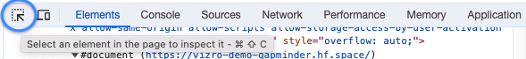

# Customizing CSS

Vizro is quite opinionated when it comes to visual formatting, but it allows for some customization if you want to
deviate from the default settings. While certain elements, such as the layout of the navigation and components,
are fixed, you can customize background colors, fonts, and other styles via CSS overrides.

To do so, you need to:

1. Add a CSS file to your `assets` folder, refer to our user guide on [adding static assets](assets.md#how-to-add-static-assets).
2. Identify the right CSS selector for the component you want to style.
3. Add the desired changed properties to your CSS file.


## Intro to CSS
Customizations are typically made using CSS. For a quick 5-minute introduction to CSS, we recommend reading
this article: [Get Started with CSS in 5 Minutes.](https://www.freecodecamp.org/news/get-started-with-css-in-5-minutes-e0804813fc3e/)

For a more comprehensive tutorial, refer to the [W3Schools CSS tutorial](https://www.w3schools.com/css/default.asp).
The entire tutorial is beneficial, but the section on [CSS selectors](https://www.w3schools.com/css/css_selectors.asp)
will be particularly useful.

In Vizro, the CSS file is read in as an external stylesheet. The most common way of applying any styling to Vizro is therefore
through the use of CSS selectors:

- **Element Selector**: Applies the style to all elements inside the Vizro app.

    ```
    h1 {
        font-size: 20px;
    }

    p {
        color: green;
    }
    ```

- **Class selector:** Applies the style to all elements with the specified classname.

    ```
    .card {
        background: lightblue;
    }
    ```

- **ID selector:** Applies the style to the element with the specified ID.

    ```
    #my-card {
        background: lightblue;
    }
    ```


## Identify the right CSS selector

Use Chrome DevTools or a similar tool (Web Inspector, Web Developer Tools, etc.) to inspect the HTML document in your browser.

1. **Open DevTools:** In Google Chrome, right-click on the app and select "Inspect" from the context menu. This will open the
HTML document of your Vizro app.

    


2. **Select an Element:** Suppose you want to change the background color of your cards. Click the
"Select an element in the page to inspect it" icon in the top left corner of the inspect panel.

    

3. **Find the HTML Block:** Hover over the component you want to style. The corresponding HTML block will be
highlighted in the document.

    

    Notice that the selected HTML block corresponds to the container of the card and has a CSS class, here it is `card`.

4. **Apply CSS:** Use this CSS class to style the card component. In your CSS file, you can write:

    ```
    .card {
        background-color: blue;
    }
    ```

    This will change the background color for any HTML element with the `card` class.

**Tip:** You can also test your CSS live by editing the CSS attributes in the "Elements" panel.
For example, temporarily add `background: blue; note that this change will be lost upon reloading the page.


## CSS overwrites

### Overwrite CSS globally
To overwrite any global CSS properties of existing components, target the right CSS property and place your CSS files
in the `assets` folder. This will overwrite any existing defaults for that CSS property.

For reference, see the [Vizro CSS files](https://github.com/mckinsey/vizro/tree/main/vizro-core/src/vizro/static/css).

!!! example "Customizing global CSS properties"
    === "my_css_file.css"
    ```css
    h1, h2 {
     color: hotpink;
    }
    ```
    === "app.py"
        ```py
        import os
        import vizro.models as vm
        from vizro import Vizro

        page = vm.Page(
                title="Changing the header color",
                components=[
                    vm.Card(
                        text="""

                            # This is an <h1> tag

                            ## This is an <h2> tag

                            ###### This is an <h6> tag
                        """)
                    ],
                )

        dashboard = vm.Dashboard(pages=[page])
        Vizro().build(dashboard).run()
        ```

        <b><a target="_blank" href="https://py.cafe/vizro-official/vizro-custom-header-colors">Run and edit this code in Py.Cafe</a></b>

    === "app.yaml"
        ```yaml
        # Still requires a .py to add data to the data manager and parse YAML configuration
        # See yaml_version example
        pages:
        - components:
            - text: |
                # This is an <h1> tag

                ## This is an <h2> tag

                ###### This is an <h6> tag
              type: card
          title: Changing the header color
        ```
    === "Result"
         [![AssetsCSS]][AssetsCSS]

    [AssetsCSS]: ../../assets/user_guides/assets/css_change.png


### Overwrite CSS for selected pages
To style components for a specific page, use the page's `id` in CSS selectors. By default, this is the
[same as the page `title`](pages.md), but such a value might not be a valid CSS identifier.
A suitable `id` must be unique across all models in the dashboard and should contain only alphanumeric
characters, hyphens (`-`) and underscores (`_`). In particular, note that spaces are _not_ allowed.

Suppose you want to hide the page title on one page only. Here's how you can achieve this:

1. Give a valid `id` to the `Page`, for example `Page(id="page-with-hidden-title", title="Page with hidden title", ...)`.
2. Identify the CSS class or CSS `id` you need to target. To hide the page title, you need to hide the container with the `id `right-header`.
3. Use the `id` in combination with CSS selectors to change the relevant CSS properties.
4. Add your custom css file to the `assets` folder as explained above.


!!! example "Hide page title on selected pages"
    === "my_css_file.css"
    ```css
    #page-with-hidden-title #right-header {
      display: none;
    }
    ```
    === "app.py"
        ```py
        import vizro.models as vm
        from vizro import Vizro

        page_one = vm.Page(
            id="page-with-hidden-title",
            title="Page with hidden title",
            components=[vm.Card(text="""# Placeholder""")]
        )

        page_two = vm.Page(
            title="Page with shown title",
            components=[vm.Card(text="""# Placeholder""")]
        )

        dashboard = vm.Dashboard(pages=[page_one, page_two])
        Vizro().build(dashboard).run()
        ```

        <b><a target="_blank" href="https://py.cafe/vizro-official/vizro-multi-page-example">Run and edit this code in Py.Cafe</a></b>

    === "app.yaml"
        ```yaml
        # Still requires a .py to add data to the data manager and parse YAML configuration
        # See yaml_version example
        pages:
        - components:
            - text: |
                # Placeholder
              type: card
          title: Page with hidden title
          id: page-with-hidden-title
        - components:
            - text: |
                # Placeholder
              type: card
          title: Page with shown title
        ```
    === "Result"
         [![PageTitle]][PageTitle]

    [PageTitle]: ../../assets/user_guides/assets/css_page_title.png


### Overwrite CSS for selected components
To adjust CSS properties for specific components, like altering the appearance of a selected [`Card`][vizro.models.Card] rather than all `Card`s,
you need to use a CSS selector that targets the right CSS property. If you're unfamiliar with CSS selectors,
you can refer to this [tutorial](https://developer.mozilla.org/en-US/docs/Web/CSS/CSS_selectors/Selector_structure) for guidance.

Let's say we want to change the background and font-color of a specific `Card`.

Here's how you can do it:

1. Assign a unique `id` to the relevant `Card`, for example: `Card(id="custom-card", ...)`
2. Run your dashboard and open it in your browser
3. View the HTML source to find the appropriate CSS class or element you need to target. For example, if you inspect a page with [Chrome DevTools](https://developer.chrome.com/docs/devtools/) then you can [directly copy the CSS selector](https://stackoverflow.com/questions/4500572/how-can-i-get-the-css-selector-in-chrome).

It's essential to understand the relationship between the targeted CSS class or element and the component assigned the `id`, for example:

<!-- vale off -->
```html title="HTML structure of a `Card`"
<div class="card">
    <div id="custom-card">
        <p>Lorem ipsum dolor sit amet consectetur adipisicing elit.</p>
    </div>
</div>
```
<!-- vale on -->

* **Main element with `id`:** There is a `<div>` with our `id="custom-card"`.
* **Parent element:** That `<div>` is wrapped inside a parent `<div>` with the class name `"card"`. This is the element we need to target to change the background color.
* **Child element:** The card text is wrapped inside a `<p>` that is a child of the `<div>` with our `id`. This is the element we need to target to change the font color.


!!! example "Customizing CSS properties in selective components"
    === "my_css_file.css"
    ```css
    /* Apply styling to parent */
    .card:has(#custom-card) {
      background-color: white;
    }

    /* Apply styling to child */
    #custom-card p {
      color: black;
    }
    ```
    === "app.py"
        ```py
        import vizro.models as vm
        from vizro import Vizro

        page = vm.Page(
            title="Changing the card color",
            components=[
                vm.Card(id="custom-card", text="""Lorem ipsum dolor sit amet consectetur adipisicing elit."""),
                vm.Card(text="""Lorem ipsum dolor sit amet consectetur adipisicing elit.""")
                     ],
        )

        dashboard = vm.Dashboard(pages=[page])

        Vizro().build(dashboard).run()
        ```

        <b><a target="_blank" href="https://py.cafe/vizro-official/vizro-custom-card-styling">Run and edit this code in Py.Cafe</a></b>

    === "app.yaml"
        ```yaml
        # Still requires a .py to add data to the data manager and parse YAML configuration
        # See yaml_version example
        pages:
        - components:
            - text: |
                Lorem ipsum dolor sit amet consectetur adipisicing elit.
              type: card
              id: custom-card
            - text: |
                Lorem ipsum dolor sit amet consectetur adipisicing elit.
              type: card
          title: Changing the card color
        ```
    === "Result"
         [![CardCSS]][CardCSS]

    [CardCSS]: ../../assets/user_guides/assets/css_change_card.png


Some Vizro components produce a single HTML element with an ID that matches the model ID, allowing you to target it
directly using the #id selector in CSS. Other components generate multiple HTML elements. Within these, the "core"
element will have an ID matching the model ID, while non-core elements may have IDs that are variations of it,
such as `{model-id}-title`.

In all instances, you can determine the correct selector by using Chrome DevTools or a similar tool after setting the
appropriate model ID.


## Common examples

### Turn off page title
See the example above on [hiding the page title on selected pages](#overwrite-css-for-selected-pages).

### Change the background color of a card
See the example above on [customizing CSS properties in selective components](#overwrite-css-for-selected-components).

### Change the font
XXXX

### Change the background color of a container
XXXX

### Change padding to align a logo
XXX
