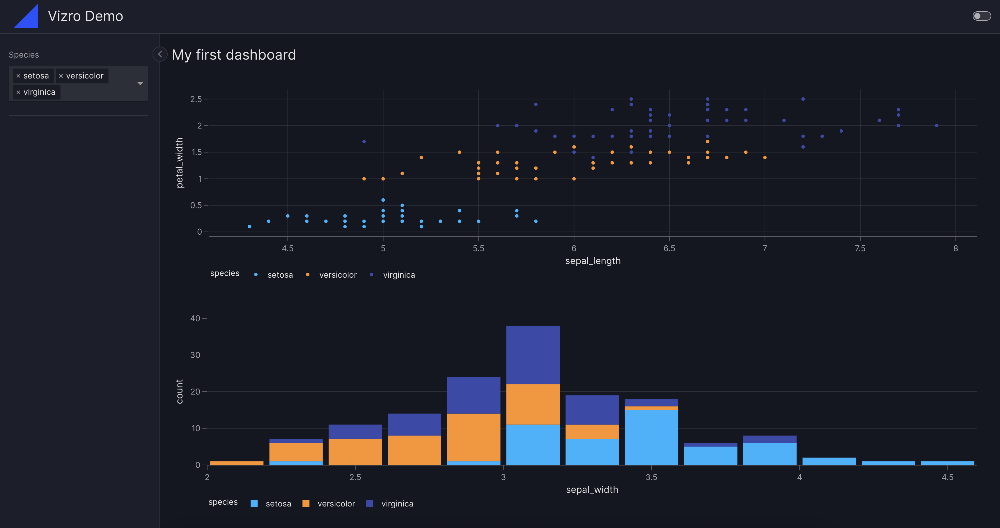
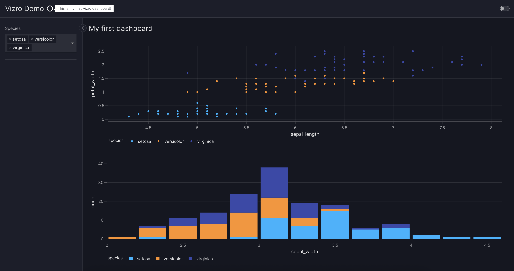

# How to create a dashboard

This guide shows you how to configure and call a [`Dashboard`][vizro.models.Dashboard] using either pydantic models, Python dictionaries, YAML, or JSON.

To create a dashboard:

1. Choose one of the possible configuration syntaxes
1. Create your `pages`, see our [guide on Pages](pages.md)
1. (optional) Customize your `navigation`, see our [guide on Navigation](navigation.md)
1. (optional) Set a `title` for your dashboard
1. (optional) Set a `description` for your dashboard to [add a tooltip](#add-a-dashboard-tooltip) and [set meta tags](#meta-tags-for-social-media)
1. (optional) Choose a `theme`, see our [guide on Themes](themes.md)
1. Add your `dashboard` to the `build` call of Vizro

## Use dashboard configuration options

!!! example "Dashboard Configuration Syntaxes"

    === "app.py - pydantic models"

        ```{.python pycafe-link}
        import vizro.plotly.express as px
        from vizro import Vizro
        import vizro.models as vm

        df = px.data.iris()

        page = vm.Page(
            title="My first dashboard",
            components=[
                vm.Graph(figure=px.scatter(df, x="sepal_length", y="petal_width", color="species")),
                vm.Graph(figure=px.histogram(df, x="sepal_width", color="species"))],
            controls=[
                vm.Filter(column="species"),
            ],
        )

        dashboard = vm.Dashboard(pages=[page])
        Vizro().build(dashboard).run()
        ```

    === "app.py - Python dict"

        ```py
        import vizro.plotly.express as px
        from vizro import Vizro

        df = px.data.iris()

        page = {
            "title": "My first dashboard",
            "components": [
                {
                    "type": "graph",
                    "figure": px.scatter(
                        df,
                        x="sepal_length",
                        y="petal_width",
                        color="species",
                    ),
                },
                {
                    "type": "graph",
                    "figure": px.histogram(
                        df,
                        x="sepal_width",
                        color="species"
                    ),
                },
            ],
            "controls": [
                {
                    "type": "filter",
                    "column": "species",
                },
            ],
        }

        dashboard = {"pages": [page]}
        Vizro().build(dashboard).run()
        ```

    === "dashboard.yaml"

        ```yaml
        # Still requires a .py to add data to the data manager and parse YAML configuration
        # See yaml_version example
        pages:
          - components:
              - figure:
                  _target_: scatter
                  data_frame: iris
                  x: sepal_length
                  y: petal_width
                  color: species
                type: graph
              - figure:
                  _target_: histogram
                  data_frame: iris
                  x: sepal_width
                  color: species
                type: graph
            controls:
              - column: species
                type: filter
            title: My first dashboard
        ```

    === "dashboard.json"

        ```json
        {
          "pages": [
            {
              "components": [
                {
                  "figure": {
                    "_target_": "scatter",
                    "color": "species",
                    "data_frame": "iris",
                    "x": "sepal_length",
                    "y": "petal_width"
                  },
                  "type": "graph"
                },
                {
                  "figure": {
                    "_target_": "histogram",
                    "color": "species",
                    "data_frame": "iris",
                    "x": "sepal_width"
                  },
                  "type": "graph"
                }
              ],
              "controls": [
                {
                  "column": "species",
                  "type": "filter"
                }
              ],
              "title": "My first dashboard"
            }
          ]
        }
        ```

    === "Result"

        [![Dashboard]][dashboard]

!!! note "Extra `.py` files for `yaml` and `json` required"

    Note that in the `yaml` and `json` example an extra `.py` is required to register the data and parse the yaml/json configuration.

    === "app.py for yaml"

        ```py
        from pathlib import Path

        import yaml

        import vizro.plotly.express as px
        from vizro import Vizro
        from vizro.managers import data_manager
        from vizro.models import Dashboard

        data_manager["iris"] = px.data.iris()
        dashboard = yaml.safe_load(Path("dashboard.yaml").read_text(encoding="utf-8"))
        dashboard = Dashboard(**dashboard)

        Vizro().build(dashboard).run()
        ```

    === "app.py for json"

        ```py
        import json
        from pathlib import Path

        import vizro.plotly.express as px
        from vizro import Vizro
        from vizro.managers import data_manager
        from vizro.models import Dashboard

        data_manager["iris"] = px.data.iris()
        dashboard = json.loads(Path("dashboard.json").read_text(encoding="utf-8"))
        dashboard = Dashboard(**dashboard)

        Vizro().build(dashboard).run()
        ```

After running the dashboard, you can access the dashboard via `localhost:8050`.

## Add a dashboard title

If supplied, the `title` of the [`Dashboard`][vizro.models.Dashboard] displays a heading at the top of every page.

## Add a dashboard logo

Vizro [automatically incorporate the dashboard logo](assets.md/#add-a-logo-image) in the top-left corner of each page if an image named `logo.<extension>` is present within the assets folder.



## Add a dashboard tooltip

The `description` argument enables you to add helpful context to your dashboard by displaying an info icon next to its title. Hovering over the icon shows a tooltip with your provided text.

You can provide [Markdown text](https://markdown-guide.readthedocs.io/) as a string to use the default info icon or a [`Tooltip`][vizro.models.Tooltip] model to use any icon from the [Google Material Icons library](https://fonts.google.com/icons).



## Meta tags for social media

Vizro automatically adds [meta tags](https://metatags.io/) to display a preview card when your app is shared on social media and chat clients. To see an example, try sharing an example from the [Vizro examples gallery](https://vizro.mckinsey.com/).

The preview includes:

- the dashboard `title` and the [Page `title`][vizro.models.Page]
- an image if a [suitable assets file exists](assets.md/#include-a-meta-tags-image)
- the dashboard `description` or the [Page `description`][vizro.models.Page]

## Browser title

The [website icon](assets.md/#change-the-favicon), Dashboard `title` (if supplied) and [Page `title`][vizro.models.Page] are displayed in the browser's title bar. For example, if your Dashboard `title` is "Vizro Demo" and the Page `title` is "Homepage", then the title in the browser tab will be "Vizro Demo: Homepage".

[dashboard]: ../../assets/user_guides/dashboard/dashboard.png
