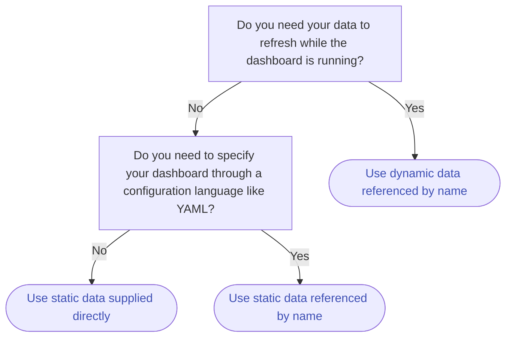

# How to connect your dashboard to data

Vizro supports two different types of data:

- [Static data](#static-data): pandas DataFrame. This is the simplest method and best to use if you do not need the more advanced functionality of dynamic data.
- [Dynamic data](#dynamic-data): function that returns a pandas DataFrame. This is a bit more complex to understand but has more advanced functionality such as the ability to refresh data while the dashboard is running.

The following flowchart shows what you need to consider when choosing how to set up your data.



??? note "Static vs. dynamic data comparison"

    This table gives a full comparison between static and dynamic data. Do not worry if you do not yet understand everything in it; it will become clearer after reading more about [static data](#static-data) and [dynamic data](#dynamic-data)!

    |                                                               | Static           | Dynamic                                  |
    | ------------------------------------------------------------- | ---------------- | ---------------------------------------- |
    | Required Python type                                          | pandas DataFrame | Function that returns a pandas DataFrame |
    | Can be supplied directly in `data_frame` argument of `figure` | Yes              | No                                       |
    | Can be referenced by name after adding to data manager        | Yes              | Yes                                      |
    | Can be refreshed while dashboard is running                   | No               | Yes                                      |
    | Production-ready                                              | Yes              | Yes                                      |

If you have a [Kedro](https://kedro.org/) project, you should use Vizro's [integration with the Kedro Data Catalog](kedro-data-catalog.md) to add [`kedro_datasets.pandas`](https://docs.kedro.org/en/stable/kedro_datasets.html) data to the Vizro data manager.

!!! note "Kedro Data Catalog as a data source registry"

    Even if you do not have a Kedro project, you can still [use a Kedro Data Catalog](kedro-data-catalog.md#create-a-kedro-data-catalog) as a YAML registry of your dashboard's data sources. This separates configuration of your data sources from your app's code and is the recommended approach if you have many data sources or a complex project. Here is an example `catalog.yaml` file:

    ```yaml
    motorbikes:
      type: pandas.CSVDataset
      filepath: s3://your_bucket/data/motorbikes.csv
      load_args:
        sep: ','
        na_values: [NA]
      credentials: s3_credentials
    ```

## Static data

A static data source is the simplest way to send data to your dashboard and should be used for any data that does not need to be reloaded while the dashboard is running. It is production-ready and works out of the box in a multi-process deployment. If you need data to be refreshed without restarting the dashboard then you should instead use [dynamic data](#dynamic-data).

### Supply directly

You can directly supply a pandas DataFrame into components such as [graphs](graph.md), [tables](table.md), and [figures](figure.md).

The below example uses the Iris data saved to a file `iris.csv` in the same directory as `app.py`. This data can be generated using `px.data.iris()` or [downloaded](../../assets/user_guides/data/iris.csv).

!!! example "Static data supplied directly"

    === "app.py"

        ```py
        from vizro import Vizro
        import pandas as pd
        import vizro.plotly.express as px
        import vizro.models as vm

        iris = pd.read_csv("iris.csv") # (1)!

        page = vm.Page(
            title="Static data example",
            components=[
                vm.Graph(figure=px.box(iris, x="species", y="petal_width", color="species")),
            ]
        )

        dashboard = vm.Dashboard(pages=[page])
        Vizro().build(dashboard).run()
        ```

        1. `iris` is a pandas DataFrame created by reading from the CSV file `iris.csv`.

    === "Result"

        [![DataBasic]][databasic]

The [`Graph`][vizro.models.Graph], [`AgGrid`][vizro.models.AgGrid] and [`Table`][vizro.models.Table] models all have an argument called `figure`. This accepts a function (in the above example, `px.scatter`) that takes a pandas DataFrame as its first argument. The name of this argument is always `data_frame`. When configuring the dashboard using Python, it is optional to give the name of the argument: if you like, you could write `data_frame=iris` instead of `iris`.

!!! note

    With static data, once the dashboard is running, the data shown in the dashboard cannot change even if the source data in `iris.csv` changes. The code `iris = pd.read_csv("iris.csv")` is only executed once when the dashboard is first started. If you would like changes to source data to flow through to the dashboard then you must use [dynamic data](#dynamic-data).

### Reference by name

If you would like to specify your dashboard configuration through YAML then you must first add your data to the data manager, importable as `vizro.managers.data_manager`. The value of the `data_frame` argument in the YAML configuration should then refer to the name of your data in the data manager.

!!! example "Static data referenced by name"

    === "app.py"

        ```py
        import yaml

        from vizro import Vizro
        import vizro.plotly.express as px
        import vizro.models as vm
        import pandas as pd
        from vizro.managers import data_manager

        data_manager["iris"] = pd.read_csv("iris.csv") # (1)!

        dashboard = yaml.safe_load(Path("dashboard.yaml").read_text(encoding="utf-8"))
        dashboard = Dashboard(**dashboard)

        Vizro().build(dashboard).run()
        ```

        1. `"iris"` is the name of a data source added to the data manager. This data is a pandas DataFrame created by reading from the CSV file `iris.csv`.

    === "dashboard.yaml"

        ```yaml
        pages:
          - components:
              figure:
                _target_: box
                data_frame: iris # (1)!
                x: species
                y: petal_width
                color: species
              type: graph
              title: Static data example
        ```

        1. Refer to the `"iris"` data source in the data manager.

    === "Result"

        [![DataBasic]][databasic]

It is also possible to refer to a named data source using the Python API: `px.scatter("iris", ...)` or `px.scatter(data_frame="iris", ...)` would work if the `"iris"` data source has been registered in the data manager.

## Dynamic data

A dynamic data source is a Python function that returns a pandas DataFrame. This function is executed when the dashboard is initially started and _can be executed again while the dashboard is running_. This makes it possible to refresh the data shown in your dashboard without restarting the dashboard itself. If you do not require this functionality then you should use [static data](#static-data) instead.

Unlike static data, dynamic data cannot be supplied directly into the `data_frame` argument of a `figure`. Instead, it must first be added to the data manager and then referenced by name.

The example below shows how data is fetched dynamically every time the page is refreshed. When you run the code and refresh the page the function `load_iris_data` is re-run, which returns different data each time. The example uses the Iris data saved to a file `iris.csv` in the same directory as `app.py`. This data can be generated using `px.data.iris()` or [downloaded](../../assets/user_guides/data/iris.csv).

!!! example "Dynamic data"

    === "app.py"

        ```py
        from vizro import Vizro
        import pandas as pd
        import vizro.plotly.express as px
        import vizro.models as vm

        from vizro.managers import data_manager

        def load_iris_data():
            iris = pd.read_csv("iris.csv") # (1)!
            return iris.sample(50) # (2)!

        data_manager["iris"] = load_iris_data # (3)!

        page = vm.Page(
            title="Update the chart on page refresh",
            components=[
                vm.Graph(figure=px.box("iris", x="species", y="petal_width", color="species")) # (4)!
            ],
        )

        dashboard = vm.Dashboard(pages=[page])
        Vizro().build(dashboard).run()
        ```

        1. `iris` is a pandas DataFrame created by reading from the CSV file `iris.csv`.
        1. To demonstrate that dynamic data can change when the page is refreshed, select 50 points at random. This simulates what would happen if your file `iris.csv` were constantly changing.
        1. To use `load_iris_data` as dynamic data it must be added to the data manager. You should **not** actually call the function as `load_iris_data()`; doing so would result in static data that cannot be reloaded.
        1. Dynamic data is referenced by the name of the data source `"iris"`.

    === "Result"

        [![DynamicData]][dynamicdata]

Since dynamic data sources must always be added to the data manager and referenced by name, they may be used in YAML configuration [exactly the same way as for static data sources](#reference-by-name).

### Configure cache

By default, a dynamic data function executes every time the dashboard is refreshed. Data loading is batched so that a dynamic data function that supplies multiple graphs on the same page only executes _once_ per page refresh. Even with this batching, if loading your data is a slow operation, your dashboard performance may suffer.

The Vizro data manager has a server-side caching mechanism to help solve this. Vizro's cache uses [Flask-Caching](https://flask-caching.readthedocs.io/en/latest/), which supports a number of possible cache backends and [configuration options](https://flask-caching.readthedocs.io/en/latest/#configuring-flask-caching). By default, the cache is turned off.

<!-- vale off -->

In a development environment the easiest way to enable caching is to use a [simple memory cache](https://cachelib.readthedocs.io/en/stable/simple/) with the default configuration options. This is achieved by adding one line to the above example to set `data_manager.cache`:

!!! example "Simple cache with default timeout of 5 minutes"

    ```py hl_lines="13"
    from flask_caching import Cache
    from vizro import Vizro
    import pandas as pd
    import vizro.plotly.express as px
    import vizro.models as vm

    from vizro.managers import data_manager

    def load_iris_data():
        iris = pd.read_csv("iris.csv")
        return iris.sample(50)

    data_manager.cache = Cache(config={"CACHE_TYPE": "SimpleCache"})
    data_manager["iris"] = load_iris_data

    page = vm.Page(
        title="Update the chart on page refresh",
        components=[
            vm.Graph(figure=px.box("iris", x="species", y="petal_width", color="species"))
        ],
    )

    dashboard = vm.Dashboard(pages=[page])
    Vizro().build(dashboard).run()
    ```

By default, when caching is turned on, dynamic data is cached in the data manager for 5 minutes. A refresh of the dashboard within this time interval will fetch the pandas DataFrame from the cache and _not_ re-run the data loading function. Once the cache timeout period has elapsed, the next refresh of the dashboard will re-execute the dynamic data loading function. The resulting pandas DataFrame will again be put into the cache and not expire until another 5 minutes has elapsed.

If you would like to alter some options, such as the default cache timeout, then you can specify a different cache configuration:

```python title="Simple cache with timeout set to 10 minutes"
data_manager.cache = Cache(config={"CACHE_TYPE": "SimpleCache", "CACHE_DEFAULT_TIMEOUT": 600})
```

!!! warning

    Simple cache exists purely for single-process development purposes and is not intended to be used in production. If you deploy with multiple workers, [for example with Gunicorn](run-deploy.md/#gunicorn), then you should use a production-ready cache backend. All of Flask-Caching's [built-in backends](https://flask-caching.readthedocs.io/en/latest/#built-in-cache-backends) other than `SimpleCache` are suitable for production. In particular, you might like to use [`FileSystemCache`](https://cachelib.readthedocs.io/en/stable/file/) or [`RedisCache`](https://cachelib.readthedocs.io/en/stable/redis/):

    ```py title="Production-ready caches"
    # Store cached data in CACHE_DIR
    data_manager.cache = Cache(config={"CACHE_TYPE": "FileSystemCache", "CACHE_DIR": "cache"})

    # Use Redis key-value store
    data_manager.cache = Cache(config={"CACHE_TYPE": "RedisCache", "CACHE_REDIS_HOST": "localhost", "CACHE_REDIS_PORT": 6379})
    ```

    Since Flask-Caching relies on [`pickle`](https://docs.python.org/3/library/pickle.html), which can execute arbitrary code during unpickling, you should not cache data from untrusted sources. Doing so [could be unsafe](https://github.com/pallets-eco/flask-caching/pull/209).

Note that when a production-ready cache backend is used, the cache is persisted beyond the Vizro process and is not cleared by restarting your server. To clear the cache then you must do so manually, for example, if you use `FileSystemCache` then you would delete your `cache` directory. Persisting the cache can also be useful for development purposes when handling data that takes a long time to load: even if you do not need the data to refresh while your dashboard is running, it can speed up your development loop to use dynamic data with a cache that is persisted between repeated runs of Vizro.

<!-- vale on -->

#### Set timeouts

You can change the timeout of the cache independently for each dynamic data source in the data manager using the `timeout` setting (measured in seconds). A `timeout` of 0 indicates that the cache does not expire. This is effectively the same as using [static data](#static-data).

```py title="Set the cache timeout for each dynamic data source"
from vizro.managers import data_manager
from flask_caching import Cache

data_manager.cache = Cache(config={"CACHE_TYPE": "SimpleCache", "CACHE_DEFAULT_TIMEOUT": 600})

# Cache of default_expire_data expires every 10 minutes, the default set by CACHE_DEFAULT_TIMEOUT
data_manager["default_expire_data"] = load_iris_data

# Set cache of fast_expire_data to expire every 10 seconds
data_manager["fast_expire_data"] = load_iris_data
data_manager["fast_expire_data"].timeout = 10

# Set cache of slow_expire_data to expires every hour
data_manager["slow_expire_data"] = load_iris_data
data_manager["slow_expire_data"].timeout = 60 * 60

# Set cache of no_expire_data to never expire
data_manager["no_expire_data"] = load_iris_data
data_manager["no_expire_data"].timeout = 0
```

### Parametrize data loading

You can give arguments to your dynamic data loading function that can be modified from the dashboard. For example:

- To load different versions of the same data.
- To handle large datasets you can use an argument that controls the amount of data that is loaded. This effectively pre-filters data before it reaches the Vizro dashboard.

In general, a parametrized dynamic data source should always return a pandas DataFrame with a fixed schema (column names and types). This ensures that page components and controls continue to work as expected when the parameter is changed on screen.

To add a parameter to control a dynamic data source, do the following:

1. add the appropriate argument to your dynamic data function and specify a default value for the argument.
1. give an `id` to all components that have the data source you wish to alter through a parameter.
1. [add a parameter](parameters.md) with `targets` of the form `<target_component_id>.data_frame.<dynamic_data_argument>` and a suitable [selector](selectors.md).

For example, let us extend the [dynamic data example](#dynamic-data) above into an example of how parametrized dynamic data works. The `load_iris_data` can take an argument `number_of_points` controlled from the dashboard with a [`Slider`][vizro.models.Slider].

!!! example "Parametrized dynamic data"

    === "app.py"

        ```py hl_lines="8 10 20-23"
        from vizro import Vizro
        import pandas as pd
        import vizro.plotly.express as px
        import vizro.models as vm

        from vizro.managers import data_manager

        def load_iris_data(number_of_points=10): # (1)!
            iris = pd.read_csv("iris.csv") # (2)!
            return iris.sample(number_of_points) # (3)!

        data_manager["iris"] = load_iris_data # (4)!

        page = vm.Page(
            title="Update the chart on page refresh",
            components=[
                vm.Graph(id="graph", figure=px.box("iris", x="species", y="petal_width", color="species")) # (5)!
            ],
            controls=[
                vm.Parameter(
                    targets=["graph.data_frame.number_of_points"], # (6)!
                    selector=vm.Slider(min=10, max=100, step=10, value=10),
                )
            ],
        )

        dashboard = vm.Dashboard(pages=[page])
        Vizro().build(dashboard).run()
        ```

        1. `load_iris_data` takes a single argument, `number_of_points`, with a default value of 10.
        1. `iris` is a pandas DataFrame created by reading from the CSV file `iris.csv`.
        1. Sample points at random, where `number_of_points` gives the number of points selected.
        1. To use `load_iris_data` as dynamic data it must be added to the data manager. You should **not** actually call the function as `load_iris_data()` or `load_iris_data(number_of_points=...)`; doing so would result in static data that cannot be reloaded.
        1. Give the `vm.Graph` component `id="graph"` so that the `vm.Parameter` can target it. Dynamic data is referenced by the name of the data source `"iris"`.
        1. Create a `vm.Parameter` to target the `number_of_points` argument for the `data_frame` used in `graph`.

    === "Result"

        [![ParametrizedDynamicData]][parametrizeddynamicdata]

Parametrized data loading is compatible with [caching](#configure-cache). The cache uses [memoization](https://flask-caching.readthedocs.io/en/latest/#memoization), so that the dynamic data function's arguments are included in the cache key. This means that `load_iris_data(number_of_points=10)` is cached independently of `load_iris_data(number_of_points=20)`.

!!! warning

    You should always [treat the content of user input as untrusted](https://community.plotly.com/t/writing-secure-dash-apps-community-thread/54619). For example, you should not expose a filepath to load without passing it through a function like [`werkzeug.utils.secure_filename`](https://werkzeug.palletsprojects.com/en/3.0.x/utils/#werkzeug.utils.secure_filename), or you might enable arbitrary access to files on your server.

You cannot pass [nested parameters](parameters.md#nested-parameters) to dynamic data. You can only target the top-level arguments of the data loading function, not the nested keys in a dictionary.

### Filters

When a [filter](filters.md) depends on dynamic data and no `selector` is explicitly defined in the `vm.Filter` model, it is called a _dynamic filter_. A dynamic filter always reflects the latest data since the available selector values update either when the page refreshes or when a relevant [dynamic data parameter](#parametrize-data-loading) changes.

The mechanism behind updating dynamic filters works exactly like other non-control components such as `vm.Graph`. However, unlike such components, a filter can depend on multiple data sources. If at least one data source of the components in the filter's `targets` is dynamic then the filter is dynamic. Remember that when `targets` is not explicitly specified, a filter applies to all the components on a page that use a DataFrame including `column`.

A dynamic filter behaves as follows when updated:

- The filter's selector updates its available values:
    - For [categorical selectors](selectors.md#categorical-selectors), `options` updates to give all unique values found in `column` across all the data sources of components in `targets`.
    - For [numerical selectors](selectors.md#numerical-selectors) and [temporal selectors](selectors.md#temporal-selectors), `min` and `max` update to give the overall minimum and maximum values found in `column` across all the data sources of components in `targets`.
- The value selected on screen by a dashboard user _does not_ change. If the selected value is not already present in the new set of available values then the `options` or `min` and `max` are modified to include it. In this case, the filtering operation might result in an empty DataFrame.
- Even though the values present in a data source can change, the schema should not: `column` should remain present and of the same type in the data sources. The `targets` of the filter and selector type cannot change while the dashboard is running. For example, a `vm.Dropdown` selector cannot turn into `vm.RadioItems`.

For example, let us extend the [parametrized dynamic data example](#parametrize-data-loading) above with a filter. When you run the code and refresh the page, the filter and Graph update automatically. The same happens when the dynamic data parameter [`Slider`][vizro.models.Slider] changes, ensuring the latest data is always reflected.

!!! example "Dynamic filters"

    === "app.py"

        ```py hl_lines="20"
        from vizro import Vizro
        import pandas as pd
        import vizro.plotly.express as px
        import vizro.models as vm

        from vizro.managers import data_manager

        def load_iris_data(number_of_points=10):
            iris = pd.read_csv("iris.csv")
            return iris.sample(number_of_points)

        data_manager["iris"] = load_iris_data

        page = vm.Page(
            title="Update the chart on page refresh or when the Parameter changes",
            components=[
                vm.Graph(id="graph", figure=px.box("iris", x="species", y="petal_width", color="species"))
            ],
            controls=[
                vm.Filter(column="species", selector=vm.RadioItems()),  # (1)!
                vm.Parameter(
                    targets=["graph.data_frame.number_of_points"],
                    selector=vm.Slider(min=1, max=10, step=1, value=1),
                )
            ],
        )

        dashboard = vm.Dashboard(pages=[page])
        Vizro().build(dashboard).run()
        ```

        1. This filter implicitly controls the dynamic data source `"iris"`, which supplies the `data_frame` to the targeted `vm.Graph`. On page refresh or when the dynamic data parameter changes, Vizro reloads this data, finds all the unique values in the `"species"` column and sets the categorical selector's `options` accordingly. We set `selector=vm.RadioItems()` just to make the `options` more obvious in the example app; if `selector` had not been specified then the filter would have defaulted to using `vm.Dropdown` but options would refresh exactly the same way.

    === "Result"

        [![DynamicFilter]][dynamicfilter]

Consider a filter that depends on dynamic data, where you do **not** want the available values to change when the dynamic data changes. You should manually specify the `selector`'s `options` field (categorical selector) or `min` and `max` fields (numerical and temporal selector). In the above example, this could be achieved as follows:

```python title="Override selector options to make a dynamic filter static"
controls = [
    vm.Filter(column="species", selector=vm.Dropdown(options=["setosa", "versicolor", "virginica"])),
    vm.Filter(column="sepal_length", selector=vm.RangeSlider(min=4.3, max=7.9)),
    vm.Filter(column="date_column", selector=vm.DatePickerRange(min="2025-01-01", max="2025-05-29")),
]
```

If you [use a specific selector](filters.md#change-selector) for a dynamic filter without manually specifying `options` (categorical selector) or `min` and `max` (numerical and temporal selector) then the selector remains dynamic. For example:

```python title="Dynamic filter with specific selector is still dynamic"
controls = [
    vm.Filter(column="species", selector=vm.Checklist()),
    vm.Filter(column="sepal_length", selector=vm.Slider()),
    vm.Filter(column="date_column", selector=vm.DatePicker(range=False)),
]
```

When Vizro initially builds a filter that depends on parametrized dynamic data loading, data is loaded using the default argument values. This data is used to:

- perform initial validation
- check which data sources contain the specified `column` (unless `targets` is explicitly specified) and
- find the type of selector to use (unless `selector` is explicitly specified).

[databasic]: ../../assets/user_guides/data/data_pandas_dataframe.png
[dynamicdata]: ../../assets/user_guides/data/dynamic_data.gif
[dynamicfilter]: ../../assets/user_guides/data/dynamic_filter.gif
[parametrizeddynamicdata]: ../../assets/user_guides/data/parametrized_dynamic_data.gif
