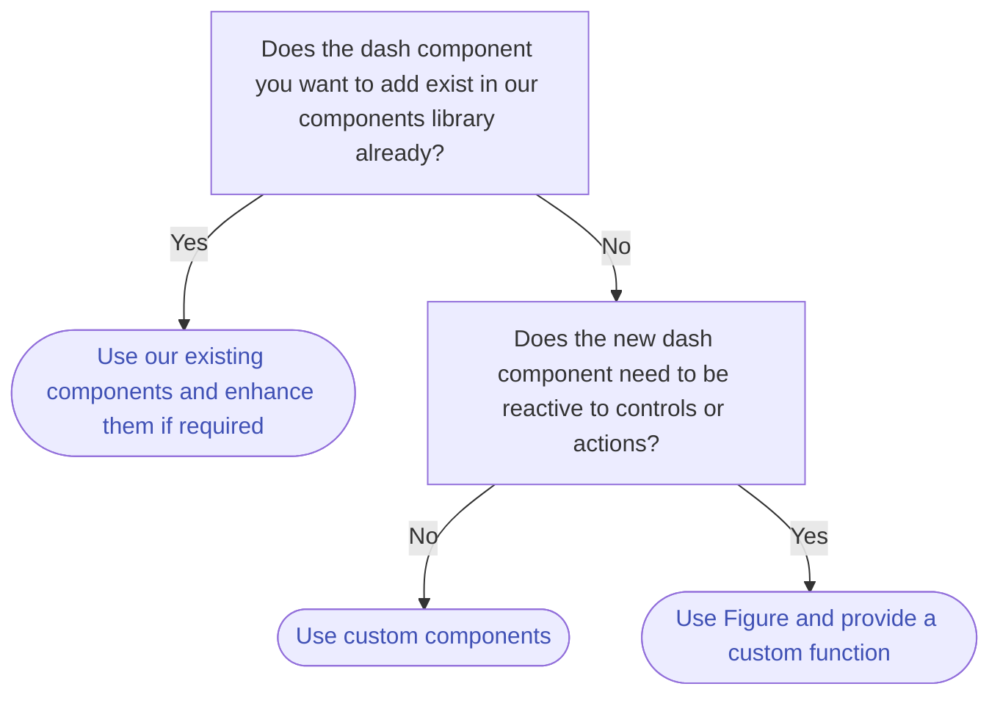

# How to use figures

This guide shows you how to add any dash component to Vizro that needs to be reactive to controls or actions in your page.
If you want to add a static dash component to your page, use [custom components](custom-components.md) instead.

A [`Figure`][vizro.models.Figure] is a versatile model that allows you to wrap any Dash component that doesn't fit into the more specialized
reactive components like [`Graph`][vizro.models.Graph], [`Table`][vizro.models.Table], [AgGrid][vizro.models.AgGrid].
In essence, `Figure` is a higher-level abstraction, providing a flexible foundation for all types of visual components in Vizro.

The `Graph`, `Table` and `AgGrid` are specific implementations of the ´Figure` model. They serve as intuitive shortcuts
for common dashboard components, embedding behaviors and interactions specific to their purposes.

The following flowchart shows what you need to consider when choosing which model to use:


Essentially: Use the `Figure` model when you need to include a custom Dash component that needs to be reactive to controls or actions on your page
and cannot be included using the `Graph`, `Table` or `AgGrid` models.

To add a `Figure` to your page, do the following:

- add the `Figure` model to the components argument of the [Page][vizro.models.Page] model.
- use one of the currently available figure functions from `vizro.figures` or create your own custom function, and pass it to the `figure` argument of the `Figure` model.


!!! example "Use currently available figure functions"

    === "app.py"
        ```py
        import pandas as pd
        import vizro.models as vm
        from vizro import Vizro
        from vizro.figures import kpi_card, kpi_card_reference
        
        df = pd.DataFrame([[67434, 65553, "A"], [6434, 6553, "B"], [34, 53, "C"]], columns=["Actual", "Reference", "Category"])
        
        page = vm.Page(
            title="KPI Indicators",
            layout=vm.Layout(grid=[[0,1,-1]] + [[-1, -1, -1]]*4),
            components=[
                vm.Figure(
                    figure=kpi_card(
                        data_frame=df,
                        value_column="Actual",
                        icon="shopping_cart",
                        title="KPI Card I",
                    )
                ),
                vm.Figure(
                    figure=kpi_card_reference(
                        data_frame=df,
                        value_column="Actual",
                        reference_column="Reference",
                        title="KPI Card II",
                    )
                ),
            ],
            controls=[vm.Filter(column="Category", selector=vm.RadioItems())],
        )

        dashboard = vm.Dashboard(pages=[page])
        Vizro().build(dashboard).run()
        ```
    === "app.yaml"
        ```yaml
        # Still requires a .py to add data to the data manager and parse YAML configuration
        # See from_yaml example
        pages:
        - components:
          - figure:
              _target_: dash_ag_grid
              data_frame: gapminder
            type: ag_grid
          title: Default Dash AG Grid
        ```
    === "Result"
        [![AGGrid]][AGGrid]

    [AGGrid]: ../../assets/user_guides/table/aggrid.png
