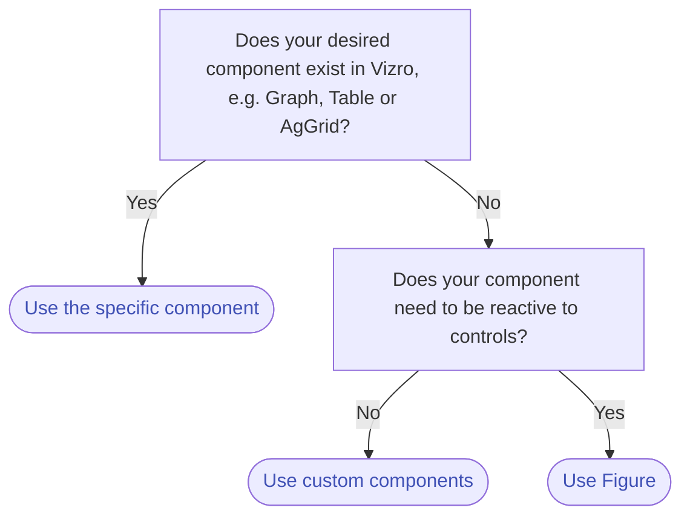

# How to use figures

This guide shows you how to add any [Dash component](https://dash.plotly.com/#open-source-component-libraries) that needs to be reactive to [filter](filters.md) and [parameter](parameters.md) controls.
If you want to add a static Dash component to your page, use [custom components](custom-components.md) instead.

[`Figure`][vizro.models.Figure] provides a flexible foundation for all types of reactive Dash components in Vizro.
The [`Graph`][vizro.models.Graph], [`Table`][vizro.models.Table] and [`AgGrid`][vizro.models.AgGrid] components are
specific implementations of `Figure`. They serve as intuitive shortcuts, embedding behaviors and interactions specific
to their purposes.

If these more specific models already achieve what you need then they should be used in preference to
the more generic `Figure`. Remember that it is possible to supply [custom charts](custom-charts.md) to `Graph`
and [custom tables](custom-tables.md) to `Table`.

There are already a few figure functions you can reuse:

- [`kpi_card`][vizro.figures.kpi_card]
- [`kpi_card_reference`][vizro.figures.kpi_card_reference]

The following flowchart shows what you need to consider when choosing which model to use:




To add a `Figure` to your page:

1. Add the `Figure` model to the components argument of the [Page][vizro.models.Page] model.
2. Use an existing figure function from [`vizro.figures`](../API-reference/figure-callables.md) and pass it to the `figure` argument of the `Figure` model.

!!! example "Use existing figure functions"

    === "app.py"
        ```py
        import vizro.models as vm
        import vizro.plotly.express as px
        from vizro import Vizro
        from vizro.figures import kpi_card

        tips = px.data.tips

        page = vm.Page(
            title="KPI Indicators",
            layout=vm.Layout(grid=[[0, -1, -1, -1]] + [[-1, -1, -1, -1]] * 4),  # (1)!
            components=[
                vm.Figure(
                    figure=kpi_card(  # (2)!
                        data_frame=tips,
                        value_column="tip",
                        value_format="${value:.2f}",
                        icon="shopping_cart",
                        title="KPI Card I",
                    )
                )
            ],
            controls=[vm.Filter(column="day", selector=vm.RadioItems())],
        )

        dashboard = vm.Dashboard(pages=[page])
        Vizro().build(dashboard).run()
        ```

        1. This creates a [`layout`](layouts.md) with five rows and four columns. The KPI card is positioned in the first cell, while the remaining cells are empty.
        2. For more information, refer to the API reference for the  [`kpi_card`](../API-reference/figure-callables.md#kpi_card).

    === "app.yaml"
        ```yaml
        # Still requires a .py to add data to the data manager and parse YAML configuration
        # See from_yaml example
        pages:
          - components:
              - figure:
                  _target_: kpi_card
                  data_frame: tips
                  value_column: tip
                  value_format: ${value:.2f}
                  icon: shopping_cart
                  title: KPI Card I
                type: figure
            controls:
              - column: day
                type: filter
                selector:
                  type: radio_items
            layout:
              grid:
                [
                  [0, -1, -1, -1],
                  [-1, -1, -1, -1],
                  [-1, -1, -1, -1],
                  [-1, -1, -1, -1],
                  [-1, -1, -1, -1],
                ]
            title: KPI Indicators
        ```
    === "Result"
        [![Figure]][Figure]

    [Figure]: ../../assets/user_guides/figure/figure.png


### KPI (Key Performance Indicator) cards
A KPI card is a dynamic card that can display a single value. Optionally, a title, icon and reference value can be added.
It is a common visual component to display key metrics in a dashboard. Vizro supports two pre-defined KPI card functions:

- [`kpi_card`](../API-reference/figure-callables.md#vizro.figures.kpi_card): A KPI card with a single value.
- [`kpi_card_with_reference`](../API-reference/figure-callables.md#vizro.figures.kpi_card_with_reference): A KPI card with a single value and a reference value.

As described in the [API reference](../API-reference/figure-callables.md) and illustrated in the below example, these
functions have several arguments to customise your KPI cards. If you require a level of customisation that is not
possible with the built-in functions then you can create a [custom figure](custom-figures.md).

!!! example "KPI Card Variations"

    === "app.py"
        ```py
        import pandas as pd
        import vizro.models as vm
        from vizro import Vizro
        from vizro.figures import kpi_card, kpi_card_reference

        df = pd.DataFrame([[67434, 65553, "A"], [6434, 6553, "B"], [34, 53, "C"]], columns=["Actual", "Reference", "Category"])

        page = vm.Page(
            title="KPI Indicators",
            layout=vm.Layout(grid=[[0, 1, 2, 3], [4, 5, 6, 7], [-1, -1, -1, -1], [-1, -1, -1, -1]]),
            components=[
                vm.Figure(figure=kpi_card(data_frame=df, value_column="Actual", title="KPI with value")),
                vm.Figure(figure=kpi_card(data_frame=df, value_column="Actual", title="KPI with aggregation", agg_func="mean")),
                vm.Figure(
                    figure=kpi_card(
                        data_frame=df,
                        value_column="Actual",
                        title="KPI with custom formatting",
                        value_format="${value:.2f}",
                    )
                ),
                vm.Figure(
                    figure=kpi_card(
                        data_frame=df,
                        value_column="Actual",
                        title="KPI with icon",
                        icon="shopping_cart",
                    )
                ),
                vm.Figure(
                    figure=kpi_card_reference(
                        data_frame=df,
                        value_column="Reference",
                        reference_column="Actual",
                        title="KPI with reference (neg)",
                    )
                ),
                vm.Figure(
                    figure=kpi_card_reference(
                        data_frame=df,
                        value_column="Actual",
                        reference_column="Reference",
                        title="KPI with reference (pos)",
                    )
                ),
                vm.Figure(
                    figure=kpi_card_reference(
                        data_frame=df,
                        value_column="Reference",
                        reference_column="Actual",
                        title="KPI with reference and custom formatting",
                        value_format="{value:.2f}$",
                        reference_format="{delta:.2f}$ vs. last year ({reference:.2f}$)",
                    )
                ),
                vm.Figure(
                    figure=kpi_card_reference(
                        data_frame=df,
                        value_column="Actual",
                        reference_column="Reference",
                        value_format="${value:.2f}",
                        title="KPI with reference and icon",
                        icon="shopping_cart",
                    ),
                ),
            ],
            controls=[vm.Filter(column="Category")],
        )


        dashboard = vm.Dashboard(pages=[page])
        Vizro().build(dashboard).run()
        ```
    === "app.yaml"
        ```yaml
        # Still requires a .py to add data to the data manager and parse YAML configuration
        # See from_yaml example
        pages:
          - components:
              - figure:
                  _target_: kpi_card
                  data_frame: tips
                  value_column: tip
                  value_format: ${value:.2f}
                  icon: shopping_cart
                  title: KPI Card I
                type: figure
            controls:
              - column: day
                type: filter
                selector:
                  type: radio_items
            layout:
              grid:
                [
                  [0, -1, -1, -1],
                  [-1, -1, -1, -1],
                  [-1, -1, -1, -1],
                  [-1, -1, -1, -1],
                  [-1, -1, -1, -1],
                ]
            title: KPI Indicators
        ```
    === "Result"
        [![KPICards]][KPICards]

    [KPICards]: ../../assets/user_guides/figure/kpi_cards.png
