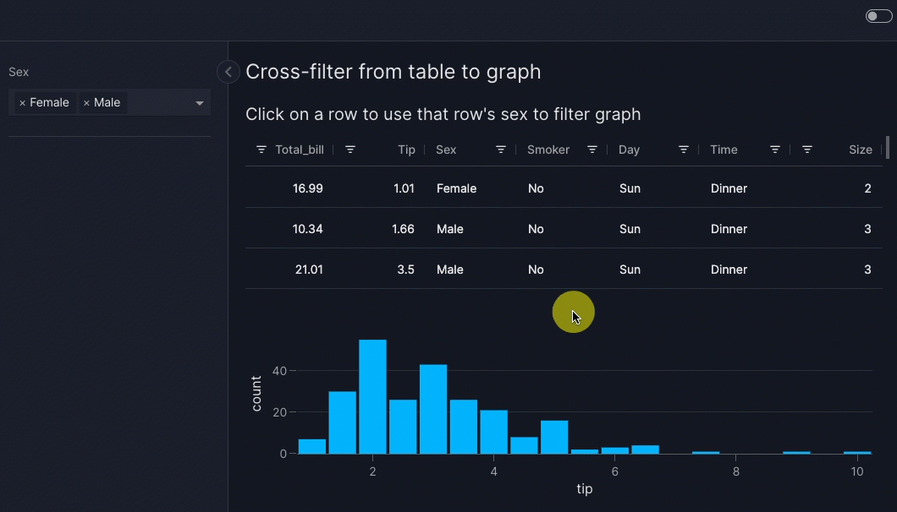
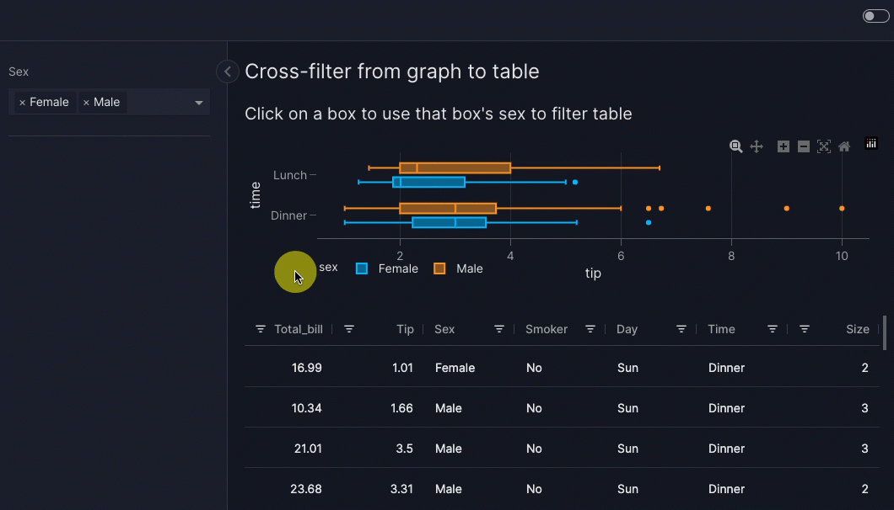
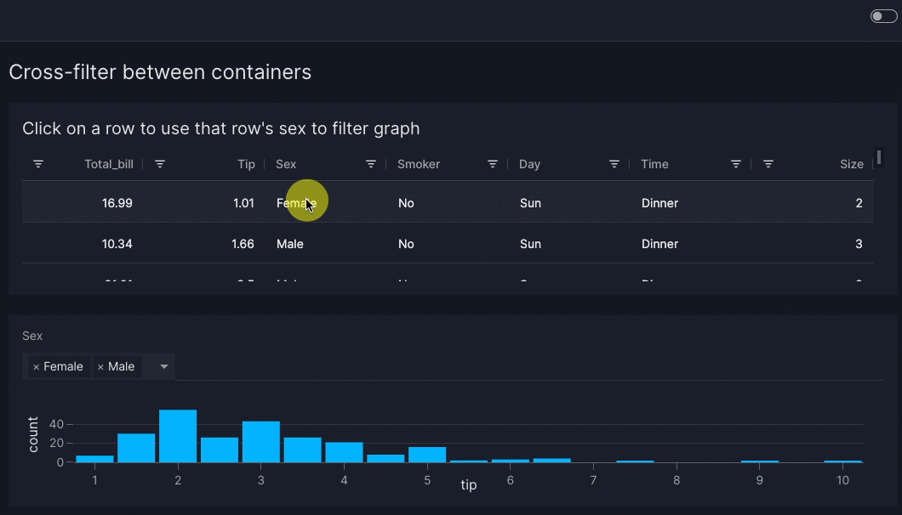
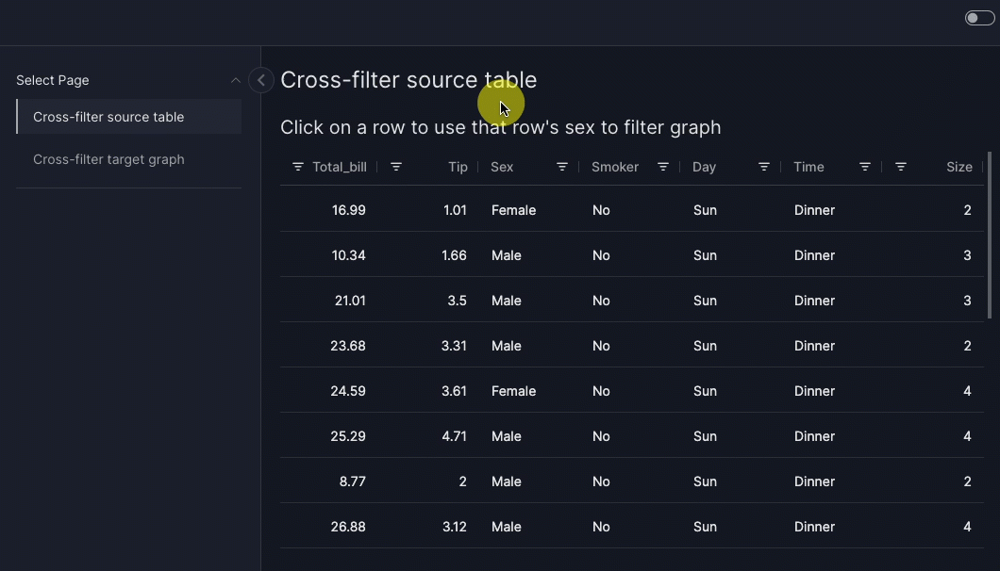
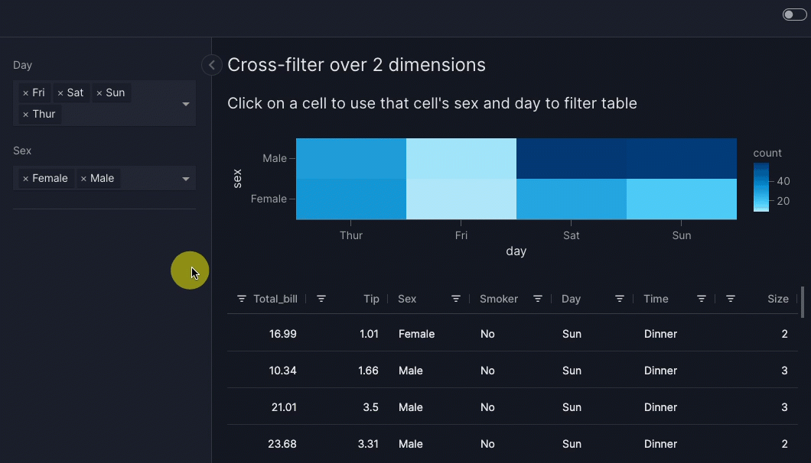
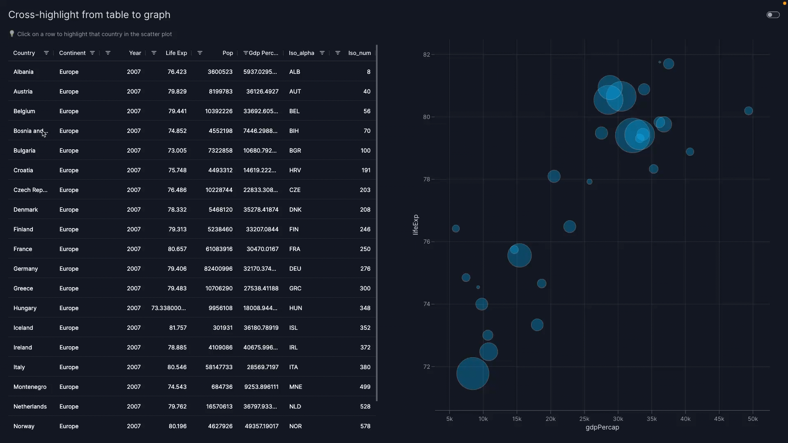
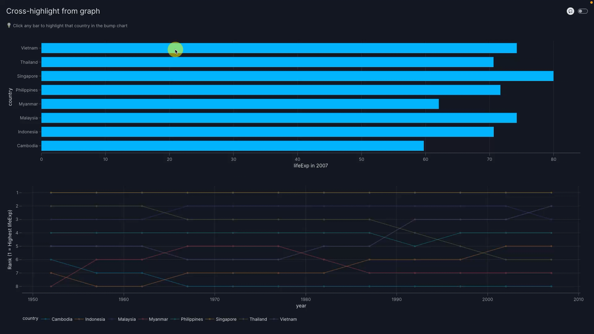
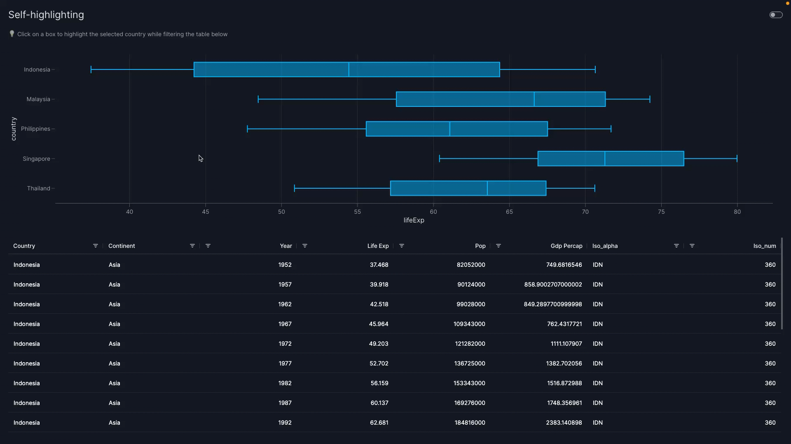

# Graph and table interactions

In this guide we show you how to configure interactions between graphs and tables, as is commonly done in business intelligence (BI) tools. In Vizro, all such interactions are enabled by an intermediate [control](controls.md) that you must explicitly define. For example:

- [Cross-filter](#cross-filter): a _source_ graph or table filters the `data_frame` of a _target_ graph or table. The source component sets a [filter](filters.md), which in turn updates the target component.
- [Cross-parameter](#cross-parameter): a _source_ graph or table updates any argument other than `data_frame` of a _target_ graph or table. The source component sets a [parameter](parameters.md), which in turn updates the target component.
- [Cross-highlight](#cross-highlight): a _source_ graph or table highlights data in a _target_ graph or table. This is an example of a [cross-parameter](#cross-parameter).

All these interactions use the [`set_control` action][vizro.actions.set_control]. This gives very generic and powerful functionality thanks to the functionality of the intermediate control:

- The target components can be anything that reacts to a control: [built-in graphs](graph.md), [custom graphs](custom-charts.md), [built-in tables](table.md), [custom tables](custom-tables.md), [built-in figures](figure.md) and [custom figures](custom-figures.md).
- A single control can update any number of these target components, and a single source component can set any number of controls. Hence a single source component can interact with any number of target components.
- A target component can be on the same page as the source or on a different page (so long as the intermediate control has [`show_in_url=True`](run-deploy.md#shareable-url)).
- A target component can also be the source component to enable a "self-interaction".
- The value of a control is persisted when you change page.
- Interactions are not "invisible"; they are explicitly shown on the screen by the value of the control. Just like a normal control, you can change the value manually.

!!! tip "Invisible controls"

    If you prefer, you can make your control invisible by setting `visible=False`, for example `vm.Parameter(..., visible=False)`. The control can then only be set by `set_control`. This achieves a visually cleaner dashboard but can also make it less clear what graph and table interactions have been applied. We use `visible=False` in all our examples on [cross-highlighting](#cross-highlight).

    A user can reset all controls on a page, including those with `visible=False`, by clicking the ["Reset controls" button](controls.md#reset-controls).

## Cross-filter

A cross-filter is when the user clicks on one _source_ graph or table to filter one or more _target_ components. In Vizro, a cross-filter operates through an intermediate [filter](filters.md). To configure a cross-filter:

1. Create a filter that targets the [graphs](graph.md), [tables](table.md) or [figures](figure.md) you would like to filter. The filter must have a [categorical selector](selectors.md#categorical-selectors) (both multi- and single-option are allowed).

    ```python
    import vizro.models as vm

    controls = [vm.Filter(id="my_filter", column="species")]  # (1)!
    ```

    1. Remember that if `targets` is not explicitly specified, a filter [targets all components on the page whose data source includes `column`](filters.md#basic-filters).

1. Call `set_control` in the `actions` argument of the source [`Graph`][vizro.models.Graph] or [`AgGrid`][vizro.models.AgGrid] component that triggers the cross-filter.

    1. Set `control` to the ID of the filter.
    1. Set `value`. The format of this depends on the source model and is given in the [API reference][vizro.actions.set_control], but it is often `column` of the filter. Think of it as an instruction for what to lookup in the source data: whatever value is fetched from this lookup is used to set `control`.

    ```python
    import vizro.actions as va

    components = [vm.Graph(..., actions=va.set_control(control="my_filter", value="species"))]
    ```

1. If your source component is a `Graph` and you use a column name for `value` then this must be included in the `custom_data` of your graph's `figure` function, for example `figure=px.scatter(..., custom_data="species")`.

!!! tip

    Often the `value` of `set_control` is the same as the `column` of the filter, but this does not need to be the case. You can perform a cross-filter where the source component's column name given by `value` is different from the target component's column name, which is given by the filter's `column`.

### Cross-filter from table

The trigger for a cross-filter from an [AG Grid](table.md#ag-grid) is clicking on a row in the table. The `value` argument of the [`set_control` action][vizro.actions.set_control] specifies the column of the value that sets `control`.

!!! example "Cross-filter from table to graph"

    === "app.py"

        ```{.python pycafe-link hl_lines="15"}
        import vizro.actions as va
        import vizro.models as vm
        import vizro.plotly.express as px
        from vizro import Vizro
        from vizro.tables import dash_ag_grid

        tips = px.data.tips()

        page = vm.Page(
            title="Cross-filter from table to graph",
            components=[
                vm.AgGrid(
                    title="Click on a row to use that row's sex to filter graph",
                    figure=dash_ag_grid(tips),
                    actions=va.set_control(control="sex_filter", value="sex"),
                ),
                vm.Graph(id="tips_graph", figure=px.histogram(tips, x="tip")),  # (1)!
            ],
            controls=[vm.Filter(id="sex_filter", column="sex", targets=["tips_graph"])],  # (2)!
        )

        dashboard = vm.Dashboard(pages=[page])
        Vizro().build(dashboard).run()
        ```

        1. We give the `vm.Graph` an `id` so that it can be targeted explicitly by `vm.Filter(id="sex_filter")`.
        1. We give the `vm.Filter` an `id` so that it can be set explicitly by `va.set_control`.

    === "app.yaml"

        ```yaml
        # Still requires a .py to add data to the data manager and parse YAML configuration
        # See yaml_version example
        pages:
          - components:
              - actions:
                  - control: sex_filter
                    type: set_control
                    value: sex
                figure:
                  _target_: dash_ag_grid
                  data_frame: tips
                title: Click on a row to use that row's sex to filter graph
                type: ag_grid
              - figure:
                  _target_: histogram
                  data_frame: tips
                  x: tip
                id: tips_graph
                type: graph
            controls:
              - column: sex
                id: sex_filter
                targets:
                  - tips_graph
                type: filter
            title: Cross-filter from table to graph
        ```

    === "Result"

        

When you click on a row in the table, the graph is cross-filtered to show data only for one sex. The column of the clicked cell does not matter: the value is always taken from the `sex` column of the clicked row.

??? details "Behind the scenes mechanism"

    In full, what happens is as follows:

    1. Clicking on a row triggers the `va.set_control` action. This uses the value of the `sex` column for the selected row (in other words, "Male" or "Female") to set the selector underlying `vm.Filter(id="sex_filter")`.
    1. The change in value of `vm.Filter(id="sex_filter")` triggers the filter to be re-applied on its `targets=["tips_graph"]` so that a filtered graph is shown.

    The mechanism for triggering the filter when its value is set by `va.set_control` is an [implicit actions chain](../tutorials/custom-actions-tutorial.md#implicit-actions-chain).

!!! tip

    You can emphasize that a row is selectable by including checkboxes in your AG Grid with `figure=dash_ag_grid(..., dashGridOptions={"rowSelection": {"checkboxes": True}})`. The Dash AG Grid offers many [options to configure row selection](https://dash.plotly.com/dash-ag-grid/single-row-selection). These can be [passed directly](table.md#basic-usage) into `dash_ag_grid` as keyword arguments or set for multiple tables by creating a [custom table function](custom-tables.md).

    As well as being triggered on mouse click, `set_control` is also triggered by pressing ++space++ while focused on a row.

### Cross-filter from graph

The trigger for a cross-filter from a [graph](graph.md) is clicking on data in the graph. The `value` argument of the [`set_control` action][vizro.actions.set_control] can be used in two ways to specify what sets `control`:

- Column from which to take the value. This requires you to set `custom_data` in the graph's `figure` function. For example, for a graph `px.bar(..., color="country", custom_data="country")` you can use `va.set_control(value="country", ...)`.
- As a shortcut, if the value is encoded by a _positional dimension_ such as `x` or `y` then you can use that variable directly and do not need to set `custom_data`. For example, for a graph `px.bar(x="country", ...)` you can use `va.set_control(value="x", ...)`. Positional dimensions include `x`, `y`, `z` for Cartesian plots and `lat`, `lon`, `location` for choropleth maps.

??? details "Behind the scenes mechanism"

    `value` is an instruction for what to lookup in [Plotly's `clickData`](https://dash.plotly.com/interactive-graphing), whose format and content depend on the type of chart clicked. Generally speaking, positional information is automatically included in `clickData` but other information such as `color` must be manually supplied using `custom_data` to make it available.

    The rules for how `value` is interpreted by `set_control` are:

    1. If the graph has `custom_data` then interpret the `value` as a column name and attempt to find it in `custom_data`.
    1. If the graph does not have `custom_data` or does not include `value` as a column in `custom_data` then perform a lookup inside `clickData["points"][0]`. For example:
        - `value="x"` is equivalent to looking at `clickData["points"][0]["x"]`.
        - `value="key.subkey[1]"` is equivalent to looking at `clickData["points"][0]["key"]["subkey"][1]`.

    Based on the source graph and its available `clickData`, you can therefore configure precisely which property to set as `value`. For almost all use cases, this would be a column name or a positional variable such as `x`. However, advanced users might like to use other data that is available in `clickData` such as `pointNumber` or to refer to an object nested deeply inside `custom_data`.

We show an example of each of these in turn. Here is an example where we use `custom_data` and `value="sex"` to use a value from the `sex` column. We need to specify `custom_data` because the `sex` column is not a positional dimension in the plot.

!!! example "Cross-filter from graph to table with `custom_data`"

    === "app.py"

        ```{.python pycafe-link hl_lines="15"}
        import vizro.actions as va
        import vizro.models as vm
        import vizro.plotly.express as px
        from vizro import Vizro
        from vizro.tables import dash_ag_grid

        tips = px.data.tips()

        page = vm.Page(
            title="Cross-filter from graph to table",
            components=[
                vm.Graph(
                    title="Click on a box to use that box's sex to filter table",
                    figure=px.box(tips, x="tip", y="time", color="sex", custom_data="sex"),  # (1)!
                    actions=va.set_control(control="sex_filter", value="sex"),
                ),
                vm.AgGrid(id="tips_table", figure=dash_ag_grid(tips)),  # (2)!
            ],
            controls=[vm.Filter(id="sex_filter", column="sex", targets=["tips_table"])],  # (3)!
        )

        dashboard = vm.Dashboard(pages=[page])
        Vizro().build(dashboard).run()
        ```

        1. We encode the `sex` column as `color` in the plot and include it in `custom_data="sex"`.
        1. We give the `vm.AgGrid` an `id` so that it can be targeted explicitly by `vm.Filter(id="sex_filter")`.
        1. We give the `vm.Filter` an `id` so that it can be set explicitly by `va.set_control`.

    === "app.yaml"

        ```yaml
        # Still requires a .py to add data to the data manager and parse YAML configuration
        # See yaml_version example
        pages:
          - components:
              - actions:
                  - control: sex_filter
                    type: set_control
                    value: sex
                figure:
                  _target_: box
                  color: sex
                  custom_data: sex
                  data_frame: tips
                  x: tip
                  y: time
                title: Click on a box to use that box's sex to filter table
                type: graph
              - figure:
                  _target_: dash_ag_grid
                  data_frame: tips
                id: tips_table
                type: ag_grid
            controls:
              - column: sex
                id: sex_filter
                targets:
                  - tips_table
                type: filter
            title: Cross-filter from graph to table
        ```

    === "Result"

        

When you click on a box in the graph, the table is cross-filtered to show data for only one sex.

??? details "Behind the scenes mechanism"

    In full, what happens is as follows:

    1. Clicking on the box triggers the `va.set_control` action. This uses the value of `sex` taken from the graph's `custom_data` (in other words, "Male" or "Female") to set the selector underlying `vm.Filter(id="sex_filter")`.
    1. The change in value of `vm.Filter(id="sex_filter")` triggers the filter to be re-applied on its `targets=["tips_table"]` so that a filtered table is shown.

    The mechanism for triggering the filter when its value is set by `va.set_control` is an [implicit actions chain](../tutorials/custom-actions-tutorial.md#implicit-actions-chain).

!!! note "Cross-filter from custom chart"

    If you cross-filter from a [custom chart](custom-charts.md) and wish to use a column supplied through `custom_data` for the `value` argument of `va.set_control` then you must explicitly include `custom_chart` in the function signature:

    ```py
    @capture("graph")
    def my_custom_chart(data_frame, custom_data, **kwargs):
        return px.scatter(data_grame, custom_data=custom_data, **kwargs)
    ```

Here is an example where we do not need to use `custom_data` because the value used in `va.set_control` is positional: it corresponds to the `y` axis of the graph.

!!! example "Cross-filter from graph without `custom_data` to table"

    === "app.py"

        ```{.python pycafe-link hl_lines="15"}
        import vizro.actions as va
        import vizro.models as vm
        import vizro.plotly.express as px
        from vizro import Vizro
        from vizro.tables import dash_ag_grid

        tips = px.data.tips()

        page = vm.Page(
            title="Cross-filter from graph to table",
            components=[
                vm.Graph(
                    title="Click on a box to use that box's sex to filter table",
                    figure=px.box(tips, x="tip", y="sex"),
                    actions=va.set_control(control="sex_filter", value="y"),
                ),
                vm.AgGrid(id="tips_table", figure=dash_ag_grid(tips)),  # (1)!
            ],
            controls=[vm.Filter(id="sex_filter", column="sex", targets=["tips_table"])],  # (2)!
        )

        dashboard = vm.Dashboard(pages=[page])
        Vizro().build(dashboard).run()
        ```

        1. We give the `vm.AgGrid` an `id` so that it can be targeted explicitly by `vm.Filter(id="sex_filter")`.
        1. We give the `vm.Filter` an `id` so that it can be set explicitly by `va.set_control`.

    === "app.yaml"

        ```yaml
        # Still requires a .py to add data to the data manager and parse YAML configuration
        # See yaml_version example
        pages:
          - components:
              - actions:
                  - control: sex_filter
                    type: set_control
                    value: y
                figure:
                  _target_: box
                  data_frame: tips
                  x: tip
                  y: sex
                title: Click on a box to use that box's sex to filter table
                type: graph
              - figure:
                  _target_: dash_ag_grid
                  data_frame: tips
                id: tips_table
                type: ag_grid
            controls:
              - column: sex
                id: sex_filter
                targets:
                  - tips_table
                type: filter
            title: Cross-filter from graph to table
        ```

    === "Result"

        

When you click on a box in the graph, the table is cross-filtered to show data for only one sex, which is the `y` variable for the plot.

??? details "Behind the scenes mechanism"

    In full, what happens is as follows:

    1. Clicking on the box triggers the `va.set_control` action. This uses the value of `y` (in other words, "Male" or "Female") to set the selector underlying `vm.Filter(id="sex_filter")`.
    1. The change in value of `vm.Filter(id="sex_filter")` triggers the filter to be re-applied on its `targets=["tips_table"]` so that a filtered table is shown.

    The mechanism for triggering the filter when its value is set by `va.set_control` is an [implicit actions chain](../tutorials/custom-actions-tutorial.md#implicit-actions-chain).

### Cross-filter between containers

A cross-filter often works best when used [inside a container](container.md#add-controls-to-container). This typically makes it clearer which components the filter applies to, especially when the [container is styled](container.md#styled-containers).

For example, let us rearrange the above example of a [cross-filter from a table](#cross-filter-from-table) into containers. Now the control appears directly above the table that it targets rather than on the left hand side of the page. The rearrangement here is purely visual to give a better user experience; `va.set_control` itself is configured exactly the same way and behaves identically while the dashboard is running.

!!! example "Cross-filter between containers"

    === "app.py"

        ```{.python pycafe-link hl_lines="17"}
        import vizro.actions as va
        import vizro.models as vm
        import vizro.plotly.express as px
        from vizro import Vizro
        from vizro.tables import dash_ag_grid

        tips = px.data.tips()

        page = vm.Page(
            title="Cross-filter between containers",
            components=[
                vm.Container(
                    components=[
                        vm.AgGrid(
                            title="Click on a row to use that row's sex to filter graph",
                            figure=dash_ag_grid(tips),
                            actions=va.set_control(control="sex_filter", value="sex"),
                        )
                    ],
                    variant="filled",  # (1)!
                ),
                vm.Container(
                    components=[vm.Graph(figure=px.histogram(tips, x="tip"))],  # (2)!
                    controls=[vm.Filter(id="sex_filter", column="sex")],  # (3)!
                    variant="filled",
                ),
            ],
        )

        dashboard = vm.Dashboard(pages=[page])
        Vizro().build(dashboard).run()
        ```

        1. We use [styled containers](container.md#styled-containers) to make it clear which components and controls are in each container.
        1. The `vm.Graph` no longer needs an `id` assigned to it, since the `vm.Filter` does not need to explicitly target it any more.
        1. The `vm.Filter` no longer needs to specify `targets`. By default, the `vm.Filter` targets all components in its container whose data source includes `column="sex"`.

    === "app.yaml"

        ```yaml
        # Still requires a .py to add data to the data manager and parse YAML configuration
        # See yaml_version example
        pages:
          - components:
              - components:
                  - actions:
                      - control: sex_filter
                        type: set_control
                        value: sex
                    figure:
                      _target_: dash_ag_grid
                      data_frame: tips
                    title: Click on a row to use that row's sex to filter graph
                    type: ag_grid
                type: container
                variant: filled
              - components:
                  - figure:
                      _target_: histogram
                      data_frame: tips
                      x: tip
                    type: graph
                controls:
                  - column: sex
                    id: sex_filter
                    type: filter
                type: container
                variant: filled
            title: Cross-filter between containers
        ```

    === "Result"

        

### Cross-filter between pages

You can perform a cross-filter where the target components are on a different page from the source. The use of [`va.set_control`][vizro.actions.set_control] is identical, but the intermediate filter must have [`show_in_url=True`](run-deploy.md#shareable-url).

For example, let us rearrange the above example of a [cross-filter from a table](#cross-filter-from-table) so that the source table is on a different page from the target graph (and hence filter). When you click or press ++space++ on a row in the table, you are taken to the target page with the graph cross-filtered to show data only for one sex.

!!! example "Cross filter between pages"

    === "app.py"

        ```{.python pycafe-link hl_lines="15"}
        import vizro.actions as va
        import vizro.models as vm
        import vizro.plotly.express as px
        from vizro import Vizro
        from vizro.tables import dash_ag_grid

        tips = px.data.tips()

        page_1 = vm.Page(
            title="Cross-filter source table",
            components=[
                vm.AgGrid(
                    title="Click on a row to use that row's sex to filter graph",
                    figure=dash_ag_grid(tips),
                    actions=va.set_control(control="sex_filter", value="sex"),
                )
            ],
        )

        page_2 = vm.Page(
            title="Cross-filter target graph",
            components=[vm.Graph(figure=px.histogram(tips, x="tip"))],   # (1)!
            controls=[vm.Filter(id="sex_filter", column="sex", show_in_url=True)],  # (2)!
        )

        dashboard = vm.Dashboard(pages=[page_1, page_2])
        Vizro().build(dashboard).run()
        ```

        1. The `vm.Graph` no longer needs an `id` assigned to it, since the `vm.Filter` does not need to explicitly target it any more.
        1. The `vm.Filter` no longer needs to specify `targets`. By default, the `vm.Filter` targets all components on its page whose data source includes `column="sex"`. We must set `show_in_url=True` for this filter to be set by `va.set_control`.

    === "app.yaml"

        ```yaml
        # Still requires a .py to add data to the data manager and parse YAML configuration
        # See yaml_version example
        pages:
          - components:
              - actions:
                  - control: sex_filter
                    type: set_control
                    value: sex
                figure:
                  _target_: dash_ag_grid
                  data_frame: tips
                title: Click on a row to use that row's sex to filter graph
                type: ag_grid
            title: Cross-filter source table
          - components:
              - figure:
                  _target_: histogram
                  data_frame: tips
                  x: tip
                type: graph
            controls:
              - column: sex
                id: sex_filter
                show_in_url: true
                type: filter
            title: Cross-filter target graph
        ```

    === "Result"

        

### Cross-filter from pivoted or multi-dimensional data

A single source component can trigger _multiple_ cross-filters. For example, [pivoted data](https://en.wikipedia.org/wiki/Pivot_table) can be visualized using a table or a [2-dimensional heatmap](https://plotly.com/python/heatmaps/).

To perform multiple cross-filters, each dimension that is filtered must have its own `vm.Filter` that is set by `va.set_control` in the `actions` of the source component in an [actions chain](actions.md#multiple-actions). Here is a 2-dimensional example that [cross-filters from a graph](#cross-filter-from-graph) using the positional variables `x` and `y`.

!!! example "Cross-filter over 2 dimensions"

    === "app.py"

        ```{.python pycafe-link hl_lines="20-23"}
        import vizro.actions as va
        import vizro.models as vm
        import vizro.plotly.express as px
        from vizro import Vizro
        from vizro.tables import dash_ag_grid

        tips = px.data.tips()

        page = vm.Page(
            title="Cross-filter over 2 dimensions",
            components=[
                vm.Graph(
                    title="Click on a cell to use that cell's sex and day to filter table",
                    figure=px.density_heatmap(  # (1)!
                        tips,
                        x="day",
                        y="sex",
                        category_orders={"day": ["Thur", "Fri", "Sat", "Sun"]},
                    ),
                    actions=[
                        va.set_control(control="day_filter", value="x"),  # (2)!
                        va.set_control(control="sex_filter", value="y"),
                    ],
                ),
                vm.AgGrid(id="tips_table", figure=dash_ag_grid(tips)),
            ],
            controls=[
                vm.Filter(id="day_filter", column="day", targets=["tips_table"]),  # (3)!
                vm.Filter(id="sex_filter", column="sex", targets=["tips_table"]),
            ],
        )

        dashboard = vm.Dashboard(pages=[page])
        Vizro().build(dashboard).run()
        ```

        1. We make a [2-dimensional histogram](https://plotly.com/python/2D-Histogram/) to show the number of rows in the `tips` data for each day and sex.
        1. Each dimension has its own `va.set_control` to set the relevant `vm.Filter`.
        1. Each has its own `vm.Filter` to filter by the relevant `column`.

    === "app.yaml"

        ```yaml
        # Still requires a .py to add data to the data manager and parse YAML configuration
        # See yaml_version example
        pages:
          - components:
              - actions:
                  - control: day_filter
                    type: set_control
                    value: x
                  - control: sex_filter
                    type: set_control
                    value: y
                figure:
                  _target_: density_heatmap
                  category_orders:
                    day:
                      - Thur
                      - Fri
                      - Sat
                      - Sun
                  data_frame: tips
                  x: day
                  y: sex
                title: Click on a cell to use that cell's sex and day to filter table
                type: graph
              - figure:
                  _target_: dash_ag_grid
                  data_frame: tips
                id: tips_table
                type: ag_grid
            controls:
              - column: day
                id: day_filter
                targets:
                  - tips_table
                type: filter
              - column: sex
                id: sex_filter
                targets:
                  - tips_table
                type: filter
            title: Cross-filter over 2 dimensions
        ```

    === "Result"

        

When you click on a colored cell in the heatmap, the table is cross-filtered to show data for only one sex and one day. The "count" shown for each heatmap cell corresponds to the number of rows shown in the filtered table when that cell is clicked.

??? details "Behind the scenes mechanism"

    In full, what happens is as follows:

    1. Clicking on a cell triggers the first `va.set_control` action. This uses the value of `day` (in other words, "Thur", "Fri", "Sat" or "Sun") to set the selector underlying `vm.Filter(id="day_filter")`.
    1. When the `day_filter` has been set, the second `va.set_control` action runs. This uses the value of `sex` (in other words, "Male" or "Female") to set the selector underlying `vm.Filter(id="sex_filter")`.
    1. The change in value of `vm.Filter(id="day_filter")` triggers the filter on its `targets=["tips_table"]` so that a filtered table is shown.
    1. The change in value of `vm.Filter(id="sex_filter")` triggers the filter on its `targets=["tips_table"]` so that a filtered table is shown.

    The mechanism for triggering the filter when its value is set by `va.set_control` is an [implicit actions chain](../tutorials/custom-actions-tutorial.md#implicit-actions-chain), while the sequence of applying the two `va.set_control` is an [explicit actions chain](../tutorials/custom-actions-tutorial.md#explicit-actions-chain). In general, steps 2 and 3 above will execute in [parallel](../tutorials/custom-actions-tutorial.md#parallel-actions).

    When performing multiple filters with [dynamic data](data.md#dynamic-data), you should consider [configuring a cache](data.md#configure-cache) so that steps 3 and 4 above do not repeatedly perform a slow data load.

Multiple cross-filters are similarly possible [from a table](#cross-filter-from-table):

```python
vm.AgGrid(
    ...,
    actions=[
        va.set_control(control="day_filter", value="day"),
        va.set_control(control="sex_filter", value="sex"),
    ],
)
```

However, it is not yet possible to cross-filter from a pivot table according to the row and column of the clicked cell.

## Cross-parameter

A cross-parameter is when the user clicks on one _source_ graph or table to update any argument other than `data_frame` of one or more _target_ components. In Vizro, a cross-parameter operates through an intermediate [parameter](parameters.md). To configure a cross-parameter:

1. Create a parameter that targets the [graphs](graph.md), [tables](table.md) or [figures](figure.md) you would like to update. The parameter must have a [categorical selector](selectors.md#categorical-selectors) (both multi- and single-option are allowed).

    ```python
    import vizro.models as vm

    controls = [
        vm.Parameter(
            id="my_parameter",
            targets=["target_component.my_argument"],
            selector=vm.RadioItems(options=["A", "B", "C"]),
        )
    ]
    ```

1. Call `set_control` in the `actions` argument of the source [`Graph`][vizro.models.Graph] or [`AgGrid`][vizro.models.AgGrid] component that triggers the cross-parameter.

    1. Set `control` to the ID of the parameter.
    1. Set `value`. The format of this depends on the source model and is given in the [API reference][vizro.actions.set_control]. Think of it as an instruction for what to lookup in the source data: whatever value is fetched from this lookup is used to set `control`.

    ```python
    import vizro.actions as va

    components = [vm.Graph(..., actions=va.set_control(control="my_parameter", value="country"))]
    ```

### Cross-highlight

A cross-highlight is an example of a cross-parameter where the effect of the intermediate parameter is to highlight data. When a user clicks on one _source_ graph or table, the corresponding data is highlighted in a _target_ graph or table (typically a [custom graph](custom-charts.md)). The highlighting can occur in two ways:

- _Target highlighting_: The highlighting appears in a target graph that is distinct from the source that was clicked. Below we give examples of highlighting a target graph [from a source table](#cross-highlight-from-table) and [from a source graph](#cross-highlight-from-graph).
- _Source highlighting_ or _self-highlighting_: The highlighting appears in the same source graph that was clicked. Below we give an example of [self-highlighting a graph](#self-highlight-a-graph).

In Vizro, cross-highlighting operates through an intermediate [parameter](parameters.md). Often this parameter is hidden from view with `visible=False` since the highlighting effect itself provides sufficient visual feedback about the selected data. Remember that the cross-highlight can be cleared with the ["Reset controls" button](controls.md#reset-controls).

In general, there are many different ways to visually highlight data in a graph. For example:

- Change the [style of a marker](https://plotly.com/python/marker-style/), [line](https://plotly.com/python/line-charts/#style-line-plots) or [bar](https://plotly.com/python/bar-charts/#colored-and-styled-bar-chart), for example its color, opacity or shape.
- Add an [annotation](https://plotly.com/python/text-and-annotations/#text-annotations).
- Highlight a [region](https://plotly.com/python/horizontal-vertical-shapes/) of the plot's background.

!!! tip Cross-highlight between containers and pages

    All [cross-parameters](#cross-parameter), which includes cross-highlights, can operate across different containers and different pages. The use of [`va.set_control`][vizro.actions.set_control] is identical to when source and target are in the same container and page. For further examples and styling hints, see the sections on cross-filtering [between containers](#cross-filter-between-containers) and [between pages](#cross-filter-between-pages).

#### Cross-highlight from table

This example shows how to configure cross-highlighting where clicking on the row in a table highlights the corresponding data in a target scatter graph. The highlighting is visually shown by changing the color of the point for the selected country. Since cross-highlight is a sort of cross-parameter, the method follows the same pattern as configuring a [cross-parameter](#cross-parameter).

1. Create a parameter that targets the [graph](graph.md) you would like to visually highlight.

    ```python
    import vizro.models as vm

    controls = [
        vm.Parameter(
            id="highlight_parameter",  # (1)!
            targets=["scatter_chart.highlight_country"],  # (2)!
            selector=vm.RadioItems(options=["NONE", ...]),  # (3)!
            visible=False,  # (4)!
        )
    ]
    ```

    1. We give the parameter an `id` so that it can be set explicitly by `va.set_control`.
    1. The parameter targets the argument `highlight_country` of `vm.Graph(id="scatter_chart")`.
    1. We add `"NONE"` as an option, corresponding to a parameter value `highlight_country=None`. This is used so the target graph is initially unhighlighted.
    1. We set `visible=False` to hide the parameter selector from the user interface while keeping the functionality active.

1. Call `set_control` in the `actions` argument of the source [`AgGrid`][vizro.models.AgGrid] component that triggers the cross-highlight.

    1. Set `control` to the ID of the parameter.
    1. Set `value` to specify which column contains the value that sets the control when a row in the table is clicked.

    ```python
    import vizro.actions as va

    components = [vm.AgGrid(..., actions=va.set_control(control="highlight_parameter", value="country"))]
    ```

1. Create a [custom chart](custom-charts.md) that highlights the data corresponding to `highlight_country`.

    ```python
    import vizro.plotly.express as px
    from vizro.models.types import capture


    @capture("graph")
    def scatter_with_highlight(data_frame, highlight_country):  # (1)!
        country_is_highlighted = data_frame["country"] == highlight_country  # (2)!
        return px.scatter(data_frame, x=..., y=..., color=country_is_highlighted)  # (3)!
    ```

    1. The `highlight_country` argument receives the selected country name from `highlight_parameter`.
    1. `country_is_highlighted` is a pandas Series that contains `True` for the highlighted country and `False` for all others.
    1. We color the points by `country_is_highlighted`. This will color differently the values `True` (for the highlighted country) and `False` (for all others).

The full code is given below. This shows a slightly more complicated highlighting style that also changes some additional properties of the highlighted point like its opacity.

!!! example "Cross-highlight from table"

    === "app.py"

        ```{.python pycafe-link hl_lines="38"}
        import vizro.plotly.express as px
        import vizro.models as vm
        import vizro.actions as va
        from vizro.models.types import capture
        from vizro import Vizro
        from vizro.tables import dash_ag_grid

        gapminder = px.data.gapminder().query("continent == 'Europe' and year == 2007")

        @capture("graph")
        def scatter_with_highlight(data_frame, highlight_country=None):  # (1)!
            country_is_highlighted = data_frame["country"] == highlight_country  # (2)!
            fig = px.scatter(
                data_frame,
                x="gdpPercap",
                y="lifeExp",
                size="pop",
                size_max=60,
                opacity=0.3,
                color=country_is_highlighted,
                category_orders={"color": [False, True]},  # (3)!
            )

            if highlight_country is not None: # (4)!
                fig.update_traces(selector=1, marker={"line_width": 2, "opacity": 1})  # (5)!

            fig.update_layout(showlegend=False)
            return fig


        page = vm.Page(
            title="Cross-highlight from table",
            layout=vm.Grid(grid=[[0, 1]], col_gap="80px"),  # (6)!
            components=[
                vm.AgGrid(
                    header="💡 Click on a row to highlight that country in the scatter plot",
                    figure=dash_ag_grid(data_frame=gapminder),
                    actions=va.set_control(control="highlight_parameter", value="country"),  # (7)!
                ),
                vm.Graph(
                    id="scatter_chart",   # (8)!
                    figure=scatter_with_highlight(gapminder),
                ),
            ],
            controls=[
                vm.Parameter(
                    id="highlight_parameter",   # (9)!
                    targets=["scatter_chart.highlight_country"],   # (10)!
                    selector=vm.RadioItems(options=["NONE", *gapminder["country"]]),   # (11)!
                    visible=False,   # (12)!
                ),
            ],
        )

        dashboard = vm.Dashboard(pages=[page])
        Vizro().build(dashboard).run()
        ```

        1. The `highlight_country` argument receives the selected country name from `highlight_parameter`.
        1. `country_is_highlighted` is a pandas Series that contains `True` for the highlighted country and `False` for all others. We use this to change the color of the highlighted point.
        1. We make sure that the colors are always ordered the same way. This ensures that the highlighted point always has the same color regardless of which row in the table is clicked.
        1. When a country is highlighted, make [further modifications](https://plotly.com/python/creating-and-updating-figures/) to the [style of the highlighted point's marker](https://plotly.com/python/marker-style/) to make it stand out more.
        1. [`update_traces`](https://plotly.com/python-api-reference/generated/generated/plotly.graph_objects.Figure.update_traces.html) updates only the trace selected with index 1. The traces are ordered by `category_orders={"color": [False, True]}` and so this corresponds to `True`, in other words the trace that has `country_is_highlighted=True` and contains the highlighted point.
        1. We use a side-by-side [layout](layouts.md) with an 80px column gap to display the table and graph together.
        1. The table's `va.set_control` sets `higlight_parameter` to the country from the clicked row.
        1. We give the `vm.Graph` an `id` so that it can be targeted by `highlight_parameter`.
        1. We give the parameter an `id` so that it can be set explicitly by `va.set_control`.
        1. The parameter targets the argument `highlight_country` of `vm.Graph(id="scatter_chart")`.
        1. We add `"NONE"` as an option, corresponding to a parameter value `highlight_country=None`. This is used so the target graph is initially unhighlighted.
        1. We set `visible=False` to hide the parameter selector from the user interface while keeping the functionality active.

    === "app.yaml"

        ```
        # Still requires a .py to add data to the data manager, define CapturedCallables, and parse YAML configuration
        # More explanation in the docs on `Dashboard` and extensions.
        pages:
        - components:
          - actions:
            - control: highlight_parameter
              type: set_control
              value: country
            figure:
              _target_: dash_ag_grid
              data_frame: gapminder
            header: 💡 Click on a row to highlight that country in the scatter plot
            type: ag_grid
          - figure:
              _target_: __main__.scatter_with_highlight
              data_frame: gapminder
            id: scatter_chart
            type: graph
          controls:
          - id: highlight_parameter
            selector:
              options:
              - NONE
              - Albania
              - ...
              - United Kingdom
              type: radio_items
            targets:
            - scatter_chart.highlight_country
            type: parameter
            visible: false
          layout:
            col_gap: 80px
            grid:
            - - 0
              - 1
            type: grid
          title: Cross-highlight from table
        ```

    === "Result"

        

When you click on a row in the table, the corresponding point is highlighted in the scatter plot with an orange color, full opacity, and a thick border. Clicking the "Reset controls" button resets the parameter to its original value and hence clears the highlighting.

??? details "Behind the scenes mechanism"

    In full, what happens is as follows:

    1. Clicking on a row triggers the `va.set_control` action. This uses the value of the `country` column for the selected row to set the selector underlying `vm.Parameter(id="highlight_parameter")`.
    1. The change in value of `vm.Parameter(id="highlight_parameter")` triggers the parameter to update the `highlight_country` argument of the target component `scatter_chart` so that a highlighted graph is shown.

    The mechanism for triggering the parameter when its value is set by `va.set_control` is an [implicit actions chain](../tutorials/custom-actions-tutorial.md#implicit-actions-chain).

#### Cross-highlight from graph

This example shows how to configure cross-highlighting where clicking on a point in a graph highlights the corresponding data in a target [bump chart](https://datavizcatalogue.com/blog/chart-snapshot-bump-charts/). The highlighting is visually shown by making the line for the selector country stronger. Since cross-highlight is a sort of cross-parameter, the method follows the same pattern as configuring a [cross-parameter](#cross-parameter).

1. Create a parameter that targets the [graph](graph.md) you would like to visually highlight.

    ```python
    import vizro.models as vm

    controls = [
        vm.Parameter(
            id="highlight_parameter",  # (1)!
            targets=["bump_chart.highlight_country"],  # (2)!
            selector=vm.RadioItems(options=["NONE", ...]),  # (3)!
            visible=False,  # (4)!
        )
    ]
    ```

    1. We give the parameter an `id` so that it can be set explicitly by `va.set_control`.
    1. The parameter targets the argument `highlight_country` of `vm.Graph(id="bump_chart")`.
    1. We add `"NONE"` as an option, corresponding to a parameter value `highlight_country=None`. This is used so the target graph is initially unhighlighted.
    1. We set `visible=False` to hide the parameter selector from the user interface while keeping the functionality active.

1. Call `set_control` in the `actions` argument of the source [`Graph`][vizro.models.Graph] component that triggers the cross-highlight.

    1. Set `control` to the ID of the parameter.
    1. Set `value`. As with a [cross-filter from a graph](#cross-filter-from-graph), there are two different ways to specify this. However, often the value you require is encoded by a _positional dimension_ such as `x`, `y`, `z`. If the value is not encoded as a positional dimension (for example, it corresponds to `color`) then you should instead use `custom_data` as described in the instructions on [cross-filtering from a graph](#cross-filter-from-graph).

    ```python
    import vizro.actions as va

    components = [
        vm.Graph(
            figure=px.bar(data_frame, x=..., y="country"),
            actions=va.set_control(control="highlight_parameter", value="y"),
        )
    ]
    ```

1. Create a [custom chart](custom-charts.md) that highlights the data corresponding to `highlight_country`.

    ```python
    import vizro.plotly.express as px
    from vizro.models.types import capture


    @capture("graph")
    def bump_chart_with_highlight(data_frame, highlight_country):  # (1)!
        fig = px.line(data_frame, x=..., y=..., color="country")  # (2)!
        fig.update_traces(selector={"name": highlight_country}, line_width=3)  # (3)!
        return fig
    ```

    1. The `highlight_country` argument receives the selected country name from `highlight_parameter`.
    1. We color the plot by `country` so that each country has its own trace in the resulting chart.
    1. We use [`update_traces`](https://plotly.com/python-api-reference/generated/generated/plotly.graph_objects.Figure.update_traces.html) to modify the [highlighted line's style](https://plotly.com/python/line-charts/#style-line-plots).

The full code is given below. This includes the complete code for a bump chart with more advanced styling.

!!! example "Cross-highlight from graph"

    === "app.py"

        ```{.python pycafe-link hl_lines="45"}
        import vizro.plotly.express as px
        import vizro.models as vm
        import vizro.actions as va
        from vizro.models.types import capture
        from vizro import Vizro

        selected_countries = [
            "Singapore",
            "Malaysia",
            "Thailand",
            "Indonesia",
            "Philippines",
            "Vietnam",
            "Cambodia",
            "Myanmar",
        ]

        gapminder = px.data.gapminder().query("country.isin(@selected_countries)")

        @capture("graph")
        def bump_chart_with_highlight(data_frame, highlight_country=None):  # (1)!
            rank = data_frame.groupby("year")["lifeExp"].rank(method="dense", ascending=False)

            fig = px.line(data_frame, x="year", y=rank, color="country", markers=True)  # (2)!
            fig.update_yaxes(title="Rank (1 = Highest lifeExp)", autorange="reversed", dtick=1)  # (3)!
            fig.update_traces(opacity=0.3, line_width=2)  # (4)!

            if highlight_country is not None:  # (5)!
                fig.update_traces(selector={"name": highlight_country}, opacity=1, line_width=3)  # (6)!

            return fig


        page = vm.Page(
            title="Cross-highlight from graph",
            components=[
                vm.Graph(
                    figure=px.bar(
                        gapminder.query("year == 2007"),
                        y="country",
                        x="lifeExp",
                        labels={"lifeExp": "lifeExp in 2007"},
                    ),
                    header="💡 Click any bar to highlight that country in the bump chart",
                    actions=va.set_control(control="highlight_parameter", value="y"),  # (7)!
                ),
                vm.Graph(
                    id="bump_chart",  # (8)!
                    figure=bump_chart_with_highlight(data_frame=gapminder),
                ),
            ],
            controls=[
                vm.Parameter(
                    id="highlight_parameter",   # (9)!
                    targets=["bump_chart.highlight_country"],   # (10)!
                    selector=vm.RadioItems(options=["NONE", *gapminder["country"]]),   # (11)!
                    visible=False,   # (12)!
                ),
            ],
        )

        dashboard = vm.Dashboard(pages=[page])
        Vizro().build(dashboard).run()
        ```

        1. The `highlight_country` argument receives the selected country name from `highlight_parameter`.
        1. `rank` is a pandas Series that gives the ranking of each country by life expectancy for every year. We color the plot by `country` so that each country has its own trace in the resulting chart.
        1. Format the bump chart's y-axis so that it shows the rank of 1 (highest life expectancy) at the top.
        1. Style the lines for every country.
        1. When a country is highlighted, modify its [line's style](https://plotly.com/python/line-charts/#style-line-plots) to make it stand out more.
        1. [`update_traces`](https://plotly.com/python-api-reference/generated/generated/plotly.graph_objects.Figure.update_traces.html) updates only the trace selected, which is the `highlighted_country` one.
        1. The graph's `va.set_control` sets `higlight_parameter` to the country from the clicked bar.
        1. We give the `vm.Graph` an `id` so that it can be targeted by `highlight_parameter`.
        1. We give the parameter an `id` so that it can be set explicitly by `va.set_control`.
        1. The parameter targets the argument `highlight_country` of `vm.Graph(id="bump_chart")`.
        1. We add `"NONE"` as an option, corresponding to a parameter value `highlight_country=None`. This is used so the target graph is initially unhighlighted.
        1. We set `visible=False` to hide the parameter selector from the user interface while keeping the functionality active.

    === "app.yaml"

        ```
        # Still requires a .py to add data to the data manager, define CapturedCallables, and parse YAML configuration
        # More explanation in the docs on `Dashboard` and extensions.
        pages:
          - components:
              - type: graph
                figure:
                  _target_: bar
                  data_frame: gapminder_2007
                  labels:
                    lifeExp: lifeExp in 2007
                  x: lifeExp
                  y: country
                header: 💡 Click any bar to highlight that country in the bump chart
                actions:
                  - type: set_control
                    control: highlight_parameter
                    value: y
              - type: graph
                id: bump_chart
                figure:
                  _target_: __main__.bump_chart_with_highlight
                  data_frame: gapminder
            controls:
              - type: parameter
                id: highlight_parameter
                targets:
                  - bump_chart.highlight_country
                selector:
                  type: radio_items
                  options:
                    - NONE
                    - Cambodia
                    - Indonesia
                    - Malaysia
                    - Myanmar
                    - Philippines
                    - Singapore
                    - Thailand
                    - Vietnam
                visible: false
            title: Cross-highlight from graph
        ```

    === "Result"

        

When you click on a bar in the bar chart, the corresponding line is highlighted in the bump chart with full opacity and a thicker line. Clicking the "Reset controls" button resets the parameter to its original value and hence clears the highlighting.

??? details "Behind the scenes mechanism"

    In full, what happens is as follows:

    1. Clicking on a bar triggers the `va.set_control` action. This uses the value of `y` (in other words, the country) taken from the source graph to set the value of the `vm.Parameter(id="highlight_parameter")`.
    1. The change in value of `vm.Parameter(id="highlight_parameter")` triggers the parameter to update the `highlight_country` argument of the target component `bump_chart` so that a highlighted graph is shown.

    The mechanism for triggering the parameter when its value is set by `va.set_control` is an [implicit actions chain](../tutorials/custom-actions-tutorial.md#implicit-actions-chain).

#### Self-highlight a graph

In a self-highlight, the same component is both the source _and_ the target of a cross-highlight. For example, when a user clicks on a graph, part of the graph can remain highlighted to show where they clicked. Since it is just a special type of cross-highlighting, the configuration works exactly the same way as a [cross-highlight from a graph](#cross-highlight-from-graph).

A self-highlight is often part of an [actions chain](actions.md#multiple-actions) that includes another action like a [cross-filter](#cross-filter). The example below shows how clicking a graph can perform a self-highlight and [cross-filter a table](#cross-filter-from-graph).

!!! example "Self-highlight a graph and cross-filter"

    === "app.py"

        ```{.python pycafe-link hl_lines="44-47"}
        import vizro.plotly.express as px
        import vizro.models as vm
        import vizro.actions as va
        from vizro.models.types import capture
        from vizro import Vizro
        from vizro.tables import dash_ag_grid

        selected_countries = [
            "Singapore",
            "Malaysia",
            "Thailand",
            "Indonesia",
            "Philippines",
            "Vietnam",
            "Cambodia",
            "Myanmar",
        ]

        gapminder = px.data.gapminder().query("country.isin(@selected_countries)")


        @capture("graph")
        def bar_with_highlight(data_frame, highlight_country=None):  # (1)!
            country_is_highlighted = data_frame["country"] == highlight_country  # (2)!
            fig = px.bar(
                data_frame,
                x="lifeExp",
                y="country",
                labels={"lifeExp": "lifeExp in 2007"},
                color=country_is_highlighted,
                category_orders={"country": sorted(data_frame["country"]), "color": [False, True]},  # (3)!
            )
            fig.update_layout(showlegend=False)
            return fig


        page = vm.Page(
            title="Self-highlight a graph and cross-filter",
            components=[
                vm.Graph(
                    id="bar_chart",   # (4)!
                    figure=bar_with_highlight(gapminder.query("year == 2007")),
                    header="💡 Click on a bar to highlight the selected country and filter the table below",
                    actions=[
                        va.set_control(control="highlight_parameter", value="y"),   # (5)!
                        va.set_control(control="country_filter", value="y"),   # (6)!
                    ],
                ),
                vm.AgGrid(id="gapminder_table", figure=dash_ag_grid(data_frame=gapminder)),   # (7)!
            ],
            controls=[
                vm.Parameter(
                    id="highlight_parameter",  # (8)!
                    targets=["bar_chart.highlight_country"],  # (9)!
                    selector=vm.RadioItems(options=["NONE", *gapminder["country"]]),  # (10)!
                    visible=False,  # (11)!
                ),
                vm.Filter(id="country_filter", column="country", targets=["gapminder_table"], visible=False),  # (12)!
            ],
        )

        dashboard = vm.Dashboard(pages=[page])
        Vizro().build(dashboard).run()
        ```

        1. The `highlight_country` argument receives the selected country name from `highlight_parameter`.
        1. `country_is_highlighted` is a pandas Series that contains `True` for the highlighted country and `False` for all others. We use this to change the color of the highlighted bar.
        1. Order the bars according to the country alphabetically. We also make sure that the colors are always ordered the same way to ensure that the highlighted bar always has the same color.
        1. We give the `vm.Graph` an `id` so that it can be targeted by `highlight_parameter`.
        1. This `va.set_control` sets `higlight_parameter` to the country from the clicked bar.
        1. This `va.set_control` sets `country_filter` to the country from the clicked bar.
        1. We give the `vm.AgGrid` an `id` so that it can be targeted by `country_filter`.
        1. We give the parameter an `id` so that it can be set explicitly by `va.set_control`.
        1. The parameter targets the argument `highlight_country` of `vm.Graph(id="bar_chart")`.
        1. We add `"NONE"` as an option, corresponding to a parameter value `highlight_country=None`. This is used so the bar chart is initially unhighlighted.
        1. We set `visible=False` to hide the parameter selector from the user interface while keeping the functionality active.
        1. Filter `gapminder_table` to show rows for only the selected country.

    === "app.yaml"

        ```
        # Still requires a .py to add data to the data manager, define CapturedCallables, and parse YAML configuration
        # More explanation in the docs on `Dashboard` and extensions.
        pages:
          - components:
              - type: graph
                id: bar_chart
                figure:
                  _target_: __main__.bar_with_highlight
                  data_frame: gapminder_2007
                header: 💡 Click on a bar to highlight the selected country and filter the table below
                actions:
                  - type: set_control
                    control: highlight_parameter
                    value: y
                  - type: set_control
                    control: country_filter
                    value: y
              - type: ag_grid
                id: gapminder_table
                figure:
                  _target_: dash_ag_grid
                  data_frame: gapminder
            controls:
              - id: highlight_parameter
                selector:
                  options:
                    - NONE
                    - Cambodia
                    - Indonesia
                    - Malaysia
                    - Myanmar
                    - Philippines
                    - Singapore
                    - Thailand
                    - Vietnam
                  type: radio_items
                targets:
                  - bar_chart.highlight_country
                type: parameter
                visible: false
              - column: country
                id: country_filter
                targets:
                  - gapminder_table
                type: filter
                visible: false
            title: Self-highlight a graph and cross-filter
        ```

    === "Result"

        

When you click on a bar in the chart, that bar is highlighted in orange and the table below is filtered to show only data for the selected country. Clicking the "Reset controls" button resets the parameter and the filter to their original values and hence clears the highlighting and filtering.

??? details "Behind the scenes mechanism"

    In full, what happens is as follows:

    1. Clicking on a bar triggers the `va.set_control` action. This uses the value of `y` (in other words, the country) taken from the source graph to set the value of the `vm.Parameter(id="highlight_parameter")`.
    1. When the `highlight_parameter` has been set, the second `va.set_control` action runs. This also uses the value of `y` (in other words, the country) to set the selector underlying `vm.Filter(id="country_filter")`.
    1. The change in value of `vm.Parameter(id="highlight_parameter")` triggers the parameter to update the `highlight_country` argument of the target component `bar_chart` so that a highlighted graph is shown.
    1. The change in value of `vm.Filter(id="country_filter")` triggers the filter on its `targets=["gapminder_table"]` so that a filtered table is shown.

    The mechanism for triggering the parameter and filter when their values are set by `va.set_control` is an [implicit actions chain](../tutorials/custom-actions-tutorial.md#implicit-actions-chain), while the sequence of applying the two `va.set_control` is an [explicit actions chain](../tutorials/custom-actions-tutorial.md#explicit-actions-chain). In general, steps 2 and 3 above will execute in [parallel](../tutorials/custom-actions-tutorial.md#parallel-actions).

    When performing multiple filters with [dynamic data](data.md#dynamic-data), you should consider [configuring a cache](data.md#configure-cache) so that steps 3 and 4 above do not repeatedly perform a slow data load.
