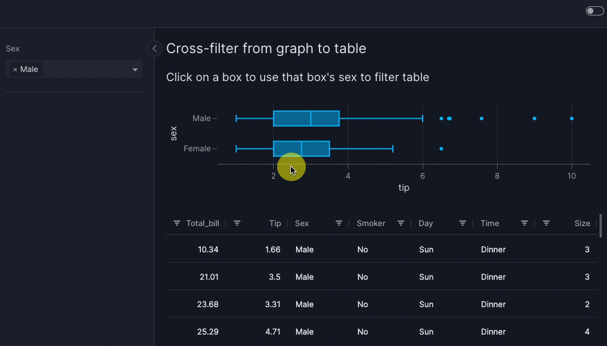

# Graph and table interactions

In this guide we show you how to configure interactions between graphs and tables, as is commonly done in business intelligence (BI) tools. In Vizro, all such interactions are enabled by an intermediate [control](controls.md) that you must explicitly define. For example:

- [Cross-filter](#cross-filter): a _source_ graph or table filters the `data_frame` of a _target_ graph or table. The source component sets a [filter](filters.md), which in turn updates the target component.
- [Cross-parameter](#cross-parameter): a _source_ graph or table updates any argument other than `data_frame` of a _target_ graph or table. The source components sets a [parameter](parameters.md), which in turn updates the target component.
- [Cross-highlight](#cross-highlight): a _source_ graph or table highlights data in a _target_ graph or table. This is an example of a [cross-parameter](#cross-parameter).

All these interactions use the [`set_control` action][vizro.actions.set_control]. This gives very generic and powerful functionality thanks to the functionality of the intermediate control:

- The target components can be anything that reacts to a control: [built-in graphs](graph.md), [custom graphs](custom-charts.md), [built-in tables](table.md), [custom tables](custom-tables.md), [built-in figures](figure.md) and [custom figures](custom-figures.md).
- A single control can update any number of these target components, and a single source component can set any number of controls. Hence a single source component can interact with any number of target components.
- A target component can be on the same page as the source or on a different page (so long as the intermediate control has [`show_in_url=True`](run-deploy.md#shareable-url)).
- A target component can also be the source component to enable a "self-interaction".
- Interactions are not "invisible"; they are explicitly shown on the screen by the value of the control. Just like a normal control, the value can be changed manually and is persisted when you change page.

## Cross-filter

A cross-filter is when the user clicks on one _source_ graph or table to filter one or more _target_ components. In Vizro, a cross-filter operates through an intermediate [filter](filters.md). To configure a cross-filter:

1. Create a filter that targets the [graphs](graph.md), [tables](table.md) or [figures](figure.md) you would like to filter. The filter must have a [categorical selector](selectors.md#categorical-selectors) (both multi- and single-option are allowed).

    ```python
    import vizro.models as vm

    controls = [vm.Filter(id="my_filter", column="species")]  # (1)!
    ```

    1. Remember that if `targets` is not explicitly specified, a filter [targets all components on the page whose data source includes `column`](filters.md#basic-filters).

1. Call `set_control` in the `actions` argument of the source [`Graph`][vizro.models.Graph] or [`AgGrid`][vizro.models.AgGrid] component that triggers the cross-filter.

    1. Set `control` to the ID of the filter.
    1. Set `value`. The format of this depends on the source model and is given in the [API reference][vizro.actions.set_control], but it is often `column` of the filter. Think of it as an instruction for what to lookup in the source data: whatever value is fetched from this lookup is used to set `control`.

    ```python
    import vizro.actions as va

    components = [vm.Graph(..., actions=va.set_control(control="my_filter", value="species"))]
    ```

1. If your source component is a `Graph` and you use a column name for `value` then this must be included in the `custom_data` of your graph's `figure` function, for example `figure=px.scatter(..., custom_data=["species"])`.

!!! tip

    Often the `value` of `set_control` is the same as the `column` of the filter, but this does not need to be the case. You can perform a cross-filter where the source component's column name given by `value` is different from the target component's column name, which is given by the filter's `column`.

### Cross-filter from table

The trigger for a cross-filter from an [AG Grid](table.md#ag-grid) is clicking on a row in the table. The `value` argument of the [`set_control` action][vizro.actions.set_control] specifies the column of the value that sets `control`.

!!! example "Cross-filter from table to graph"

    === "app.py"

        ```{.python pycafe-link hl_lines="15"}
        import vizro.actions as va
        import vizro.models as vm
        import vizro.plotly.express as px
        from vizro import Vizro
        from vizro.tables import dash_ag_grid

        tips = px.data.tips()

        page = vm.Page(
            title="Cross-filter from table to graph",
            components=[
                vm.AgGrid(
                    title="Click on a row to use that row's sex to filter graph",
                    figure=dash_ag_grid(tips),
                    actions=va.set_control(control="sex_filter", value="sex"),
                ),
                vm.Graph(id="tips_graph", figure=px.histogram(tips, x="tip")),  # (1)!
            ],
            controls=[vm.Filter(id="sex_filter", column="sex", targets=["tips_graph"])],  # (2)!
        )

        dashboard = vm.Dashboard(pages=[page])
        Vizro().build(dashboard).run()
        ```

        1. We give the `vm.Graph` an `id` so that it can be targeted explicitly by `vm.Filter(id="sex_filter")`.
        1. We give the `vm.Filter` an `id` so that it can be set explicitly by `va.set_control`.

    === "app.yaml"

        ```yaml
        # Still requires a .py to add data to the data manager and parse YAML configuration
        # See yaml_version example
        pages:
          - components:
              - actions:
                  - control: sex_filter
                    type: set_control
                    value: sex
                figure:
                  _target_: dash_ag_grid
                  data_frame: tips
                title: Click on a row to use that row's sex to filter graph
                type: ag_grid
              - figure:
                  _target_: histogram
                  data_frame: tips
                  x: tip
                id: tips_graph
                type: graph
            controls:
              - column: sex
                id: sex_filter
                targets:
                  - tips_graph
                type: filter
            title: Cross-filter from table to graph
        ```

    === "Result"

        

When you click on a row in the table, the graph is cross-filtered to show data only for one sex. The column of the clicked cell does not matter: the value is always taken from the `sex` column of the clicked row.

??? details "Behind the scenes mechanism"

    In full, what happens is as follows:

    1. Clicking on a row triggers the `va.set_control` action. This uses the value of the `sex` column for the selected row (in other words, "Male" or "Female") to set the selector underlying `vm.Filter(id="sex_filter")`.
    1. The change in value of `vm.Filter(id="sex_filter")` triggers the filter to be re-applied on its `targets=["tips_graph"]` so that a filtered graph is shown.

    The mechanism for triggering the filter when its value is set by `va.set_control` is an [implicit actions chain](../tutorials/custom-actions-tutorial.md#implicit-actions-chain).

!!! tip

    You can emphasize that a row is selectable by including checkboxes in your AG Grid with `figure=dash_ag_grid(..., dashGridOptions={"rowSelection": {"checkboxes": True}})`. The Dash AG Grid offers many [options to configure row selection](https://dash.plotly.com/dash-ag-grid/single-row-selection). These can be [passed directly](table.md#basic-usage) into `dash_ag_grid` as keyword arguments or set for multiple tables by creating a [custom table function](custom-tables.md).

    As well as being triggered on mouse click, `set_control` is also triggered by pressing ++space++ while focused on a row.

### Cross-filter from graph

The trigger for a cross-filter from a [graph](graph.md) is clicking on data in the graph. The `value` argument of the [`set_control` action][vizro.actions.set_control] can be used in two ways to specify the value that sets `control`:

- Column from which to take the value. This requires you to set `custom_data` in the graph's `figure` function.
- Value to extract from [Plotly's `clickData`](https://dash.plotly.com/interactive-graphing), for example `"x"`. This does not use `custom_data`.

We show an example of each of these in turn. Here is an example where we use `custom_data` and `value="sex"` to use a value from the `sex` column. We need to specify `custom_data` because the `sex` column is otherwise not available in `clickData`.

!!! example "Cross-filter from graph to table with `custom_data`"

    === "app.py"

        ```{.python pycafe-link hl_lines="15"}
        import vizro.actions as va
        import vizro.models as vm
        import vizro.plotly.express as px
        from vizro import Vizro
        from vizro.tables import dash_ag_grid

        tips = px.data.tips()

        page = vm.Page(
            title="Cross-filter from graph to table",
            components=[
                vm.Graph(
                    title="Click on a box to use that box's sex to filter table",
                    figure=px.box(tips, x="tip", y="time", color="sex", custom_data="sex"),  # (1)!
                    actions=va.set_control(control="sex_filter", value="sex"),
                ),
                vm.AgGrid(id="tips_table", figure=dash_ag_grid(tips)),  # (2)!
            ],
            controls=[vm.Filter(id="sex_filter", column="sex", targets=["tips_table"])],  # (3)!
        )

        dashboard = vm.Dashboard(pages=[page])
        Vizro().build(dashboard).run()
        ```

        1. We encode the `sex` column as `color` in the plot and include it in `custom_data="sex"`.
        1. We give the `vm.AgGrid` an `id` so that it can be targeted explicitly by `vm.Filter(id="sex_filter")`.
        1. We give the `vm.Filter` an `id` so that it can be set explicitly by `va.set_control`.

    === "app.yaml"

        ```yaml
        # Still requires a .py to add data to the data manager and parse YAML configuration
        # See yaml_version example
        pages:
          - components:
              - actions:
                  - control: sex_filter
                    type: set_control
                    value: sex
                figure:
                  _target_: box
                  color: sex
                  custom_data: sex
                  data_frame: tips
                  x: tip
                  y: time
                title: Click on a box to use that box's sex to filter table
                type: graph
              - figure:
                  _target_: dash_ag_grid
                  data_frame: tips
                id: tips_table
                type: ag_grid
            controls:
              - column: sex
                id: sex_filter
                targets:
                  - tips_table
                type: filter
            title: Cross-filter from graph to table
        ```

    === "Result"

        

When you click on a box in the graph, the table is cross-filtered to show data for only one sex.

??? details "Behind the scenes mechanism"

    In full, what happens is as follows:

    1. Clicking on the box triggers the `va.set_control` action. This uses the value of `sex` taken from the graph's `custom_data` (in other words, "Male" or "Female") to set the selector underlying `vm.Filter(id="sex_filter")`.
    1. The change in value of `vm.Filter(id="sex_filter")` triggers the filter to be re-applied on its `targets=["tips_table"]` so that a filtered table is shown.

    The mechanism for triggering the filter when its value is set by `va.set_control` is an [implicit actions chain](../tutorials/custom-actions-tutorial.md#implicit-actions-chain).

!!! note "Cross-filter from custom chart"

    If you cross-filter from a [custom chart](custom-charts.md) and wish to use a column supplied through `custom_data` for the `value` argument of `va.set_control` then you must explicitly include `custom_chart` in the function signature:

    ```py
    @capture("graph")
    def my_custom_chart(data_frame, custom_data, **kwargs):
        return px.scatter(data_grame, custom_data=custom_data, **kwargs)
    ```

Here is an example where we do not need to use `custom_data` because the data is already available in [Plotly's `clickData`](https://dash.plotly.com/interactive-graphing). For example, this happens when the `value` you use in `va.set_control` corresponds to the `x` or `y` axis of the graph.

!!! example "Cross-filter from graph without `custom_data` to table"

    === "app.py"

        ```{.python pycafe-link hl_lines="15"}
        import vizro.actions as va
        import vizro.models as vm
        import vizro.plotly.express as px
        from vizro import Vizro
        from vizro.tables import dash_ag_grid

        tips = px.data.tips()

        page = vm.Page(
            title="Cross-filter from graph to table",
            components=[
                vm.Graph(
                    title="Click on a box to use that box's sex to filter table",
                    figure=px.box(tips, x="tip", y="sex"),
                    actions=va.set_control(control="sex_filter", value="y"),
                ),
                vm.AgGrid(id="tips_table", figure=dash_ag_grid(tips)),  # (1)!
            ],
            controls=[vm.Filter(id="sex_filter", column="sex", targets=["tips_table"])],  # (2)!
        )

        dashboard = vm.Dashboard(pages=[page])
        Vizro().build(dashboard).run()
        ```

        1. We give the `vm.AgGrid` an `id` so that it can be targeted explicitly by `vm.Filter(id="sex_filter")`.
        1. We give the `vm.Filter` an `id` so that it can be set explicitly by `va.set_control`.

    === "app.yaml"

        ```yaml
        # Still requires a .py to add data to the data manager and parse YAML configuration
        # See yaml_version example
        pages:
          - components:
              - actions:
                  - control: sex_filter
                    type: set_control
                    value: y
                figure:
                  _target_: box
                  data_frame: tips
                  x: tip
                  y: sex
                title: Click on a box to use that box's sex to filter table
                type: graph
              - figure:
                  _target_: dash_ag_grid
                  data_frame: tips
                id: tips_table
                type: ag_grid
            controls:
              - column: sex
                id: sex_filter
                targets:
                  - tips_table
                type: filter
            title: Cross-filter from graph to table
        ```

    === "Result"

        

When you click on a box in the graph, the table is cross-filtered to show data for only one sex, which is the `y` variable for the plot. This works because `"y"` exists in `clickData` for this chart.

??? details "Behind the scenes mechanism"

    In full, what happens is as follows:

    1. Clicking on the box triggers the `va.set_control` action. This uses the value of `y` (in other words, "Male" or "Female") to set the selector underlying `vm.Filter(id="sex_filter")`.
    1. The change in value of `vm.Filter(id="sex_filter")` triggers the filter to be re-applied on its `targets=["tips_table"]` so that a filtered table is shown.

    The mechanism for triggering the filter when its value is set by `va.set_control` is an [implicit actions chain](../tutorials/custom-actions-tutorial.md#implicit-actions-chain).

In general, the data contained in [Plotly's `clickData`](https://dash.plotly.com/interactive-graphing) depends on the type of chart used. The rules for how `value` is interpreted by `set_action` are:

1. If the graph has `custom_data` then interpret the `value` as a column name and attempt to find it in `custom_data`.
1. If the graph does not have `custom_data` or does not include `value` as a column in `custom_data` then perform a lookup inside the data [`clickData["points"][0]`](https://dash.plotly.com/interactive-graphing). For example:
    - `value="x"` is equivalent to looking at `clickData["points"][0]["x"]`.
    - `value="key.subkey[1]"` is equivalent to looking at `clickData["points"][0]["key"]["subkey"][1]`.

Based on the source graph and its available `clickData`, you can therefore configure precisely which property to set as `value`.

### Cross-filter between containers

A cross-filter often works best when used [inside a container](container.md#add-controls-to-container). This typically makes it clearer which components the filter applies to, especially when the [container is styled](container.md#styled-containers).

For example, let us rearrange the above example of a [cross-filter from a table](#cross-filter-from-table) into containers. Now the control appears directly above the table that it targets rather than on the left hand side of the page. The rearrangement here is purely visual to give a better user experience; `va.set_control` itself is configured exactly the same way and behaves identically while the dashboard is running.

!!! example "Cross-filter between containers"

    === "app.py"

        ```{.python pycafe-link hl_lines="17"}
        import vizro.actions as va
        import vizro.models as vm
        import vizro.plotly.express as px
        from vizro import Vizro
        from vizro.tables import dash_ag_grid

        tips = px.data.tips()

        page = vm.Page(
            title="Cross-filter between containers",
            components=[
                vm.Container(
                    components=[
                        vm.AgGrid(
                            title="Click on a row to use that row's sex to filter graph",
                            figure=dash_ag_grid(tips),
                            actions=va.set_control(control="sex_filter", value="sex"),
                        )
                    ],
                    variant="filled",  # (1)!
                ),
                vm.Container(
                    components=[vm.Graph(figure=px.histogram(tips, x="tip"))],  # (2)!
                    controls=[vm.Filter(id="sex_filter", column="sex")],  # (3)!
                    variant="filled",
                ),
            ],
        )

        dashboard = vm.Dashboard(pages=[page])
        Vizro().build(dashboard).run()
        ```

        1. We use [styled containers](container.md#styled-containers) to make it clear which components and controls are in each container.
        1. The `vm.Graph` no longer needs an `id` assigned to it, since the `vm.Filter` does not need to explicitly target it any more.
        1. The `vm.Filter` no longer needs to specify `targets`. By default, the `vm.Filter` targets all components in its container whose data source includes `column="sex"`.

    === "app.yaml"

        ```yaml
        # Still requires a .py to add data to the data manager and parse YAML configuration
        # See yaml_version example
        pages:
          - components:
              - components:
                  - actions:
                      - control: sex_filter
                        type: set_control
                        value: sex
                    figure:
                      _target_: dash_ag_grid
                      data_frame: tips
                    title: Click on a row to use that row's sex to filter graph
                    type: ag_grid
                type: container
                variant: filled
              - components:
                  - figure:
                      _target_: histogram
                      data_frame: tips
                      x: tip
                    type: graph
                controls:
                  - column: sex
                    id: sex_filter
                    type: filter
                type: container
                variant: filled
            title: Cross-filter between containers
        ```

    === "Result"

        

### Cross-filter between pages

You can perform a cross-filter where the target components are on a different page from the source. The use of [`va.set_control`][vizro.actions.set_control] is identical, but the intermediate filter must have [`show_in_url=True`](run-deploy.md#shareable-url).

For example, let us rearrange the above example of a [cross-filter from a table](#cross-filter-from-table) so that the source table is on a different page from the target graph (and hence filter). When you click or press ++space++ on a row in the table, you are taken to the target page with the graph cross-filtered to show data only for one sex.

!!! example "Cross filter between pages"

    === "app.py"

        ```{.python pycafe-link hl_lines="15"}
        import vizro.actions as va
        import vizro.models as vm
        import vizro.plotly.express as px
        from vizro import Vizro
        from vizro.tables import dash_ag_grid

        tips = px.data.tips()

        page_1 = vm.Page(
            title="Cross-filter source table",
            components=[
                vm.AgGrid(
                    title="Click on a row to use that row's sex to filter graph",
                    figure=dash_ag_grid(tips),
                    actions=va.set_control(control="sex_filter", value="sex"),
                )
            ],
        )

        page_2 = vm.Page(
            title="Cross-filter target graph",
            components=[vm.Graph(figure=px.histogram(tips, x="tip"))],   # (1)!
            controls=[vm.Filter(id="sex_filter", column="sex", show_in_url=True)],  # (2)!
        )

        dashboard = vm.Dashboard(pages=[page_1, page_2])
        Vizro().build(dashboard).run()
        ```

        1. The `vm.Graph` no longer needs an `id` assigned to it, since the `vm.Filter` does not need to explicitly target it any more.
        1. The `vm.Filter` no longer needs to specify `targets`. By default, the `vm.Filter` targets all components on its page whose data source includes `column="sex"`. We must set `show_in_url=True` for this filter to be set by `va.set_control`.

    === "app.yaml"

        ```yaml
        # Still requires a .py to add data to the data manager and parse YAML configuration
        # See yaml_version example
        pages:
          - components:
              - actions:
                  - control: sex_filter
                    type: set_control
                    value: sex
                figure:
                  _target_: dash_ag_grid
                  data_frame: tips
                title: Click on a row to use that row's sex to filter graph
                type: ag_grid
            title: Cross-filter source table
          - components:
              - figure:
                  _target_: histogram
                  data_frame: tips
                  x: tip
                type: graph
            controls:
              - column: sex
                id: sex_filter
                show_in_url: true
                type: filter
            title: Cross-filter target graph
        ```

    === "Result"

        

### Cross-filter from pivoted or multi-dimensional data

A single source component can trigger _multiple_ cross-filters. For example, [pivoted data](https://en.wikipedia.org/wiki/Pivot_table) can be visualized using a table or a [2-dimensional heatmap](https://plotly.com/python/heatmaps/).

To perform multiple cross-filters, each dimension that is filtered must have its own `vm.Filter` that is set by `va.set_control` in the `actions` of the source component in an [actions chain](actions.md#multiple-actions). Here is a 2-dimensional example that [cross-filters from a graph](#cross-filter-from-graph):

!!! example "Cross-filter over 2 dimensions"

    === "app.py"

        ```{.python pycafe-link hl_lines="20-23"}
        import vizro.actions as va
        import vizro.models as vm
        import vizro.plotly.express as px
        from vizro import Vizro
        from vizro.tables import dash_ag_grid

        tips = px.data.tips()

        page = vm.Page(
            title="Cross-filter over 2 dimensions",
            components=[
                vm.Graph(
                    title="Click on a cell to use that cell's sex and day to filter table",
                    figure=px.density_heatmap(  # (1)!
                        tips,
                        x="day",
                        y="sex",
                        category_orders={"day": ["Thur", "Fri", "Sat", "Sun"]},
                    ),
                    actions=[
                        va.set_control(control="day_filter", value="x"),  # (2)!
                        va.set_control(control="sex_filter", value="y"),
                    ],
                ),
                vm.AgGrid(id="tips_table", figure=dash_ag_grid(tips)),
            ],
            controls=[
                vm.Filter(id="day_filter", column="day", targets=["tips_table"]),  # (3)!
                vm.Filter(id="sex_filter", column="sex", targets=["tips_table"]),
            ],
        )

        dashboard = vm.Dashboard(pages=[page])
        Vizro().build(dashboard).run()
        ```

        1. We make a [2-dimensional histogram](https://plotly.com/python/2D-Histogram/) to show the number of rows in the `tips` data for each day and sex.
        1. Each dimension has its own `va.set_control` to set the relevant `vm.Filter`.
        1. Each has its own `vm.Filter` to filter by the relevant `column`.

    === "app.yaml"

        ```yaml
        # Still requires a .py to add data to the data manager and parse YAML configuration
        # See yaml_version example
        pages:
          - components:
              - actions:
                  - control: day_filter
                    type: set_control
                    value: x
                  - control: sex_filter
                    type: set_control
                    value: y
                figure:
                  _target_: density_heatmap
                  category_orders:
                    day:
                      - Thur
                      - Fri
                      - Sat
                      - Sun
                  data_frame: tips
                  x: day
                  y: sex
                title: Click on a cell to use that cell's sex and day to filter table
                type: graph
              - figure:
                  _target_: dash_ag_grid
                  data_frame: tips
                id: tips_table
                type: ag_grid
            controls:
              - column: day
                id: day_filter
                targets:
                  - tips_table
                type: filter
              - column: sex
                id: sex_filter
                targets:
                  - tips_table
                type: filter
            title: Cross-filter over 2 dimensions
        ```

    === "Result"

        

When you click on a colored cell in the heatmap, the table is cross-filtered to show data for only one sex and one day. The "count" shown for each heatmap cell corresponds to the number of rows shown in the filtered table when that cell is clicked.

??? details "Behind the scenes mechanism"

    In full, what happens is as follows:

    1. Clicking on a cell triggers the first `va.set_control` action. This uses the value of `day` (in other words, "Thur", "Fri", "Sat" or "Sun") to set the selector underlying `vm.Filter(id="day_filter")`.
    1. When the `day_filter` has been set, the second `va.set_control` action runs. This uses the value of `sex` (in other words, "Male" or "Female") to set the selector underlying `vm.Filter(id="sex_filter")`.
    1. The change in value of `vm.Filter(id="day_filter")` triggers the filter on its `targets=["tips_table"]` so that a filtered table is shown.
    1. The change in value of `vm.Filter(id="sex_filter")` triggers the filter on its `targets=["tips_table"]` so that a filtered table is shown.

    The mechanism for triggering the filter when its value is set by `va.set_control` is an [implicit actions chain](../tutorials/custom-actions-tutorial.md#implicit-actions-chain), while the sequence of applying the two `va.set_control` is an [explicit actions chain](../tutorials/custom-actions-tutorial.md#explicit-actions-chain). In general, steps 2 and 3 above will execute in [parallel](../tutorials/custom-actions-tutorial.md#parallel-actions).

    When performing multiple filters with [dynamic data](data.md#dynamic-data), you should consider [configuring a cache](data.md#configure-cache) so that steps 3 and 4 above do not repeatedly perform a slow data load.

Multiple cross-filters are similarly possible [from a table](#cross-filter-from-table):

```python
vm.AgGrid(
    ...,
    actions=[
        va.set_control(control="day_filter", value="day"),
        va.set_control(control="sex_filter", value="sex"),
    ],
)
```

However, it is not yet possible to cross-filter from a pivot table according to the row and column of the clicked cell.

## Cross-parameter

This is already possible, and documentation is coming soon!

### Cross-highlight

This is already possible, and documentation is coming soon!
