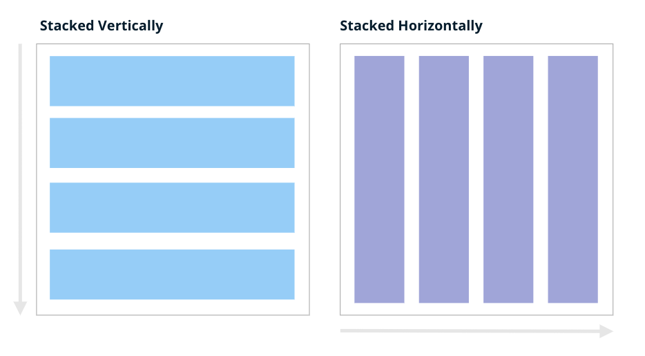

# How to use layouts

The [`Page`][vizro.models.Page] model accepts a `layout` argument that enables custom arrangement of charts and components on the screen. This guide shows how to customize the grid specifications in the [`Layout`][vizro.models.Layout].

## The default layout
The `layout` argument of the [`Page`][vizro.models.Page] model is optional. If no layout is specified, all charts/components are automatically [**stacked vertically**](layouts.md#vertical-and-horizontal-stacking) on the page in one column.
If you are happy with that arrangement, you can create your charts/components without providing a [`Layout`][vizro.models.Layout].

!!! example "Default Layout"

    === "app.py"
        ```py
        from vizro import Vizro
        import vizro.models as vm

        page = vm.Page(
            title="two_left",
            components=[vm.Card(text="""# Component 0"""),
                        vm.Card(text="""# Component 1""")]

        )

        dashboard = vm.Dashboard(pages=[page])
        Vizro().build(dashboard).run()
        ```
    === "app.yaml"
        ```yaml
        # Still requires a .py to add data to the data manager and parse YAML configuration
        # See yaml_version example
        pages:
        - components:
            - text: |
                # Component 0
              type: card
            - text: |
                # Component 1
              type: card
          title: two_left
        ```
    === "Result"
        [![Layout]][Layout]

    [Layout]: ../../assets/user_guides/layout/two_left.png


## Configure the grid
To customize the grid arrangement, configure the `grid` parameter of the [`Layout`][vizro.models.Layout] model.

The example below shows an example of a valid `grid`:

```python title="Basic example"
grid = [[0, 1],
        [0, 2]]
```

- The `grid` must be provided as `List[List[int]]` (for example, `grid = [[0, 1], [0, 2]]`).
- The integers in the `grid` must be consecutive integers starting with 0 (for example, `0`, `1`, `2`).
    - The integers correspond to the index of the chart/component inside the list of `components` provided to [`Page`][vizro.models.Page].
    - The number of integers in the `grid` needs to match the number of chart/components provided.
- Each sub-list corresponds to a grid row (in the example above, row 1 = `[0, 1]` and row 2 = `[0, 2]`)
- Each element inside the sub-list corresponds to a grid column (for example, column 1 = `[0, 0]` and column 2 = `[1, 2]`)
- Each chart/component will take the entire space of its grid area but you can use [empty sections](#add-empty-sections-to-the-grid) for extra separation.
- The area spanned by a chart/component in the grid must be rectangular.
- The grid can be arbitrarily large, allowing arbitrarily granular control of the grid.


## Vertical and horizontal stacking
As described above, when no `Layout` is specified, components are presented **vertically** as a single-column stack. If you have three components, the default `Layout.grid` will be as follows, with three equally sized rows, each containing a component spanning the entire width:

```python title="Vertical stacking"
grid = [
             [0],
             [1],
             [2]
       ]
```

To present components **horizontally** in one row:

```python title="Horizontal stacking"
grid = [[0, 1, 2]]
```

This defines a single row that occupies the entire width and height, divided into three equal columns.

<figure markdown>
  { width="680" }
</figure>

## Grid - basic example
!!! example "Grid Arrangement - Basic Example"

    === "app.py"
        ```py
        import vizro.models as vm
        from vizro import Vizro

        page = vm.Page(
            title="one_left_two_right",
            layout=vm.Layout(grid=[[0, 1],
                                   [0, 2]]),
            components=[vm.Card(text="""# Component 0"""),
                        vm.Card(text="""# Component 1"""),
                        vm.Card(text="""# Component 2"""),
                        ],
        )

        dashboard = vm.Dashboard(pages=[page])
        Vizro().build(dashboard).run()
        ```
    === "app.yaml"
        ```yaml
        # Still requires a .py to add data to the data manager and parse YAML configuration
        # See yaml_version example
        pages:
        - components:
            - text: |
                # Component 0
              type: card
            - text: |
                # Component 1
              type: card
            - text: |
                # Component 2
              type: card
          layout:
            grid: [[0, 1], [0, 2]]
          title: one_left_two_right
        ```
    === "Result"
        [![Grid]][Grid]

    [Grid]: ../../assets/user_guides/layout/one_left_two_right.png

## Grid - advanced example

!!! tip "When to use Containers"

    If you want to divide the grid into subgrids with finer control over these, you can use [`Containers`](container.md). See our section on [when to use `Containers` vs. `Page.layout`](container.md#when-to-use-containers) for more information.

The `Layout` provides full control over the arrangement of top-level components within a page,
allowing arbitrarily granular control of the grid by creating larger grids.

!!! example "Grid Arrangement - Advanced Example"

    === "app.py"
        ```py
        import vizro.models as vm
        import vizro.plotly.express as px
        from vizro import Vizro

        gapminder = px.data.gapminder()

        page = vm.Page(
            title="Custom Layout - Advanced Example",
            layout=vm.Layout(grid=[[0, 1, 3, 4],
                                    [2, 2, 3, 4]]),
            components=[
                vm.Graph(
                    figure=px.line(
                        gapminder,
                        title="Graph 1",
                        x="year",
                        y="lifeExp",
                        color="continent",
                    ),
                ),
                vm.Graph(
                    figure=px.scatter(
                        gapminder,
                        title="Graph 2",
                        x="gdpPercap",
                        y="lifeExp",
                        size="pop",
                        color="continent",
                    ),
                ),
                vm.Graph(
                    figure=px.box(
                        gapminder,
                        title="Graph 3",
                        x="continent",
                        y="lifeExp",
                        color="continent",
                    ),
                ),
                vm.Graph(
                    figure=px.line(
                        gapminder,
                        title="Graph 4",
                        x="year",
                        y="lifeExp",
                        color="continent",
                    ),
                ),
                vm.Graph(
                    figure=px.scatter(
                        gapminder,
                        title="Graph 5",
                        x="gdpPercap",
                        y="lifeExp",
                        size="pop",
                        color="continent",
                    ),
                ),
            ],
        )

        dashboard = vm.Dashboard(pages=[page])
        Vizro().build(dashboard).run()
        ```
    === "app.yaml"
        ```yaml
        # Still requires a .py to add data to the data manager and parse YAML configuration
        # See yaml_version example
        pages:
          - components:
              - figure:
                  _target_: line
                  data_frame: gapminder
                  x: year
                  y: lifeExp
                  color: continent
                  title: Graph 1
                type: graph
              - figure:
                  _target_: scatter
                  data_frame: gapminder
                  x: gdpPercap
                  y: lifeExp
                  size: pop
                  color: continent
                  title: Graph 2
                type: graph
              - figure:
                  _target_: box
                  data_frame: gapminder
                  x: continent
                  y: lifeExp
                  color: continent
                  title: Graph 3
                type: graph
              - figure:
                  _target_: line
                  data_frame: gapminder
                  x: year
                  y: lifeExp
                  color: continent
                  title: Graph 4
                type: graph
              - figure:
                  _target_: scatter
                  data_frame: gapminder
                  x: gdpPercap
                  y: lifeExp
                  size: pop
                  color: continent
                  title: Graph 5
                type: graph
            layout:
              grid: [[0, 1, 3, 4], [2, 2, 3, 4]]
            title: Custom Layout - Advanced Example
        ```
    === "Result"
        [![GridAdv]][GridAdv]

    [GridAdv]: ../../assets/user_guides/layout/grid_advanced.png

## Custom layout examples
Here is a reference table of example layouts:
<!-- vale off -->

one row with one component, second row with two components stacked horizontally

| Layout needed | Grid | Code  |
|--------------------------------|----------------------------|-------------------------------------------------------------------------------------|
|  |  | `layout=vm.Layout(grid=[[0]])` |
|  |  | `layout=vm.Layout(grid=[[0],[1]])` |
|  |  | `layout=vm.Layout(grid=[[0,1]])` |
|  |  | `layout=vm.Layout(grid=[[0],[1],[2]])` or <br/> `layout=None` |
|  |  | `layout=vm.Layout(grid=[[0,1],[0,2]])` |
|  |  | `layout=vm.Layout(grid=[[0,0],[1,2]])` |
|  |  | `layout=vm.Layout(grid=[[0,1],[2,2]])` |
|  |  | `layout=vm.Layout(grid=[[0,1],[0,2],[0,3]])` |
|  |  | `layout=vm.Layout(grid=[[0,1],[2,3]])` |
|  |  | `layout=vm.Layout(grid=[[0,3],[1,3],[2,3]])` |
|  |  | `layout=vm.Layout(grid=[[0,0,0],[1,2,3]])` |
|  |  | `layout=vm.Layout(grid=[[0,1,2],[3,3,3]])` |

<!--vale on -->

## Add empty sections to the grid
One approach to organize the dashboard's layout involves integrating empty sections by specifying `-1` within the grid layout.

```python title="Example"
grid = [[0, 1, -1],
        [0, 2, -1]]
```

!!! example "Adding Empty Spaces"

    === "app.py"
        ```py
        import vizro.models as vm
        from vizro import Vizro

        page = vm.Page(
            title="Adding empty spaces",
            layout=vm.Layout(grid=[[0, 1, -1],
                                   [0, 2, -1]]),
            components=[vm.Card(text="""# Component 0"""),
                        vm.Card(text="""# Component 1"""),
                        vm.Card(text="""# Component 2"""),
                        ],
        )

        dashboard = vm.Dashboard(pages=[page])
        Vizro().build(dashboard).run()
        ```
    === "app.yaml"
        ```yaml
        # Still requires a .py to add data to the data manager and parse YAML configuration
        # See yaml_version example
        pages:
        - components:
            - text: |
                # Component 0
              type: card
            - text: |
                # Component 1
              type: card
            - text: |
                # Component 2
              type: card
          layout:
            grid: [[0, 1, -1], [0, 2, -1]]
          title: Adding empty spaces
        ```
    === "Result"
        [![GridEmpty]][GridEmpty]

    [GridEmpty]: ../../assets/user_guides/layout/layout_empty_spaces.png

## Control the scroll behavior
By default, the grid fits all charts/components on the screen. This can lead to distortions such that the chart/component looks squashed. To control the scroll behavior, you can specify the following:

- `row_min_height`: Sets a chart/component's minimum height. Defaults to 0px.
- `col_min_width`: Sets a chart/component's minimum width. Defaults to 0px.

!!! example "Activate Scrolling"

    === "app.py"
        ```py
        import vizro.models as vm
        from vizro import Vizro

        page = vm.Page(
            title="Activate scrolling",
            layout=vm.Layout(grid=[[i] for i in range(8)],
                             row_min_height="240px"),
            components=[vm.Card(text="""# Component 0"""),
                        vm.Card(text="""# Component 1"""),
                        vm.Card(text="""# Component 2"""),
                        vm.Card(text="""# Component 3"""),
                        vm.Card(text="""# Component 4"""),
                        vm.Card(text="""# Component 5"""),
                        vm.Card(text="""# Component 6"""),
                        vm.Card(text="""# Component 7"""),
                        ],
        )

        dashboard = vm.Dashboard(pages=[page])
        Vizro().build(dashboard).run()
        ```
    === "app.yaml"
        ```yaml
        # Still requires a .py to add data to the data manager and parse YAML configuration
        # See yaml_version example
        pages:
        - components:
            - text: |
                # Component 0
              type: card
            - text: |
                # Component 1
              type: card
            - text: |
                # Component 2
              type: card
            - text: |
                # Component 2
              type: card
            - text: |
                # Component 4
              type: card
            - text: |
                # Component 5
              type: card
            - text: |
                # Component 6
              type: card
            - text: |
                # Component 7
              type: card
          layout:
            grid: [[0], [1], [2], [3], [4], [5], [6], [7]]
            row_min_height: 240px
          title: Activate scrolling
        ```
    === "Result"
        [![GridScroll]][GridScroll]

    [GridScroll]: ../../assets/user_guides/layout/grid_scroll.png


## Further customization
For further customization, such as changing the gap between row and column, refer to the
documentation of the [`Layout`][vizro.models.Layout] model.

## Alternative layout approaches
In general, any arbitrarily granular layout can already be achieved using [`Page.layout`](layouts.md) alone and is our recommended approach if you want to arrange components on a page with consistent row and/or column spacing.

!!! note "Alternative layout approaches: `Tabs` and `Containers`"

    [`Tabs`][vizro.models.Tabs] and [`Containers`][vizro.models.Container] provide an alternative approach to customize your page layout.
    For example, if you want to have more granular control and break the overall page grid into subgrids, see our [user guide on Containers](container.md).

    If you want to display multiple containers on one page by putting them into the same screen space, and letting the user switch between them, see our [user guide on Tabs](tabs.md).

    { width="500" }
