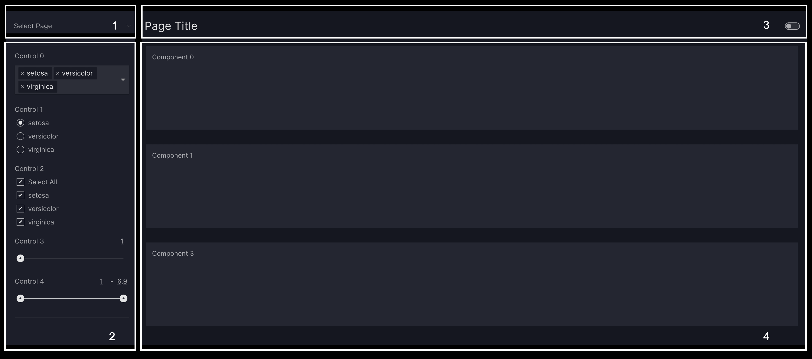

# How to make dashboard pages

This guide shows you how to add pages to your dashboard and customize the URL paths if needed. A [`Page`][vizro.models.Page] lets you place and arrange your dashboard content (for example, chart/components, tables, and text) and configure your dashboard interactions (such as filters and parameters).

The [`Dashboard`][vizro.models.Dashboard] model accepts the `pages` argument, where you can insert your [`Page`][vizro.models.Page].

## Create a page

A [`Page`][vizro.models.Page] is split up into four main containers:

1. The **navigation container** where you can customize your `navigation` (see [Dashboard](dashboard.md) and [Navigation](navigation.md) for more information). Note that the navigation container needs to be configured via the Dashboard.
1. The **control container** where you can add your `controls` (see [Filters](filters.md) or [Parameters](parameters.md)) to interact with the dashboard
1. The **page header** that contains the page title and the theme toggle switch button
1. The **component container** where you can add your [components](components.md) to visualize your data



To create and add a page to your dashboard, do the following steps:

1. Set a `title` for your [`Page`][vizro.models.Page]
1. Configure your `components`, see our guide on the [various options](components.md)
1. (optional) Configure your `controls` , see our guides on [Filters](filters.md) and [Parameters](parameters.md)
1. (optional) Configure your `layout` , see our guide on [Layouts](layouts.md)
1. (optional) Set a `description` for your page to add a tooltip and [set meta tags](dashboard.md#meta-tags-for-social-media)

!!! example "Page"

    === "app.py"

        ```{.python pycafe-link}
        import vizro.models as vm
        import vizro.plotly.express as px
        from vizro import Vizro

        gapminder = px.data.gapminder().query("year == 2007")

        page = vm.Page(
            title="Page Title",
            description="Longer description of the page content",
            components=[
                vm.Graph(
                    id="sunburst", figure=px.sunburst(gapminder, path=["continent", "country"], values="pop", color="lifeExp")
                )
            ],
            controls=[
                vm.Filter(column="continent"),
                vm.Parameter(targets=["sunburst.color"], selector=vm.RadioItems(options=["lifeExp", "pop"], title="Color")),
            ],
        )

        dashboard = vm.Dashboard(pages=[page])
        Vizro().build(dashboard).run()
        ```

    === "app.yaml"

        ```yaml
        # Still requires a .py to add data to the data manager and parse YAML configuration
        # See yaml_version example
        pages:
          - components:
              - figure:
                  _target_: sunburst
                  path: [continent, country]
                  values: pop
                  color: lifeExp
                  data_frame: gapminder
                id: sunburst
                type: graph
            controls:
              - column: continent
                type: filter
              - selector:
                  options: [lifeExp, pop]
                  title: Color
                  type: radio_items
                targets: [sunburst.color]
                type: parameter
            title: Page Title
            description: Longer description of the page content
        ```

    === "Result"

        [![Page]][page]

An accordion page selector is automatically added to your dashboard in the top-left of the control container for through the different pages. It will not be added if your dashboard consists of only one page.

You can also navigate through the different pages by going directly to the relevant page URL (more details in next section).

## Customize the page URL

By default, the page URL is automatically generated based on the `id` of the page. For example, if `id="This is my first page"` the generated page URL will be `path=this-is-my-first-page`. You can then access the page via `localhost:<port_number>/this-is-my-first-page`.

Note that the page `id` defaults to be the same as the page `title` if not set. If you have multiple pages with the same `title` then you must assign a unique `id`.

The first page always has the URL prefix `/` assigned. A custom URL can, therefore, not be created for the first page.

To customize the page URL, pass a valid URL name to the `path` argument of [`Page`][vizro.models.Page]:

!!! example "Page"

    === "app.py"

        ```{.python pycafe-link}
        import vizro.models as vm
        import vizro.plotly.express as px
        from vizro import Vizro

        gapminder = px.data.gapminder().query("year == 2007")

        page1 = vm.Page(
            title="Page 1",
            components=[
                vm.Card(
                    text="""Commodi repudiandae consequuntur voluptatum.""",
                ),
            ],
        )

        page2 = vm.Page(
            title="Page 2",
            path="my-custom-url",
            components=[
                vm.Graph(
                    id="sunburst", figure=px.sunburst(gapminder, path=["continent", "country"], values="pop", color="lifeExp")
                )
            ],
            controls=[
                vm.Filter(column="continent"),
                vm.Parameter(targets=["sunburst.color"], selector=vm.RadioItems(options=["lifeExp", "pop"], title="Color")),
            ],
        )

        dashboard = vm.Dashboard(pages=[page1, page2])
        Vizro().build(dashboard).run()
        ```

    === "app.yaml"

        ```yaml
        # Still requires a .py to add data to the data manager and parse YAML configuration
        # See yaml_version example
        pages:
          - components:
              - text: |
                  Commodi repudiandae consequuntur voluptatum.
                type: card
            title: Page 1
          - components:
              - figure:
                  _target_: sunburst
                  path: [continent, country]
                  values: pop
                  color: lifeExp
                  data_frame: gapminder
                id: sunburst
                type: graph
            controls:
              - column: continent
                type: filter
              - selector:
                  options: [lifeExp, pop]
                  title: Color
                  type: radio_items
                targets: [sunburst.color]
                type: parameter
            title: Page 2
            path: my-custom-url
        ```

You can now access the first page via `localhost:<port_number>/` and the second page via `localhost:<port_number>/my-custom-url`.

[page]: ../../assets/user_guides/pages/page_sunburst.png
