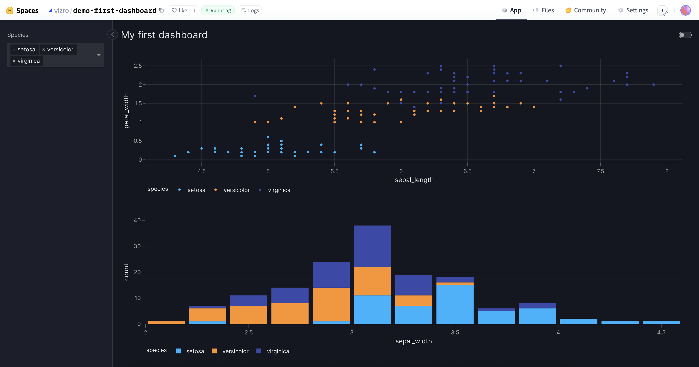

# How to run and/or deploy your dashboard

Typically when you create a dashboard, there are two distinct stages:

1. [Development](#development). This is when you build your dashboard. You make frequent changes to your code and want a simple way to see how it looks after each change. At this point, you may, or may not, want to make it possible for other people to access your dashboard.
1. [Production](#production). When you complete development, you _deploy_ it to production to make it accessible to other people.

This guide describes methods to run your dashboard _in development_ and _in production_. Follow either section based on your current need.

If your data sources in development and production are different (for example, you have different s3 buckets for development and production data) then you might like to [use the Kedro Data Catalog](kedro-data-catalog.md#use-datasets-from-the-kedro-data-catalog) to manage your data source configuration.

Vizro is built on top of [Dash](https://dash.plotly.com/), which itself uses [Flask](https://flask.palletsprojects.com/). Most of our guidance on how to run a Vizro app in development or production is very similar to guidance on Dash and Flask.

!!! note

    There are many possible workflows depending on your requirements. We are considering a simple workflow that applies to many people but is not suitable for everyone. For example:

    - If you are the only user of your app then the process is often simpler since you might never want to deploy to production.
    - If there are multiple people involved with development then you will need some way to coordinate code changes, such as a [GitHub repository](https://github.com/) or [Hugging Face Space](https://huggingface.co/spaces).
    - You might want to use _authentication_ to restrict access to your app.
    - You might want to update your dashboard after it has been put into production. There is then a cycle of repeated development and deployment.
    - There might be more stages or _environments_ for Quality Assurance (QA) to test that the app works correctly before it is deployed.

## Development

When developing a dashboard, you have several options on how to get started as the table below describes. Clicking the links will lead you to the relevant docs section explaining more. The [fastest way to run a dashboard is to use PyCafe](https://py.cafe/snippet/vizro/v1), as shown in our [First Dashboard tutorial](../tutorials/first-dashboard.md).

| Method                                     | Description                                                | Requires                         |
| ------------------------------------------ | ---------------------------------------------------------- | -------------------------------- |
| [Python script](#develop-in-python-script) | Run a local Python script using a Flask development server | Local Python                     |
| [Jupyter](#develop-in-a-notebook)          | Run a cell in a Notebook using a Flask development server  | Local Python, Jupyter/JupyterLab |
| [PyCafe](#develop-in-pycafe)               | Run code in your browser using WebAssembly                 | No requirements                  |

### Develop in Python script

The most common way to run your dashboard in development is to run it _locally_ (on your own computer) using the Flask development server.

1. Create a Python file named `app.py` that ends with the line `Vizro().build(dashboard).run()`.
1. Run the command `python app.py` in your terminal.
1. Go to [http://127.0.0.1:8050/](http://127.0.0.1:8050/) to see your app.

```python
from vizro import Vizro
import vizro.plotly.express as px
import vizro.models as vm

iris = px.data.iris()

page = vm.Page(
    title="My first page",
    components=[
        vm.Graph(figure=px.scatter(iris, x="sepal_length", y="petal_width", color="species")),
    ],
)

dashboard = vm.Dashboard(pages=[page])
Vizro().build(dashboard).run()
```

The `run` method wraps [Dash's run method](https://dash.plotly.com/reference#app.run), and all arguments are passed through to Dash. Particularly useful ones are:

- `port`. If not specified, this defaults to `8050`. If you run multiple dashboards on your computer then you may need to avoid a clash by specifying a different port with, for example, `run(port=8051)`.
- `debug`. This is described more below in the [section on debugging](#automatic-reloading-and-debugging).
- `jupyter_mode`. This is described more below in the [section on Jupyter](#develop-in-a-notebook).

!!! warning "Use only for local development"

    The Flask development server is [intended for local development only](https://flask.palletsprojects.com/en/3.0.x/deploying/) and should not be used when deploying a Vizro dashboard to production. See our [section on deployment](#production) for information on how to deploy.

### Develop in a Notebook

If you develop in a Jupyter Notebook or JupyterLab then you should use exactly the [same code as above](#develop-in-python-script):

```python
from vizro import Vizro
import vizro.plotly.express as px
import vizro.models as vm

iris = px.data.iris()

page = vm.Page(
    title="My first page",
    components=[
        vm.Graph(figure=px.scatter(iris, x="sepal_length", y="petal_width", color="species")),
    ],
)

dashboard = vm.Dashboard(pages=[page])
Vizro().build(dashboard).run()
```

The code runs Vizro using a Flask development server and shows the resulting dashboard inline in your Notebook. You can change where the dashboard appears with the [`jupyter_mode` argument](https://dash.plotly.com/dash-in-jupyter). For example, `run(jupyter_mode="external")` provides a link to open the dashboard in a new window.

!!! note "Reloading and debugging"

    Code reloading and hot reloading do not work in Jupyter. See the [section on reloading for alternatives when using Jupyter](#automatic-reloading-and-debugging).

### Develop in PyCafe

The easiest way to run a dashboard is to work on the code live on [PyCafe](https://py.cafe/).

Most of the Vizro documentation examples have a link below the code that reads [**Run and edit this code in Py.Cafe**](https://py.cafe/vizro-official/vizro-iris-analysis). Follow the link to open the code in PyCafe within an editor, such as the one below, which displays the dashboard and the code side by side.

<figure markdown="span">
  
  <figcaption>Enter your dashboard code on the left, and see the results immediately reflected in the app on the right.</figcaption>
</figure>

You can use [PyCafe](https://py.cafe/snippet/vizro/v1) snippet mode to experiment with your own Vizro dashboards by dropping code into a new project.

!!! note

    Note that when you save your code as a project, the dashboard and the code will be visible to the public. PyCafe is planning to implement a paid tier that allows private dashboards.

    As long as you remain in [snippet mode](https://py.cafe/snippet/vizro/v1) - not having clicked "Push" - your code is only local to your machine and is not visible to others.

### Automatic reloading and debugging

While developing, you often make frequent changes to your code and want to see how the dashboard looks after each change. It can be slow and tedious to manually restart your dashboard every time you want to see your changes. Depending on your chosen development method, there are ways to automatically refresh whenever code changes.

**... in Python scripts**

Turn on [Dash Dev Tools](https://dash.plotly.com/devtools) by setting `debug=True` in the `run()` method: `Vizro().build(dashboard).run(debug=True)`. This switches on [code reloading and hot reloading](https://dash.plotly.com/devtools#code-reloading-&-hot-reloading) as well as several other features that are useful during development, such as detailed in-app error reporting. Some errors generated at run time can also be viewed via the browser console (for example, in Chrome, see `View > Developer > Developer Tools > Console`).

Dash Dev Tools can also be [configured using environment variables](https://dash.plotly.com/devtools#configuring-with-environment-variables). For example, setting the environment variable `DASH_DEBUG=true` is equivalent to setting `debug=True` in the `run()` method.

**... in a Notebook**

Vizro code reloading and hot reloading do not work in Jupyter Notebooks. There are two alternative methods to reload the dashboard after you change your code:

- Restart the Jupyter kernel and re-run your Notebook.
- Add a cell containing `from vizro import Vizro; Vizro._reset()` to the top of your Notebook and re-run it before you re-run your code. With this method, there is no need to restart the Jupyter kernel.

**... in PyCafe**

In PyCafe there is no need to set anything as your dashboard will automatically reload and update when you make code changes. You can change in the settings whether this should happen automatically or on file save.

## Production

When developing your dashboard you typically run it _locally_ (on your own computer) using the Flask development server. When you deploy to production, this is no longer suitable. Instead, you need a solution that can handle multiple users in a stable, secure and efficient way.

The below table is a **TLDR** that provides an overview of the most common options. Clicking the links will lead you to the relevant section below.

| Method                                         | Free Tier         | Some key features (not exhaustive)                                                                                                                                     | Requires                                                      |
| ---------------------------------------------- | ----------------- | ---------------------------------------------------------------------------------------------------------------------------------------------------------------------- | ------------------------------------------------------------- |
| [Hugging Face](#deploy-to-hugging-face)        | :simple-ticktick: | Easy cloning of apps, Gallery features, easy access to HF model hub                                                                                                    | Hugging Face account                                          |
| [Ploomber Cloud](#deploy-to-ploomber-cloud)    | :simple-ticktick: | Easy drag and drop and CLI deployment, authentication features and serverless functions in paid tier                                                                   | Ploomber Account                                              |
| [Dash Enterprise](#deploy-via-dash-enterprise) | :x:               | Enterprise deployment solution with many more features going above and beyond                                                                                          | Dash Enterprise subscription                                  |
| [PyCafe](#deploy-via-pycafe)                   | :simple-ticktick: | No deployment in traditional sense (with backend server) as it uses WASM technology to run python in the Browser, but very scalable and easy alternative in some cases | No requirements (in snippet mode), otherwise a PyCafe account |

### Overview

Vizro is a production-ready framework, which means that the dashboard created during development is immediately suitable for deployment to production with minimal changes. Under the hood, Vizro uses [Dash's stateless architecture](https://dash.plotly.com/sharing-data-between-callbacks#dash-is-stateless), designed for scaling to thousands of concurrent users.

In general, there is only one code change that is required for deployment. During development, the last line of your `app.py` file should be `Vizro().build(dashboard).run()`.

For deployment, this should be replaced with:

```python
app = Vizro().build(dashboard)  # (1)!

if __name__ == "__main__":  # (2)!
    app.run()
```

1. The Vizro `app` object needs to be exposed so that the app can be started in production.
1. This code is only executed when you run `python app.py` and does not run in production. It's there to enable you to [run the same app in development](#develop-in-python-script) using the Flask development server.

That's it! Your app is now suitable for deployment to production.

!!! warning "Extra step if you use dynamic data cache"

    If your dashboard uses [dynamic data](data.md#dynamic-data) that can be refreshed while the dashboard is running then you should [configure your data manager cache](data.md#configure-cache) to use a backend that supports multiple processes.

Now that your `app.py` file is ready, you need to choose a _hosting provider_. There are many services out there with different offerings, but for most users we recommend two in particular: [Hugging Face](https://huggingface.co/) and [Ploomber Cloud](https://docs.cloud.ploomber.io/). These both have a free tier with the possibility of paying more for extras, and they are both quick and easy to get started with. We give step-by-step instructions on how to use each:

- [Deploy a Vizro dashboard to Hugging Face](#deploy-to-hugging-face)
- [Deploy a Vizro dashboard to Ploomber Cloud](#deploy-to-ploomber-cloud)

Enterprise users should look at our guidance for [deploying Vizro dashboards on Dash Enterprise](#deploy-via-dash-enterprise). We also discuss the [general principles for deploying a Vizro app](#general-principles-when-deploying-vizro-dashboards) that apply to all hosting providers.

### Deploy to Hugging Face

[Hugging Face](https://huggingface.co/) is a platform for machine learning models, datasets and demos. Within Hugging Face, the [Spaces feature](https://huggingface.co/spaces/launch) offers a one click experience to deploy a Vizro dashboard for free. This is the easiest way to deploy a Vizro app if you do not mind your app's code being public or shared within your [Hugging Face organization](https://huggingface.co/organizations). Paid plans include features such as authentication, developer mode for debugging, user analytics and more powerful computing resources.

The best way to get started with Vizro on Hugging Face is to copy an existing Vizro dashboard and then modify it to add your own app. Vizro maintains an [official gallery of example dashboards](https://huggingface.co/collections/vizro/vizro-official-gallery-66697d414646eeac61eae6de) and a [gallery of example dashboards made by the community](https://huggingface.co/collections/vizro/vizro-official-gallery-66697d414646eeac61eae6de). Any of these example dashboards can be used as a template for your app. In Hugging Face terminology, a Vizro dashboard lives in a _Space_, and you can copy a dashboard by [duplicating the Space](https://huggingface.co/docs/hub/en/spaces-overview#duplicating-a-space).

If this is your first Vizro deployment, we recommend using our [first dashboard example](https://huggingface.co/spaces/vizro/demo-first-dashboard). This is a minimal example that is designed to make it as simple as possible to get started on Hugging Face. You can create your own Vizro deployment based on this template as follows:

1. [Sign up for a Hugging Face account](https://huggingface.co/join).
1. Copy our example Hugging Face dashboard by duplicating our [first dashboard example Space](https://huggingface.co/spaces/vizro/demo-first-dashboard). To do so, click the following button: [](https://huggingface.co/spaces/vizro/demo-first-dashboard?duplicate=true). This should open a window with the following form: 
1. You do not need to alter any of the default options but the [Hugging Face documentation](https://huggingface.co/docs/hub/en/spaces-overview#duplicating-a-space) gives an explanation of each.
1. Click "Duplicate Space" to build your Hugging Face Space. This takes around 10 seconds, and when complete you should see the following dashboard running. 

To turn the example app into your own, you will need to edit the code in the `app.py` file. Click on the Files tab at the top of your app and select `app.py`. Click the Edit button highlighted in the below screenshot to enter an editor view of the file. 

You can now copy and paste your app code into the editor. When you've finished editing, click "Commit changes to `main`". This immediately triggers a rebuild of your Space. As with the initial build this takes around 10 seconds, and when complete you should be able to view your own app deployed on Hugging Face!

!!! note

    Remember that a deployed `app.py` file must contain a line that [exposes the Vizro `app` object](#overview) as `app = Vizro().build(dashboard)`.

Under the hood, your Space is a Git repository. Instead of editing files through your browser, you can use [`git` from the command line and the Hugging Face CLI](https://huggingface.co/docs/hub/en/repositories-getting-started). Every time you make a commit to your repository, your app is automatically rebuilt and restarted.

In addition to `app.py`, your Space contains a few other files:

- `.gitattributes` is used by [Git Large File Storage (LFS)](https://git-lfs.com/) and is only relevant if you have files larger than 10MB. See the [Hugging Face documentation](https://huggingface.co/docs/hub/en/repositories-getting-started) for more information.
- `Dockerfile` gives instructions to configure your app's environment and start the app. See our [section on Dockerfiles](#dockerfile) for more information.
- `README.md` configures your Space, for example its title, description and license. See the [Hugging Face documentation](https://huggingface.co/docs/hub/en/spaces-config-reference) for more information.
- `requirements.txt` gives your Python package dependencies. See our [section on dependencies](#dependencies) for more information.

!!! tip

    If you'd like to show your Vizro app off to the community then you can add it to our [Vizro dashboard community gallery](https://huggingface.co/collections/vizro/vizro-official-gallery-66697d414646eeac61eae6de). Notify us on GitHub in case you are interested.

### Deploy to Ploomber Cloud

[Ploomber Cloud](https://ploomber.io/) is a platform specifically built to deploy data visualization apps built using frameworks such as Vizro. Its free tier offers an easy deployment by drag and drop, the [Ploomber Cloud CLI](https://docs.cloud.ploomber.io/en/latest/user-guide/cli.html), or `git push`. Paid plans include features such as a custom domains, enterprise-grade authentication, user analytics and more powerful computing resources.

The [Ploomber Cloud documentation](https://docs.cloud.ploomber.io/en/latest/apps/vizro.html) contains detailed instructions on how to deploy Vizro on Ploomber Cloud. In short, the process is as follows:

1. [Sign up for a Ploomber Cloud account](https://platform.ploomber.io/register).
1. Modify the last line of your `app.py` to [expose the Vizro `app` object](#overview) as `app = Vizro().build(dashboard)`.
1. Create a `requirements.txt` file to give your Python package dependencies. This should include `vizro` and `gunicorn`. See our [section on dependencies](#dependencies) for more information.
1. Create a `Dockerfile` by copying the [example given in the Ploomber Cloud documentation](https://docs.cloud.ploomber.io/en/latest/apps/vizro.html#application-setup). See our [section on Dockerfiles](#dockerfile) for more information.
1. Compress your `app.py`, `requirements.txt` and `Dockerfile` into a single zip file.
1. Upload the zip file to Ploomber Cloud.

You can find a [similar guide on the Ploomber Cloud Blog](https://ploomber.io/blog/vizro-deploy).

### Deploy via Dash Enterprise

Since a Vizro app is a Dash app under the hood, they can be deployed to [Dash Enterprise](https://plotly.com/dash/) and accessed in the same way as other Dash apps.

Dash Enterprise helps to deploy and scale production-grade data apps and integrate them with IT infrastructure such as authentication and VPC services. Vizro users may find it suitable for deployment, rapid development environments, and authentication.

Vizro is compatible with the following functionality within Dash Enterprise:

- [App Portal](https://dash.plotly.com/dash-enterprise/portal?de-version=5.5)
- [App Manager](https://plotly.com/dash/app-manager/)
- [Dash App Workspaces](https://plotly.com/dash/workspaces/)
- [App logs and viewer statistics](https://dash.plotly.com/dash-enterprise/logs)
- [Centralized data app management](https://plotly.com/dash/centralized-data-app-management/)
- [CI/CD](https://plotly.com/dash/continuous-integration/)
- [Redis](https://plotly.com/dash/big-data-for-python/)
- [Dash Enterprise Authentication](https://plotly.com/dash/authentication/)

Vizro is not currently compatible with the [Dashboard Engine](https://plotly.com/dash/dashboard-engine/) or [Dash Design Kit](https://plotly.com/dash/design-kit/), and cannot produce static reports accessed via the [Snapshot Engine](https://plotly.com/dash/snapshot-engine/).

### Deploy via PyCafe

You can also share your Vizro application using [PyCafe](#develop-in-pycafe) - which we introduced in the [development](#development) section. This is not a traditional deployment (using a backend server), but [uses WebAssembly and Pyodide to run Python in your browser](#webassembly-wasm-and-pyodide). If you are happy with the constraints and advantages of this technology, then this is likely the easiest and fastest way to share your application.

The two menu options of interest are highlighted in red below. "Push" let's you save a snippet to your account, so you can come back to edit it, and "Share" shows you how to share your code and dashboard.

<figure markdown="span">
  
  <figcaption>Highlighted in red are the options that help you share your dashboard.</figcaption>
</figure>

Since this solution runs the dashboard in every visitors Browser, scalability to many viewers is not an issue.

### General principles when deploying Vizro dashboards

There are many other hosting providers, such as [Render](https://render.com/), [Heroku](https://www.heroku.com/), and [Fly](https://fly.io/). Some of these, such as Render, offer a free tier.

Although these services work in slightly different ways, there are some general principles that usually apply across all hosting providers. In general, the procedure is:

1. Modify the last line of your `app.py` to [expose the Vizro `app` object](#overview) as `app = Vizro().build(dashboard)`.
1. Create a `requirements.txt` file to give your Python package dependencies. This should include `vizro` and `gunicorn`. See the [section on dependencies](#dependencies) for more information.
1. Upload your `app.py` and `requirements.txt` files, for example by drag and drop, your hosting provider's CLI, or `git push`.
1. Specify on your hosting provider how to handle your app:
    - Before the app is started, the environment needs to be built. Python dependencies should be installed with `pip install -r requirements.txt`.
    - To start the app, you should use the command `gunicorn app:app --workers 4`. See the [section on Gunicorn](#gunicorn) for more information.
    - Optional: set [advanced configuration](#advanced-dockerfile-configuration), for example to serve assets using a Content Delivery Network (CDN).
1. Optional: configure further settings on your hosting provider, for example to make your dashboard private or to configure computing resources.

The method for providing instructions on how to handle your app varies between hosting providers. For example, on Render there are [build and deploy commands](https://render.com/docs/deploys); on Heroku and Dash Enterprise there is a [Procfile](https://devcenter.heroku.com/articles/procfile). One common cross-platform way to configure an environment is using a Dockerfile. This is used by both Hugging Face and Ploomber Cloud among others. See the [section on Dockerfile](#dockerfile) for more information.

#### Dependencies

The `requirements.txt` file [specifies your app's Python dependencies](https://pip.pypa.io/en/stable/reference/requirements-file-format/). At a minimum, the file must include `vizro` (used to run the app in development and production) and `gunicorn` (used only in production). Our simple dashboard demo has exactly this [minimal example `requirements.txt`](https://huggingface.co/spaces/vizro/demo-first-dashboard/blob/main/requirements.txt). These dependencies should then be installed on your host server using [`pip install`](https://pip.pypa.io/en/stable/cli/pip_install/) with the command `pip install -r requirements.txt` (or the [`uv` equivalent](https://docs.astral.sh/uv/pip/packages/#installing-a-package) `uv pip install -r requirements.txt`).

Although this process for handling dependencies is sufficient to get started with deployment, it is best practice to _pin_ your dependencies to exact versions. This ensures that your app does not break when your dependencies are updated. Ideally, pinned versions should include both your _direct_ dependencies and their dependencies (your _transitive_ dependencies). There are two alternative methods we recommend for this:

- Run [`pip freeze`](https://pip.pypa.io/en/stable/cli/pip_freeze/) in your development environment to create the `requirements.txt` file with `pip freeze > requirements.txt`. On your host server, these dependencies are installed with `pip install -r requirements.txt`.
- Create a new file `requirements.in` for your unpinned requirements and run [`uv pip compile`](https://docs.astral.sh/uv/pip/compile/) to generate the `requirements.txt` file from this with `uv pip compile requirements.in -o requirements.txt`. On the host server, these dependencies should be installed with `uv pip sync requirements.txt`. This is the method followed in our [KPI dashboard demo](https://huggingface.co/spaces/vizro/demo-kpi/tree/main).

#### Gunicorn

[Gunicorn](https://gunicorn.org/) is a production-ready Python server for deploying an app over multiple worker processes. The standard way to write a Vizro app is to have a file called `app.py` that contains the Vizro app in a variable called `app`. Given this setup, the command to start Gunicorn with four worker processes is:

```bash
gunicorn app:app --workers 4
```

The Gunicorn documentation gives [commonly used arguments](https://docs.gunicorn.org/en/stable/run.html#commands) and advice for setting them. Other than `workers`, the most common argument to specify is `bind`, which makes your app accessible. This is often set as `--bind 0.0.0.0:<port>`. Your hosting provider needs to tell you what the correct port to use is. For example, on Hugging Face it is 7860 and on Ploomber Cloud it is 80.

#### Dockerfile

A [Dockerfile](https://docs.docker.com/build/concepts/dockerfile/) contains instructions to build a [container image](https://docs.docker.com/get-started/docker-concepts/the-basics/what-is-an-image/). You can think of it as a way to give in a single file all the instructions that your hosting provider needs to deploy your app. This includes both the [installation of dependencies](#dependencies) and [starting the app with Gunicorn](#gunicorn). A Dockerfile is used by many hosting providers, including Hugging Face and Ploomber Cloud.

Here is an annotated [example Dockerfile](https://huggingface.co/spaces/vizro/demo-first-dashboard/blob/main/Dockerfile) that we use in our simple Hugging Face demo. It demonstrates the key Dockerfile instructions needed to deploy Vizro and should serve as a good starting point for your own Dockerfile.

```dockerfile
FROM ghcr.io/astral-sh/uv:python3.12-bookworm-slim  # (1)!

WORKDIR /app

COPY requirements.txt .
RUN uv pip install --system -r requirements.txt
COPY . .
# (2)!

ENTRYPOINT ["gunicorn", "app:app", "--workers", "4", "--bind", "0.0.0.0:7860"]
# (3)!
```

1. Use a Docker image that [includes `uv` pre-installed](https://docs.astral.sh/uv/guides/integration/docker/).
1. Install the [Python dependencies](#dependencies) as [described in the `uv` documentation](https://docs.astral.sh/uv/guides/integration/docker/#installing-requirements). The app files are copied into the container after installing dependencies to optimize Docker's [build cache](https://docs.docker.com/build/cache/).
1. Run the Vizro app using [Gunicorn](#gunicorn).

#### Advanced Dockerfile configuration

Vizro is built on top of [Dash](https://dash.plotly.com/), which itself uses [Flask](https://flask.palletsprojects.com/). Deployment of Vizro is essentially the same as deployment of the underlying frameworks, and more guidance can be found in [Flask's deployment documentation](https://flask.palletsprojects.com/en/2.0.x/deploying/) and [Dash's deployment documentation](https://dash.plotly.com/deployment).

[`Vizro`][vizro.Vizro] accepts `**kwargs` that are passed through to `Dash`. This enables you to configure the underlying Dash app using the same [arguments that are available](https://dash.plotly.com/reference#dash.dash) in `Dash`. For example, in a deployment context, these arguments may be useful:

- `url_base_pathname`: serve your Vizro app at a specific path rather than at the domain root. For example, if you host your dashboard at `http://www.example.com/my_dashboard/` then you would set `url_base_pathname="/my_dashboard/"` or an environment variable `DASH_URL_BASE_PATHNAME="/my_dashboard/"`.
- `serve_locally`: set to `False` to [serve Dash component libraries from a Content Delivery Network (CDN)](https://dash.plotly.com/external-resources#serving-dash's-component-libraries-locally-or-from-a-cdn), which reduces load on the server and can improve performance. Vizro uses [jsDeliver](https://www.jsdelivr.com/) as a CDN for CSS and JavaScript sources.
- `assets_external_path`: when `serve_locally=False`, you can also set `assets_external_path` or an environment variable `DASH_ASSETS_EXTERNAL_PATH` to [serve your own assets from a CDN](https://dash.plotly.com/external-resources#load-assets-from-a-folder-hosted-on-a-cdn).

In fact, the only difference between deploying a Vizro app and deploying a Dash app is that Vizro implements a small simplification that makes it unnecessary for you to add a line like `server = app.server`, as you would do with Dash. Internally, `app = Vizro()` contains a Flask app in `app.dash.server`. As a convenience, the Vizro `app` itself implements the [WSGI application interface](https://werkzeug.palletsprojects.com/en/3.0.x/terms/#wsgi) as a shortcut to the underlying Flask app. This means that the Vizro `app` object can be directly supplied to the WSGI server in the command `gunicorn app:app`.

#### WebAssembly (WASM) and Pyodide

Vizro applications traditionally run on a Python backend, serving dynamic content to a web-based frontend. However, [advancements in WASM](https://en.wikipedia.org/wiki/WebAssembly) and [Pyodide](https://github.com/pyodide/pyodide) as used by [PyCafe](#develop-in-pycafe) now enable Vizro to run entirely in the browser without a dedicated server.

**WASM**

WASM is a low-level binary instruction format that enables high-performance execution of code on web browsers. Unlike JavaScript, which is typically interpreted, WASM code is compiled and executed at near-native speed. This enables languages like C, Rust, and even Python (via Pyodide) to run efficiently in the browser.

**Pyodide**

[Pyodide is a Python distribution compiled to WebAssembly, enabling Python execution in a browser’s JavaScript runtime](https://hacks.mozilla.org/2019/04/pyodide-bringing-the-scientific-python-stack-to-the-browser/). It includes a standard Python interpreter, common scientific libraries (NumPy, Pandas, Matplotlib, etc.), and interoperability with JavaScript within the browser environment. In the context of Vizro, Pyodide enables the execution of Dash callbacks, component updates, and external Python libraries directly in the client’s browser, without a persistent backend.

While potential advantages include serverless execution, reduced latency and easier "deployment", the disadvantages include limited performance compared to a native server, limited library support, and memory constraints.
