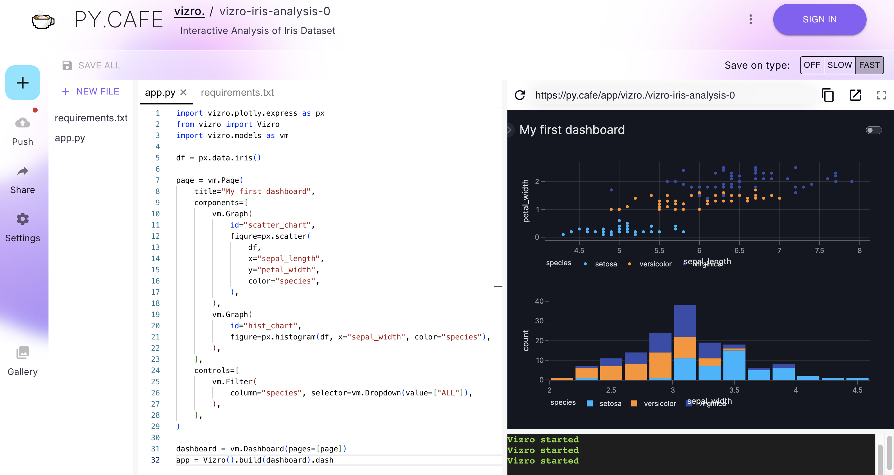

# How to launch the dashboard

This guide shows you how to launch your dashboard in different ways. By default, your dashboard apps run on localhost port 8050 so is accessible at [http://127.0.0.1:8050/](http://127.0.0.1:8050/).

## PyCafe

The easiest way to launch your dashboard is to edit the code live on [PyCafe](https://py.cafe/).

Most of our examples have a link below the code, [Run and edit this code in PyCafe](https://py.cafe/vizro-official/vizro-iris-analysis), which you can follow to experiment with the code. This opens an editor such as the one below, which displays the dashboard and the code side by side.

<figure markdown="span">
  
  <figcaption>Enter your dashboard code on the left, and see the results immediately reflected in the app on the right.</figcaption>
</figure>

You can use [PyCafe](https://py.cafe/snippet/vizro/v1) snippet mode to experiment with your own Vizro dashboards by dropping code into a new project.


## Default built-in Flask development server

!!! example "Default built-in Flask development server"
    === "app.py"
        ```
        from vizro import Vizro
        import vizro.plotly.express as px
        import vizro.models as vm

        iris = px.data.iris()

        page = vm.Page(
            title="My first page",
            components=[
                vm.Graph(figure=px.scatter(iris, x="sepal_length", y="petal_width", color="species")),
            ],
        )

        dashboard = vm.Dashboard(pages=[page])

        Vizro().build(dashboard).run()
        ```
1. create a Python file named `app.py`.
2. type the command `python app.py` into your terminal.
3. information below will be displayed in your terminal, go to [http://127.0.0.1:8050/](http://127.0.0.1:8050/).

```
Dash is running on http://127.0.0.1:8050/

 * Serving Flask app 'app'
 * Debug mode: off
INFO:werkzeug:WARNING: This is a development server. Do not use it in a production deployment. Use a production WSGI server instead.
```

!!! warning "In production"

    As per the above warning message, which is [further explained in the Flask documentation](https://flask.palletsprojects.com/en/3.0.x/deploying/), the Flask development server is intended for use only during local development and **should not** be used when deploying to production. Instead, you should instead use a production-ready solution such as [Gunicorn](#gunicorn).

### Automatic reloading and debugging

You can set up the front-end to automatically refresh whenever dashboard configuration updates are made, as described in the ["Code Reloading and Hot Reloading" section of the Dash Dev Tools documentation](https://dash.plotly.com/devtools#code-reloading-&-hot-reloading).

This is turned off by default in Vizro apps but can be enabled by using `debug=True` in the `run()` method: `Vizro().build(dashboard).run(debug=True)`

Setting `debug=True` enables [Dash Dev Tools](https://dash.plotly.com/devtools). In addition to hot reloading, this enables several other features that are useful during development, such as detailed in-app error reporting.

In addition, some errors generated at run time can also be viewed via the browser console (for example in `Chrome` see `View > Developer > Developer Tools > Console`).


## Jupyter
The dashboard application can be launched in a Jupyter environment in `inline`, `external`, and `jupyterlab` mode.
!!! example "Run in a Jupyter Notebook in inline mode"

    === "app.ipynb"
        ```py linenums="1"
        from vizro import Vizro
        import vizro.plotly.express as px
        import vizro.models as vm

        iris = px.data.iris()

        page = vm.Page(
            title="My first page",
            components=[
                vm.Graph(id="scatter_chart", figure=px.scatter(iris, x="sepal_length", y="petal_width", color="species")),
            ],
        )

        dashboard = vm.Dashboard(pages=[page])
        Vizro().build(dashboard).run(jupyter_mode="external")
        ```
- by default, the mode is set to `inline` in `run()` and the dashboard will be displayed inside your Jupyter environment.
- you can specify `jupyter_mode="external"` and a link will be displayed to direct you to the localhost where the dashboard is running.
- you can use tab mode by `jupyter_mode="tab"` to automatically open the app in a new browser

!!! note "Reloading and debugging"

    Code reloading and hot reloading do not work within a Jupyter Notebook. Instead, there are two methods to reload the dashboard:

	* Restart the Jupyter kernel and re-run your notebook.
	* Add a cell containing `from vizro import Vizro; Vizro._reset()` to the top of your notebook and re-run it. With this method, there is no need to restart the Jupyter kernel.

## Gunicorn

[Gunicorn](https://gunicorn.org/) is a production-ready Python WSGI server for deploying an app over multiple worker processes. It can be installed with `pip install gunicorn`.

!!! example "Use Gunicorn"
    === "app.py"
        ```py
        from vizro import Vizro
        import vizro.plotly.express as px
        import vizro.models as vm

        iris = px.data.iris()

        page = vm.Page(
            title="My first page",
            components=[
                vm.Graph(id="scatter_chart", figure=px.scatter(iris, x="sepal_length", y="petal_width", color="species")),
            ],
        )

        dashboard = vm.Dashboard(pages=[page])
        app = Vizro().build(dashboard)  # (1)!

        if __name__ == "__main__":  # (2)!
            app.run()
        ```

        1. The Vizro `app` object is a WSGI application that exposes the underlying Flask app; this will be used by Gunicorn.
        2. Enable the same app to still be run using the built-in Flask server with `python app.py` for development purposes.

To run using Gunicorn with four worker processes, execute
```bash
gunicorn app:app --workers 4
```
in the command line. For more Gunicorn configuration options, refer to [Gunicorn documentation](https://docs.gunicorn.org/).

!!! warning "In production"

    If your dashboard uses [dynamic data](data.md#dynamic-data) that can be refreshed while the dashboard is running then you should [configure your data manager cache](data.md#configure-cache) to use a backend that supports multiple processes.

## Deployment

A Vizro app wraps a Dash app, which itself wraps a Flask app. Hence to deploy a Vizro app, similar guidance applies as for the underlying frameworks:

- [Flask deployment documentation](https://flask.palletsprojects.com/en/2.0.x/deploying/)
- [Dash deployment documentation](https://dash.plotly.com/deployment)

Internally, `app = Vizro()` contains a Flask app in `app.dash.server`. However, as a convenience, the Vizro `app` itself implements the [WSGI application interface](https://werkzeug.palletsprojects.com/en/3.0.x/terms/#wsgi) as a shortcut to the underlying Flask app. This means that, as in the [above example with Gunicorn](#gunicorn), the Vizro `app` object can be directly supplied to the WSGI server.

[`Vizro`][vizro.Vizro] accepts `**kwargs` that are passed through to `Dash`. This enables you to configure the underlying Dash app using the same [arguments that are available](https://dash.plotly.com/reference#dash.dash) in `Dash`. For example, in a deployment context, these arguments may be useful:

- `url_base_pathname`: serve your Vizro app at a specific path rather than at the domain root. For example, if you host your dashboard at http://www.example.com/my_dashboard/ then you would set `url_base_pathname="/my_dashboard/"` or an environment variable `DASH_URL_BASE_PATHNAME="/my_dashboard/"`.
- `serve_locally`: set to `False` to [serve Dash component libraries from a Content Delivery Network (CDN)](https://dash.plotly.com/external-resources#serving-dash's-component-libraries-locally-or-from-a-cdn), which reduces load on the server and can improve performance. Vizro uses [jsDeliver](https://www.jsdelivr.com/) as a CDN for CSS and JavaScript sources.
- `assets_external_path`: when `serve_locally=False`, you can also set `assets_external_path` or an environment variable `DASH_ASSETS_EXTERNAL_PATH` to [serve your own assets from a CDN](https://dash.plotly.com/external-resources#load-assets-from-a-folder-hosted-on-a-cdn).
