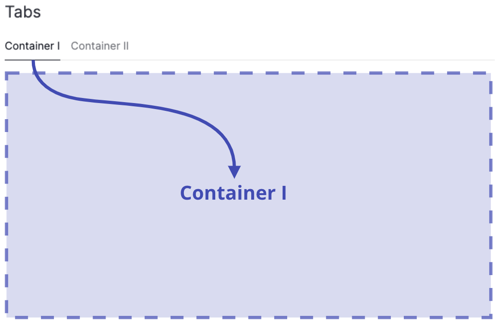

# How to use tabs

This guide shows you how to use [`Tabs`][vizro.models.Tabs], which organize and separate groups of related content in a dashboard, letting users switch between different sections or views.

They are essentially a way of putting multiple [`Containers`][vizro.models.Container] in the same screen space, and letting the user switch between them. `Containers` enable the grouping of page components into sections and subsections. See our [user guide on `Containers`](container.md) for more information. The [`Tabs`][vizro.models.Tabs] are based on the underlying Dash component [`dbc.Tabs`](https://dash-bootstrap-components.opensource.faculty.ai/docs/components/tabs/).

<figure markdown>
  { width="400"}
  <figcaption>Displaying multiple containers in Tabs</figcaption>
</figure>

Both `Tabs` and `Containers` are a more advanced technique for customizing your page layout. If you want to arrange components on a page, we recommend reading our [user guide on layouts](layouts.md) first.

This guide shows you how to use tabs to organize your `Containers` into subsections inside the dashboard.

By using [`Tabs`][vizro.models.Tabs], the following applies:

- [`Filters`][vizro.models.Filter] affect all components on all tabs (opened and closed) of the page if not specified otherwise inside `Filter.targets`
- The `title` of the [`Container`][vizro.models.Container] inserted into `Tabs.tabs` will be displayed as a tab label, and the title will be removed from the `Container`

To add [`Tabs`][vizro.models.Tabs] to your page, do the following:

1. Insert the [`Tabs`][vizro.models.Tabs] into the `components` argument of the [`Page`][vizro.models.Page]
1. Insert your [`Containers`][vizro.models.Container] into the `tabs` argument of the [`Tabs`][vizro.models.Tabs]
1. Add a `title` to the `Container`, which will be used as the `label` for the corresponding `Tab`.
1. (optional) Add a `title` to the `Tabs` to display a heading above your `Tabs` component.

!!! example "Tabs"

    === "app.py"

        ```{.python pycafe-link}

        import vizro.models as vm
        import vizro.plotly.express as px
        from vizro import Vizro

        gapminder_2007 = px.data.gapminder().query("year == 2007")

        page = vm.Page(
            title="Tabs",
            components=[
                vm.Tabs(
                    title="Tabs Title",
                    tabs=[
                        vm.Container(
                            title="Tab I",
                            components=[
                                vm.Graph(
                                    figure=px.bar(
                                        gapminder_2007,
                                        title="Graph 1",
                                        x="continent",
                                        y="lifeExp",
                                        color="continent",
                                    ),
                                ),
                                vm.Graph(
                                    figure=px.box(
                                        gapminder_2007,
                                        title="Graph 2",
                                        x="continent",
                                        y="lifeExp",
                                        color="continent",
                                    ),
                                ),
                            ],
                        ),
                        vm.Container(
                            title="Tab II",
                            components=[
                                vm.Graph(
                                    figure=px.scatter(
                                        gapminder_2007,
                                        title="Graph 3",
                                        x="gdpPercap",
                                        y="lifeExp",
                                        size="pop",
                                        color="continent",
                                    ),
                                ),
                            ],
                        ),
                    ],
                ),
            ],
        )

        dashboard = vm.Dashboard(pages=[page])
        Vizro().build(dashboard).run()
        ```

    === "app.yaml"

        ```yaml
        # Still requires a .py to add data to the data manager and parse YAML configuration
        # See yaml_version example
        pages:
          components:
            - type: tabs
              title: Tabs Title
              tabs:
                - title: Tab I
                  type: container
                  components:
                    - type: graph
                      figure:
                        _target_: bar
                        data_frame: gapminder_2007
                        title: Graph 1
                        x: continent
                        y: lifeExp
                        color: continent
                    - type: graph
                      figure:
                        _target_: box
                        data_frame: gapminder_2007
                        title: Graph 2
                        x: continent
                        y: lifeExp
                        color: continent
                - title: Tab II
                  type: container
                  components:
                    - type: graph
                      figure:
                        _target_: scatter
                        data_frame: gapminder_2007
                        title: Graph 3
                        x: gdpPercap
                        y: lifeExp
                        size: pop
                        color: continent
          title: Tabs
        ```

    === "Result"

        [![Tabs]][tabs]

## Add a tooltip

The `description` argument enables you to add helpful context to your tabs by displaying an info icon next to its title. Hovering over the icon shows a tooltip with your chosen text.

You can provide [Markdown text](https://markdown-guide.readthedocs.io/) as a string to use the default info icon or a [`Tooltip`][vizro.models.Tooltip] model to use any icon from the [Google Material Icons library](https://fonts.google.com/icons).

!!! example "Tabs with tooltip"

    === "app.py"

        ```{.python pycafe-link hl_lines="9-13"}

        import vizro.models as vm
        import vizro.plotly.express as px
        from vizro import Vizro

        gapminder_2007 = px.data.gapminder().query("year == 2007")

        page = vm.Page(
            title="Tabs",
            description="""
                The Iris dataset includes measurements of 150 iris flowers across three types: Setosa, Versicolor, and Virginica.

                While all samples are labeled by type, they can appear similar when looking at just some features—making it a useful dataset for exploring patterns and challenges in classification.
            """,
            components=[
                vm.Tabs(
                    title="Tabs Title",
                    tabs=[
                        vm.Container(
                            title="Tab I",
                            components=[
                                vm.Graph(
                                    figure=px.bar(
                                        gapminder_2007,
                                        title="Graph 1",
                                        x="continent",
                                        y="lifeExp",
                                        color="continent",
                                    ),
                                ),
                                vm.Graph(
                                    figure=px.box(
                                        gapminder_2007,
                                        title="Graph 2",
                                        x="continent",
                                        y="lifeExp",
                                        color="continent",
                                    ),
                                ),
                            ],
                        ),
                        vm.Container(
                            title="Tab II",
                            components=[
                                vm.Graph(
                                    figure=px.scatter(
                                        gapminder_2007,
                                        title="Graph 3",
                                        x="gdpPercap",
                                        y="lifeExp",
                                        size="pop",
                                        color="continent",
                                    ),
                                ),
                            ],
                        ),
                    ],
                ),
            ],
        )

        dashboard = vm.Dashboard(pages=[page])
        Vizro().build(dashboard).run()
        ```

    === "app.yaml"

        ```{.yaml hl_lines="9-12"}
        # Still requires a .py to add data to the data manager and parse YAML configuration
        # See yaml_version example
        pages:
          components:
            - type: tabs
              title: Tabs Title
              tabs:
                - title: Tab I
                  description: |
                    The Iris dataset includes measurements of 150 iris flowers across three types: Setosa, Versicolor, and Virginica.

                    While all samples are labeled by type, they can appear similar when looking at just some features—making it a useful dataset for exploring patterns and challenges in classification.
                  type: container
                  components:
                    - type: graph
                      figure:
                        _target_: bar
                        data_frame: gapminder_2007
                        title: Graph 1
                        x: continent
                        y: lifeExp
                        color: continent
                    - type: graph
                      figure:
                        _target_: box
                        data_frame: gapminder_2007
                        title: Graph 2
                        x: continent
                        y: lifeExp
                        color: continent
                - title: Tab II
                  type: container
                  components:
                    - type: graph
                      figure:
                        _target_: scatter
                        data_frame: gapminder_2007
                        title: Graph 3
                        x: gdpPercap
                        y: lifeExp
                        size: pop
                        color: continent
          title: Tabs
        ```

    === "Result"

        [![TabsInfoIcon]][tabsinfoicon]

[tabs]: ../../assets/user_guides/components/tabs.png
[tabsinfoicon]: ../../assets/user_guides/components/tabs-info-icon.png
