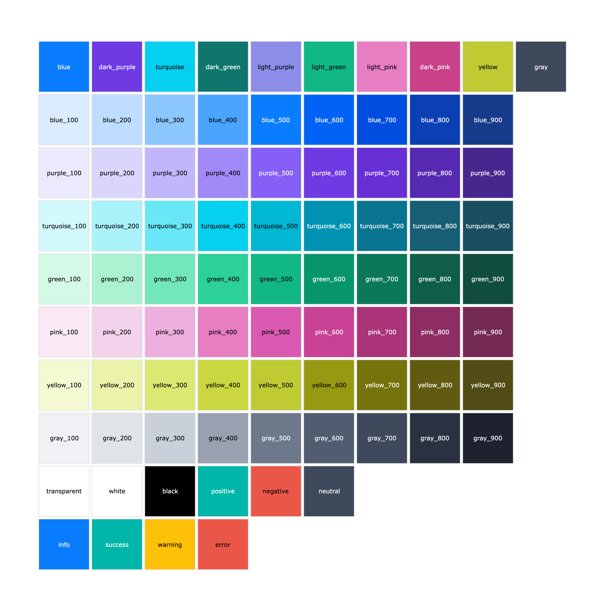
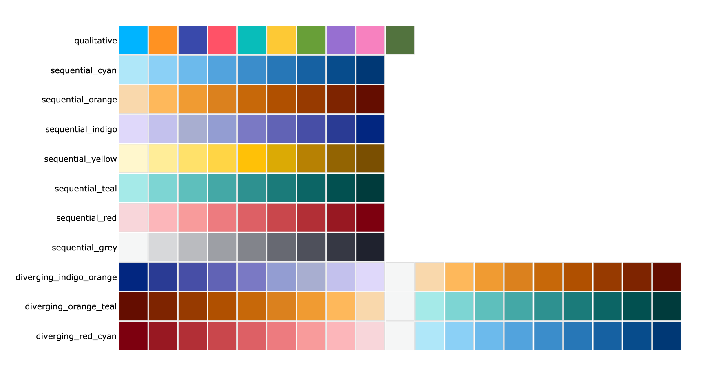

# How to use themes and colors

This guide shows you how to use themes. Themes are pre-designed collections of stylings that are applied to entire charts and dashboards. The themes provided by Vizro are infused with our design best practices that make charts and dashboards look visually consistent and professional.

## Dashboard themes

### Built-in Vizro themes

The [`Dashboard`][vizro.models.Dashboard] model accepts an optional `theme` argument, where you can choose between a `vizro_dark` and a `vizro_light` theme. If not specified then `theme` defaults to `vizro_dark`. The theme is applied to the entire dashboard and its charts/components when a user first loads your dashboard. Regardless of the theme applied on first load, users can always switch between light and dark themes via the toggle button in the upper-right corner of the dashboard.

!!! example "Change theme"

    === "app.py"

        ```{.python pycafe-link hl_lines="18"}
        import vizro.models as vm
        import vizro.plotly.express as px
        from vizro import Vizro

        df = px.data.iris()

        page = vm.Page(
            title="Changing themes",
            components=[
                vm.Graph(
                    figure=px.scatter_matrix(
                        df, dimensions=["sepal_length", "sepal_width", "petal_length", "petal_width"], color="species"
                    ),
                ),
            ],
        )

        dashboard = vm.Dashboard(pages=[page], theme="vizro_light")
        Vizro().build(dashboard).run()
        ```

    === "app.yaml"

        ```yaml hl_lines="12"
        # Still requires a .py to add data to the data manager and parse YAML configuration
        # See yaml_version example
        pages:
          - components:
              - figure:
                  _target_: scatter_matrix
                  color: species
                  data_frame: iris
                  dimensions: [sepal_length, sepal_width, petal_length, petal_width]
                type: graph
            title: Changing themes
        theme: vizro_light
        ```

    === "Result - vizro_light"

        [![Light]][light]

    === "Result - vizro_dark"

        [![Dark]][dark]

### Bootstrap themes in Vizro

If you would like to change the default Vizro styling, you have two options:

- Apply custom CSS to override specific properties. See our guide on [customizing CSS](custom-css.md) for full details.
- Load a completely different Bootstrap theme.

Vizro is primarily built out of [Dash Bootstrap components](https://www.dash-bootstrap-components.com), which means you can customize the appearance by providing your own Bootstrap theme via the `Vizro(external_stylesheets=...)`. When you specify an external Bootstrap stylesheet, Vizro will use your custom theme instead of its default styling. You can explore available Bootstrap themes in the [Dash Bootstrap Components theme gallery](https://www.dash-bootstrap-components.com/docs/themes/explorer/).

!!! example "Use bootstrap theme"

    === "app.py"

        ```{.python pycafe-link hl_lines="33"}
        import vizro.models as vm
        import vizro.plotly.express as px
        from vizro import Vizro
        import dash_bootstrap_components as dbc

        df = px.data.iris()

        page = vm.Page(
            title="Bootstrap theme inside Vizro app",
            layout=vm.Grid(grid=[[0, 1], [2, 2], [2, 2], [3, 3], [3, 3]]),
            components=[
                vm.Card(
                    text="""
                        ### What is Vizro?
                        An open-source toolkit for creating modular data visualization applications.

                        Rapidly self-serve the assembly of customized dashboards in minutes - without the need for advanced coding or design experience - to create flexible and scalable, Python-enabled data visualization applications."""
                ),
                vm.Card(
                    text="""
                        ### Github

                        Checkout Vizro's GitHub page for further information and release notes. Contributions are always welcome!""",
                    href="https://github.com/mckinsey/vizro",
                ),
                vm.Graph(id="scatter_chart", figure=px.scatter(df, x="sepal_length", y="petal_width", color="species")),
                vm.Graph(id="hist_chart", figure=px.histogram(df, x="sepal_width", color="species")),
            ],
            controls=[vm.Filter(column="species"), vm.Filter(column="petal_length"), vm.Filter(column="sepal_width")],
        )

        dashboard = vm.Dashboard(pages=[page])
        Vizro(external_stylesheets=[dbc.themes.BOOTSTRAP]).build(dashboard).run()
        ```

    === "Result - Bootstrap light"

        [![BootstrapLight]][bootstraplight]

    === "Result - Bootstrap dark"

        [![BootstrapDark]][bootstrapdark]

### Vizro theme in Dash

Vizro apps use the [Dash Bootstrap Components](https://www.dash-bootstrap-components.com/) library of Bootstrap components for Dash. If you have a pure Dash app and want to use Vizro's themes, you can apply Vizro's Bootstrap stylesheet in a [similar way to other Dash Bootstrap themes](https://www.dash-bootstrap-components.com/docs/themes/) through the `vizro.bootstrap` variable:

```python
import vizro
from dash import Dash

app = Dash(external_stylesheets=[vizro.bootstrap])
```

Vizro uses some extra CSS in addition to the Bootstrap stylesheet to style some Dash components that are used in Vizro but are not part of Bootstrap (for example, [`DatePicker`][vizro.models.DatePicker] is based on [Dash Mantine Components](https://www.dash-mantine-components.com/)). If you would like your pure Dash app to look as close to Vizro as possible then you will also need [this extra CSS](https://github.com/mckinsey/vizro/tree/main/vizro-core/src/vizro/static/css).

??? note "Apply Vizro Bootstrap theme to charts and other components"

    To apply the Vizro theme to Plotly charts, refer to the above section [Vizro themes in Plotly charts](#vizro-plotly-templates). This is possible with or without Vizro Bootstrap.

    If you want to style your entire Dash app with Vizro Bootstrap so that your Plotly figures automatically match, we recommend [`dash-bootstrap-templates`](https://github.com/AnnMarieW/dash-bootstrap-templates). You can find examples in the [documentation about styling Plotly figures with a Bootstrap theme](https://hellodash.pythonanywhere.com/adding-themes/figure-templates).

## Vizro Plotly templates

You can also use our templates for Plotly charts outside the dashboard. This is useful in a few contexts:

- Creation of standalone charts to be used independently of a Vizro dashboard.
- Rapid development of charts for eventual use in a Vizro dashboard, for example in a Jupyter Notebook.

!!! note

    Using `import vizro.plotly.express as px` is equal to using `import plotly.express as px`, but with the added benefit of being able to integrate the resulting chart code into a Vizro dashboard. Vizro offers a minimal layer on top of Plotly's existing charting library, allowing you to seamlessly use all the existing charts and functionalities provided by plotly.express without any modifications.

Our `vizro_dark` and `vizro_light` themes are automatically registered to `plotly.io.templates` when importing Vizro. Consult the Plotly documentation for [more details on how templates work in plotly](https://plotly.com/python/templates/#theming-and-templates).

By default, plots imported from `vizro.plotly.express` have the `vizro_dark` theme applied. This can be altered either globally or for individual plots.

### Set themes for all charts

To change the theme to `vizro_light` for all charts, run:

```python
import plotly.io as pio
import vizro.plotly.express as px

pio.templates.default = "vizro_light"

df = px.data.iris()
px.scatter_matrix(
    df,
    dimensions=["sepal_length", "sepal_width", "petal_length", "petal_width"],
    color="species",
)
```

### Set themes for selected charts

To change the template for a selected chart only, use the `template` parameter and run:

```python
import vizro.plotly.express as px

df = px.data.iris()
px.scatter_matrix(
    df,
    dimensions=["sepal_length", "sepal_width", "petal_length", "petal_width"],
    color="species",
    template="vizro_light",
)
```

## Vizro colors and palettes

The `vizro.themes` module provides direct access to Vizro's color system. Each color has been carefully selected by our design team to ensure visual consistency, professional aesthetics, and accessibility. All color palettes are colorblind-safe, making your visualizations accessible to a wider audience.

For a complete list of available colors and palettes, refer to the [API reference for themes](../API-reference/themes.md).

### Colors

Individual colors can be accessed through `vizro.themes.colors`. These include:

- **Qualitative colors**: Used for categorical data (e.g., `cyan`, `orange`, `dark_purple`, `red`, `teal`, `amber`, `green`, `purple`, `pink`, `dark_green`)
- **Sequential colors**: Organized in shades from light (100) to dark (900) for ordinal data (e.g., `cyan_100` through `cyan_900`)
- **Special colors**: Including `white`, `black`, and `transparent`

Sequential colors are available in multiple families: cyan, orange, indigo, yellow, teal, red, and grey. Each family contains 9 shades numbered from 100 (lightest) to 900 (darkest).

!!! example "Use Vizro colors"

    === "Single color"

        ```python
        from vizro.themes import colors
        import plotly.express as px

        df = px.data.gapminder().query("year == 2007")
        fig = px.bar(df.nlargest(10, "pop"), x="country", y="pop", color_discrete_sequence=[colors.dark_purple])
        fig.show()
        ```

**Color reference** 

### Palettes

Pre-configured color palettes can be accessed through `vizro.themes.palettes`. These are ready-to-use color scales ideal for different data visualization needs:

- **Qualitative palette**: Distinct colors for categorical data (`palettes.qualitative`)
- **Sequential palettes**: Sequential color gradients for ordered data (e.g. `palettes.sequential_cyan`)
- **Diverging palettes**: Diverging color scales for data with a meaningful midpoint (e.g. `palettes.diverging_red_cyan`)

!!! note "Default palettes in Vizro themes"

    When using Vizro's `vizro_dark` or `vizro_light` themes in Plotly charts, the `palettes.qualitative` is automatically applied to categorical data, and the `palettes.sequential_cyan` is used for all numerical sequences. You can override these defaults by explicitly specifying `color_discrete_sequence` or `color_continuous_scale` in your Plotly chart.

!!! example "Use Vizro palettes"

    === "Qualitative palette"

        ```python
        from vizro.themes import palettes
        import plotly.express as px

        df = px.data.iris()
        fig = px.scatter(df, x="sepal_length", y="petal_width", color="species", color_discrete_sequence=palettes.qualitative)
        fig.show()
        ```

    === "Sequential palette"

        ```python
        from vizro.themes import palettes
        import plotly.express as px

        df = px.data.tips()
        fig = px.density_heatmap(df, x="total_bill", y="tip", color_continuous_scale=palettes.sequential_red)
        fig.show()
        ```

    === "Diverging palette"

        ```python
        from vizro.themes import palettes
        import plotly.express as px
        import numpy as np

        # Create data with positive and negative values
        data = np.random.randn(20, 20)
        fig = px.imshow(data, color_continuous_scale=palettes.diverging_red_cyan, color_continuous_midpoint=0)
        fig.show()
        ```

**Palette reference** 

[bootstrapdark]: ../../assets/user_guides/themes/bootstrap_dark.png
[bootstraplight]: ../../assets/user_guides/themes/bootstrap_light.png
[dark]: ../../assets/user_guides/themes/dark.png
[light]: ../../assets/user_guides/themes/light.png
