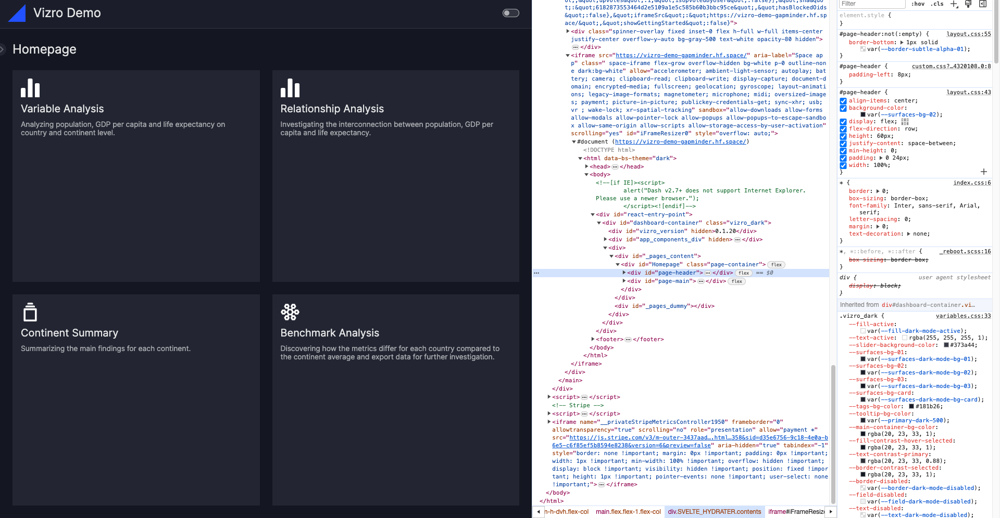

# Visual formatting in Vizro

Vizro is quite opinionated when it comes to visual formatting, but it allows for some customization if you want to
deviate from the default settings. While certain elements, such as the layout of the navigation and components,
are fixed, you can customize background colors, fonts, and other styles via CSS overrides.

To do so, you need to:

1. Add a CSS file to your `assets` folder, refer to our user guide on [adding static assets](assets.md#how-to-add-static-assets).
2. Identify the right CSS selector for the component you want to style.
3. Add the desired changed properties to your CSS file.


## Intro to CSS
Customizations are typically made using CSS. For a quick 5-minute introduction to CSS, we recommend reading
this article: [Get Started with CSS in 5 Minutes.](https://www.freecodecamp.org/news/get-started-with-css-in-5-minutes-e0804813fc3e/)

For a more comprehensive tutorial, refer to the [W3Schools CSS tutorial](https://www.w3schools.com/css/default.asp).
The entire tutorial is beneficial, but the section on [CSS selectors](https://www.w3schools.com/css/css_selectors.asp)
will be particularly useful.

In Vizro, the CSS file is read in as an external stylesheet. The most common way of applying any styling to Vizro is therefore
through the use of CSS selectors:

- **Element Selector**: Applies the style to all elements inside the Vizro app.

    ```
    h1 {
        font-size: 20px;
    }
    
    p {
        color: green;
    }
    ```

- **Class selector:** Applies the style to all elements with the specified classname.

    ```
    .card {
        background: lightblue;
    }
    ```

- **ID selector:** Applies the style to the element with the specified ID.

    ```
    #my-card {
        background: lightblue;
    }
    ```


## Identify the right CSS selector

Use Chrome DevTools or a similar tool (Web Inspector, Web Developer Tools, etc.) to inspect the HTML document in your browser.

1. **Open DevTools:** In Google Chrome, right-click on the app and select "Inspect" from the context menu. This will open the
HTML document of your Vizro app.

    


2. **Select an Element:** Suppose you want to change the background color of your cards. Click the
"Select an element in the page to inspect it" icon in the top left corner of the inspect panel.

    

3. **Find the HTML Block:** Hover over the component you want to style. The corresponding HTML block will be
highlighted in the document.

    

    Notice that the selected HTML block corresponds to the container of the card and has a CSS class, here it is `card`.

4. **Apply CSS:** Use this CSS class to style the card component. In your CSS file, you can write:

    ```
    .card {
        background-color: blue;
    }
    ```

    This will change the background color for any HTML element with the `card` class.

**Tip:** You can also test your CSS live by editing the CSS attributes in the "Elements" panel.
For example, temporarily add `background: blue; note that this change will be lost upon reloading the page.


## Common examples

### Change the background color of a container

### Add a logo

### Change padding to align a logo

### Change the font

### Turn off page title

### Add a Flexbox


## Info dump for now (not sure yet, where I'll add this)
To modify a component's styling, you need to identify the appropriate CSS selector. Some Vizro components produce a
single HTML element with an ID that matches the model ID, allowing you to target it directly using the #id selector
in CSS. Other components generate multiple HTML elements. Within these, the "core" element will have an ID
matching the model ID, while non-core elements may have IDs that are variations of it, such as `{model-id}-title`.
In all instances, you can determine the correct selector by using Chrome DevTools or a similar tool after setting the
appropriate model ID (see the section below).
