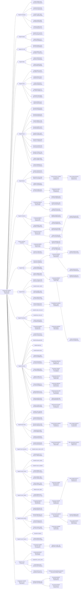

```mermaid

%% Generator: https://github.com/mar10/nutree/

flowchart LR

%% Nodes:
1["Dashboard(id=4505f4f6-0a8c-46c7-0921-5f4f9edb95f2)"]
2["Page(id=Homepage)"]
3["Card(id=f728b4fa-4248-5e3a-0a5d-2f346baa9455)"]
4["Card(id=eb1167b3-67a9-c378-7c65-c1e582e2e662)"]
5["Card(id=f7c1bd87-4da5-e709-d471-3d60c8a70639)"]
6["Card(id=e443df78-9558-867f-5ba9-1faf7a024204)"]
7["Grid(id=e3e70682-c209-4cac-629f-6fbed82c07cd)"]
8["Page(id=Graphs)"]
9["Graph(id=23a7711a-8133-2876-37eb-dcd9e87a1613)"]
10["Grid(id=1846d424-c17c-6279-23c6-612f48268673)"]
11["Page(id=AG Grid)"]
12["AgGrid(id=fcbd04c3-4021-2ef7-cca5-a5a19e4d6e3c)"]
13["Grid(id=b4862b21-fb97-d435-8856-1712e8e5216a)"]
14["Page(id=Table)"]
15["Table(id=259f4329-e6f4-590b-9a16-4106cf6a659e)"]
16["Grid(id=12e0c8b2-bad6-40fb-1948-8dec4f65d4d9)"]
17["Page(id=Cards)"]
18["Card(id=5487ce1e-af19-922a-d9b8-a714e61a441c)"]
19["Card(id=5a921187-19c7-8df4-8f4f-f31e78de5857)"]
20["Card(id=a3f2c9bf-9c63-16b9-50f2-44556f25e2a2)"]
21["Card(id=8d723104-f773-83c1-3458-a748e9bb17bc)"]
22["Card(id=85776e9a-dd84-f39e-7154-5a137a1d5006)"]
23["Grid(id=eb2083e6-ce16-4dba-0ff1-8e0242af9fc3)"]
24["Page(id=Figure)"]
25["Figure(id=b5d32b16-6619-4cb1-d710-37d1b83e90ec)"]
26["Figure(id=a0116be5-ab0c-1681-c8f8-e3d0d3290a4c)"]
27["Figure(id=d3fbf47a-7e5b-1e7f-9ca5-499d004ae545)"]
28["Figure(id=baf3897a-3e70-f16a-5548-5822de1b372a)"]
29["Figure(id=101fbccc-ded7-33e8-b421-eaeb534097ca)"]
30["Figure(id=38c1962e-9148-624f-eac1-c14f30e9c5cc)"]
31["Figure(id=247a8333-f7b0-b7d2-cda8-056c3d15eef7)"]
32["Figure(id=1759edc3-72ae-2244-8b01-63c1cd9d2b7d)"]
33["Grid(id=17e0aa3c-0398-3ca8-ea7e-9d498c778ea6)"]
34["Filter(id=e005b860-51ef-1922-fe43-c49e149818d1)"]
35["Page(id=Button)"]
36["Graph(id=4a84eb03-8d1f-d9b7-4d2b-9deb1beb3711)"]
37["Button(id=8c1745a7-9a6a-5f92-cca7-4147f6be1f72)"]
38["ActionsChain(id=1775336d-71ea-cd05-49a3-e80e966e1277)"]
39["export_data(id=552f233a-8c25-166a-1ff3-9849b4e1357d)"]
40["Grid(id=7d41e602-eece-328b-ff7b-118e820865d6)"]
41["Filter(id=2f120554-4a53-08cc-3dfa-bc08935ddd72)"]
42["Dropdown(id=5129fb7c-6288-e1a5-cc45-782198a6416d)"]
43["Page(id=Containers)"]
44["Container(id=2648ee38-e074-05eb-2156-63abc1f254b8)"]
45["Graph(id=42930b33-a81a-d477-fb36-75b89cdeb3e6)"]
46["Graph(id=adc0da7a-16fe-baa0-11af-923d79fdef7c)"]
47["Grid(id=0870e15c-2fcd-81b5-d24b-ace4307bf326)"]
48["Container(id=d450fe4a-ec4f-217b-b306-d1a8e5eeac76)"]
49["Graph(id=148b2758-d7ab-7928-09e4-69e6ec62b2c8)"]
50["Grid(id=d67e55fd-642b-fa42-aef9-c00b8a64c1b9)"]
51["Grid(id=85940927-468f-f53d-864a-7a50b48d73f1)"]
52["Page(id=Collapsible containers)"]
53["Container(id=46743741-9466-e472-6b5f-5241f323ca74)"]
54["Graph(id=d3447490-96fd-35d0-adf2-0806e5214606)"]
55["Grid(id=a425799a-a905-d750-7e1e-a9c573581a81)"]
56["Container(id=5306f3f5-1516-6570-5b7c-709acb175a5a)"]
57["Graph(id=fb82860d-eabc-a8d0-b341-facdff0ac0f1)"]
58["Grid(id=964a870c-7c87-9b74-1d87-8f9f9cdf5a86)"]
59["Flex(id=37176e84-d977-e993-3c49-d76fcfc6e625)"]
60["Page(id=Tabs)"]
61["Tabs(id=9a27d858-88c1-32ad-efbf-c19ee8f6cf32)"]
62["Container(id=5f3f5638-3870-1a14-b490-b6081dfc8352)"]
63["Graph(id=30bcab0e-d857-0102-55d4-4936a1515607)"]
64["Graph(id=4562be7f-bb42-e0b2-0426-465e3e37952d)"]
65["Grid(id=6d16ee18-5521-16dd-2ba4-b180cb69ca38)"]
66["Container(id=38018b47-b29a-8b06-daf6-6c5f2577bffa)"]
67["Graph(id=c87a7463-19c1-6a0d-0feb-d845d0dfae43)"]
68["Grid(id=a25b59fd-92e8-e269-d12e-cbc40b9475b1)"]
69["Grid(id=d480865f-9b38-fe80-3042-e325a28f5ab0)"]
70["Filter(id=1fdb8b32-06d5-99e8-12f1-75ffae3b16ec)"]
71["Page(id=Filters)"]
72["Graph(id=176ea1b1-6426-4cd5-1ea4-5cd69371a71f)"]
73["Graph(id=scatter_chart2)"]
74["Grid(id=ba26d851-35e8-579a-7aaf-0e891fb797fa)"]
75["Filter(id=1db53334-fb03-23a1-d576-d4155ec17dbe)"]
76["Filter(id=b7d6467b-2f5a-522a-f87f-43fdf6062541)"]
77["RangeSlider(id=31d0b664-0589-f877-9b02-52440950fd13)"]
78["Page(id=Parameters)"]
79["Graph(id=scatter_chart_pm)"]
80["Graph(id=bar_chart_pm)"]
81["Grid(id=11ebcd49-428a-1c22-d5fd-b76a19fbeb1d)"]
82["Parameter(id=9edfa3da-6cf5-5b15-8b53-031d05d51433)"]
83["Dropdown(id=ade9b2b4-efdd-35f8-0fa3-4266ccfdba9b)"]
84["Page(id=Selectors)"]
85["Card(id=0fa07a3f-2e29-5065-6fa2-31e959acdd98)"]
86["Table(id=table-gapminder)"]
87["Table(id=table-tips)"]
88["Graph(id=graph-stocks)"]
89["Grid(id=4d125e7f-a59c-ec98-126c-bc8f38884479)"]
90["Filter(id=642aad48-fcfc-fa81-b306-d70019d5f970)"]
91["RangeSlider(id=98b33c6e-0a14-b90a-7795-e98680ee526e)"]
92["Filter(id=e6fd68e8-d69c-91c2-7860-1602bb4a06cb)"]
93["Checklist(id=e786ab37-5bca-47be-4298-17c53308fb2e)"]
94["Filter(id=c470f0e7-f76f-bfb8-3412-fc12ac322c12)"]
95["Dropdown(id=b29c467d-2b5f-6932-91dc-59efeb21a3f6)"]
96["Filter(id=878b9f6b-57a1-cb71-2975-d279d86dbf11)"]
97["Dropdown(id=28805c5d-ad1b-8f60-c9e4-dab20edc6d2b)"]
98["Filter(id=0361524c-2cc0-f859-aa65-24ab713b7e05)"]
99["RadioItems(id=ebe21368-98c7-5205-1e01-a934402d0baf)"]
100["Filter(id=eae2025e-8233-9e23-dff3-334b91b15f5d)"]
101["Slider(id=e66cd36e-68ef-8f5f-ae68-690a78bc7175)"]
102["Filter(id=27460f22-403d-1f83-a859-890cd670f668)"]
103["DatePicker(id=637e0edc-5b6e-4ae7-a620-81434fbaecc0)"]
104["Page(id=Export data)"]
105["Graph(id=753c7c99-032f-06ca-b0d9-c2aa8f837ef7)"]
106["Graph(id=bd30291a-55fe-a08e-143e-2e04bdd7d19b)"]
107["Button(id=ac642b4c-49b2-5ded-9c31-d9b25a2b745b)"]
108["ActionsChain(id=e456697c-f268-6baa-971c-702d5bf49c04)"]
109["export_data(id=2284b7a4-47e7-f593-8b58-85ca0bb2c3f0)"]
110["Grid(id=bf9cc545-6355-18f7-4f6f-a985b732d46f)"]
111["Filter(id=21e15094-9efe-e464-da90-f534a23d4c9d)"]
112["Page(id=Chart interaction)"]
113["Graph(id=391cf046-3d4a-5d51-28fa-fd04559b5975)"]
114["ActionsChain(id=b5d97ef7-60ef-1471-72b8-ff39a32c9b6f)"]
115["filter_interaction(id=14aa451c-a69c-fb85-d432-f8db6a174c1c)"]
116["Graph(id=scatter_relation_2007)"]
117["Grid(id=dfe1b307-9172-5f0a-ac7c-8803e01bbf50)"]
118["Page(id=Custom Charts)"]
119["Graph(id=custom_scatter)"]
120["Graph(id=custom_waterfall)"]
121["Grid(id=b3969057-425c-b200-105a-da6b720299e3)"]
122["Filter(id=df26f517-66fa-f989-0813-5d586a1689ad)"]
123["Filter(id=2a69acc7-0bf9-c0ef-b581-6b74a985ab61)"]
124["Dropdown(id=c5adf681-6b10-e53a-9145-de05b3ab1b2c)"]
125["Page(id=Custom Tables)"]
126["Table(id=custom_table)"]
127["Grid(id=09f6048f-e245-a460-0004-884cc167733f)"]
128["Parameter(id=9a9e4310-8fb8-3bab-e875-4cd37cbd7025)"]
129["Dropdown(id=e28bc9ff-870f-084c-7244-f536285e25b4)"]
130["Page(id=Custom Actions)"]
131["Graph(id=d663049d-155e-18b1-fa83-ada4a2121ac5)"]
132["Button(id=9bbd750d-1e70-7c52-30c1-fb6a19086515)"]
133["ActionsChain(id=4d6b234f-dfa7-c6ed-32d1-f81ba636425c)"]
134["export_data(id=03c54c71-fca0-5536-2169-df82b9bdee2d)"]
135["Action(id=03a89879-36a9-8d74-00de-59f550f0fc2b)"]
136["export_data(id=faf1501b-009a-815b-c137-8be5b7a28e0a)"]
137["Grid(id=0597aab6-14d3-0dbc-a0ac-f4c9658de17e)"]
138["Filter(id=ec3aa314-da9b-b017-79c1-47c719a5711b)"]
139["Dropdown(id=2ea60b99-fa7f-f8bf-b044-284a47acf2f6)"]
140["Page(id=Custom Figures)"]
141["Figure(id=my-figure)"]
142["Grid(id=d138d150-8557-716a-a750-2a812227d96d)"]
143["Parameter(id=41a93f90-dc82-1527-1da3-b7e2cad6e514)"]
144["Slider(id=ccc14d51-73f6-60d8-e9f4-1cc04653a560)"]
145["Page(id=Custom Components)"]
146["Jumbotron(id=d675ebf7-4fe3-0c9a-5371-0f577e9cf84f)"]
147["Graph(id=for_custom_chart)"]
148["Grid(id=f689a4a5-ffda-0336-8c6e-90373020da5c)"]
149["Filter(id=6a46721a-cffa-6cdd-f963-a7efe00111e5)"]
150["TooltipNonCrossRangeSlider(id=d29dc5df-cf1d-a110-0cc3-6d8c77863fe5)"]
151["Navigation(id=c787ddfb-5697-f17c-17fd-3736b7ef941c)"]
152["NavBar(id=5e00ea6d-ca24-be4d-5667-2017555a4085)"]
153["NavLink(id=4a814d53-964d-db77-6025-f0ae35354579)"]
154["NavLink(id=4578bab3-26a9-7465-2371-ea2c0247145f)"]

%% Edges:
1 --> 2
2 --> 3
2 --> 4
2 --> 5
2 --> 6
2 --> 7
1 --> 8
8 --> 9
8 --> 10
1 --> 11
11 --> 12
11 --> 13
1 --> 14
14 --> 15
14 --> 16
1 --> 17
17 --> 18
17 --> 19
17 --> 20
17 --> 21
17 --> 22
17 --> 23
1 --> 24
24 --> 25
24 --> 26
24 --> 27
24 --> 28
24 --> 29
24 --> 30
24 --> 31
24 --> 32
24 --> 33
24 --> 34
1 --> 35
35 --> 36
35 --> 37
37 --> 38
38 --> 39
35 --> 40
35 --> 41
41 --> 42
1 --> 43
43 --> 44
44 --> 45
44 --> 46
44 --> 47
43 --> 48
48 --> 49
48 --> 50
43 --> 51
1 --> 52
52 --> 53
53 --> 54
53 --> 55
52 --> 56
56 --> 57
56 --> 58
52 --> 59
1 --> 60
60 --> 61
61 --> 62
62 --> 63
62 --> 64
62 --> 65
61 --> 66
66 --> 67
66 --> 68
60 --> 69
60 --> 70
1 --> 71
71 --> 72
71 --> 73
71 --> 74
71 --> 75
71 --> 76
76 --> 77
1 --> 78
78 --> 79
78 --> 80
78 --> 81
78 --> 82
82 --> 83
1 --> 84
84 --> 85
84 --> 86
84 --> 87
84 --> 88
84 --> 89
84 --> 90
90 --> 91
84 --> 92
92 --> 93
84 --> 94
94 --> 95
84 --> 96
96 --> 97
84 --> 98
98 --> 99
84 --> 100
100 --> 101
84 --> 102
102 --> 103
1 --> 104
104 --> 105
104 --> 106
104 --> 107
107 --> 108
108 --> 109
104 --> 110
104 --> 111
1 --> 112
112 --> 113
113 --> 114
114 --> 115
112 --> 116
112 --> 117
1 --> 118
118 --> 119
118 --> 120
118 --> 121
118 --> 122
118 --> 123
123 --> 124
1 --> 125
125 --> 126
125 --> 127
125 --> 128
128 --> 129
1 --> 130
130 --> 131
130 --> 132
132 --> 133
133 --> 134
133 --> 135
133 --> 136
130 --> 137
130 --> 138
138 --> 139
1 --> 140
140 --> 141
140 --> 142
140 --> 143
143 --> 144
1 --> 145
145 --> 146
145 --> 147
145 --> 148
145 --> 149
149 --> 150
1 --> 151
151 --> 152
152 --> 153
152 --> 154
```
