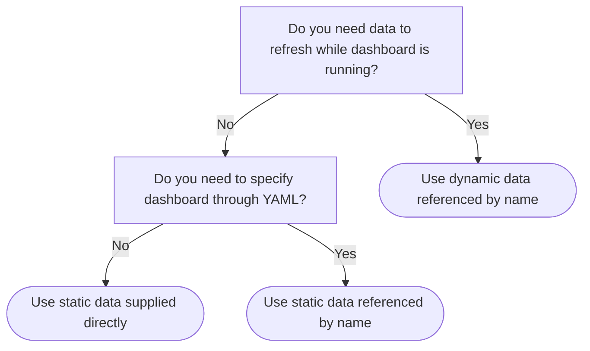

# Vizro Data Manager Guide

## Overview

The Vizro Data Manager is the recommended way to handle data in your dashboard. It supports two types of data sources:

- **Static data**: pandas DataFrame (simple, production-ready)
- **Dynamic data**: Function returning pandas DataFrame (supports refresh and caching)

## Choosing Your Data Source Type



## Static vs Dynamic Data Comparison

| Feature                              | Static           | Dynamic                      |
| ------------------------------------ | ---------------- | ---------------------------- |
| Required Python type                 | pandas DataFrame | Function returning DataFrame |
| Can be supplied directly in `figure` | Yes              | No                           |
| Can be referenced by name            | Yes              | Yes                          |
| Can refresh while running            | No               | Yes                          |
| Production-ready                     | Yes              | Yes                          |

## Static Data

### Supply Directly (Simplest Method)

```python
from vizro import Vizro
import pandas as pd
import vizro.plotly.express as px
import vizro.models as vm

# Load data once at startup
iris = pd.read_csv("iris.csv")

page = vm.Page(
    title="Static data example",
    components=[
        vm.Graph(figure=px.box(iris, x="species", y="petal_width", color="species")),
    ],
)

dashboard = vm.Dashboard(pages=[page])
Vizro().build(dashboard).run()
```

**Pros**: Simplest approach, works out of the box **Cons**: Data never refreshes even if source file changes

### Reference by Name (For YAML Configuration)

If using YAML configuration, add data to the data manager first:

```python
from vizro import Vizro
from vizro.managers import data_manager
import pandas as pd

# Add to data manager with a name
data_manager["iris"] = pd.read_csv("iris.csv")

# Can now reference "iris" by name in YAML or Python
page = vm.Page(
    title="Static data example",
    components=[
        vm.Graph(figure=px.box("iris", x="species", y="petal_width")),
    ],
)
```

## Dynamic Data

Dynamic data uses a **function** that returns a DataFrame. This function can be re-executed to refresh data.

### Basic Dynamic Data

```python
from vizro import Vizro
import pandas as pd
import vizro.plotly.express as px
import vizro.models as vm
from vizro.managers import data_manager


def load_iris_data():
    """This function runs every time the page refreshes"""
    iris = pd.read_csv("iris.csv")
    return iris.sample(50)  # Returns different data each time


# Add function (NOT function call) to data manager
data_manager["iris"] = load_iris_data  # ✅ Correct
# data_manager["iris"] = load_iris_data()  # ❌ Wrong - this is static!

page = vm.Page(
    title="Dynamic data example",
    components=[vm.Graph(figure=px.box("iris", x="species", y="petal_width"))],
)

dashboard = vm.Dashboard(pages=[page])
Vizro().build(dashboard).run()
```

### Configure Caching

Without caching, dynamic data loads on every page refresh. Add caching to improve performance:

**Development (Simple Cache)**:

```python
from flask_caching import Cache
from vizro.managers import data_manager

# Enable 5-minute cache (default)
data_manager.cache = Cache(config={"CACHE_TYPE": "SimpleCache"})

# Or customize timeout
data_manager.cache = Cache(
    config={
        "CACHE_TYPE": "SimpleCache",
        "CACHE_DEFAULT_TIMEOUT": 600,  # 10 minutes
    }
)
```

**Production (File System or Redis Cache)**:

```python
# File system cache (persists between restarts)
data_manager.cache = Cache(config={"CACHE_TYPE": "FileSystemCache", "CACHE_DIR": "cache"})

# Redis cache (shared across multiple workers)
data_manager.cache = Cache(
    config={"CACHE_TYPE": "RedisCache", "CACHE_REDIS_HOST": "localhost", "CACHE_REDIS_PORT": 6379}
)
```

⚠️ **Warning**: `SimpleCache` is for single-process development only. Use `FileSystemCache` or `RedisCache` in production with multiple workers.

### Set Individual Timeouts

Control cache timeout for each data source:

```python
from vizro.managers import data_manager

data_manager.cache = Cache(config={"CACHE_TYPE": "SimpleCache"})

# Use default timeout (5 minutes)
data_manager["default_data"] = load_data

# Expire every 10 seconds
data_manager["fast_data"] = load_data
data_manager["fast_data"].timeout = 10

# Expire every hour
data_manager["slow_data"] = load_data
data_manager["slow_data"].timeout = 3600

# Never expire (like static data)
data_manager["static_data"] = load_data
data_manager["static_data"].timeout = 0
```

### Parametrize Data Loading

Add parameters to control what data is loaded:

```python
from vizro import Vizro
import pandas as pd
import vizro.plotly.express as px
import vizro.models as vm
from vizro.managers import data_manager


def load_iris_data(number_of_points=10):  # Parameter with default
    iris = pd.read_csv("iris.csv")
    return iris.sample(number_of_points)


data_manager["iris"] = load_iris_data

page = vm.Page(
    title="Parametrized dynamic data",
    components=[
        vm.Graph(
            id="graph",  # Need ID to target with parameter
            figure=px.box("iris", x="species", y="petal_width"),
        )
    ],
    controls=[
        vm.Parameter(
            targets=["graph.data_frame.number_of_points"],  # Target syntax
            selector=vm.Slider(min=10, max=100, step=10, value=10),
        )
    ],
)

dashboard = vm.Dashboard(pages=[page])
Vizro().build(dashboard).run()
```

**Target syntax**: `<component_id>.data_frame.<function_argument>`

⚠️ **Security Warning**: Always treat user input as untrusted. Use functions like `werkzeug.utils.secure_filename` for file paths.

### Dynamic Filters

Filters on dynamic data automatically update their options when data refreshes:

```python
from vizro import Vizro
import pandas as pd
import vizro.plotly.express as px
import vizro.models as vm
from vizro.managers import data_manager


def load_iris_data(number_of_points=10):
    iris = pd.read_csv("iris.csv")
    return iris.sample(number_of_points)


data_manager["iris"] = load_iris_data

page = vm.Page(
    title="Dynamic filter example",
    components=[vm.Graph(id="graph", figure=px.box("iris", x="species", y="petal_width"))],
    controls=[
        # Filter options update when data refreshes
        vm.Filter(column="species", selector=vm.RadioItems()),
        # Parameter to control data loading
        vm.Parameter(
            targets=["graph.data_frame.number_of_points"],
            selector=vm.Slider(min=1, max=10, value=5),
        ),
    ],
)

dashboard = vm.Dashboard(pages=[page])
Vizro().build(dashboard).run()
```

**Dynamic filter behavior**:

- Categorical selectors: `options` updates with unique values from data
- Numerical/temporal selectors: `min` and `max` update from data
- Selected value on screen does not change automatically
- If you want static filter options, manually specify them:

```python
vm.Filter(column="species", selector=vm.Dropdown(options=["setosa", "versicolor", "virginica"]))
```

## Kedro Data Catalog Integration

For projects with many data sources, use Kedro Data Catalog as a YAML registry:

**catalog.yaml**:

```yaml
motorbikes:
  type: pandas.CSVDataset
  filepath: s3://your_bucket/data/motorbikes.csv
  load_args:
    sep: ','
    na_values: [NA]
  credentials: s3_credentials
```

**app.py**:

```python
from vizro import Vizro
from vizro.integrations import kedro
import vizro.models as vm

# Load all datasets from Kedro catalog
kedro.catalog_from_project()

# Use datasets by name
page = vm.Page(
    title="Kedro catalog example", components=[vm.Graph(figure=px.scatter("motorbikes", x="price", y="mileage"))]
)
```

See [Kedro Data Catalog guide](https://vizro.readthedocs.io/en/latest/pages/user-guides/kedro-data-catalog/) for more details.

## Best Practices

### Use Static Data When:

- Data never needs to refresh
- Simple use case
- Data loads quickly

### Use Dynamic Data When:

- Data needs to refresh without restarting
- Data is large and benefits from caching
- Need parametrized data loading
- Using scheduled data updates

### Performance Optimization:

1. **Enable caching** for slow data loads
1. **Pre-aggregate data** before returning DataFrame
1. **Use appropriate data types** (e.g., `category` for strings)
1. **Filter data** in the loading function, not after
1. **Use FileSystemCache or RedisCache** in production

### Common Patterns:

**Database connection**:

```python
import sqlalchemy as sa


def load_from_db():
    engine = sa.create_engine("postgresql://...")
    query = "SELECT * FROM sales WHERE date > '2024-01-01'"
    return pd.read_sql(query, engine)


data_manager["sales"] = load_from_db
```

**API fetch**:

```python
import requests


def load_from_api():
    response = requests.get("https://api.example.com/data")
    return pd.DataFrame(response.json())


data_manager["api_data"] = load_from_api
```

**Multiple files**:

```python
from pathlib import Path


def load_all_csvs():
    dfs = [pd.read_csv(f) for f in Path("data/").glob("*.csv")]
    return pd.concat(dfs, ignore_index=True)


data_manager["combined"] = load_all_csvs
```

## Documentation Links

- **Data Guide**: https://vizro.readthedocs.io/en/latest/pages/user-guides/data/
- **Kedro Catalog**: https://vizro.readthedocs.io/en/latest/pages/user-guides/kedro-data-catalog/
- **Flask-Caching**: https://flask-caching.readthedocs.io/en/latest/
- **Kedro Datasets**: https://docs.kedro.org/projects/kedro-datasets
