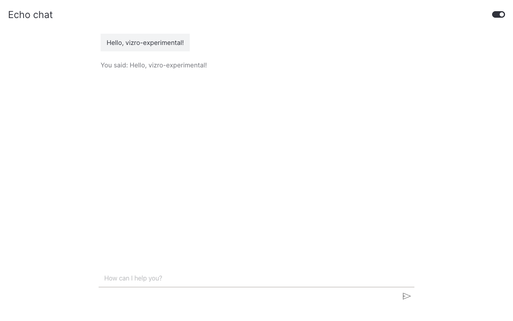

# How to use the Chat component

This guide shows you how to add a [`Chat`][vizro_experimental.chat.Chat] component to your dashboard.

The `Chat` component renders a message history, a textarea, and a send button. It is decoupled from any specific LLM — you bring the backend by subclassing [`ChatAction`][vizro_experimental.chat.ChatAction] and overriding `generate_response`.

## Add a chat to a page

To add a `Chat`, register it as an allowed page component with `vm.Page.add_type` and pass an action. The simplest possible action just echoes the user's last message.

!!! example "Echo chat"

    === "app.py"

        ```python hl_lines="6-10"
        import vizro.models as vm
        from vizro import Vizro
        from vizro_experimental.chat import Chat, ChatAction, Message


        class EchoAction(ChatAction):
            """Echo the user's last message back as the assistant reply."""

            def generate_response(self, messages: list[Message]) -> str:
                return f"You said: {messages[-1]['content']}"


        vm.Page.add_type("components", Chat)

        page = vm.Page(
            title="Echo chat",
            components=[Chat(actions=[EchoAction()])],
        )

        Vizro().build(vm.Dashboard(pages=[page])).run()
        ```

    === "Result"

        

The `messages` argument is the parsed conversation history. Each entry has a `role` (`"user"` or `"assistant"`) and a `content` field decoded from the wire format. The most recent user message is always `messages[-1]`.

## Customize the placeholder

Use the `placeholder` argument to replace the default hint text shown in the input.

```python
Chat(actions=[EchoAction()], placeholder="Ask me anything…")
```

## What's next

- [Use a real LLM](use-llm.md) — wire a LLM provider's SDK into a `ChatAction`.
- [Stream text responses](streaming-chat.md) — show tokens as they arrive.
- [API reference](api-reference.md) — the full public surface.
