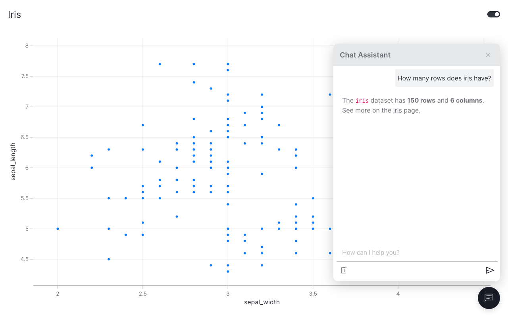

# How to add a chat popup

This guide shows you how to add a floating chat popup to any Vizro dashboard.

The popup is **not** a Vizro page component. It mounts at the dashboard root, appears as a floating button in the bottom-right corner, and persists across page navigation. By default it spins up a data-aware [LangChain](https://python.langchain.com/) agent that introspects the datasets registered with `data_manager` and answers questions about them — no `Chat` model, no `ChatAction` subclass, no backend code.

## Install the popup extra

```bash
pip install "vizro-experimental[agent]"
```

Set `OPENAI_API_KEY` for the default model (`gpt-5.4-mini-2026-03-17`).

## Add the popup with the auto-agent

Call [`add_chat_popup`][vizro_experimental.chat.popup.popup.add_chat_popup] after `app.build(dashboard)` and before `app.run()`.

!!! example "Popup with the auto-agent"

    === "app.py"

        ```python hl_lines="21"
        import vizro.models as vm
        import vizro.plotly.express as px
        from vizro import Vizro
        from vizro.managers import data_manager
        from vizro_experimental.chat.popup import add_chat_popup

        data_manager["iris"] = px.data.iris()

        dashboard = vm.Dashboard(
            pages=[
                vm.Page(
                    title="Iris",
                    components=[
                        vm.Graph(figure=px.scatter("iris", x="sepal_width", y="sepal_length"))
                    ],
                )
            ]
        )

        app = Vizro().build(dashboard)
        add_chat_popup(app)
        app.run()
        ```

    === "Result"

        

The popup auto-discovers `iris` from `data_manager` and includes its schema and a sample of rows in the agent's system prompt. Questions like *"how many rows does the iris dataset have?"* or *"what columns are available?"* now work out of the box.

## Bring your own backend

To skip the auto-agent and use a custom backend, pass a `generate_response` callable. It receives parsed messages and either returns a string (non-streaming) or yields chunks (streaming).

```python
from collections.abc import Iterator
from vizro_experimental.chat import Message


def my_generate(messages: list[Message]) -> Iterator[str]:
    last = messages[-1]["content"]
    yield from f"Echo: {last}"


add_chat_popup(app, generate_response=my_generate, streaming=True)
```

## When to use the popup vs. the Chat component

| Use the popup when… | Use the Chat component when… |
|---|---|
| You want a chatbot available across every page | You want chat on a specific page |
| The auto-agent's data-aware Q&A is enough | You need a fully custom backend pattern |
| One chat per dashboard is fine | You need multiple chats with different backends on the same dashboard |
| You don't want to register `Chat` as a page component | You're already composing chats with other Vizro components |

For multi-chat dashboards, custom UI flows, or non-LLM backends, prefer the [Chat component](chat-component.md).

## What's next

- [Chat component](chat-component.md) — the full-featured component if the popup's defaults aren't a fit.
- [API reference](popup-api-reference.md) — `add_chat_popup`, `create_dashboard_agent`, and `make_generate_response`.
