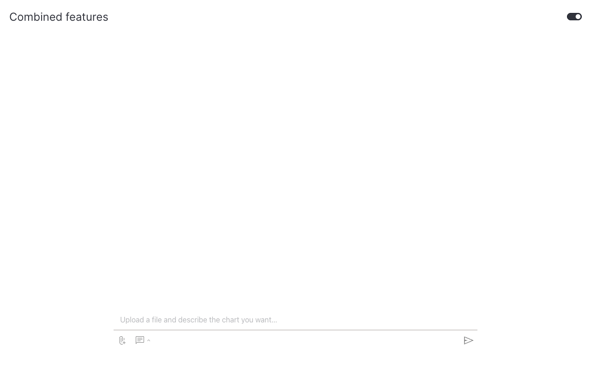

# How to combine features

This guide shows you how to combine multiple chat features in a single `Chat` to handle richer use cases.

Each feature shipped with the chat is composable: file upload, example questions, custom actions, and rich Dash-component responses can all be enabled on the same `Chat`. The example below pairs them all to turn an uploaded CSV plus a natural-language prompt into a Plotly chart, using [Vizro-AI](https://vizro.readthedocs.io/projects/vizro-ai/) as the generative backend.

## What we combine

| Feature | Role in this example |
|---|---|
| `file_upload=True` | Lets the user attach a CSV or Excel file |
| `example_questions=[...]` | Primes the user with valid prompt shapes |
| Custom `ChatAction` | Decodes the file, calls Vizro-AI, returns a `dcc.Graph` |
| Rich response | Returning a Dash component instead of text so the chart renders inline |

See [Add file upload](file-upload.md), [Add example questions](example-questions.md), and [Render Dash components](mixed-content.md) for each feature on its own.

## Install Vizro-AI

```bash
pip install vizro-ai
```

Set `OPENAI_API_KEY` (and optionally `OPENAI_BASE_URL`).

## Build a chart-generating chat

The action below decodes the first uploaded file into a `pandas.DataFrame`, passes it to `chart_agent` along with the user's prompt, and returns the resulting Plotly figure as a `dcc.Graph`.

!!! example "Chat that turns a file plus a prompt into a chart"

    === "app.py"

        ```python hl_lines="41-47"
        import base64
        import io

        import pandas as pd
        from dash import dcc
        from vizro_ai.agents import chart_agent

        import vizro.models as vm
        from vizro import Vizro
        from vizro_experimental.chat import Chat, ChatAction, Message


        class VizroAIChat(ChatAction):
            def generate_response(
                self,
                messages: list[Message],
                uploaded_files: list[dict] | None = None,
            ) -> dcc.Graph | str:
                if not uploaded_files:
                    return "Please upload a CSV or Excel file first."

                file = uploaded_files[0]
                raw = base64.b64decode(file["content"].split(",", 1)[1])
                if file["filename"].endswith(".csv"):
                    df = pd.read_csv(io.BytesIO(raw))
                else:
                    df = pd.read_excel(io.BytesIO(raw))

                chart = chart_agent(df=df, user_prompt=messages[-1]["content"])
                return dcc.Graph(figure=chart.figure)


        vm.Page.add_type("components", Chat)

        page = vm.Page(
            title="Combined features",
            components=[
                Chat(
                    actions=[VizroAIChat()],
                    placeholder="Upload a file and describe the chart you want…",
                    file_upload=True,
                    example_questions=[
                        "Show a bar chart of the data",
                        "Create a scatter plot of price vs quantity",
                        "Make a pie chart showing distribution",
                        "Plot a line chart over time",
                    ],
                )
            ],
        )

        Vizro().build(vm.Dashboard(pages=[page])).run()
        ```

    === "Result"

        

The chat input now pairs two on-ramps:

- The **paperclip** icon for file upload.
- The **chat** icon for example-question prompts.

A non-streaming `ChatAction` is used so the response can be a full `dcc.Graph` rather than a stream of text chunks.

## What's next

- [Add a chat popup](chat-popup.md) — for dashboards where chat should live across pages rather than on a dedicated builder page.
