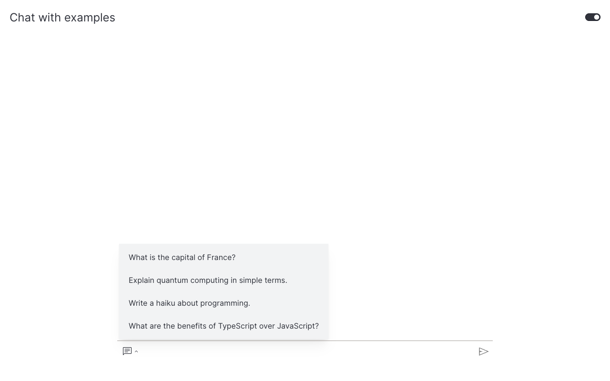

# How to add example questions

This guide shows you how to surface predefined prompts next to the chat input as a popup menu.

The `example_questions` argument on [`Chat`][vizro_experimental.chat.Chat] takes a list of strings. Each one becomes a clickable item in a menu next to the input field. Clicking an item fills the textarea.

## Configure example questions

!!! example "Chat with example questions"

    === "app.py"

        ```python hl_lines="19-24"
        import vizro.models as vm
        from vizro import Vizro
        from vizro_experimental.chat import Chat, ChatAction, Message


        class EchoAction(ChatAction):
            def generate_response(self, messages: list[Message]) -> str:
                return f"You said: {messages[-1]['content']}"


        vm.Page.add_type("components", Chat)

        page = vm.Page(
            title="Chat with examples",
            components=[
                Chat(
                    actions=[EchoAction()],
                    placeholder="Ask me anything or pick an example…",
                    example_questions=[
                        "What is the capital of France?",
                        "Explain quantum computing in simple terms.",
                        "Write a haiku about programming.",
                        "What are the benefits of TypeScript over JavaScript?",
                    ],
                )
            ],
        )

        Vizro().build(vm.Dashboard(pages=[page])).run()
        ```

    === "Result"

        

The chat icon next to the textarea opens a dropdown listing the four prompts above. Combining example questions with a real LLM action — see [Use a real LLM](use-llm.md) or [Stream text responses](streaming-chat.md) — gives users a guided entry point without locking them out of free-form questions.

## What's next

- [Add file upload](file-upload.md) — let users attach files for the action to process.
- [Combine features](combine-features.md) — pair example questions with file upload and a generative backend.
