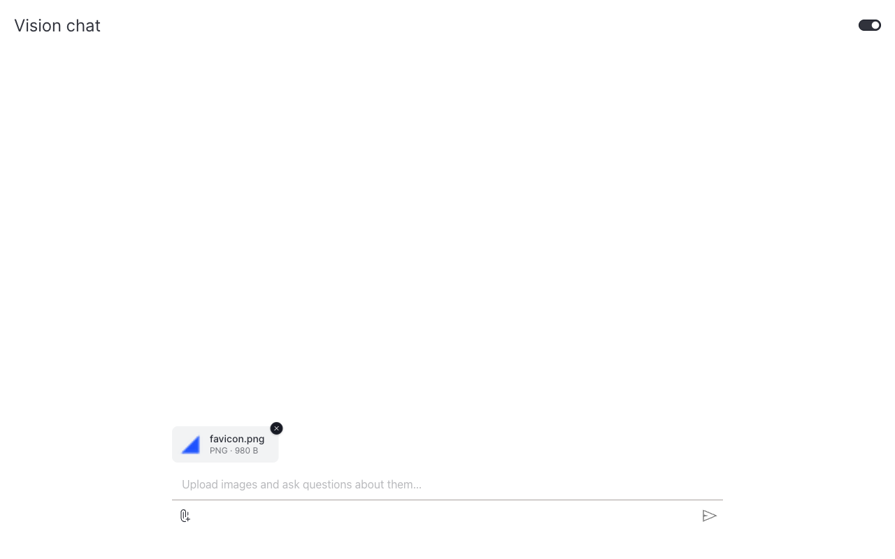

# How to add file upload

This guide shows you how to enable file upload on a chat and forward the attached files to your action.

Setting `file_upload=True` on [`Chat`][vizro_experimental.chat.Chat] adds a paperclip button next to the input. Each uploaded file is base64-encoded as a data URL and forwarded to the action as `uploaded_files=[{"filename": ..., "content": "data:..."}]`. To receive the files, declare `uploaded_files` on your action's `generate_response` signature.

We use OpenAI's vision API as the example below to analyze attached images. The same upload pipeline works for CSVs, PDFs, or anything else. Decode the data URL inside `generate_response` and use the bytes however you like.

## Enable upload on the Chat

```python
Chat(actions=my_action, file_upload=True)
```

The action only receives the `uploaded_files` kwarg when its signature explicitly lists it:

```python
class FileAware(ChatAction):
    def generate_response(self, messages, uploaded_files=None):
        ...
```

## Forward images to a vision model

Vision models accept content as a list of `input_text` and `input_image` parts. Pass image data URLs as-is.

!!! example "Chat that analyzes uploaded images"

    === "app.py"

        ```python hl_lines="17 46"
        from collections.abc import Iterator

        from openai import OpenAI
        from pydantic import Field

        import vizro.models as vm
        from vizro import Vizro
        from vizro_experimental.chat import Chat, Message, StreamingChatAction


        class OpenAIVisionChat(StreamingChatAction):
            model: str = Field(default="gpt-4.1-nano")

            def generate_response(
                self,
                messages: list[Message],
                uploaded_files: list[dict] | None = None,
            ) -> Iterator[str]:
                prior = [{"role": m["role"], "content": m["content"]} for m in messages[:-1]]
                last_text = messages[-1]["content"]

                content = [{"type": "input_text", "text": last_text}]
                for file in uploaded_files or []:
                    if file["content"].startswith("data:image/"):
                        content.append({"type": "input_image", "image_url": file["content"]})

                client = OpenAI()
                response = client.responses.create(
                    model=self.model,
                    input=[*prior, {"role": "user", "content": content}],
                    stream=True,
                )
                for event in response:
                    if event.type == "response.output_text.delta":
                        yield event.delta


        page = vm.Page(
            title="Vision chat",
            components=[
                Chat(
                    actions=OpenAIVisionChat(),
                    placeholder="Upload images and ask questions about them…",
                    file_upload=True,
                )
            ],
        )

        Vizro().build(vm.Dashboard(pages=[page])).run()
        ```

    === "Result"

        

## Re-attach files on follow-ups

The example above only attaches images to the **current** turn. A follow-up like *"and what color is it?"* would lose the image. To support multi-turn questions about an uploaded file, re-attach files from earlier user turns too.

Attachments uploaded in prior turns are preserved at `msg["attachments"]` (a list of `{filename, content}` dicts) on each user `Message`. Walk historical turns and re-emit their files alongside the text:

```python
def _user_content(text, attachments):
    blocks = [{"type": "input_text", "text": text}]
    for f in attachments or []:
        if f["content"].startswith("data:image/"):
            blocks.append({"type": "input_image", "image_url": f["content"]})
    return blocks if len(blocks) > 1 else text


def generate_response(self, messages, uploaded_files=None):
    api_messages = []
    for msg in messages[:-1]:
        content = _user_content(msg["content"], msg.get("attachments")) if msg["role"] == "user" else msg["content"]
        api_messages.append({"role": msg["role"], "content": content})
    api_messages.append({"role": "user", "content": _user_content(messages[-1]["content"], uploaded_files)})
    # ...call the model with api_messages...
```

Each repeated image is re-sent (and re-billed) on every turn, typical for image-heavy conversations. Trim `messages` if cost matters. The `openai_vision_*` actions in `examples/chat_component/actions.py` show the full pattern via the `_build_vision_api_messages` helper.

## Handle non-image files

For CSVs, Excel, PDFs, or any other format, decode the base64 data URL and process the bytes:

```python
import base64
import io
import pandas as pd


class CsvSummariser(ChatAction):
    def generate_response(self, messages, uploaded_files=None):
        if not uploaded_files:
            return "Please upload a CSV file."
        file = uploaded_files[0]
        raw = base64.b64decode(file["content"].split(",", 1)[1])
        df = pd.read_csv(io.BytesIO(raw))
        return f"{file['filename']}: {len(df)} rows, columns {list(df.columns)}"
```

## What's next

- [Combine features](combine-features.md): pair file upload with example questions and Vizro-AI to build a richer chat.
- [Add a chat popup](chat-popup.md): drop a turnkey chat onto an existing dashboard.
