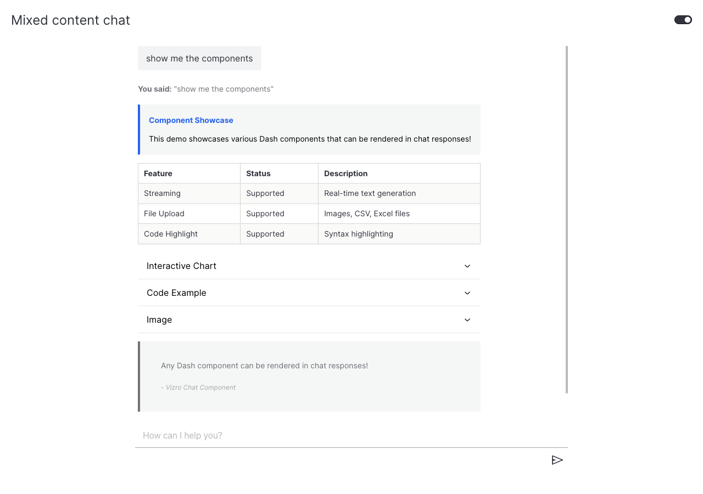

# How to render Dash components in responses

This guide shows you how to return rich content — Markdown, alerts, tables, accordions, charts, code blocks, images — from a chat action instead of plain text.

A [`ChatAction`][vizro_experimental.chat.ChatAction]'s `generate_response` can return any Dash component (or any object Plotly's JSON encoder can serialize). The component is rendered directly inside the assistant bubble. The example below combines several Dash and Mantine components in a single reply to showcase what's possible.

!!! example "Component showcase"

    === "app.py"

        ```python hl_lines="40 41-46 47-58 59-93 94-99"
        import dash_mantine_components as dmc
        import plotly.express as px
        from dash import dcc, html

        import vizro.models as vm
        from vizro import Vizro
        from vizro_experimental.chat import Chat, ChatAction, Message


        class mixed_content(ChatAction):
            """Example showing different content types: text, chart, and image."""

            def generate_response(self, messages: list[Message]) -> html.Div:
                prompt = messages[-1]["content"] if messages else ""

                # Sample data for table
                table_data = [
                    {"feature": "Streaming", "status": "Supported", "description": "Real-time text generation"},
                    {"feature": "File Upload", "status": "Supported", "description": "Images, CSV, Excel files"},
                    {"feature": "Code Highlight", "status": "Supported", "description": "Syntax highlighting"},
                ]

                # Create a scatter plot
                fig = px.scatter(
                    px.data.iris(),
                    x="sepal_width",
                    y="sepal_length",
                    color="species",
                    title="Interactive Plotly Chart",
                )

                # Sample code for CodeHighlight
                sample_code = '''def generate_response(self, messages):
            """Your custom chat logic here."""
            return "Hello, World!"'''

                return html.Div(
                    [
                        dcc.Markdown(f'**You said:** "{prompt}"'),
                        dmc.Alert(
                            "This demo showcases various Dash components that can be rendered in chat responses!",
                            title="Component Showcase",
                            color="blue",
                            style={"marginTop": "15px", "marginBottom": "15px"},
                        ),
                        dmc.Table(
                            striped=True,
                            highlightOnHover=True,
                            withTableBorder=True,
                            withColumnBorders=True,
                            data={
                                "head": ["Feature", "Status", "Description"],
                                "body": [[row["feature"], row["status"], row["description"]] for row in table_data],
                            },
                            style={"marginBottom": "15px"},
                        ),
                        dmc.Accordion(
                            children=[
                                dmc.AccordionItem(
                                    value="chart",
                                    children=[
                                        dmc.AccordionControl("Interactive Chart"),
                                        dmc.AccordionPanel(
                                            dcc.Graph(figure=fig, style={"height": "400px", "width": "600px"})
                                        ),
                                    ],
                                ),
                                dmc.AccordionItem(
                                    value="code",
                                    children=[
                                        dmc.AccordionControl("Code Example"),
                                        dmc.AccordionPanel(
                                            dmc.CodeHighlight(code=sample_code, language="python", withCopyButton=True)
                                        ),
                                    ],
                                ),
                                dmc.AccordionItem(
                                    value="image",
                                    children=[
                                        dmc.AccordionControl("Image"),
                                        dmc.AccordionPanel(
                                            dmc.Image(
                                                radius="md",
                                                h=200,
                                                w="auto",
                                                fit="contain",
                                                src="https://raw.githubusercontent.com/mantinedev/mantine/master/.demo/images/bg-9.png",
                                            )
                                        ),
                                    ],
                                ),
                            ],
                            style={"marginBottom": "15px"},
                        ),
                        dmc.Blockquote(
                            "Any Dash component can be rendered in chat responses!",
                            cite="- Vizro Chat Component",
                            color="blue",
                            style={"marginBottom": "15px"},
                        ),
                    ]
                )


        vm.Page.add_type("components", Chat)

        page = vm.Page(
            title="Mixed content chat",
            components=[Chat(actions=[mixed_content()])],
        )

        Vizro().build(vm.Dashboard(pages=[page])).run()
        ```

    === "Result"

        

The highlighted blocks are the response body: Markdown intro, an Alert, a Table, an Accordion (containing a Plotly chart, a syntax-highlighted code block, and an image), and a Blockquote — all returned as a single `html.Div`.

## What's next

- [Add example questions](example-questions.md) — guide users with predefined prompts.
- [Combine features](combine-features.md) — pair rich responses with file upload and example questions.
