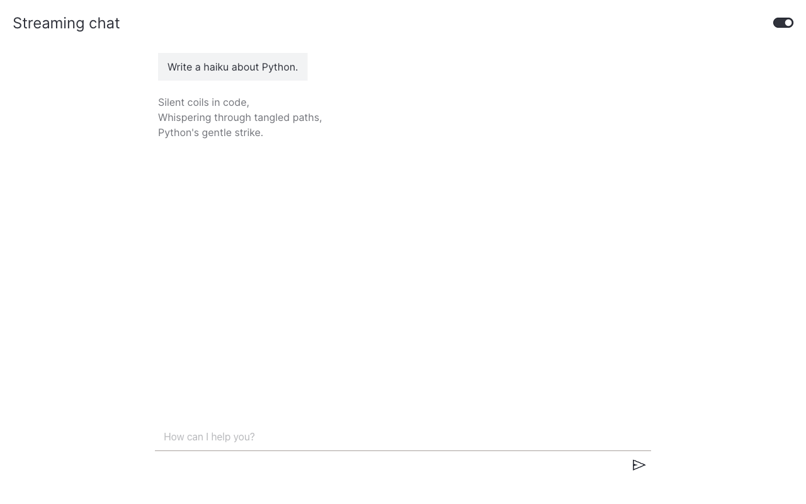

# How to stream text responses

This guide shows you how to stream tokens to the chat UI as they arrive from the model.

A [`StreamingChatAction`][vizro_experimental.chat.StreamingChatAction] differs from a [`ChatAction`][vizro_experimental.chat.ChatAction] in one way: `generate_response` is a generator that yields string chunks instead of returning a single string. The chat component pushes each chunk to the browser over Server-Sent Events and appends it to the assistant bubble in real time.

## Install the OpenAI SDK

```bash
pip install openai
```

Set `OPENAI_API_KEY` (and optionally `OPENAI_BASE_URL` for Azure or self-hosted deployments).

## Define a streaming action

Subclass [`StreamingChatAction`][vizro_experimental.chat.StreamingChatAction] and `yield` each delta the model emits.

!!! example "OpenAI streaming chat"

    === "app.py"

        ```python hl_lines="22 24-26"
        from collections.abc import Iterator

        from openai import OpenAI
        from pydantic import Field

        import vizro.models as vm
        from vizro import Vizro
        from vizro_experimental.chat import Chat, Message, StreamingChatAction


        class OpenAIStreamingChat(StreamingChatAction):
            model: str = Field(default="gpt-4.1-nano")

            def generate_response(self, messages: list[Message]) -> Iterator[str]:
                client = OpenAI()
                api_messages = [{"role": m["role"], "content": m["content"]} for m in messages]
                response = client.responses.create(
                    model=self.model,
                    input=api_messages,
                    instructions="Be polite and creative.",
                    store=False,
                    stream=True,
                )
                for event in response:
                    if event.type == "response.output_text.delta":
                        yield event.delta


        vm.Page.add_type("components", Chat)

        page = vm.Page(
            title="Streaming chat",
            components=[Chat(actions=[OpenAIStreamingChat()])],
        )

        Vizro().build(vm.Dashboard(pages=[page])).run()
        ```

    === "Result"

        

For a non-streaming version of the same pattern (full reply in one shot), see [Use a real LLM](use-llm.md).

## When to use streaming

Reach for `StreamingChatAction` when the model can stream and the response is text-only. Use the synchronous [`ChatAction`][vizro_experimental.chat.ChatAction] when:

- The backend returns the full reply in one call (no streaming API).
- You need to return a Dash component instead of text — see [Render Dash components](mixed-content.md). Streaming only supports text chunks.

## What's next

- [Render Dash components](mixed-content.md) — return charts and rich layouts from a `ChatAction`.
- [Add example questions](example-questions.md) — surface predefined prompts next to the input.
