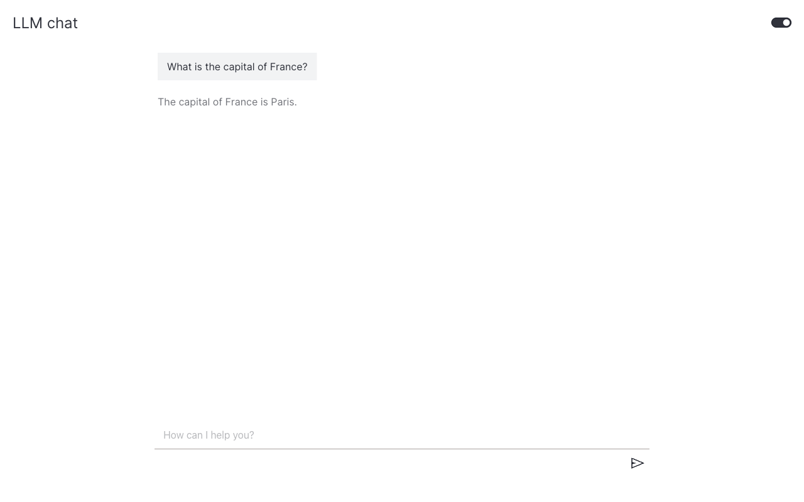

# How to use a real LLM

This guide shows you how to wire a real LLM as the backend for a chat.

The pattern is the same regardless of provider: subclass [`ChatAction`][vizro_experimental.chat.ChatAction], call the model inside `generate_response`, and return the assistant message. We use Anthropic Claude as the example below. Replace the SDK call with any other backend like OpenAI.

## Install a provider SDK

```bash
pip install anthropic
```

Set `ANTHROPIC_API_KEY` (and optionally `ANTHROPIC_BASE_URL`).

## Wire the LLM into a `ChatAction`

Add a Pydantic field for the model name so it's configurable per `Chat` instance, then call the SDK and return the model's text.

!!! example "Chat backed by Claude"

    === "app.py"

        ```python hl_lines="13-20"
        from anthropic import Anthropic
        from pydantic import Field

        import vizro.models as vm
        from vizro import Vizro
        from vizro_experimental.chat import Chat, ChatAction, Message


        class ClaudeChat(ChatAction):
            model: str = Field(default="claude-haiku-4-5-20251001", description="Anthropic model name.")

            def generate_response(self, messages: list[Message]) -> str:
                client = Anthropic()
                api_messages = [{"role": m["role"], "content": m["content"]} for m in messages]
                response = client.messages.create(
                    model=self.model,
                    max_tokens=1024,
                    messages=api_messages,
                )
                return response.content[0].text


        page = vm.Page(
            title="LLM chat",
            components=[Chat(actions=ClaudeChat())],
        )

        Vizro().build(vm.Dashboard(pages=[page])).run()
        ```

    === "Result"

        

The action returns the full assistant message in one shot. To stream tokens as they arrive, see [Stream text responses](streaming-chat.md).

## Use the same pattern for other providers

The shape is identical; only the SDK changes. For OpenAI:

```python
from openai import OpenAI


class OpenAIChat(ChatAction):
    model: str = Field(default="gpt-4.1-nano")

    def generate_response(self, messages: list[Message]) -> str:
        client = OpenAI()
        api_messages = [{"role": m["role"], "content": m["content"]} for m in messages]
        response = client.responses.create(model=self.model, input=api_messages, store=False)
        return response.output_text
```

## Multi-turn behavior

The `messages` argument is the **full conversation history**, not just the new user turn. The library handles storage (browser session storage), append-on-send, and restore-on-open for you; what you do with the history inside `generate_response` is your call.

| If your action needs… | Pass to the LLM |
|---|---|
| Follow-up questions ("and what about X?") to work | `messages` (the whole list); every example above does this |
| Each prompt to be independent (e.g. text-to-SQL with no memory) | `messages[-1]["content"]` only |
| Both, conditional on the user opting in | Add a Pydantic field on your action (e.g. `multi_turn: bool = True`) and branch |

If your action handles uploaded files (e.g. a vision model), historical attachments need to be re-sent alongside historical text so the model can answer follow-ups about an image uploaded earlier. See [Add file upload](file-upload.md#re-attach-files-on-follow-ups).

The library *does not* truncate or summarize history. Token cost grows linearly with conversation length; if that matters, slice `messages` yourself before calling the LLM.

## What's next

- [Stream text responses](streaming-chat.md): switch to `StreamingChatAction` so users see tokens in real time.
- [Render Dash components](mixed-content.md): return charts, tables, or rich layouts from an action.
