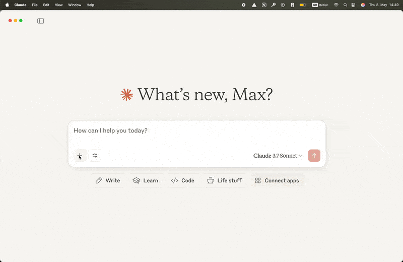
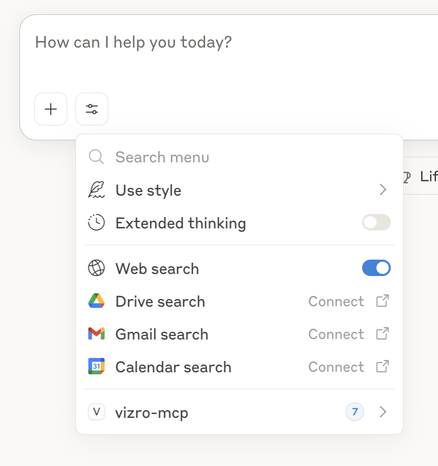
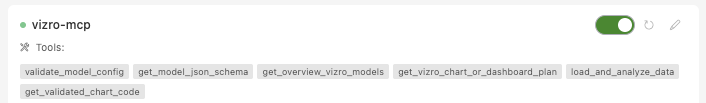
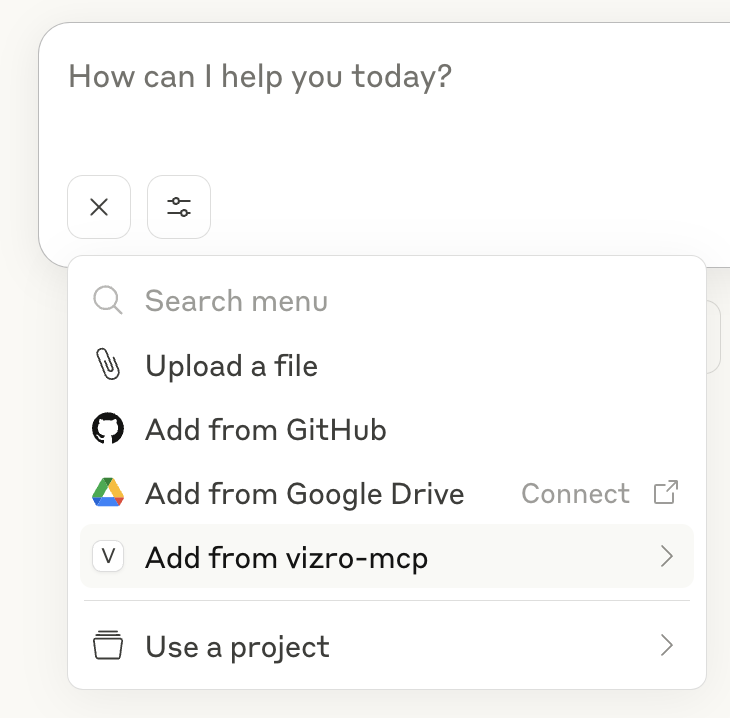
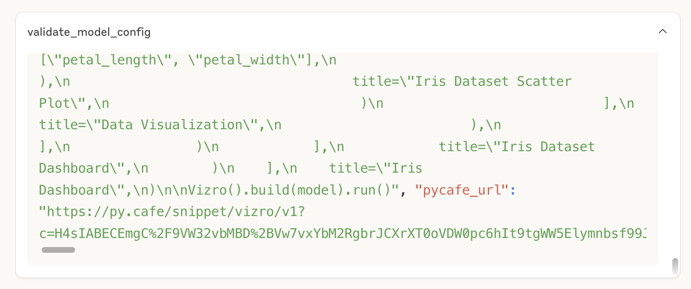

<!-- <a href="https://glama.ai/mcp/servers/@mckinsey/vizro">
  
</a> -->

# Vizro MCP server

Vizro-MCP is a [Model Context Protocol (MCP)](https://modelcontextprotocol.io/) server, which works alongside a LLM to help you create Vizro dashboards and charts.



### Quick install

| Host                                      | Prerequisite                                                  | Link                                                                                                                                                                                                                                                                                                                                   | Notes                                                                   |
| ----------------------------------------- | ------------------------------------------------------------- | -------------------------------------------------------------------------------------------------------------------------------------------------------------------------------------------------------------------------------------------------------------------------------------------------------------------------------------- | ----------------------------------------------------------------------- |
| [Cursor](https://www.cursor.com/)         | [uv](https://docs.astral.sh/uv/getting-started/installation/) | [](https://cursor.com/install-mcp?name=vizro-mcp&config=eyJjb21tYW5kIjoidXZ4IHZpenJvLW1jcCJ9)                                                                                                 |                                                                         |
| [VS Code](https://code.visualstudio.com/) | [uv](https://docs.astral.sh/uv/guides/tools/)                 | [](https://insiders.vscode.dev/redirect/mcp/install?name=vizro-mcp&config=%7B%22command%22%3A%22uvx%22%2C%22args%22%3A%5B%22vizro-mcp%22%5D%7D)                                             |                                                                         |
| [Cursor](https://www.cursor.com/)         | [Docker](https://www.docker.com/get-started/)                 | [](https://cursor.com/install-mcp?name=vizro-mcp&config=eyJjb21tYW5kIjoiZG9ja2VyIHJ1biAtaSAtLXJtIG1jcC92aXpybyJ9)                                                                          | For local data access, [mount your data directory](#setup-instructions) |
| [VS Code](https://code.visualstudio.com/) | [Docker](https://www.docker.com/get-started/)                 | [](https://insiders.vscode.dev/redirect/mcp/install?name=vizro-mcp&config=%7B%22command%22%3A%22docker%22%2C%22args%22%3A%5B%22run%22%2C%22-i%22%2C%22--rm%22%2C%22mcp%2Fvizro%22%5D%7D) | For local data access, [mount your data directory](#setup-instructions) |

## Features of Vizro-MCP

Vizro-MCP provides tools and templates to create a functioning Vizro chart or dashboard step by step. Benefits include:

✅ One consistent framework for charts and dashboards with one common design language.

✅ Validated config output that is readable and easy to alter or maintain.

✅ Live preview of the dashboard to iterate the design until the dashboard is perfect.

✅ Use of local or remote datasets simply by providing a path or URL.

### Without Vizro-MCP

Without Vizro-MCP, if you try to make a dashboard using an LLM, it could choose any framework, and use it without specific guidance, design principles, or consistency. The results are:

❌ A random choice of frontend framework or charting library.

❌ A vibe-coded mess that may or may not run, but certainly is not very maintainable.

❌ No way to easily preview the dashboard.

❌ No easy way to connect to real data.

## 🛠️ Get started

Vizro-MCP can be run in two ways: using [`uvx`](https://docs.astral.sh/uv/guides/tools/) or using [`Docker`](https://www.docker.com/get-started/). It works with any MCP-enabled LLM client such as Cursor or Claude Desktop.

If you want to run Vizro-MCP directly from source, skip to the end of this page to [Development or running from source](#development-or-running-from-source).

### Prerequisites

- [uv](https://docs.astral.sh/uv/getting-started/installation/) **or** [Docker](https://www.docker.com/get-started/)
- Any LLM application that supports MCP, such as [Claude Desktop](https://claude.ai/download) or [Cursor](https://www.cursor.com/downloads)

### Setup Instructions

The general server config is mostly the same for all hosts:

#### 1. Set up configuration

**Using `uvx`**

```json
{
  "mcpServers": {
    "vizro-mcp": {
      "command": "uvx",
      "args": [
        "vizro-mcp"
      ]
    }
  }
}
```

**Using `Docker`**

```json
{
  "mcpServers": {
    "vizro-mcp": {
      "command": "docker",
      "args": [
        "run",
        "-i",
        "--rm",
        "--mount",
        "type=bind,src=</absolute/path/to/allowed/dir>,dst=</absolute/path/to/allowed/dir>",
        "--mount",
        "type=bind,src=</absolute/path/to/data.csv>,dst=</absolute/path/to/data.csv>",
        "mcp/vizro"
      ]
    }
  }
}
```

> To use local data with Vizro-MCP, mount your data directory or directories into the container. Replace `</absolute/path/to/allowed/dir>` (syntax for folders) or `</absolute/path/to/data.csv>` (syntax for files) with the absolute path to your data on your machine. For consistency, it is recommended that the `dst` path matches the `src` path.

#### 2. Add the Configuration to MCP enabled LLM applications

In principle, the Vizro MCP server works with _any_ MCP enabled LLM applications but we recommend Claude Desktop or Cursor as popular choices (see more detailed instructions below). Different AI tools may use different setup methods or connection settings. Check each tool's docs for details.

<details>
<summary><strong>Claude Desktop</strong></summary>

- Add the configuration to your `claude_desktop_config.json` ([found via Developer Settings](https://modelcontextprotocol.io/quickstart/user#2-add-the-filesystem-mcp-server)).

- Restart Claude Desktop. After a few moments, you should see the vizro-mcp menu in the settings/context menu:

    

> ⚠️ **Warning:** In some hosts (like Claude Desktop) the free plan might be less performant, which may cause issues when the request is too complex. In cases where the request causes the UI to crash, opt for using a paid plan, or reduce your request's complexity.

</details>

<details>
<summary><strong>Cursor</strong></summary>
<br >

[](https://cursor.com/install-mcp?name=vizro-mcp&config=eyJjb21tYW5kIjoidXZ4IHZpenJvLW1jcCJ9)

- Add the above configuration to your `mcp.json` ([see Cursor Settings](https://docs.cursor.com/context/model-context-protocol#configuration-locations)) or click the button above.

- After a short pause, you should see a green light in the MCP menu:

    

</details>

<details>
<summary><strong>Other MCP Clients</strong></summary>

<br />

[](https://insiders.vscode.dev/redirect/mcp/install?name=vizro-mcp&config=%7B%22command%22%3A%22uvx%22%2C%22args%22%3A%5B%22vizro-mcp%22%5D%7D)

- Add the configuration as per your client's documentation.

- Check your client's documentation for where to place the config and how to verify the server is running.

</details>

## 💻 Usage

The MCP server is designed to get you started on Vizro dashboards and charts by creating beautiful working dashboards based on the core Vizro features. It is not designed to replace a human developer when going beyond the core features, e.g. when building an application that requires custom CSS or bespoke Dash components.

### Use prompt templates to get specific dashboards quickly

Prompt templates are not available in all MCP hosts, but when they are, you can use them to get specific dashboards quickly. To access them (e.g. in Claude Desktop), click on the plus icon below the chat, and choose _`Add from vizro-mcp`_.



The **easiest** way to get started with Vizro dashboards is to choose the template `create_starter_dashboard` and just send the prompt. This will create a super simple dashboard with one page, one chart, and one filter. Take it from there!

### Create a Vizro dashboard based on local or remote data

You can also ask the LLM to create specific dashboards based on local or remote data if you already have an idea of what you want. Example prompts could be:

> _Create a Vizro dashboard with one page, a scatter chart, and a filter based on `<insert absolute file path or public URL>` data._

> _Create a simple two page Vizro dashboard, with first page being a correlation analysis of `<insert absolute file path or public URL>` data, and the second page being a map plot of `<insert absolute file path or public URL>` data_

You can find a set of sample CSVs to try out in the [Plotly repository](https://github.com/plotly/datasets/tree/master).

You can even ask for a dashboard without providing data:

> _Create a Vizro dashboard with one page, a scatter chart, and a filter._

In general, it helps to specify Vizro in the prompt and to keep it as precise (and simple) as possible.

### Get a live preview of your dashboard

When the LLM chooses to use the tool `validate_dashboard_config`, and the tool executes successfully, the LLM will return a link to a live preview of the dashboard if only public data accessed via URL is used. By default, the LLM will even open the link in your browser for you unless you tell it not to. In Claude Desktop, you can see the output of the tool by opening the tool collapsible and scrolling down to the very bottom.



You can also ask the model to give you the link, but it will attempt to regenerate it, which is very error prone and slow.

### Create Vizro charts

If you don't want to create an entire Vizro dashboard, you can still use Vizro-MCP to create the code for a single chart. If you're not sure what kind of chart you want, check out the [Vizro Visual Vocabulary](https://huggingface.co/spaces/vizro/demo-visual-vocabulary) for ideas.

The **easiest** way to create a Vizro chart is to choose the template `create_vizro_chart` and just send the prompt. This will create a simple chart that you can alter. Take it from there!

Alternatively, you can just ask in the chat, for example:

> _Create a scatter based on the iris dataset._

> _Create a bar chart based on `<insert absolute file path or public URL>` data._

## 🔍 Transparency and trust

MCP servers are a relatively new concept, and it is important to be transparent about what the tools are capable of so you can make an informed choice as a user. Overall, the Vizro MCP server only reads data, and never writes, deletes or modifies any data on your machine.

In general the most critical part of the process is the `load_and_analyze_data` tool. This tool, running on your machine, will load local or remote data into a pandas DataFrame and provide a detailed analysis of its structure and content. It only uses `pd.read_xxx`, so in general there is no need to worry about privacy or data security. However, you should only run Vizro-MCP locally, not as a hosted server, because there is currently no authentication to manage access.

The second most critical part is the `validate_dashboard_config` tool. This tool will attempt to instantiate the Vizro model configuration and return the Python code and visualization link for valid configurations. If the configuration is valid, it will also return and attempt to open a link to a live preview of the dashboard, which will take you to [PyCafe](https://py.cafe). If you don't want to open the link, you can tell the LLM to not do so.

## Available Tools (if client allows)

The Vizro MCP server provides the following tools. In general you should not need to use them directly, but in special cases you could ask the LLM to call them directly to help it find its way.

- `get_vizro_chart_or_dashboard_plan` - Get a structured step-by-step plan for creating either a chart or dashboard. Provides guidance on the entire creation process.
- `get_model_json_schema` - Retrieves the complete JSON schema for any specified Vizro model, useful for understanding required and optional parameters.
- `validate_dashboard_config` - Tests Vizro model configurations by attempting to instantiate them. Returns Python code and visualization links for valid configurations.
- `load_and_analyze_data` - Loads a CSV file from a local path or URL into a pandas DataFrame and provides detailed analysis of its structure and content.
- `validate_chart_code` - Validates the code created for a chart and returns feedback on its correctness.
- `get_sample_data_info` - Provides information about sample datasets that can be used for testing and development.

## Available Prompts (if client allows)

- `create_starter_dashboard` - Use this prompt template to get started with Vizro dashboards.
- `create_dashboard` - Use this prompt template to create a dashboard based on a local or remote CSV dataset.
- `create_vizro_chart` - Use this prompt template to create a Vizro styled plotly chart based on a local or remote CSV dataset.

## Development or running from source

If you are a developer, or if you are running Vizro-MCP from source, you need to clone the Vizro repo. To configure the Vizro-MCP server details:

Add the following to your MCP configuration:

```json
{
  "mcpServers": {
    "vizro-mcp": {
      "command": "uv",
      "args": [
        "run",
        "--directory",
        "<PATH TO VIZRO>/vizro-mcp/",
        "vizro-mcp"
      ]
    }
  }
}
```

Replace `<PATH TO VIZRO>` with the actual path to your Vizro repository. You may also need to provide the full path to your `uv` executable, so instead of `"uv"` you would use something like `"/Users/<your-username>/.local/bin/uv"`. To discover the path of `uv` on your machine, in your terminal app, type `which uv`.

## Disclaimers

<details>
<summary><strong>Third party API</strong></summary>

Users are responsible for anything done via their host LLM application.

Users are responsible for procuring any and all rights necessary to access any third-party generative AI tools and for complying with any applicable terms or conditions thereof.

Users are wholly responsible for the use and security of the third-party generative AI tools and of Vizro.

</details>

<details>
<summary><strong>User acknowledgments</strong></summary>

Users acknowledge and agree that:

Any results, options, data, recommendations, analyses, code, or other information (“Outputs”) generated by any third-party generative AI tools (“GenAI Tools”) may contain some inaccuracies, biases, illegitimate, potentially infringing, or otherwise inappropriate content that may be mistaken, discriminatory, or misleading.

McKinsey & Company:

(i) expressly disclaims the accuracy, adequacy, timeliness, reliability, merchantability, fitness for a particular purpose, non-infringement, safety or completeness of any Outputs,

(ii) shall not be liable for any errors, omissions, or other defects in, delays or interruptions in such Outputs, or for any actions taken in reliance thereon, and

(iii) shall not be liable for any alleged violation or infringement of any right of any third party resulting from the users’ use of the GenAI Tools and the Outputs.

The Outputs shall be verified and validated by the users and shall not be used without human oversight and as a sole basis for making decisions impacting individuals.

Users remain solely responsible for the use of the Output, in particular, the users will need to determine the level of human oversight needed to be given the context and use case, as well as for informing the users’ personnel and other affected users about the nature of the GenAI Output. Users are also fully responsible for their decisions, actions, use of Vizro and Vizro-MCP and compliance with applicable laws, rules, and regulations, including but not limited to confirming that the Outputs do not infringe any third-party rights.

</details>

<details>
<summary><strong>Warning and safety usage for generative AI models</strong></summary>

Vizro-MCP is used by generative AI models because large language models (LLMs) represent significant advancements in the AI field. However, as with any powerful tool, there are potential risks associated with connecting to a generative AI model.

We recommend users research and understand the selected model before using Vizro-MCP.

Users are encouraged to treat AI-generated content as supplementary, always apply human judgment, approach with caution, review the relevant disclaimer page, and consider the following:

<ol>
<li>Hallucination and misrepresentation</li>
Generative models can potentially generate information while appearing factual, being entirely fictitious or misleading.

The vendor models might lack real-time knowledge or events beyond its last updates. Vizro-MCP output may vary and you should always verify critical information. It is the user's responsibility to discern the accuracy, consistent, and reliability of the generated content.

<li>Unintended and sensitive output</li>
The outputs from these models can be unexpected, inappropriate, or even harmful. Users as human in the loop is an essential part. Users must check and interpret the final output. It is necessary to approach the generated content with caution, especially when shared or applied in various contexts.

<li>Data privacy</li>
Your data is sent to model vendors if you connect to LLMs via their APIs. For example, if you connect to the model from OpenAI, your data will be sent to OpenAI via their API. Users should be cautious about sharing or inputting any personal or sensitive information.

<li>Bias and fairness</li>
Generative AI can exhibit biases present in their training data. Users need to be aware of and navigate potential biases in generated outputs and be cautious when interpreting the generated content.

<li>Malicious use</li>
These models can be exploited for various malicious activities. Users should be cautious about how and where they deploy and access such models.
</ol>
It's crucial for users to remain informed, cautious, and ethical in their applications.

</details>
