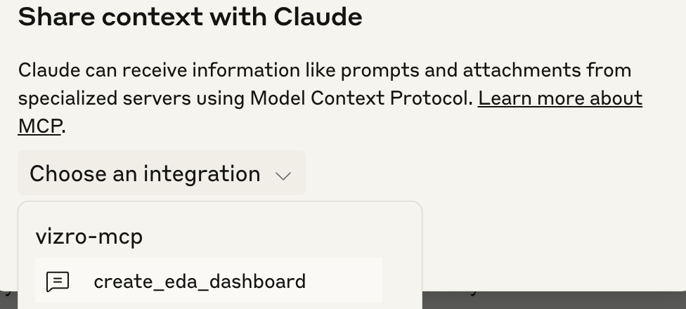

# Vizro MCP Server

A [Model Context Protocol (MCP) server](https://modelcontextprotocol.io/) to help create Vizro dashboards and charts.

## Features

- Use prompts to create Vizro dashboards from LLM Applications (hosts) that support MCP server connections, such as IDEs and Claude Desktop
- Iterate the design until the dashboard is perfect
- Use local or remote datasets
- Take advantage of specialized prompt templates to guide dashboard creation (Claude Desktop only)

... and best of all, your result is Vizro config, so well structured, readable, (almost) guaranteed to run and no Vibe coded mess!

## Prerequisites

- [Claude Desktop](https://claude.ai/download) or [Cursor](https://www.cursor.com/downloads)
- [uv](https://docs.astral.sh/uv/getting-started/installation/)

We are working on getting [VS Code](https://code.visualstudio.com/) with Copilot working soon. There are some known issues.

In principle, the Vizro MCP server works with _any_ MCP enabled client, the Claude Desktop and Cursor are just some of the most popular.

> ⚠️ **Warning:** In some hosts (like Claude Desktop) the Free Tier might be less performant. In Claude Desktop this results in the UI crashing when the request is too complex. In that case, opt for the Paid tier or reduce request complexity.

## Installation

Add this to your `claude_desktop_config.json` [Claude - found via Developer Settings](https://modelcontextprotocol.io/quickstart/user#2-add-the-filesystem-mcp-server) or `mcp.json` [Cursor - found via the Cursor Settings](https://docs.cursor.com/context/model-context-protocol#configuration-locations):

```json
{
  "mcpServers": {
    "git": {
      "command": "uvx",
      "args": [
        "vizro-mcp"
      ]
    }
  }
}
```

If successful, in Claude Desktop you should see a little hammer icon below the chat field:


or when using Cursor, you would see a green light in the MCP menu:


## Usage

### Ask to create a Vizro dashboard based on local or remote data

You can ask things like:

> _Create a Vizro dashboard with one page, a scatter chart, and a filter based on `<insert absolute file path or public URL>` data._

> _Create simple two page Vizro dashboard, with first page being a correlation analysis of `<insert absolute file path or public URL>` data, and the second page being a map plot of `<insert absolute file path or public URL>` data_

You can even ask for a dashboard without providing data:

> _Create a Vizro dashboard with one page, a scatter chart, and a filter._

In general it helps to specify `Vizro` and to keep it as precise (and simple) as possible.

### Use a prompt template to get specific dashboards quickly

Currently we offer only one template to create an exploratory data analysis (EDA) dashboard. This prompt template is only available in certain Apps/IDEs (e.g. Claude Desktop). In that case you need to click on the plug symbol next to the hammer, and choose the template you like.




### Get a live preview of your dashboard

When the LLM chooses to use the tool `validate_model_config`, and the tool executes successfully, the LLM will return a link to a live preview of the dashboard if only public data accessed via URL is used. In Claude Desktop, you can see the output of the tool by opening the tool collapsible and scrolling down to the very bottom.


You can also also the model to give you the link, but it will attempt to regenerate it, which is very error prone and slow.

### Create Vizro charts

TBD

## Available Tools (if client allows)

- `get_vizro_chart_or_dashboard_plan` - Call this tool first to get a structured step-by-step plan for creating either a chart or dashboard. Provides guidance on the entire creation process.
- `get_overview_vizro_models` - Returns a comprehensive overview of all available models in the `vizro.models` namespace, organized by category.
- `get_model_JSON_schema` - Retrieves the complete JSON schema for any specified Vizro model, useful for understanding required and optional parameters.
- `validate_model_config` - Tests Vizro model configurations by attempting to instantiate them. Returns Python code and visualization links for valid configurations.
- `load_and_analyze_csv` - Loads a CSV file from a local path or URL into a pandas DataFrame and provides detailed analysis of its structure and content.
- `get_validated_chart_code` - Validates the code created for a chart and returns feedback on its correctness.

## Available Prompts (if client allows)

- `create_EDA_dashboard` - Use this prompt template to create an Exploratory Data Anlysis (EDA) dashboard based on a local or remote CSV dataset
- `create_vizro_chart` - Use this prompt template to create a Vizro styled plotly chart based on a local or remote CSV dataset

A quick way to get sample remote CSVs can be found [at the plotly repository](https://github.com/plotly/datasets/tree/master).

## Development or running from source

For developer or if running from source, you need to clone the Vizro repo, and then add the following to your `claude_desktop_config.json` (Claude - found via Developer Settings) or `mcp.json` (Cursor - found via the Cursor Settings).

```json
{
  "mcpServers": {
    "vizro-mcp": {
      "command": "uv",
      "args": [
        "run",
        "--directory",
        "<PATH TO VIZRO>/vizro-mcp/",
        "vizro-mcp"
      ]
    }
  }
}
```

Replace `<PATH TO VIZRO>` with the actual path to your Vizro repository.
