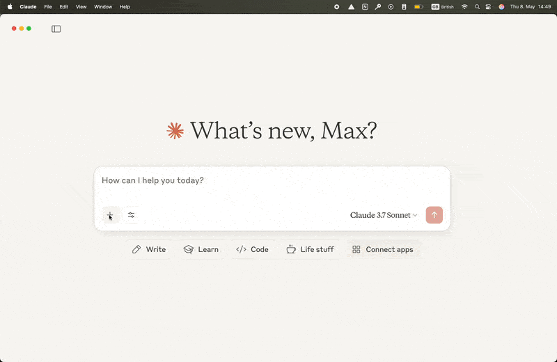

---
hide:
  - navigation
  - toc
---

# Vizro-MCP

Vizro-MCP is a [Model Context Protocol (MCP)](https://modelcontextprotocol.io/) server, which works alongside a LLM to help you create Vizro dashboards and charts.

- :fontawesome-solid-wand-magic-sparkles:{ .lg .middle } __Benefits of Vizro-MCP__

    - One consistent framework for charts and dashboards with one common design language.

    - Validated config output that is readable and easy to alter or maintain.

    - Live preview of the dashboard to iterate the design until the dashboard is perfect.

    - Use of local or remote datasets simply by providing a path or URL.

- :fontawesome-solid-heart-crack:{ .lg .middle } __Without Vizro-MCP__

    - Limited guidance, design principles, and consistency.

    - Results tend to be a vibe-coded mess that may or may not run, but certainly is not very maintainable.

    - No way to easily preview the dashboard.

    - No easy way to connect to real data.

