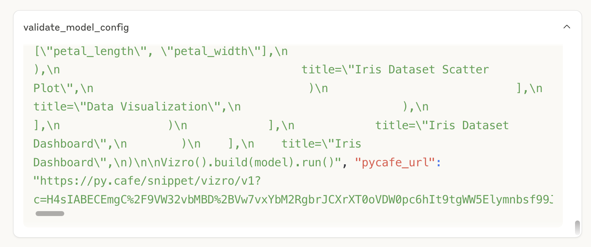

# FAQs

## Can Vizro-MCP create custom CSS?
Vizro-MCP is designed to start you creating Vizro dashboards and charts based on the core Vizro features. It is not designed to replace a human developer when going beyond the core features, e.g. when building an application that requires custom CSS or bespoke Dash components.

## How do I use the prompt templates?

!!! warning "Check if the templates are available for your MCP client"

    Vizro-MCP's prompt templates are not available in all MCP clients.
    
You can use the prompt templates to create specific dashboards quickly. To access them (e.g. in Claude Desktop), click on the plus icon below the chat, and choose _`Add from vizro-mcp`_.
  

The **easiest** way to get started with Vizro dashboards is to choose the template `create_starter_dashboard` and just send the prompt. This will create a super simple dashboard with one page, one chart, and one filter. Take it from there!

## How do I create a Vizro dashboard based on local or remote data?

You can ask the LLM to create specific dashboards based on local or remote data if you already have an idea of what you want. Example prompts could be:

> _Create a Vizro dashboard with one page, a scatter chart, and a filter based on `<insert absolute file path or public URL>` data._

> _Create a simple two page Vizro dashboard, with first page being a correlation analysis of `<insert absolute file path or public URL>` data, and the second page being a map plot of `<insert absolute file path or public URL>` data_

You can find a set of sample CSVs to try out in the [Plotly repository](https://github.com/plotly/datasets/tree/master).

You can even ask for a dashboard without providing data:

> _Create a Vizro dashboard with one page, a scatter chart, and a filter._

In general, it helps to specify Vizro in the prompt and to keep it as precise (and simple) as possible.

## How do I get a live preview of the dashboard?

When the LLM chooses to use the tool `validate_dashboard_config`, and the tool executes successfully, the LLM will return a link to a live preview of the dashboard if only public data accessed via URL is used. By default, the LLM will even open the link in your browser for you unless you tell it not to. In Claude Desktop, you can see the output of the tool by opening the tool collapsible and scrolling down to the very bottom.

You can also ask the model to give you the link, but it will attempt to regenerate it, which is very error prone and slow.

## Can I just create Vizro charts without a dashboard?

If you don't want to create an entire Vizro dashboard, you can still use Vizro-MCP to create the code for a single chart. If you're not sure what kind of chart you want, check out the [Vizro Visual Vocabulary](https://huggingface.co/spaces/vizro/demo-visual-vocabulary) for ideas.

The **easiest** way to create a Vizro chart is to choose the template `create_vizro_chart` and just send the prompt. This will create a simple chart that you can alter. Take it from there!

Alternatively, you can just ask in the chat, for example:

> _Create a scatter based on the iris dataset._

> _Create a bar chart based on `<insert absolute file path or public URL>` data._

