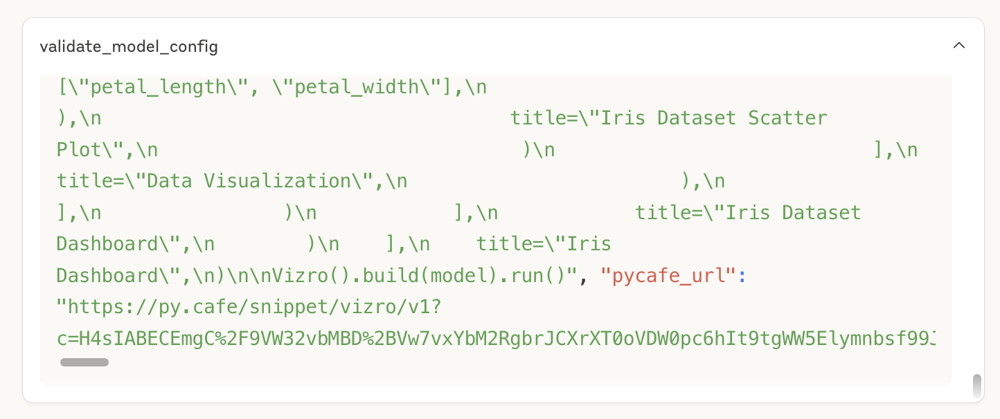

# How to get a live preview

When the LLM chooses to use the tool `validate_dashboard_config`, and the tool executes successfully, the LLM will return a link to a live preview of the dashboard if only public data accessed via URL is used. By default, the LLM will even open the link in your browser for you unless you tell it not to. In Claude Desktop, you can see the output of the tool by opening the tool collapsible and scrolling down to the very bottom.

You can also ask the model to give you the link, but it will attempt to regenerate it, which is very error prone and slow.
