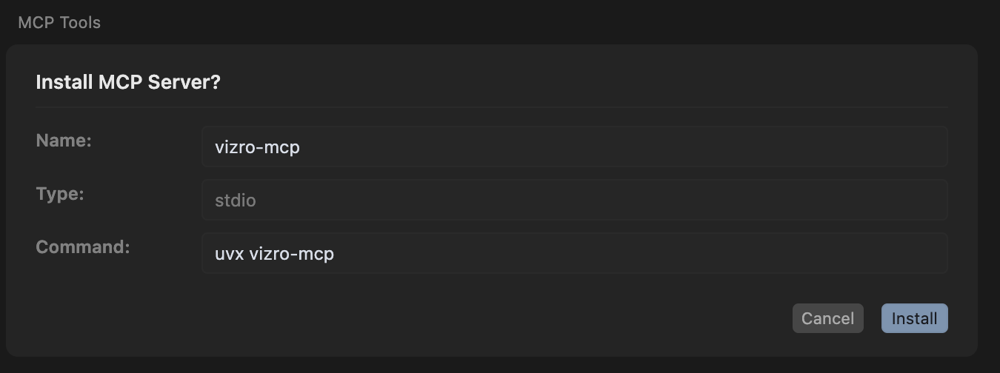
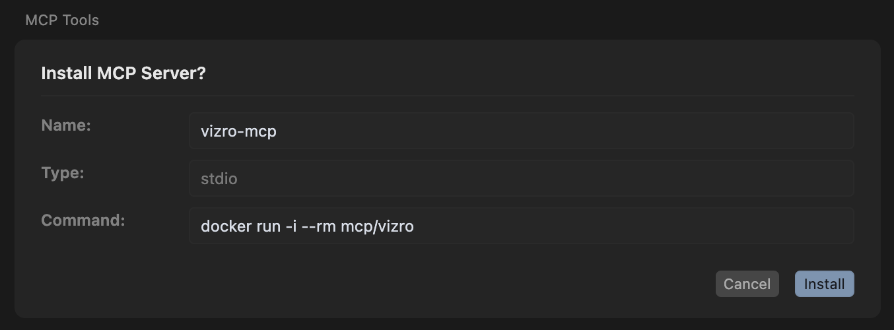

# How to set up Vizro-MCP with Cursor

!!! notice "Use of large language models"

    You must connect to a large language model (LLM) to use Vizro-MCP.

    Please review our [guidelines on the use of LLMs](../explanation/disclaimers.md).

This page explains how to set up [Cursor](https://www.cursor.com/) to use Vizro-MCP.

!!! Warning "Can I use a trial version of Cursor?"

    You can use the limited-period trial version of Cursor with Vizro-MCP, but your tokens for usage will be limited. The plan might also be less performant, which may cause issues when the request is too complex. In cases where you run out of tokens, or the request causes the UI to crash, opt to use a paid plan, or reduce your request's complexity.

If you have not already done so, download and install the [Cursor app](https://cursor.com/downloads). Vizro-MCP does not work with the web version.

## Set up uv or Docker

To access Vizro-MCP, you must first install **either [uv](https://docs.astral.sh/uv/getting-started/installation/) or [Docker](https://www.docker.com/get-started/)** by following the linked instructions.

## Set up instructions

Once you have uv or Docker, and have installed the desktop version of Cursor, you need to set up the Vizro-MCP server configuration.

### Using uv

Click the button below:

[](https://cursor.com/en/install-mcp?name=vizro-mcp&config=eyJjb21tYW5kIjoidXZ4IHZpenJvLW1jcCJ9)

The following configuration is added to your `mcp.json` ([see Cursor Settings](https://docs.cursor.com/context/model-context-protocol#configuration-locations)).

```json
{
  "vizro-mcp": {
    "command": "uvx vizro-mcp"
  }
}
```

Click "Install" on the Cursor MCP configuration page:



### Using Docker

Click the button below:

[](https://cursor.com/en/install-mcp?name=vizro-mcp&config=eyJjb21tYW5kIjoiZG9ja2VyIHJ1biAtaSAtLXJtIG1jcC92aXpybyIsImVudiI6e319)

The following configuration is added to your `mcp.json` ([see Cursor Settings](https://docs.cursor.com/context/model-context-protocol#configuration-locations)).

```json
{
  "mcpServers": {
    "vizro-mcp": {
      "command": "docker run -i --rm mcp/vizro",
      "env": {}
    }
  }
}
```

??? information "To use local data with Vizro-MCP"

    Mount your data directory or directories into the container by extending the configuration as follows:

    ```json
    {
      "mcpServers": {
        "vizro-mcp": {
          "command": "docker run -i --rm --mount type=bind,src=</absolute/path/to/allowed/dir>,dst=</absolute/path/to/allowed/dir> --mount type=bind,src=</absolute/path/to/data.csv>,dst=</absolute/path/to/data.csv> mcp/vizro",
          "env": {}
        }
      }
    }
    ```

    Replace `</absolute/path/to/allowed/dir>` (syntax for folders) or `</absolute/path/to/data.csv>` (syntax for files) with the absolute path to your data on your machine. For consistency, we recommend that the `dst` path matches the `src` path.

Click "Install" on the Cursor MCP configuration page:


